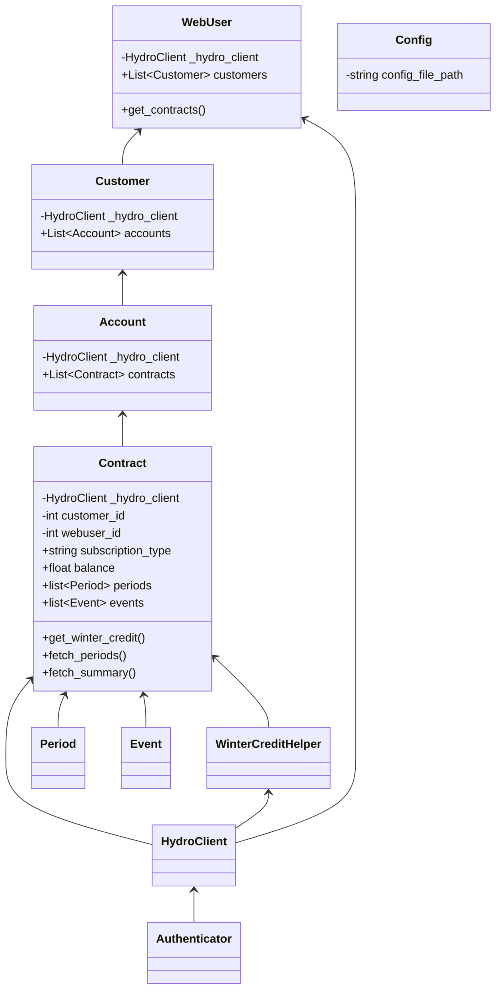

# HydroQC - Hydro Quebec API wrapper


[](https://gitlab.com/hydroqc/hydroqc/-/commits/main)
[](https://gitlab.com/hydroqc/hydroqc/-/commits/main)


**This is a library to use if you want to build your own solution. If you want a user-friendly implementation for your home automation system please use [hydroqc2mqtt](https://gitlab.com/hydroqc/hydroqc2mqtt) which provide a MQTT publisher, docker image and HASS addon.**

This is a package to access some functionalities of Hydro Quebec API that are not documented.

We started a discord server for the project where you can come to discuss and find help with the project on our [#development](https://discord.gg/NWnfdfRZ7T) channel

## Donations

We put a lot of heart and effort in this project, any contribution is greatly appreciated!

[](https://hydroqc.ca/en/donations)

## Tested Rates

Each account, contracts and rates are different and we do our best to integrate all available options. Currently the account combinations listed below are supported and tested automaticaly by our CI/CD pipeline. If your account scenario is not currently tested and listed as **Needed** feel free to reach out to us on our discord [#development](https://discord.gg/NWnfdfRZ7T) channel if you want to volunter for testing. We provide a way to setup CI/CD tests in your own account in a way that keep your account info private to you (more details [here](https://gitlab.com/hydroqc/hydroqc-test-template)). Keep in mind that this process is a bit involved technicaly so it is best if you have some working knowledge with Gitlab.

### Rate D

| Base Rate | Rate Option | Tester | Test result | Last run | Comment |
| - | - | - | - | - | - |
| D | - | @weimdall |  |  | |
| D | - | @mdallaire1 |  |  | |
| D | - | @devzwf |  |  | Hilo |
| D | CPC | @titilambert |  |  | |

#### Flex D (DPC)

| Base Rate | Rate Option  | Tester | Test result | Last run | Comment |
| - | - | - | - | - | - |
| DPC | - | @mdallaire1 |  |  | |

#### Dual Energy (DT)

| Base Rate | Rate Option | Tester | Test result | Last run | Comment |
| - | - | - | - | - | - |
| DT | - | @mdallaire1 |  |  |

#### Rate M

| Base Rate | Rate Option | Tester | Test result | Last run | Comment |
| - | - | - | - | - | - |
| M | - | @hdenergy |  |  | [HD Énergie](https://hd.energy) |
| M | GDP | @hdenergy |  |  | [HD Énergie](https://hd.energy) |

Thanks to [HD Énergie](https://hd.energy) for sponsoring developpement of the Rate M support.

### Other plans
We don't have anyone to test with. Please reach out to us if you have this plan and want to help!

## Documentation

### Code documentation

[https://hydroqc.readthedocs.io/](https://hydroqc.readthedocs.io/)

### Architecture / concepts

If you need more information about the usage and current integrations of the library please see our website [https://hydroqc.ca](https://hydroqc.ca)

## Goal

Make it easy to fetch and manipulate data from Hydro-Quebec, especially the winter credit periods

## Example folder

An example script that extracts the data available from Hydro-Quebec is available in the examples folder.

### Basic setup

This uses python 3.10

1. Clone the repo

   ```bash
   git clone https://gitlab.com/hydroqc/hydroqc.git
   ```

2. Create a virtual-env

   ```bash
   python -m venv env
   . env/bin/activate
   pip install --editable .
   ```

3. Enter your hydro account credentials in the examples/hydro.py file (line 6)

4. Run

   ```bash
   examples/hydro.py
   ```

## TODO

[https://gitlab.com/groups/hydroqc/-/issues](https://gitlab.com/groups/hydroqc/-/issues)

## Targeted architecture (might change in the future)


