# # AI Agent Marketplace Index| AI Agent Directory | AI Agent Store to Host All Available AI Agents | OneKey AI Agent Router | Agent Moneytization

[Github](https://github.com/aiagenta2z/ai-agent-marketplace)|[Huggingface](https://huggingface.co/datasets/DeepNLP/AI-Agent-Marketplace-Index)|[Pypi](https://pypi.org/project/ai-agent-marketplace/) | [Open Source AI Agent Marketplace DeepNLP](https://www.deepnlp.org/store/ai-agent)|[Agent RL Dataset](https://www.deepnlp.org/store/dataset)

This is the official github repo for pypi package ai_agent_marketplace [https://pypi.org/project/ai-agent-marketplace](https://pypi.org/project/ai-agent-marketplace).
The repo Open Source AI Agent Marketplace and deepnlp.org website [AI Agent Marketplace Store & Search Engine](http://www.deepnlp.org/store/ai-agent) aims to provides a public repo and index of more than 10K+ AI Agent information from 30+ categories in the communities, such as autonomous agent, chatbots, Computer and Mobile phone use agents, robotic agents, and various industries such as business, finance, law, medical or healthcare, etc. The directory are updated to websites from both public repo (github/huggingface) as well as AI Agent services in cloud service provider (Microsoft Azure AWS, Copilot, OpenAI Agent app Store GPT Store, Google Cloud, etc). 


**AI Agent Marketplace Distribution By Category**<br>


We would like to help developers and end users within the lifecycle of AI agent development. From the registration, deployment, Agent router, API calling, metric/traffic tracking, and finally to the stage of moneyterization from your AI Agent. Anyone can submit their AI agents card information, code, APIs, pricing plans to the public registry, just like your submit a paper to arxiv.org and submit models to huggingface.co.

```mermaid

graph LR
    
    Dev[Developers]--> A[AI Agent/MCP Development] --> B[Deloyment] --> C[AI Agent Registry to Marketplace] --> D[Agent Search and Exploration]

    U[Users] --> R[Agent Router & Data Tracking] --> F[API Billing System​] --> G[Feedback Comments & Discussion] --> H[Moneytization]

```



# Main Features
1. **AI Agent Registry**: You can submit your AI Agent's meta to the [Official AI Agent Marketplace Registry](https://www.deepnlp.org/workspace/my_ai_services) directly on website or using various methods (python,nodejs, curl, etc). After submitting your AI Agent meta and approval, community will find your AI Agent in each categories. We also host available submission from various agent store or build in any infrastractures, such as OpenAI Apps SDK, Claude MCPs, etc. 
2. **AI Agent Search Engine and Search API**: Users are able to search and explore your AI Agent through [AI Agent Search Engine](https://www.deepnlp.org/search/agent) and you can also access the AI Agent Meta Index through [Search API](https://www.deepnlp.org/doc/ai_agent_marketplace) and [MCP servers](https://github.com/aiagenta2z/ai-agent-marketplace-index-mcp) also.
3. **OneKey Agent Router**: [OneKey Agent Router](https://www.deepnlp.org/agent/onekey-ai-agent-router) aims to router users' request to your AI Agent or MCPs' registered http APIs using only one access key authentication, which can help users simplify their registration process. We initialize a OneKey revenue sharing credit plans to help you gain from the free-tier users.
4. **Traffic Tracking**: Traffic tracking service to your AI Agents, ranging from API calls from the OneKey Router,GitHub Stars,Google/Bing search engine rankings, 
5. **Users Genunie Reviews & Discussion**: Users can sort the AI Agent meta by reviews, ratings and find good AI Agent of different categories. 
6. **AI Agent Moneyterization**: Getting payment account for your AI Agent is not easy, we provides Stripe, Alipay, Credit card payment methods based on a unified credit charging system and and you can gain credits in your billing account from users' request. You can purchase datasets, call LLM and commercial MCPs (Google Maps, Google Search, etc) and withdraw. 
7. **Dataset for Research**: We provide full snapshot of AI Agent Marketplace dataset periodically back to the community on [Huggingface](https://huggingface.co/datasets/DeepNLP/AI-Agent-Marketplace-Index), so researchers can track the growth.


**AI Agent Marketplace and Search Engine**<br>


**AI Agent Registration**<br>


**AI Agent Calls Credit Usage**<br>


**Traffic Tracking**<br>


**OneKey Router**<br>


**Users Genunie Reviews**<br>


## Short Cut to AI Agent Marketplace Markdown
- [AI AGENT Marketplace Collection](./AGENT.md)
- [Email Writing AI Agent](./AGENT.md#email-writing-ai-agent)
- [BENCHMARK AI Agent](./AGENT.md#benchmark-ai-agent)


## Usage
1. **AI Agent Registry**

List of Methods that you can register your AI agent

| method  | usage                                                                                    |
|---------|------------------------------------------------------------------------------------------| 
| Website | Visit the [official AI Agent registry](https://www.deepnlp.org/workspace/my_ai_services) |
| curl    | Support to Submit your Github Repo contents to the marketplace                           |
| CLI     | Command Line `agtm upload --github` or `agtm upload --config ./agent.json`                                    |
| python  | Install packages `pip install ai-agent-marketplace`                                      |
| nodejs  | Install packages  `npm install -g @aiagenta2z/agtm`                                      |

### Curl 

Best suitable when you already put your AI Agent introduction on github and you can just curl to the registry.

Let's say you want to submit an MCP github repo, we use the markitdown repo for example: https://github.com/microsoft/markitdown.

Firstly, get the keys from [Keys Generation](https://www.deepnlp.org/workspace/keys) generate `AI_AGENT_MARKETPLACE_ACCESS_KEY` as developer.

```
curl -X POST https://www.deepnlp.org/api/ai_agent_marketplace/registry -H "Content-Type: application/json" -d '{"github":"https://github.com/microsoft/markitdown", "access_key":"{AI_AGENT_MARKETPLACE_ACCESS_KEY}"}' 
```


### CLI
Install the command line using pip or nodejs first, Get access key at [keys](https://www.deepnlp.org/workspace/keys)

```
export AI_AGENT_MARKETPLACE_ACCESS_KEY="{your_access_key}"
agtm upload --github https://github.com/AI-Hub-Admin/My-First-AI-Coding-Agent

## upload from json file or yaml file
agtm upload --config ./agent.json
agtm upload --config ./agent.yaml
```

Demo examples can be found in ./agent.json or ./agent.yaml

**Setup Your Own Endpoint or Schema**

Please visit the command line github package [agtm](https://github.com/aiagenta2z/agtm) detailed usage
```
agtm upload --config ./agent.json --endpoint https://www.example.com --schema ./schema.json
```

For test API Key, please set variable of AI_AGENT_MARKETPLACE_ACCESS_KEY
```
export AI_AGENT_MARKETPLACE_ACCESS_KEY="TEST_KEY_AI_AGENT_REGISTRY"
```

```
agtm upload --config ./agent.json --endpoint https://www.deepnlp.org/api/ai_agent_marketplace/registry --schema ./schema.json

# or 

agtm upload --config ./agent.json --endpoint https://www.aiagenta2z.com/api/ai_agent_marketplace/registry --schema ./schema.json
```


### Python

####  Install 
```
pip install ai-agent-marketplace

```

Get [Keys](https://deepnlp.org/workspace/keys) and Register your AI Agent
```
export AI_AGENT_MARKETPLACE_API_KEY={Your API Key}
```


submit your AI Agent 
```
import ai_agent_marketplace as aa
import json

def publish_your_agent():
    """
        access_key can be obtained from your personal page:
        www.deepnlp.orgworkspace/my_ai_services
        once you submit, it's pending approval and you can track the data then
        get your access_key from http://www.deepnlp.org/workspace/my_ai_services
    """
    access_key = "${your_access_key}"
    name = "My First AI Agent"

    item_info = {}
    item_info["content"] = "This AI Agent can do complicated programming work for humans"
    item_info["website"] = "https://www.my_first_agent.com"
    item_info["field"] = "AI AGENT"
    item_info["subfield"] = "Coding Agent"
    item_info["content_tag_list"] = "coding,python"
    result = aa.add(access_key=access_key, name="My First Agent", item_info=item_info)
    url = result["url"] if "url" in result else ""
    msg = result["msg"] if "msg" in result else ""
    print ("## DEBUG: AI Agent Marketplace Post msg is|%s" % str(msg))
    print ("## DEBUG: AI Agent Marketplace Post url is|%s" % str(url))


publish_your_agent()
```


2. **AI Agent Search Engine and Search API**:


We provides both API and python package wrapper

```

import ai_agent_marketplace as aa
import json

def search_ai_agent_traffic_data():

    result = aa.search(q="Coding Agent Jetbrains")
    print ("## DEBUG: search result is|%s" % str(result))

    result2 = aa.search(q="Coding Agent", limit=20, timeout=5)
    print ("## DEBUG: search result is|%s" % str(result2))

    result3 = aa.search(q="", limit=20, timeout=5)
    print ("## DEBUG: search result is|%s" % str(result3))

search_ai_agent_traffic_data()

```

For example, we use the AI Agent MCP server [Google Maps MCP Servers](https://www.deepnlp.org/store/mcp-server/map/pub-google-maps/google-maps) as example. 

The unique_id should follow the same /{owerid}/{item-id} format

```
{
  "unique_id": "google-maps/google-maps",
  "content_name": "Google Maps MCPs",
  "content": "Google Maps MCPs provides Location Service to support various APIs..."  
  "category": "Map",
  "field": "MCP SERVER",
  "subfield": "Map",
  "website": "maps.google.com",
  "content_tag_list": "official,maps,location",
  "github": "https://github.com/modelcontextprotocol/servers/tree/main/src/google-maps"
}
```

### NodeJs
See the document for node CLI wrapper at [NPM Agtm package](https://github.com/aiagenta2z/agtm)


3. OneKey Agent Router

Try Web App of Onekey [API Router Agent](https://agent.deepnlp.org/agent/mcp_tool_use)


4. **Traffic and API Usage Tracking**

### Key Metrics
Some of the key metric that DeepNLP AI Agent Marketplace monitors include:

- Bing/Google search result ranking
- IOS Android App Store Ranking
- Github Repo Ranking
- etc


You can visit [DeepNLP AI Agent Marketplace and Directory](http://www.deepnlp.org/store/ai-agent) to find more.

#### Search Ranking Performance

Suppose you want to find out some suitable AI Employees which can help you write reports or emails, schedule meeting, write codes, etc. You may use Google or Bing to search keywords like "AI Agent Employees", "Report Writing Agents", "Coding Agents", etc. And DeepNLP AI Agents Marketplace helps you monitor the AI Agents search results ranking. You can navigate to the "Email writing" tab of the AI Agent Directory and see the top reviewed AI Agents and its latested Bing Search Ranking.

And you can navigate the [Email Writing AI Agents Directory](http://www.deepnlp.org/store/ai-agent?tag=Email%20Writing) and find out some top rated AI Agents in Email Writing such as 


- [mailmeteor.com](http://www.deepnlp.org/store/ai-agent/email-writing/pub-mailmeteor-com/mailmeteor-com)
Bing Search Rank 2.0

- [galaxy.ai](http://www.deepnlp.org/store/ai-agent/email-writing/pub-galaxy-ai/galaxy-ai)
 Bing Search Rank 3.0 


The metric of Bing search results of AI agents are calculated on various related keywords and updated daily. And you can monitor the daily trends of fast growing AI agents.


#### Github Performance

Some of the AI Agents are public available and you can use github to help you track the performance and help you find the best open source AI agents. You can visit the [AI Agent Directory of Coding Agents](http://www.deepnlp.org/store/ai-agent?tag=Coding%20Agent) and help you monitor the performance such as github repo stars.
[List of AI Coding Agent](https://www.deepnlp.org/store/ai-agent/coding-agent)


Can you can find the popular stared Github projects such as: 

- [Vanna AI](http://www.deepnlp.org/store/ai-agent/ai-agent/pub-vanna-ai/vanna-ai)
- [Cody](http://www.deepnlp.org/store/ai-agent/ai-agent/pub-cody-by-sourcegraph/cody-by-sourcegraph)
- [Taskweaver from microsoft](http://www.deepnlp.org/store/ai-agent/coding-agent/pub-taskweaver-microsoft/taskweaver-microsoft)


#### Dataset and API to Access the AI Agent


|Snapshot| Dataset |
| 2025-10 | https://huggingface.co/datasets/DeepNLP/AI-Agent-Marketplace-Index |

## Contributing

Please contribute to the AGENT.md to include links and introduction to your repo.

