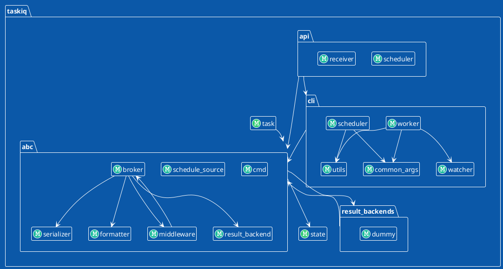

# Description

Generate modules import graph for python project. Using `plantuml` for render.

# Installation

```shell
pip install arch-blueprint
```

# Usage

Commands
```shell
python arch_blueprint --help
usage: arch_blueprint [-h] [--modules [MODULES ...]] root

Generate component diagrams in plantuml for python applications

positional arguments:
  root                  Name of root python module in project (example: 'myapp'

options:
  -h, --help            show this help message and exit
  --modules [MODULES ...], -m [MODULES ...]
                        Selected modules for rendering (examples: 'myapp.somemodule',
                        'myapp.somemodule.*', 'myapp.somemodule.**')
```

# Examples

Command usage example for `taskiq` lib
```shell
arch_blueprint taskiq -m "taskiq.api.*" "taskiq.cli.*" "taskiq.abc.*" "taskiq.result_backends.*" "taskiq.state" "taskiq.task" "taskiq.brokes.*" > out.puml
```

Example of graph



