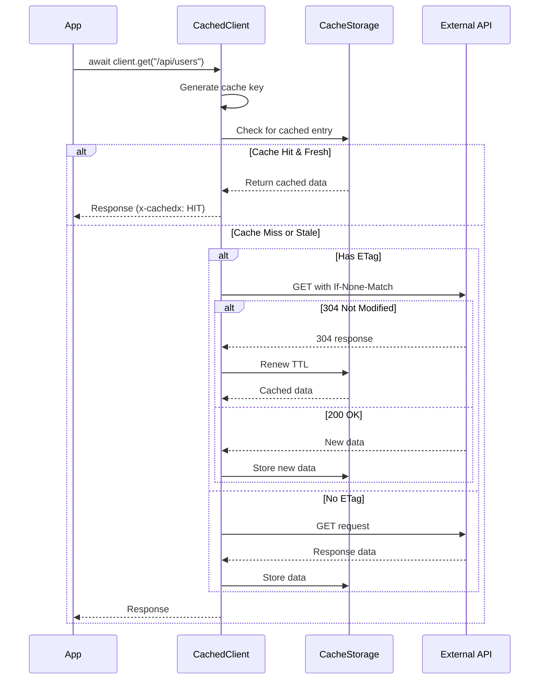
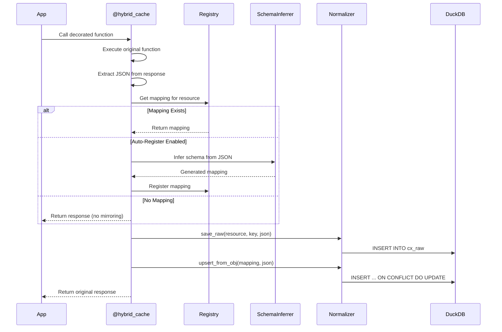

# cachedx Architecture

This document describes the internal architecture of cachedx, a unified HTTP caching and data mirroring solution.

## Overview

cachedx provides two complementary layers:

1. **HTTP Cache Layer**: Intelligent caching with TTL/ETag support
2. **Mirror Layer**: Automatic schema inference and normalized storage

## Architecture Diagram

```mermaid
graph TB
    subgraph "Application Layer"
        APP[Your Application]
        LLM[LLM Integration]
    end

    subgraph "cachedx Core"
        CLIENT[CachedClient<br/>httpx wrapper]
        CONFIG[CacheConfig<br/>Pydantic models]
    end

    subgraph "HTTP Cache Layer"
        CACHE[HTTP Cache<br/>TTL + ETag]
        KEY[Key Generation<br/>Request signatures]
        STORAGE[Cache Storage<br/>_cx_cache table]
    end

    subgraph "Mirror Layer"
        REGISTRY[Schema Registry<br/>Resource mappings]
        INFER[Schema Inferrer<br/>Auto-detection]
        NORM[Normalization<br/>JSON → SQL]
        HOOKS[Decorators<br/>@hybrid_cache]
    end

    subgraph "Storage Backend"
        DUCKDB[(DuckDB)]
        CACHE_TABLE[_cx_cache]
        RAW_TABLE[cx_raw]
        NORM_TABLES[Normalized Tables]
    end

    subgraph "Safety Layer"
        SAFE[Safe SQL<br/>SELECT-only]
        CONTEXT[LLM Context<br/>Schema info]
    end

    APP --> CLIENT
    APP --> LLM
    LLM --> SAFE

    CLIENT --> CONFIG
    CLIENT --> CACHE
    CLIENT --> HOOKS

    CACHE --> KEY
    CACHE --> STORAGE

    HOOKS --> REGISTRY
    HOOKS --> INFER
    HOOKS --> NORM

    REGISTRY --> INFER

    STORAGE --> DUCKDB
    NORM --> DUCKDB

    DUCKDB --> CACHE_TABLE
    DUCKDB --> RAW_TABLE
    DUCKDB --> NORM_TABLES

    SAFE --> DUCKDB
    CONTEXT --> DUCKDB
```

## Request Flow

### HTTP Cache Flow



### Mirror Flow



## Component Details

### HTTP Cache Layer

**Key Components:**

- `CachedClient`: httpx.AsyncClient subclass with caching
- `CacheConfig`: Pydantic configuration model
- `CacheStorage`: DuckDB-backed storage with TTL support
- `signature()`: Request signature generation

**Features:**

- Multiple caching strategies (CACHED, STATIC, REALTIME, DISABLED)
- ETag-based revalidation with 304 responses
- Vary header support for conditional caching
- Automatic view generation from cached JSON

### Mirror Layer

**Key Components:**

- `Mapping`: Pydantic model for resource schema definitions
- `SchemaInferrer`: Automatic schema detection from JSON
- `@hybrid_cache`: Decorator for transparent mirroring
- `Registry`: Global mapping storage

**Features:**

- Auto-inference of SQL schemas from JSON responses
- JSONPath and SQL expression support for field mapping
- Batch upsert operations for performance
- Raw data preservation for provenance

### Safety Layer

**Key Components:**

- `safe_select()`: SELECT-only query execution
- `validate_sql()`: SQL safety validation
- `build_llm_context()`: Schema context generation
- `safe_llm_query()`: LLM query execution with formatting

**Safety Features:**

- Blocks all non-SELECT statements
- Prevents dangerous keywords (DROP, DELETE, etc.)
- Automatic LIMIT injection
- Query result formatting and metadata

## Data Storage

### Database Schema

```sql
-- HTTP Cache Table
CREATE TABLE _cx_cache (
  key TEXT PRIMARY KEY,
  method TEXT NOT NULL,
  path TEXT NOT NULL,
  params TEXT,
  headers TEXT,
  status INTEGER NOT NULL,
  etag TEXT,
  fetched_at TIMESTAMP NOT NULL DEFAULT now(),
  expires_at TIMESTAMP,
  payload JSON NOT NULL
);

-- Raw Data Table (Provenance)
CREATE TABLE cx_raw (
  key TEXT PRIMARY KEY,
  resource TEXT NOT NULL,
  payload JSON NOT NULL,
  fetched_at TIMESTAMP NOT NULL DEFAULT now()
);

-- Example Normalized Table
CREATE TABLE users (
  id INTEGER PRIMARY KEY,
  name TEXT NOT NULL,
  email TEXT,
  created_at TIMESTAMP,
  _raw JSON,              -- Original response
  _fetched_at TIMESTAMP,  -- When cached
  _updated_at TIMESTAMP   -- Last update
);
```

### Data Flow

1. **HTTP Response** → `_cx_cache` (exact response with metadata)
2. **JSON Extraction** → `cx_raw` (provenance storage)
3. **Schema Mapping** → Normalized tables (queryable structure)

## Configuration

### Cache Strategies

| Strategy   | Behavior                          | Use Case                |
| ---------- | --------------------------------- | ----------------------- |
| `CACHED`   | TTL-based with ETag revalidation  | Most API endpoints      |
| `STATIC`   | Cache forever, never expires      | Configuration, metadata |
| `REALTIME` | Always fetch, but store responses | Live data, monitoring   |
| `DISABLED` | No caching at all                 | Development, debugging  |

### Endpoint Configuration

```python
CacheConfig(
    endpoints={
        "/api/users": EndpointConfig(
            strategy=CacheStrategy.CACHED,
            ttl=timedelta(minutes=10),
            table_name="users",
            flatten=True
        ),
        "/api/static/*": EndpointConfig(
            strategy=CacheStrategy.STATIC
        )
    }
)
```

## Performance Characteristics

| Operation               | Typical Latency | Notes                         |
| ----------------------- | --------------- | ----------------------------- |
| Cache Hit               | < 1ms           | DuckDB in-memory              |
| Cache Miss              | Network + 2ms   | HTTP + storage overhead       |
| Schema Inference        | 2-5ms           | One-time per resource         |
| SQL Query (1K rows)     | 5-10ms          | DuckDB analytical performance |
| Batch Upsert (100 rows) | 10-20ms         | Optimized bulk operations     |

## Extension Points

### Custom Mappings

```python
register("custom_resource", Mapping(
    table="custom_table",
    columns={
        "id": "$.id",
        "computed": "CAST(j->>'timestamp' AS TIMESTAMP)",
        "nested_value": "$.metadata.category"
    },
    ddl="CREATE TABLE custom_table (...)"
))
```

### Custom Cache Strategies

Extend `CacheStrategy` enum and implement handling in `CachedClient._handle_read_request()`.

### Custom Type Inference

Extend `SchemaInferrer._get_value_type()` to detect domain-specific types.

## Best Practices

### Performance

- Use connection pooling for high-traffic applications
- Consider persistent DuckDB files for large datasets
- Batch operations when processing multiple resources

### Schema Design

- Include metadata columns (`_raw`, `_fetched_at`, `_updated_at`)
- Use appropriate SQL types for better query performance
- Consider indexing frequently queried columns

### LLM Integration

- Build comprehensive contexts with `build_llm_context()`
- Always use `safe_llm_query()` for LLM-generated SQL
- Include sample data in contexts for better query generation

### Error Handling

- HTTP cache failures fall back to origin API
- Mirror failures don't prevent HTTP responses
- SQL safety violations raise clear validation errors

This architecture provides a robust, performant, and safe foundation for HTTP caching with automatic data mirroring and LLM integration.
