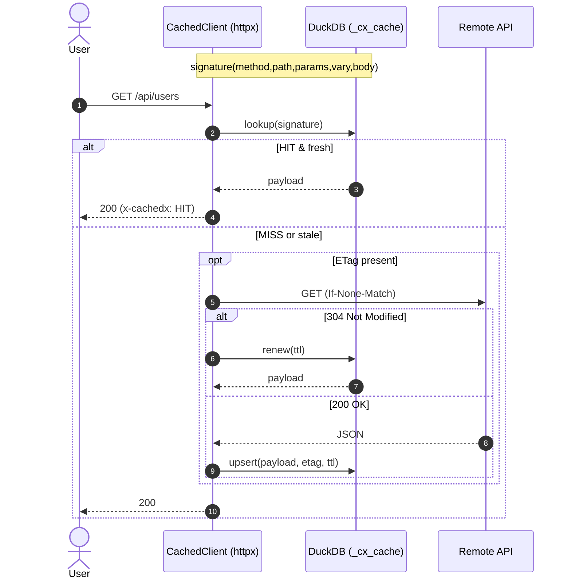
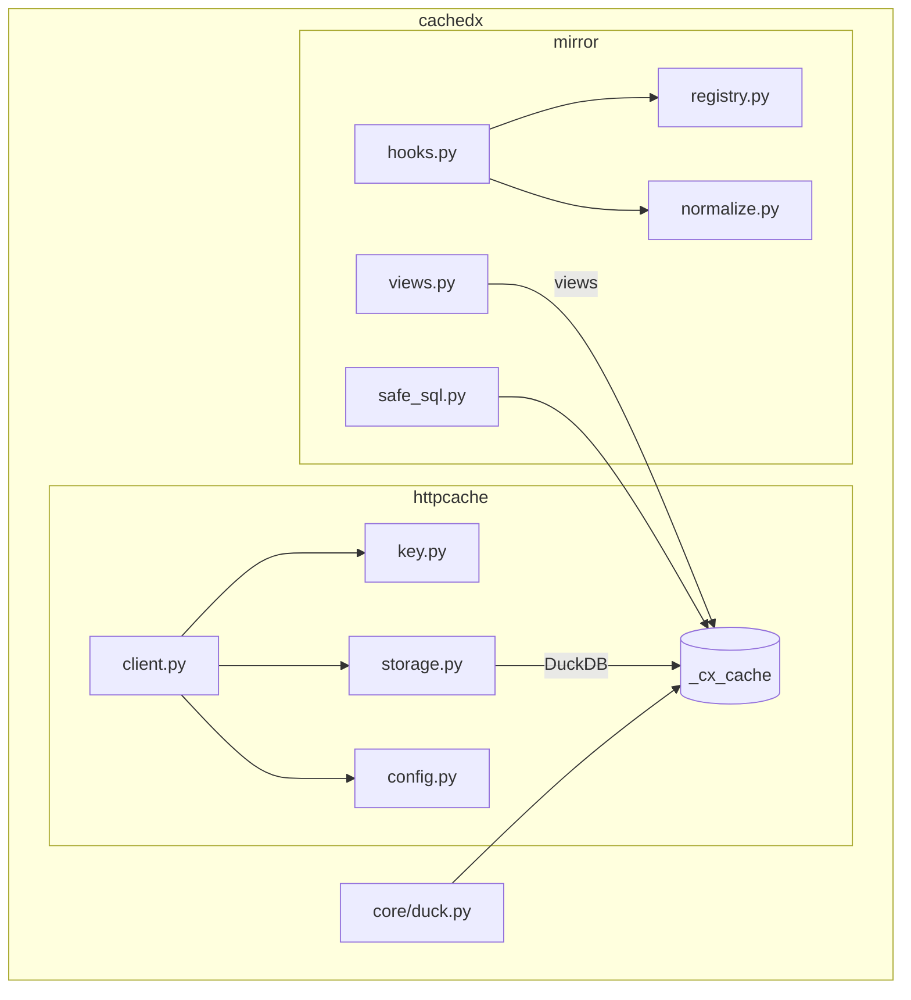
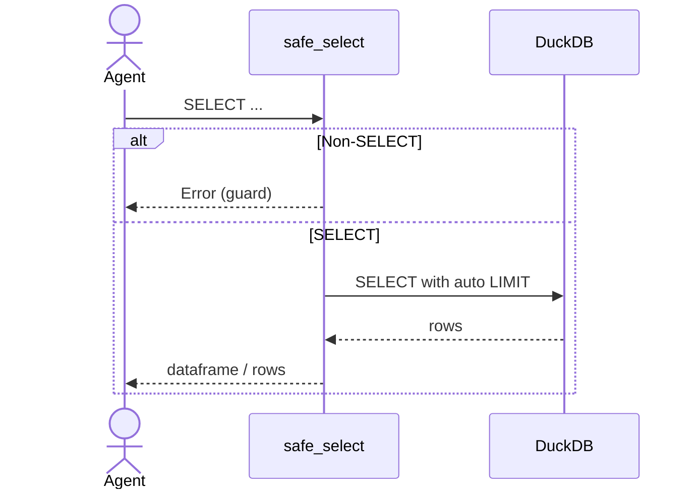

# cachedx

Unified, production‑ready caching for any REST API:

- **HTTP cache** for `httpx` with **TTL / ETag / 304** + per‑request signatures
- **Schema‑aware mirror** (raw JSON + normalized tables) for fast SQL & LLM‑safe reads
- Backed by **DuckDB** (in‑memory or file)
- **Python 3.12+**, **uv** friendly, and **Pydantic‑validated** end‑to‑end

> One package, two layers — use either independently or together:
>
> - `cachedx.httpcache`: endpoint‑level caching (TTL/ETag/conditional GET)
> - `cachedx.mirror`: resource‑level mirroring (raw JSON + normalized tables)

---

## Installation (with **uv**)

```bash
uv venv
source .venv/bin/activate  # Windows: .\.venv\Scripts\activate

uv pip install cachedx
# optional extras
uv pip install 'cachedx[pandas]'
uv pip install 'cachedx[dev]'
```

**Requires:** Python **3.12+**, `duckdb>=1.0.0`, `httpx>=0.26`, `orjson>=3.9`, `pydantic>=2.7`.

---

## Quick Start

### A) Drop‑in HTTP cache for `httpx`

```python
from datetime import timedelta
from cachedx.httpcache import CachedClient, CacheConfig, EndpointConfig, CacheStrategy

cfg = CacheConfig(
    db_path=":memory:",
    default_ttl=timedelta(minutes=5),
    endpoints={
        "/api/metadata": EndpointConfig(strategy=CacheStrategy.STATIC),
        "/api/users":    EndpointConfig(strategy=CacheStrategy.CACHED, table_name="users"),
        "/api/live/*":   EndpointConfig(strategy=CacheStrategy.REALTIME),
    },
    enable_logging=True,
)

async with CachedClient(base_url="https://api.example.com", cache_config=cfg) as client:
    r1 = await client.get("/api/users", params={"limit": 50})  # MISS → stores
    r2 = await client.get("/api/users", params={"limit": 50})  # HIT or 304 revalidate

    # SQL on cached responses (auto view: users)
    df = client.query("SELECT name, email FROM users WHERE active = true LIMIT 100")
    print(df)
```

### B) Add schema‑aware mirroring (read‑model)

```python
from cachedx.mirror import register, Mapping, hybrid_cache

register("forecast", Mapping(
    table="forecast",
    columns={
        "id": "$.id",
        "sku": "$.sku",
        "method": "$.method",
        "status": "$.status",
        "updated_at": "CAST(j->>'updated_at' AS TIMESTAMP)",
    },
    ddl="""
    CREATE TABLE IF NOT EXISTS forecast(
      id TEXT PRIMARY KEY,
      sku TEXT,
      method TEXT,
      status TEXT,
      updated_at TIMESTAMP
    );
    """,
))

@hybrid_cache(resource="forecast")
async def list_forecasts(client):
    return await client.get("/api/forecasts")

await list_forecasts(client)
```

---

## Architecture (Mermaid)

### Request lifecycle



### Components



### LLM‑safe querying



---

## Project Layout

```
cachedx/
├─ src/cachedx/
│  ├─ __init__.py
│  ├─ core/
│  │  ├─ duck.py          # connection + bootstrap (cx_raw)
│  │  ├─ safe_sql.py      # SELECT‑only guard, LIMIT injection
│  │  ├─ util.py          # hashing, sanitize, time helpers
│  ├─ httpcache/
│  │  ├─ __init__.py
│  │  ├─ client.py        # CachedClient (ETag/TTL/304, auto views)
│  │  ├─ storage.py       # _cx_cache (per‑request cache) — Pydantic CachedEntry
│  │  ├─ config.py        # CacheConfig, EndpointConfig, CacheStrategy (Pydantic)
│  │  ├─ key.py           # signature: method+path+params+Vary+bodyhash
│  │  └─ exceptions.py
│  ├─ mirror/
│  │  ├─ __init__.py
│  │  ├─ registry.py      # Mapping (Pydantic), validators
│  │  ├─ normalize.py     # save_raw + upsert_from_obj
│  │  ├─ hooks.py         # @hybrid_cache decorator, httpx hooks
│  │  └─ views.py         # curated/auto views
│  └─ py.typed
├─ examples/
│  ├─ httpcache_quickstart.py
│  ├─ mirror_quickstart.py
│  └─ fastapi_app/main.py
├─ tests/
│  ├─ test_httpcache.py
│  ├─ test_mirror.py
│  └─ test_views.py
├─ docs/
│  ├─ index.md
│  ├─ quickstart.md
│  ├─ advanced.md
│  └─ api.md
├─ pyproject.toml
├─ README.md
└─ .github/workflows/ci.yml
```

---

## PyProject (Python 3.12+, uv scripts)

```toml
[build-system]
requires = ["hatchling>=1.25"]
build-backend = "hatchling.build"

[project]
name = "cachedx"
version = "0.2.1"
description = "Unified httpx cache (TTL/ETag) + DuckDB mirror (raw+normalized) with SQL/LLM helpers"
readme = "README.md"
requires-python = ">=3.12"
authors = [{name = "Your Name"}]
license = {text = "MIT"}
keywords = ["duckdb","httpx","cache","sql","llm"]
classifiers = [
  "Programming Language :: Python :: 3",
  "Programming Language :: Python :: 3.12",
  "License :: OSI Approved :: MIT License",
  "Typing :: Typed",
]

dependencies = [
  "duckdb>=1.0.0",
  "httpx>=0.26",
  "orjson>=3.9.0",
  "pydantic>=2.7",
  "typing-extensions>=4.9.0",
]

[project.optional-dependencies]
pandas = ["pandas>=2"]
dev = ["pytest>=8","pytest-asyncio>=0.23","respx>=0.21","mypy>=1.10","ruff>=0.5","coverage"]
docs = ["mkdocs>=1.6","mkdocs-material>=9.5","mkdocstrings[python]>=0.24"]

[tool.hatch.build.targets.wheel]
packages = ["src/cachedx"]

[tool.uv]
index-url = "https://pypi.org/simple"

[tool.uv.pip]
python = "3.12"

[tool.uv.scripts]
serve = "uvicorn examples.fastapi_app.main:app --reload"
test = "pytest -q"
lint = "ruff check src"
type = "mypy src"

[tool.pytest.ini_options]
asyncio_mode = "auto"
addopts = "-q"

[tool.ruff]
line-length = 100
select = ["E","F","I","W","UP"]

[tool.mypy]
python_version = "3.12"
strict = true
warn_unused_ignores = true
```

---

## Core code (selected files)

### `src/cachedx/__init__.py`

```python
from .core.duck import connect, con
from .core.safe_sql import safe_select

__all__ = ["connect", "con", "safe_select"]
```

### `src/cachedx/core/duck.py`

```python
from __future__ import annotations
import threading, duckdb

_CONN: duckdb.DuckDBPyConnection | None = None
_LOCK = threading.Lock()

RAW_DDL = """
CREATE TABLE IF NOT EXISTS cx_raw(
  key TEXT PRIMARY KEY,
  payload JSON NOT NULL,
  fetched_at TIMESTAMP NOT NULL DEFAULT now()
);
"""

def connect(path: str = ":memory:") -> duckdb.DuckDBPyConnection:
    global _CONN
    with _LOCK:
        if _CONN is None:
            _CONN = duckdb.connect(path)
            _CONN.execute(RAW_DDL)
    return _CONN

def con() -> duckdb.DuckDBPyConnection:
    return _CONN or connect(":memory:")
```

### `src/cachedx/core/safe_sql.py`

```python
import re
from .duck import con

_SELECT = re.compile(r"(?is)^\s*select\s")

def safe_select(sql: str, params: dict | None = None, limit: int = 200):
    s = sql.strip().rstrip(";")
    if not _SELECT.match(s):
        raise ValueError("Only SELECT statements are allowed.")
    if " limit " not in s.lower():
        s = f"{s} LIMIT {limit}"
    cur = con().execute(s, params or {})
    try:
        import pandas as pd
        return cur.df()
    except Exception:
        return cur.fetchall()
```

---

## HTTP cache layer

### `src/cachedx/httpcache/config.py`

```python
from __future__ import annotations
from datetime import timedelta
from enum import Enum
from pydantic import BaseModel, Field, field_validator
from typing import Dict, Optional

class CacheStrategy(str, Enum):
    STATIC = "static"
    CACHED = "cached"
    REALTIME = "realtime"
    DISABLED = "disabled"

class EndpointConfig(BaseModel):
    strategy: CacheStrategy = CacheStrategy.CACHED
    ttl: Optional[timedelta] = Field(default=timedelta(minutes=5))
    table_name: Optional[str] = None
    view_sql: Optional[str] = None
    flatten: bool = True
    vary_headers: list[str] = Field(default_factory=lambda: ["accept-language"])  # key Vary

    @field_validator("ttl")
    @classmethod
    def _ttl_pos(cls, v):
        if v is not None and v.total_seconds() <= 0:
            raise ValueError("ttl must be positive")
        return v

class CacheConfig(BaseModel):
    endpoints: Dict[str, EndpointConfig] = Field(default_factory=dict)
    default_strategy: CacheStrategy = CacheStrategy.CACHED
    default_ttl: timedelta = Field(default=timedelta(minutes=5))
    db_path: str = Field(default=":memory:")
    enable_logging: bool = False
    auto_refresh: bool = False
    refresh_interval: timedelta = Field(default=timedelta(minutes=1))

    def get(self, path: str) -> EndpointConfig:
        if path in self.endpoints:
            return self.endpoints[path]
        for pat, cfg in self.endpoints.items():
            if pat.endswith('*') and path.startswith(pat[:-1]):
                return cfg
        return EndpointConfig(strategy=self.default_strategy, ttl=self.default_ttl)
```

### `src/cachedx/httpcache/key.py`

```python
import hashlib, json
from typing import Optional, Dict

_DEF_VARY = ("accept", "accept-language")

def signature(method: str, path: str, params: Optional[Dict]=None,
              headers: Optional[Dict]=None, body: Optional[bytes]=None,
              vary: Optional[list[str]]=None) -> str:
    parts = [method.upper(), path]
    if params:
        parts.append(json.dumps(params, sort_keys=True, separators=(",", ":")))
    if headers and (vary or _DEF_VARY):
        vs = vary or _DEF_VARY
        hv = {k.lower(): headers.get(k, headers.get(k.title())) for k in vs}
        parts.append(json.dumps(hv, sort_keys=True))
    if body:
        parts.append(hashlib.sha256(body).hexdigest()[:16])
    return hashlib.sha256("|".join(parts).encode()).hexdigest()[:32]
```

### `src/cachedx/httpcache/storage.py`

```python
from __future__ import annotations
import json
from datetime import datetime, timezone, timedelta
from typing import Any, Optional
from pydantic import BaseModel, field_validator
from ..core.duck import con

con().execute("""
CREATE TABLE IF NOT EXISTS _cx_cache(
  key TEXT PRIMARY KEY,
  method TEXT NOT NULL,
  path TEXT NOT NULL,
  params TEXT,
  headers TEXT,
  status INTEGER NOT NULL,
  etag TEXT,
  fetched_at TIMESTAMP NOT NULL DEFAULT now(),
  expires_at TIMESTAMP,
  payload JSON NOT NULL
);
CREATE INDEX IF NOT EXISTS idx_cx_path ON _cx_cache(path);
""")

class CachedEntry(BaseModel):
    status: int
    etag: str | None
    fetched_at: datetime
    expires_at: datetime | None
    expired: bool
    payload: dict | list

    @field_validator("fetched_at", "expires_at")
    @classmethod
    def _tz_aware(cls, v):
        if v is None:
            return v
        return v if v.tzinfo else v.replace(tzinfo=timezone.utc)

    def df(self):
        try:
            import pandas as pd
        except Exception:
            raise RuntimeError("Install cachedx[pandas] to use .df()")
        data = self.payload
        if isinstance(data, list):
            return pd.DataFrame(data)
        return pd.DataFrame([data])

class Storage:
    def get(self, key: str) -> Optional[CachedEntry]:
        row = con().execute(
            "SELECT status, etag, fetched_at, expires_at, payload FROM _cx_cache WHERE key = ?",
            [key],
        ).fetchone()
        if not row:
            return None
        status, etag, fetched_at, expires_at, payload = row
        expired = expires_at is not None and expires_at <= datetime.now(timezone.utc)
        return CachedEntry(
            status=status,
            etag=etag,
            fetched_at=fetched_at,
            expires_at=expires_at,
            expired=expired,
            payload=payload if isinstance(payload, (dict, list)) else json.loads(payload),
        )

    def set(self, key: str, method: str, path: str, params: dict | None, headers: dict | None,
            status: int, payload: Any, etag: str | None, ttl: timedelta | None) -> None:
        exp = None
        if ttl:
            exp = datetime.now(timezone.utc) + ttl
        con().execute(
            """
            INSERT OR REPLACE INTO _cx_cache(key,method,path,params,headers,status,etag,fetched_at,expires_at,payload)
            VALUES(?,?,?,?,?,?,?,now(),?,?::JSON)
            """,
            [key, method, path,
             json.dumps(params, sort_keys=True) if params else None,
             json.dumps(headers, sort_keys=True) if headers else None,
             status, etag, exp, json.dumps(payload)],
        )

    def renew(self, key: str, ttl: timedelta | None) -> None:
        if ttl:
            exp = datetime.now(timezone.utc) + ttl
            con().execute("UPDATE _cx_cache SET expires_at = ? WHERE key = ?", [exp, key])
```

### `src/cachedx/httpcache/client.py`

```python
from __future__ import annotations
import asyncio, json
from typing import Any, Optional
import httpx
from .config import CacheConfig, CacheStrategy
from .key import signature
from .storage import Storage
from ..mirror.views import ensure_auto_view

class CachedClient(httpx.AsyncClient):
    def __init__(self, *args, cache_config: Optional[CacheConfig]=None, **kwargs):
        super().__init__(*args, **kwargs)
        self.cfg = cache_config or CacheConfig()
        self.store = Storage()
        self._refresh_task: asyncio.Task | None = None

    async def request(self, method: str, url: httpx.URL | str, **kwargs: Any) -> httpx.Response:
        req = self.build_request(method, url, **kwargs)
        path = req.url.raw_path.decode()
        cfg = self.cfg.get(path)
        key = signature(req.method, path, dict(req.url.params), req.headers, req.content, cfg.vary_headers)

        # Writes → pass through
        if req.method in {"POST","PUT","PATCH","DELETE"}:
            return await super().send(req, **kwargs)

        # Reads
        cached = self.store.get(key) if cfg.strategy != CacheStrategy.DISABLED else None

        # Conditional GET when possible
        headers = dict(req.headers)
        if cached and cached.etag:
            headers["If-None-Match"] = cached.etag
        req.headers.update(headers)

        # STATIC + fresh → short-circuit
        if cached and cfg.strategy == CacheStrategy.STATIC and not cached.expired:
            return self._from_cache(req, cached)

        # CACHED + fresh → try 304
        if cached and cfg.strategy == CacheStrategy.CACHED and not cached.expired:
            resp = await super().send(req, **kwargs)
            if resp.status_code == 304:
                self.store.renew(key, cfg.ttl)
                return self._from_cache(req, cached, headers=resp.headers)
        else:
            resp = await super().send(req, **kwargs)

        if resp.status_code < 400:
            try:
                payload = resp.json()
            except json.JSONDecodeError:
                return resp
            self.store.set(key, req.method, path, dict(req.url.params), dict(req.headers),
                           resp.status_code, payload, resp.headers.get("etag"), cfg.ttl)
            if cfg.flatten:
                ensure_auto_view(path, cfg.table_name)
        return resp

    def _from_cache(self, req: httpx.Request, entry, headers: Optional[dict]=None) -> httpx.Response:
        content = json.dumps(entry.payload).encode()
        hdrs = {"content-type":"application/json","x-cachedx":"HIT"}
        if entry.etag: hdrs["etag"] = entry.etag
        if headers: hdrs.update({k.lower(): v for k,v in headers.items()})
        return httpx.Response(status_code=entry.status, content=content, headers=hdrs, request=req)

    def query(self, sql: str, params: list | None = None):
        from ..core.duck import con
        cur = con().execute(sql, params or [])
        try:
            import pandas as pd
            return cur.df()
        except Exception:
            cols = [d[0] for d in cur.description]
            return [dict(zip(cols, r)) for r in cur.fetchall()]
```

---

## Mirror layer

### `src/cachedx/mirror/registry.py`

```python
from __future__ import annotations
import re
from typing import Dict
from pydantic import BaseModel, Field, field_validator
from ..core.duck import con

class Mapping(BaseModel):
    table: str = Field(..., description="Target DuckDB table name")
    columns: Dict[str, str] = Field(default_factory=dict, description="col -> JSONPath or SQL using alias `j`")
    ddl: str | None = None

    @field_validator("table")
    @classmethod
    def _sanitize_table(cls, v: str) -> str:
        s = re.sub(r"[^A-Za-z0-9_]", "_", v)
        if not s:
            raise ValueError("table name cannot be empty")
        return s

    @field_validator("columns")
    @classmethod
    def _non_empty_columns(cls, v: Dict[str, str]) -> Dict[str, str]:
        if not v:
            raise ValueError("columns mapping cannot be empty")
        return v

    def ensure(self) -> None:
        if self.ddl:
            con().execute(self.ddl)

_registry: Dict[str, Mapping] = {}

def register(resource: str, mapping: Mapping) -> None:
    mapping.ensure()
    _registry[resource] = mapping

def get(resource: str) -> Mapping:
    return _registry[resource]
```

### `src/cachedx/mirror/normalize.py`

```python
import orjson
from ..core.duck import con

def save_raw(resource: str, key: str, obj: dict) -> None:
    con().execute(
        "INSERT OR REPLACE INTO cx_raw(key,payload,fetched_at) VALUES (?,?, now())",
        [f"{resource}:{key}", orjson.dumps(obj).decode("utf-8")],
    )

def upsert_from_obj(resource: str, obj: dict, columns: dict[str,str], table: str) -> None:
    cols = list(columns.keys())
    def expr(p: str) -> str:
        return f"j->>'{p.split('.')[-1]}'" if p.startswith('$.') else p
    select_sql = ", ".join(expr(v) for v in columns.values())
    pk = cols[0]
    updates = ", ".join(f"{c}=excluded.{c}" for c in cols[1:])
    sql = f"""
    INSERT INTO {table} ({', '.join(cols)})
    SELECT {select_sql} FROM (SELECT json(?) AS j)
    ON CONFLICT ({pk}) DO UPDATE SET {updates}
    """
    con().execute(sql, [orjson.dumps(obj).decode("utf-8")])
```

### `src/cachedx/mirror/hooks.py`

```python
from __future__ import annotations
from functools import wraps
import orjson
from pydantic import TypeAdapter
from .registry import get as get_mapping
from .normalize import save_raw, upsert_from_obj

JsonObjOrList = TypeAdapter(list[dict] | dict)

def hybrid_cache(resource: str):
    def deco(fn):
        @wraps(fn)
        async def wrapper(*args, **kwargs):
            resp = await fn(*args, **kwargs)
            content = getattr(resp, "content", resp)
            ctype = getattr(resp, "headers", {}).get("content-type", "application/json")
            if b"application/json" not in (ctype.encode() if isinstance(ctype, str) else ctype):
                return resp
            obj = JsonObjOrList.validate_json(content)
            mp = get_mapping(resource)
            def handle(o: dict):
                key = str(o.get("id", hash(orjson.dumps(o))))
                save_raw(resource, key, o)
                upsert_from_obj(resource, o, mp.columns, mp.table)
            if isinstance(obj, list):
                for o in obj:
                    handle(o)
            else:
                handle(obj)
            return resp
        return wrapper
    return deco
```

### `src/cachedx/mirror/views.py`

```python
import re
from ..core.duck import con

def _safe_ident(name: str) -> str:
    s = re.sub(r"[^A-Za-z0-9_]", "_", name)
    return f"cx_{s}" if s else "cx_view"

def ensure_auto_view(path: str, table_name: str | None):
    name = _safe_ident(table_name or path.strip('/').replace('/', '_') or 'data')
    path_lit = path.replace("'", "''")
    con().execute(f"""
    CREATE OR REPLACE VIEW {name} AS
    WITH src AS (
      SELECT payload AS doc FROM _cx_cache WHERE path = '{path_lit}' AND method = 'GET'
    ), rows AS (
      SELECT * FROM json_each(doc)
      UNION ALL
      SELECT 0 AS index, doc FROM src WHERE json_type(doc) <> 'array'
    )
    SELECT index AS _idx, value AS _raw FROM rows;
    """)
    return name
```

---

## Examples

### `examples/httpcache_quickstart.py`

```python
from datetime import timedelta
from cachedx.httpcache import CachedClient, CacheConfig, EndpointConfig, CacheStrategy

async def main():
    cfg = CacheConfig(
        db_path=":memory:",
        default_ttl=timedelta(minutes=5),
        endpoints={"/users": EndpointConfig(strategy=CacheStrategy.CACHED, table_name="users")},
    )
    async with CachedClient(base_url="https://api.github.com", cache_config=cfg) as client:
        await client.get("/users")
        print(client.query("SELECT _raw->>'login' AS login FROM users LIMIT 5"))
```

### `examples/mirror_quickstart.py`

```python
from cachedx.mirror import register, Mapping, hybrid_cache

register("forecast", Mapping(
  table="forecast",
  columns={"id":"$.id","method":"$.method","status":"$.status"},
  ddl="CREATE TABLE IF NOT EXISTS forecast(id TEXT PRIMARY KEY, method TEXT, status TEXT);",
))

@hybrid_cache(resource="forecast")
async def list_forecasts(client):
    return await client.get("/api/forecasts")
```

### FastAPI demo

```python
# examples/fastapi_app/main.py
from fastapi import FastAPI
from cachedx.httpcache import CachedClient, CacheConfig, EndpointConfig, CacheStrategy
from datetime import timedelta

app = FastAPI()

cfg = CacheConfig(
    db_path=":memory:",
    default_ttl=timedelta(minutes=5),
    endpoints={"/users": EndpointConfig(strategy=CacheStrategy.CACHED, table_name="users")},
)

@app.get("/proxy/users")
async def proxy_users():
    async with CachedClient(base_url="https://api.github.com", cache_config=cfg) as client:
        r = await client.get("/users")
        return r.json()

@app.get("/analytics/top")
async def top():
    async with CachedClient(base_url="https://api.github.com", cache_config=cfg) as client:
        rows = client.query("SELECT _raw->>'login' AS login FROM users LIMIT 5")
        try:
            return rows.to_dict(orient="records")
        except Exception:
            return rows
```

---

## Tests (high‑value cases)

- httpcache: HIT/MISS, TTL expiry, ETag/304 (via `respx`), keying with Vary headers
- mirror: mapping registration & DDL, decorator capture (list/object), upsert correctness
- views: auto‑view name sanitization, array/object payloads

`tests/test_httpcache.py` (example)

```python
import httpx, pytest, respx
from datetime import timedelta
from cachedx.httpcache import CachedClient, CacheConfig, EndpointConfig, CacheStrategy

@respx.mock
@pytest.mark.asyncio
async def test_cached_hit_and_304():
    respx.get("https://api.test.com/users").mock(
        return_value=httpx.Response(200, json=[{"id":1,"name":"A"}], headers={"etag":"v1"})
    )
    cfg = CacheConfig(endpoints={"/users": EndpointConfig(strategy=CacheStrategy.CACHED, ttl=timedelta(seconds=60), table_name="users")})
    async with CachedClient(base_url="https://api.test.com", cache_config=cfg) as client:
        r1 = await client.get("/users")
        assert r1.status_code == 200

    # second call returns 304
    respx.get("https://api.test.com/users").mock(return_value=httpx.Response(304))
    async with CachedClient(base_url="https://api.test.com", cache_config=cfg) as client:
        r2 = await client.get("/users")
        assert r2.status_code == 200
        assert r2.headers.get("x-cachedx") == "HIT"
```

---

## Docs

### `docs/index.md`

- What & Why
- When to use `httpcache` vs `mirror`
- Mermaid diagrams (request lifecycle, components)

### `docs/quickstart.md`

- Install with uv
- httpcache Quick Start
- mirror Quick Start
- Combined usage and best practices

### `docs/advanced.md`

- Conditional GET (ETag/If‑None‑Match)
- Vary headers in cache key
- Curated views for LLMs
- `safe_select` and SQL guardrails

### `docs/api.md`

- Public API reference (CachedClient, CacheConfig, EndpointConfig, Mapping, hybrid_cache, safe_select)

---

## README (outline)

- Summary + badges
- Install
- Quick Start (A/B)
- Concepts (request cache vs resource mirror)
- SQL & LLM usage
- Persistence vs memory
- Roadmap & Contributing

---

## Publishing

```bash
uv pip install hatch
hatch build
hatch publish   # or twine upload dist/*
```

---

## Changelog

- `0.2.1` — TypeAdapter examples, `CachedEntry.df()`, FastAPI demo, Mermaid diagrams
- `0.2.0` — Python 3.12+, uv workflow, pervasive Pydantic validation
- `0.1.0` — Initial unified release (httpcache + mirror)
