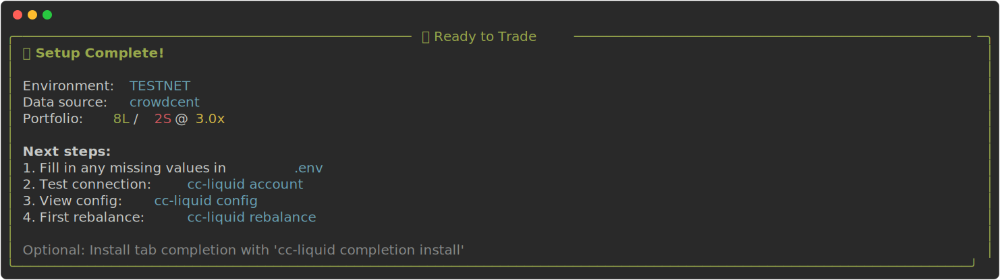

## Prerequisites

- Hyperliquid API/Agent wallet (address + private key)
- Optional: CrowdCent API key

## Install

If uv is not yet installed:

=== "macOS / Linux"
    ```bash
    curl -LsSf https://astral.sh/uv/install.sh | sh
    ```

=== "Windows (PowerShell)"
    ```powershell
    powershell -ExecutionPolicy ByPass -c "irm https://astral.sh/uv/install.ps1 | iex"
    ```

#### Install cc-liquid as a CLI tool:
```bash
uv tool install cc-liquid
uv tool install cc-liquid[numerai] # optional Numerai support
```

#### Or run with uvx (no install)

```bash
uvx cc-liquid init
```

### First-time setup

```bash
cc-liquid init               # interactive setup wizard (recommended)
cc-liquid init --non-interactive  # use safe defaults without prompts
```

The wizard will guide you through:

- Choosing testnet vs mainnet (defaults to testnet for safety)
- Selecting data source (CrowdCent, Numerai, or local)
- Entering API keys (with links to get them)
- Setting up portfolio parameters
- Auto-adding `.env` to `.gitignore` for security


Example init result:



!!! warning

    Before running commands, your secrets must be loaded into your shell's environment. `cc-liquid` will attempt to load any .env in PATH, but if you are encountering errors it is likely that you need to manually export your environment variables. From the directory with your .env, run either:

    1) export the file to a UV environment variable
    ```bash
    export UV_ENV_FILE=.env
    ```

    or 2) export all non-comments in .env
    ```bash
    export $(grep -v '^#' .env | xargs)
    ```

   You'll need to run it in each new terminal session.

### Enable tab auto-completion in your shell (optional)

Tabs for commands, options, and values.

```bash
cc-liquid completion install          # auto-detects your shell
```

Manual equivalent:

=== "Bash"
    ```bash
    _CC_LIQUID_COMPLETE=bash_source cc-liquid > ~/.cc-liquid-complete.bash
    echo '. ~/.cc-liquid-complete.bash' >> ~/.bashrc
    ```

=== "Zsh"
    ```bash
    _CC_LIQUID_COMPLETE=zsh_source cc-liquid > ~/.cc-liquid-complete.zsh
    echo '. ~/.cc-liquid-complete.zsh' >> ~/.zshrc
    ```

=== "Fish"
    ```bash
    mkdir -p ~/.config/fish/completions
    _CC_LIQUID_COMPLETE=fish_source cc-liquid > ~/.config/fish/completions/cc-liquid.fish
    ```

Restart your shell to activate completion, or run `source ~/.bashrc`, `source ~/.zshrc`, etc. as needed.  
See [Click Shell Completion](https://click.palletsprojects.com/en/stable/shell-completion/) for details.

## Quick Start
### Configure

View [configuration](configuration.md) for full configuration details. After running `cc-liquid init`, you'll have two files:

1) `.env` - Contains your secrets (auto-added to .gitignore):

```env
# Secrets only - NEVER commit this file to git!
CROWDCENT_API_KEY=...                # from https://crowdcent.com/profile
HYPERLIQUID_PRIVATE_KEY=0x...        # from https://app.hyperliquid.xyz/API
```

2) `cc-liquid-config.yaml` - Your trading configuration:

```yaml
active_profile: personal

profiles:
  personal:
    owner: 0xYourMain
    vault: null
    signer_env: HYPER_AGENT_KEY_PERSONAL

data:
  source: crowdcent         # crowdcent | numerai | local
  path: predictions.parquet
  date_column: release_date
  asset_id_column: id
  prediction_column: pred_10d

portfolio:
  num_long: 10
  num_short: 10
  target_leverage: 1.0
  rebalancing:
    every_n_days: 10
    at_time: "18:15"

execution:
  slippage_tolerance: 0.005
```

### First run

```bash
cc-liquid config     # verify config is loaded
cc-liquid account    # view account and positions
cc-liquid rebalance  # plan and execute trades (prompts for confirmation)
```

### Autopilot (continuous)

Runs a live dashboard and executes on your schedule.

```bash
cc-liquid run --skip-confirm   # WARNING: executes trades automatically
```

See the [User Guide](walkthrough.md) for a deeper walkthrough.


