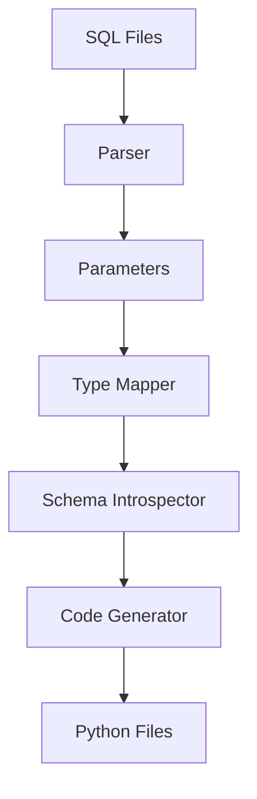

# Architecture

Understanding how `chty` works under the hood.

## Overview



## Components

### Parser (`chty/parser.py`)

Extracts parameters from SQL using regex:

```python
# From: WHERE age >= {min_age:Int32}
# To: QueryParameter(name='min_age', clickhouse_type='Int32')
```

### Type Mapper (`chty/typemapper.py`)

Maps ClickHouse types to Python types:

```python
clickhouse_to_python_type('Int32') -> 'int'
clickhouse_to_python_type('Array(String)') -> 'list[str]'
```

### Schema Introspector (`chty/schema.py`)

Queries ClickHouse for result schema:

```python
# Uses: DESCRIBE TABLE (query_with_defaults)
# Returns: [(column_name, clickhouse_type), ...]
```

**Key insight:** Replaces parameters with type-appropriate defaults before `DESCRIBE`:

```python
{min_age:Int32} -> 0
{pattern:String} -> ''
{tags:Array(String)} -> []
```

This allows schema introspection without executing the query.

### Code Generator (`chty/codegen.py`)

Generates Python code from templates:

1. Parameter class (Dict subclass)
2. Result TypedDict
3. Query wrapper class
4. Methods: `execute()`, `execute_df()`

### Validator (`chty/validator.py`)

Validates generated code against live schema:

1. Parse Python file (AST)
2. Extract TypedDict
3. Query ClickHouse
4. Compare schemas

### CLI (`chty/cli.py`)

Command-line interface using Typer:

- `generate` - Generate Python code
- `validate` - Validate schemas

## Data Flow

### Generation

```
1. Parse SQL file
   ↓
2. Extract {param:Type} patterns
   ↓
3. Map ClickHouse types → Python types
   ↓
4. (If --db-url) Replace params with defaults
   ↓
5. (If --db-url) DESCRIBE TABLE (modified_query)
   ↓
6. Generate Python code
   ↓
7. Write .py file
```

### Validation

```
1. Read generated .py file
   ↓
2. Parse with AST
   ↓
3. Extract TypedDict definition
   ↓
4. Extract QUERY constant
   ↓
5. Query ClickHouse with DESCRIBE
   ↓
6. Compare schemas
   ↓
7. Report diff
```

## Design Decisions

### Why Dict Subclass for Parameters?

- ✅ Compatible with clickhouse_connect (expects dict)
- ✅ Named parameters with type hints
- ✅ Runtime validation on construction
- ✅ No casting needed

### Why TypedDict for Results?

- ✅ Zero runtime overhead
- ✅ Native dictionary interface
- ✅ IDE autocomplete
- ✅ Type checker support

### Why Query Wrapper Class?

- ✅ Type-safe execute methods
- ✅ Optional runtime validation
- ✅ Clean API
- ✅ Forwards kwargs to clickhouse_connect

### Why DESCRIBE TABLE?

- ✅ Safe (doesn't execute query)
- ✅ Fast (just schema inspection)
- ✅ Purpose-built for schema introspection
- ❌ Alternative (LIMIT 0) can still trigger CTEs/subqueries

## Project Structure

```
chty/
├── chty/
│   ├── __init__.py
│   ├── cli.py           # CLI interface
│   ├── parser.py        # SQL parameter parsing
│   ├── typemapper.py    # Type mapping logic
│   ├── codegen.py       # Python code generation
│   ├── schema.py        # ClickHouse introspection
│   └── validator.py     # Schema validation
├── tests/
│   ├── test_parser.py
│   ├── test_typemapper.py
│   ├── test_codegen.py
│   ├── test_schema.py
│   └── test_validator.py
├── docs/                # MkDocs documentation
├── examples/
│   ├── queries/         # Example SQL files
│   ├── generated/       # Generated Python files
│   └── demo.py          # Usage demo
├── pyproject.toml       # Package configuration
├── mkdocs.yml           # Documentation config
└── main.py             # CLI entrypoint
```

## Dependencies

- **clickhouse-connect** - ClickHouse Python driver
- **typer** - CLI framework
- **pandas** - For `execute_df()` support
- **pytest** - Testing framework
- **mkdocs-material** - Documentation

## See Also

- [Contributing](contributing.md)
- [Type Mapping](../reference/type-mapping.md)
- [CLI Reference](../reference/cli.md)

