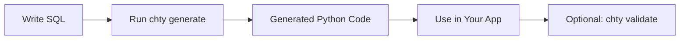

# Basic Usage

This guide covers the fundamental concepts and workflows of `chty`.

## The chty Workflow



## Writing SQL Queries

### Parameter Syntax

Use ClickHouse's parameter syntax `{param_name:Type}`:

```sql
SELECT *
FROM events
WHERE 
    event_type = {type:String}
    AND timestamp >= {start_time:DateTime}
    AND user_id IN {user_ids:Array(Int64)}
```

### Supported Types

See [Type Mapping Reference](../reference/type-mapping.md) for the complete list of supported ClickHouse types and their Python equivalents.

Common examples:

| ClickHouse Type | Python Type | Example |
|----------------|-------------|---------|
| `Int32`, `Int64` | `int` | `user_id:Int64` |
| `String` | `str` | `name:String` |
| `DateTime` | `datetime` | `created_at:DateTime` |
| `Array(T)` | `list[T]` | `tags:Array(String)` |
| `Nullable(T)` | `T \| None` | `score:Nullable(Float64)` |

## Generating Code

### Full Type Safety (Recommended)

Generate both parameter and result types:

```bash
chty generate queries/*.sql \
  --output generated/ \
  --db-url clickhouse://localhost:8123
```

This connects to ClickHouse at codegen time to introspect the result schema using `DESCRIBE TABLE`.

!!! success "Best Practice"
    Always use `--db-url` when possible. It provides:
    
    - Full type safety for results
    - Schema validation support
    - Better IDE experience
    - Catch more errors at development time

### Parameter Types Only

If you don't have database access at codegen time:

```bash
chty generate queries/*.sql --output generated/
```

This generates only parameter types. You'll need to use the raw ClickHouse client for queries.

## Generated Code Structure

For a query file `queries/users.sql`, `chty` generates `generated/users.py` with:

### 1. Parameter Class

```python
class UsersParams(Dict[str, Any]):
    def __init__(self, *, min_age: int, pattern: str):
        super().__init__(min_age=min_age, pattern=pattern)
```

- Inherits from `Dict[str, Any]` (compatible with clickhouse_connect)
- Named parameters with type hints
- Runtime validation on construction

### 2. Result TypedDict (with `--db-url`)

```python
class UsersResult(TypedDict):
    user_id: int
    username: str
    email: str
    created_at: datetime
```

- Zero runtime overhead
- Full IDE autocomplete
- Type checker knows all fields

### 3. Query Wrapper (with `--db-url`)

```python
class UsersQuery:
    def __init__(self, client, *, validate: bool = False):
        self.client = client
        self.query = QUERY
        self.validate = validate

    def execute(self, parameters: UsersParams, **kwargs) -> list[UsersResult]:
        """Execute query and return typed results."""
        ...

    def execute_df(self, parameters: UsersParams, **kwargs) -> list[UsersResult]:
        """Execute query using DataFrame and return typed results."""
        ...
```

- Type-safe `execute()` and `execute_df()` methods
- Optional runtime validation
- Forwards `**kwargs` to clickhouse_connect

### 4. Query Constant

```python
QUERY = """SELECT user_id, username, email, created_at
FROM users
WHERE age >= {min_age:Int32}
  AND username LIKE {pattern:String}"""
```

The original SQL query for reference.

## Using Generated Code

### Basic Usage

```python
from generated.users import UsersParams, UsersQuery
import clickhouse_connect

# Setup
client = clickhouse_connect.get_client(host="localhost")
params = UsersParams(min_age=18, pattern="%john%")
query = UsersQuery(client)

# Execute
results = query.execute(params)
```

### With Options

Forward any `clickhouse_connect` options:

```python
results = query.execute(
    params,
    settings={'max_threads': 4},
    query_formats={'datetime': 'string'}
)
```

### DataFrame Mode

```python
results = query.execute_df(params, use_none=True)
```

Both methods return the same type: `list[UsersResult]`

## Type Checking

### Development Time

Use mypy or pyright to catch errors:

```bash
mypy your_app.py
```

```python
# These will be caught by type checkers:
params = UsersParams(min_age="not a number")  # ❌ Type error
params = UsersParams(wrong_param=18)  # ❌ Unknown parameter
result['wrong_field']  # ❌ Field doesn't exist
```

### Runtime

Python doesn't enforce TypedDict at runtime, but you can enable optional validation:

```python
query = UsersQuery(client, validate=True)
results = query.execute(params)  # Validates schema
```

See [Runtime Validation](../guide/runtime-validation.md) for details.

## Next Steps

- [Full Type Safety Guide](../guide/full-type-safety.md) - Deep dive into type-safe workflows
- [CLI Reference](../reference/cli.md) - Complete command documentation
- [Examples](../reference/examples.md) - Real-world usage patterns

