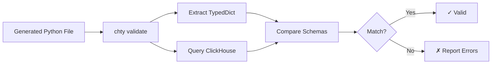

# Schema Validation

Detect schema drift by validating generated code against your current ClickHouse schema.

## Overview

The `chty validate` command checks that your generated TypedDict definitions still match the actual ClickHouse schema. This catches breaking changes **before** they hit production.

## How It Works



`chty validate`:

1. Parses the generated Python file (AST parsing)
2. Extracts the `TypedDict` definition
3. Queries ClickHouse with `DESCRIBE TABLE (query)`
4. Compares expected vs actual schemas
5. Reports any mismatches

## Usage

### Basic Validation

```bash
chty validate generated/users.py --db-url clickhouse://localhost:8123
```

### Validate Multiple Files

```bash
chty validate generated/*.py --db-url clickhouse://localhost:8123
```

## What It Validates

### Missing Columns

Expected columns that no longer exist:

```
✗ Validation failed:
  - Missing columns in current schema: old_column, deprecated_field
```

**Cause:** Columns were removed from the table or query result.

### Extra Columns

New columns not in the generated code:

```
✗ Validation failed:
  - Extra columns in current schema: new_column, added_field
```

**Cause:** Columns were added to the table or query.

### Type Mismatches

Column types that have changed:

```
✗ Validation failed:
  - Type mismatch for column 'age': expected str, got int
  - Type mismatch for column 'score': expected int, got float
```

**Cause:** Column types were altered (e.g., `ALTER TABLE` statements).

## Exit Codes

- `0` - All files are valid
- `1` - One or more files failed validation

Perfect for CI/CD pipelines!

## Example Output

### All Valid

```bash
$ chty validate generated/*.py --db-url clickhouse://localhost:8123

Validating 3 file(s) against ClickHouse...

Checking generated/users.py...
  ✓ Valid

Checking generated/events.py...
  ✓ Valid

Checking generated/products.py...
  ✓ Valid

✓ All 3 file(s) are valid!
```

### Schema Drift Detected

```bash
$ chty validate generated/users.py --db-url clickhouse://localhost:8123

Validating 1 file(s) against ClickHouse...

Checking generated/users.py...
  ✗ Validation failed:
    - Missing columns in current schema: deprecated_score
    - Extra columns in current schema: new_rating
    - Type mismatch for column 'age': expected str, got int

✗ 1 file(s) failed validation, 0 passed
```

## CI/CD Integration

### GitHub Actions

```yaml title=".github/workflows/validate-schemas.yml"
name: Validate ClickHouse Schemas

on:
  pull_request:
  schedule:
    - cron: '0 0 * * *'  # Daily

jobs:
  validate:
    runs-on: ubuntu-latest
    steps:
      - uses: actions/checkout@v3
      
      - name: Install uv
        uses: astral-sh/setup-uv@v4
      
      - name: Validate schemas
        run: |
          uvx chty validate generated/*.py \
            --db-url ${{ secrets.CLICKHOUSE_URL }}
```

### GitLab CI

```yaml title=".gitlab-ci.yml"
validate-schemas:
  image: ghcr.io/astral-sh/uv:latest
  stage: test
  script:
    - uvx chty validate generated/*.py --db-url $CLICKHOUSE_URL
  only:
    - merge_requests
    - main
```

### Pre-deployment Check

```bash title="deploy.sh"
#!/bin/bash

echo "Validating ClickHouse schemas..."
chty validate generated/*.py --db-url $STAGING_DB_URL

if [ $? -ne 0 ]; then
    echo "Schema validation failed! Aborting deployment."
    exit 1
fi

echo "Schema validation passed. Deploying..."
# ... deployment steps ...
```

## When to Validate

### ✅ Good Use Cases

1. **Pull Request Checks** - Catch schema changes before merge
2. **Daily Scheduled Jobs** - Monitor for drift
3. **Pre-deployment** - Ensure compatibility before releasing
4. **After DB Migrations** - Verify schema changes are reflected

### ⚠️ When NOT to Validate

1. **Without `--db-url` generation** - Files must have result types
2. **Against different environments** - Dev vs prod schemas may differ intentionally
3. **During active migrations** - Expected to be temporarily out of sync

## Handling Validation Failures

### Regenerate Types

If schemas have changed intentionally:

```bash
# Regenerate with new schema
chty generate queries/*.sql -o generated/ --db-url $DB_URL

# Commit updated types
git add generated/
git commit -m "Update types after schema change"
```

### Investigate Changes

If changes were unintentional:

1. Check recent database migrations
2. Review ALTER TABLE statements
3. Coordinate with database team
4. Roll back breaking changes if needed

## Best Practices

### 1. Validate Against the Right Environment

```bash
# ✅ Validate against environment you'll deploy to
chty validate generated/*.py --db-url $STAGING_DB_URL

# ❌ Don't validate prod code against dev DB
chty validate generated/*.py --db-url $DEV_DB_URL  # Wrong!
```

### 2. Run in CI on Multiple Events

```yaml
on:
  pull_request:  # Before merge
  push:
    branches: [main]  # After merge
  schedule:
    - cron: '0 */6 * * *'  # Every 6 hours
```

### 3. Fail Fast

Configure CI to fail the build on validation errors:

```yaml
- name: Validate schemas
  run: |
    chty validate generated/*.py --db-url $DB_URL
    # Exit code 1 will fail the job
```

### 4. Track Schema Changes

Monitor validation failures to understand schema evolution:

```yaml
- name: Validate and notify
  run: |
    if ! chty validate generated/*.py --db-url $DB_URL; then
      # Send Slack/email notification
      ./notify-schema-drift.sh
      exit 1
    fi
```

## Limitations

### Only Validates Schema Shape

Validation checks:
- ✅ Column names
- ✅ Column types
- ❌ NOT data values
- ❌ NOT performance
- ❌ NOT query correctness

### Requires Result Types

Files generated without `--db-url` will fail validation:

```
✗ Validation failed:
  - No result schema found in generated/users.py.
    File was likely generated without --db-url.
```

### Network Dependency

Validation requires live database access. In environments without network access, validation will fail.

## Next Steps

- [Runtime Validation](runtime-validation.md) - Validate at query execution time
- [Error Handling](error-handling.md) - Handle validation failures gracefully
- [CLI Reference](../reference/cli.md) - Complete `validate` command docs

