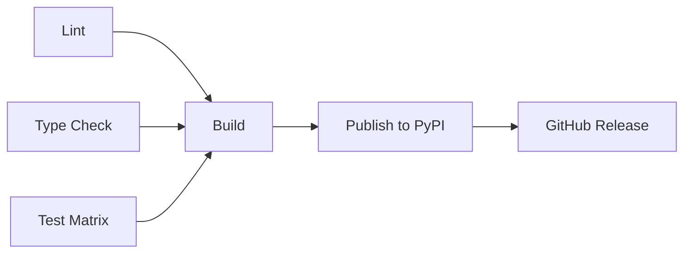

# GitHub Actions Setup

This document describes the GitHub Actions CI/CD pipelines configured for chuk-acp-agent.

## Workflows

### 1. CI Workflow (`.github/workflows/ci.yml`)

**Triggers:**
- Push to `main` or `develop` branches
- Pull requests to `main` or `develop`
- Manual trigger via `workflow_dispatch`

**Jobs:**

#### Lint & Format Check
- Runs `ruff check .` for linting
- Runs `ruff format --check .` for format verification
- Python 3.11 on Ubuntu

#### Type Check
- Runs `mypy src/chuk_acp_agent` for type checking
- Python 3.11 on Ubuntu
- Requires all type checks to pass

#### Test
- **Matrix strategy**: Tests on multiple platforms and Python versions
  - OS: Ubuntu, macOS, Windows
  - Python: 3.11, 3.12
- Runs tests with coverage: `pytest --cov --cov-fail-under=90`
- Uploads coverage to Codecov (Ubuntu + Python 3.11 only)
- **Coverage requirement**: 90% minimum

#### Build
- Builds the Python package
- Validates package with `twine check`
- Uploads build artifacts
- Only runs after all other jobs succeed

**Status**: ✅ All quality checks enforced

---

### 2. Publish Workflow (`.github/workflows/publish.yml`)

**Triggers:**
- Automatic: When a GitHub release is published
- Manual: Via `workflow_dispatch` with environment selection

**Jobs:**

#### Build
- Builds the package distribution (sdist + wheel)
- Validates with `twine check`
- Uploads artifacts

#### Publish to TestPyPI
- **Environment**: `testpypi`
- **Trigger**: Manual workflow dispatch with `testpypi` selected
- **URL**: https://test.pypi.org/p/chuk-acp-agent
- Uses Trusted Publishers (OIDC)
- Skips existing versions

#### Publish to PyPI
- **Environment**: `pypi`
- **Trigger**: GitHub release OR manual with `pypi` selected
- **URL**: https://pypi.org/p/chuk-acp-agent
- Uses Trusted Publishers (OIDC)

#### GitHub Release
- Signs artifacts with Sigstore
- Uploads signed artifacts to GitHub release
- Only runs for official releases

**Publishing Method**: Trusted Publishers (no tokens needed!)

---

### 3. CodeQL Security Scan (`.github/workflows/codeql.yml`)

**Triggers:**
- Push to `main` branch
- Pull requests to `main`
- Weekly schedule (Mondays at midnight)

**Analysis:**
- Language: Python
- Queries: `security-extended`, `security-and-quality`
- Auto-detection of vulnerabilities
- Results visible in Security tab

**Status**: ✅ Automated security scanning

---

### 4. Release Drafter (`.github/workflows/release-drafter.yml`)

**Triggers:**
- Push to `main` branch
- Pull requests (opened, reopened, synchronized)

**Features:**
- Automatically drafts release notes
- Categorizes changes by labels
- Semantic versioning based on PR labels
- Tracks contributors

**Configuration**: `.github/release-drafter.yml`

---

## Release Drafter Configuration

The release drafter uses PR labels to categorize changes and determine version bumps:

### Categories
- **Breaking Changes**: `breaking`, `breaking-change`
- **Features**: `feature`, `enhancement`
- **Bug Fixes**: `fix`, `bugfix`, `bug`
- **Documentation**: `documentation`, `docs`
- **Dependencies**: `dependencies`, `deps`
- **CI/CD**: `ci`, `github-actions`

### Version Resolution
- **Major** (x.0.0): Breaking changes
- **Minor** (0.x.0): New features
- **Patch** (0.0.x): Bug fixes, dependencies (default)

---

## Setup Requirements

### 1. Repository Secrets

No secrets required! We use **Trusted Publishers** for PyPI.

However, you may optionally add:
- `CODECOV_TOKEN` - For coverage uploads (optional, public repos work without)

### 2. PyPI Trusted Publishers Setup

Configure Trusted Publishers on PyPI/TestPyPI:

**For PyPI:**
1. Go to https://pypi.org/manage/account/publishing/
2. Add publisher:
   - PyPI Project Name: `chuk-acp-agent`
   - Owner: `<your-github-org>`
   - Repository: `chuk-acp-agent`
   - Workflow: `publish.yml`
   - Environment: `pypi`

**For TestPyPI:**
1. Go to https://test.pypi.org/manage/account/publishing/
2. Add publisher with same settings but environment: `testpypi`

### 3. GitHub Environments

Create two environments in repository settings:

**Environment: `pypi`**
- Protection rules (optional): Require reviewers for production
- No secrets needed (uses OIDC)

**Environment: `testpypi`**
- No protection rules needed
- No secrets needed (uses OIDC)

### 4. Branch Protection (Recommended)

For `main` branch:
- ✅ Require status checks to pass
- ✅ Require branches to be up to date
- ✅ Require: `lint`, `type-check`, `test`, `build`
- ✅ Require pull request reviews

---

## Usage Guide

### Running Tests Locally

```bash
# Run all checks (same as CI)
make check

# Individual checks
make lint          # Linting
make typecheck     # Type checking
make test-cov      # Tests with coverage
```

### Creating a Release

1. **Merge PRs with proper labels**
   - Label PRs: `feature`, `fix`, `breaking`, etc.
   - Release Drafter automatically updates draft

2. **Review draft release**
   - Go to Releases → Draft
   - Edit release notes if needed

3. **Publish release**
   - Click "Publish release"
   - CI automatically publishes to PyPI
   - Artifacts signed and attached to release

### Testing PyPI Publish

```bash
# Option 1: Manual workflow
# Go to Actions → Publish to PyPI → Run workflow
# Select: testpypi

# Option 2: Install from TestPyPI
pip install -i https://test.pypi.org/simple/ chuk-acp-agent
```

---

## Continuous Integration Matrix

| Job | Python | OS | Coverage | Type Check | Lint |
|-----|--------|-----|----------|------------|------|
| Lint | 3.11 | Ubuntu | - | - | ✅ |
| Type Check | 3.11 | Ubuntu | - | ✅ | - |
| Test | 3.11 | Ubuntu | ✅ | - | - |
| Test | 3.11 | macOS | - | - | - |
| Test | 3.11 | Windows | - | - | - |
| Test | 3.12 | Ubuntu | - | - | - |
| Test | 3.12 | macOS | - | - | - |
| Test | 3.12 | Windows | - | - | - |

**Total test runs per PR**: 6 (3 OS × 2 Python versions)

---

## Workflow Dependencies



---

## Quality Gates

All PRs must pass:
1. ✅ **Linting** (ruff)
2. ✅ **Formatting** (ruff format)
3. ✅ **Type checking** (mypy --strict)
4. ✅ **Tests** (90% coverage minimum)
5. ✅ **Security scan** (CodeQL)
6. ✅ **Build verification** (package builds successfully)

**Merge blocked until all checks pass** (if branch protection enabled)

---

## Comparison with chuk-acp

| Feature | chuk-acp | chuk-acp-agent |
|---------|----------|----------------|
| Lint tool | Black + Ruff | Ruff only |
| Test without Pydantic | ✅ | ❌ (requires chuk-acp) |
| Security scan | Bandit + CodeQL | CodeQL |
| Coverage target | Not enforced | 90% required |
| Trusted Publishers | ✅ | ✅ |
| Release Drafter | ✅ | ✅ |

---

## Troubleshooting

### Build fails on Windows
- Check line endings (CRLF vs LF)
- Ensure paths use forward slashes

### Coverage below 90%
- Add tests for uncovered lines
- Check coverage report: `htmlcov/index.html`

### Type check fails
- Run locally: `mypy src/chuk_acp_agent`
- Ensure py.typed files are included

### Publish fails
- Verify Trusted Publisher configured on PyPI
- Check environment name matches workflow
- Ensure version is unique (not already published)

---

## Next Steps

1. ✅ **Push workflows to GitHub**
2. ⚠️ **Configure Trusted Publishers on PyPI**
3. ⚠️ **Create GitHub environments** (`pypi`, `testpypi`)
4. ⚠️ **Enable branch protection** (recommended)
5. ⚠️ **Create first release** (test the pipeline)

---

## References

- [GitHub Actions Documentation](https://docs.github.com/en/actions)
- [PyPI Trusted Publishers](https://docs.pypi.org/trusted-publishers/)
- [Release Drafter](https://github.com/release-drafter/release-drafter)
- [CodeQL](https://codeql.github.com/)
- [Codecov](https://about.codecov.io/)
