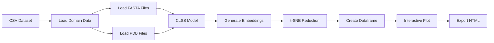

# CLSS Interactive Protein Domain Map

An interactive visualization tool for exploring protein domains through multi-modal embeddings using the CLSS (Contrastive Learning of Sequence and Structure) model.

## Overview

This application creates an interactive 2D visualization of protein domains by:

1. **Processing Multi-Modal Data**: Reading protein sequences (FASTA) and structures (PDB) 
2. **AI-Powered Embeddings**: Using the CLSS model to generate unified embeddings for both sequences and structures
3. **Dimensionality Reduction**: Applying t-SNE to project high-dimensional embeddings to 2D space
4. **Interactive Visualization**: Creating a Plotly/Dash scatter plot where users can explore domain relationships

## Features

- 📊 **Multi-modal visualization** - sequences and structures in the same embedding space
- 🎨 **Custom color mapping** - use hex colors with meaningful legend labels
- 🔍 **Shape-coded modalities** - circles for sequences, squares for structures
- 🖱️ **Interactive controls** - scrollwheel zoom, pan, hover tooltips
- 📱 **Full-screen experience** - visualization fills entire browser window
- 💾 **Smart caching** - avoids recomputing expensive operations
- � **Standalone HTML export** - self-contained interactive visualizations

## Pipeline Overview



## Usage

### Basic Command

```bash
python app.py \
    --dataset-path domains.csv \
    --id-column domain_id \
    --label-column fold_class \
    --fasta-path-column fasta_file \
    --pdb-path-column pdb_file \
    --html-output-path output.html
```

### Full Example

```bash
python app.py \
    --dataset-path datasets/ecod_domains.csv \
    --id-column domain_id \
    --label-column architecture \
    --fasta-path-column sequence_path \
    --pdb-path-column structure_path \
    --html-output-path visualization.html \
    --model-repo guyyanai/CLSS \
    --model-filename h32_r10.lckpt \
    --tsne-perplexity 50 \
    --tsne-max-iterations 1000 \
    --hex-color-column custom_color \
    --use-pdb-sequences \
    --use-record-id \
    --cache-path ./cache
```

### CLI Arguments

| Argument | Required | Default | Description |
|----------|----------|---------|-------------|
| `--dataset-path` | ✅ | - | Path to CSV file with domain data |
| `--id-column` | ✅ | - | Column name for domain IDs |
| `--label-column` | ✅ | - | Column name for labels (determines colors) |
| `--html-output-path` | ✅ | - | Path to output HTML file |
| `--fasta-path-column` | * | - | Column name for FASTA file paths |
| `--pdb-path-column` | * | - | Column name for PDB file paths |
| `--model-repo` | ❌ | `guyyanai/CLSS` | HuggingFace model repository |
| `--model-filename` | ❌ | `h32_r10.lckpt` | Model checkpoint filename |
| `--tsne-perplexity` | ❌ | 30 | t-SNE perplexity parameter |
| `--tsne-max-iterations` | ❌ | 1000 | Maximum t-SNE iterations |
| `--tsne-random-state` | ❌ | 0 | Random state for reproducibility |
| `--hex-color-column` | ❌ | - | Column with hex color codes for custom colors |
| `--exclude-structures` | ❌ | False | Exclude structure data if PDB column is provided |
| `--use-pdb-sequences` | ❌ | False | Extract sequences from PDB files instead of FASTA |
| `--use-record-id` | ❌ | False | Use domain ID as FASTA record ID when loading |
| `--cache-path` | ❌ | - | Directory for caching intermediate results |

**Requirements:**
- At least one of `--fasta-path-column` or `--pdb-path-column` must be provided
- If `--use-pdb-sequences` is set, `--pdb-path-column` must be provided

## Input Data Format

### CSV Dataset Structure

Your input CSV should contain the following columns:

```csv
domain_id,architecture,sequence_path,structure_path,custom_color
d1a00a_,alpha/beta,/path/to/d1a00a_.fasta,/path/to/d1a00a_.pdb,#FF5733
d1a01a_,alpha,/path/to/d1a01a_.fasta,/path/to/d1a01a_.pdb,#33C3FF
d1a02a_,beta,/path/to/d1a02a_.fasta,/path/to/d1a02a_.pdb,#FF33C3
```

**Required Columns:**
- **ID column**: Unique identifier for each domain (specified via `--id-column`)
- **Label column**: Category/class for coloring (specified via `--label-column`)

**Optional Columns:**
- **FASTA path column**: Paths to FASTA files (specified via `--fasta-path-column`)
- **PDB path column**: Paths to PDB files (specified via `--pdb-path-column`)
- **Hex color column**: Custom hex colors for points (specified via `--hex-color-column`)

### File Requirements

- **FASTA files**: Standard protein sequence format
  - Can contain single or multiple sequences
  - If `--use-record-id` is set, the tool looks for a specific record ID matching the domain ID
  - Otherwise, uses the first sequence in the file
- **PDB files**: Standard Protein Data Bank format
  - Used for both structure coordinates and sequence extraction (if `--use-pdb-sequences` is set)
- **Paths**: Can be relative or absolute paths to the files

### Sequence Loading Options

1. **FASTA-only mode**: Use `--fasta-path-column` to load sequences from FASTA files
2. **PDB-only mode**: Use `--pdb-path-column` with `--use-pdb-sequences` to extract sequences from PDB files
3. **Mixed mode**: Provide both `--fasta-path-column` and `--pdb-path-column` for dual-modality analysis

## Output

The application generates a complete interactive visualization:

### Interactive HTML Visualization
- **Full-screen display**: Automatically fills the entire browser window
- **Scatter plot**: Each point represents a domain-modality pair in t-SNE space
- **Custom colors**: Points colored using hex values from your color column
- **Meaningful legends**: Legend shows label names, not hex codes
- **Shape distinction**: Circles for sequences, squares for structures
- **Interactive controls**:
  - 🖱️ Scrollwheel to zoom in/out
  - 🖱️ Click and drag to pan
  - 🖱️ Double-click to reset view
  - 📱 Hover for detailed domain information
- **Export options**: Download plot as high-resolution PNG

### Cached Data
Intermediate results stored for faster re-runs (if `--cache-path` specified):
- `sequences.pkl`: Parsed sequences from FASTA/PDB files
- `structures.pkl`: Loaded protein structure coordinates
- `sequence_embeddings.pkl`: CLSS model sequence embeddings
- `structure_embeddings.pkl`: CLSS model structure embeddings
- `reduced_embeddings.pkl`: t-SNE 2D coordinates

## Performance & Caching

### Caching Strategy

The tool implements multi-level caching to avoid expensive recomputation:

1. **Sequence Loading**: Cached parsed FASTA sequences
2. **Structure Loading**: Cached parsed PDB structures  
3. **Embeddings**: Cached CLSS model outputs
4. **Dimensionality Reduction**: Cached t-SNE results

## Architecture

### Component Overview

- **`args.py`**: CLI argument parsing with type safety
- **`dataset.py`**: Data loading and preprocessing functions
- **`embeddings.py`**: CLSS model loading and embedding generation
- **`dim_reducer.py`**: t-SNE dimensionality reduction
- **`mapper.py`**: Interactive Plotly visualization creation and HTML export
- **`utils.py`**: Utility functions and caching helpers
- **`app.py`**: Main application orchestrator

### Data Flow

1. **Dataset Loading**: Parse CSV and validate required columns exist
2. **Cache Setup**: Create cache paths for intermediate results (if specified)
3. **Sequence Loading**: Load sequences from FASTA files OR extract from PDB files
   - Supports FASTA record ID matching with domain IDs
   - Can extract sequences directly from PDB files
   - Handles missing files gracefully
4. **Structure Loading**: Load 3D coordinates from PDB files (if specified)
5. **Model Loading**: Initialize CLSS model from HuggingFace Hub and load ESM3 components
6. **Embedding Generation**: Process sequences and structures through CLSS model
   - Generates 32-dimensional embeddings for each modality
   - Handles missing sequences/structures gracefully
7. **Data Structuring**: Create unified dataframe with:
   - Domain IDs and labels
   - Modality information (sequence/structure)
   - High-dimensional embeddings
   - Optional custom colors
8. **Dimensionality Reduction**: Apply t-SNE to reduce embeddings to 2D coordinates
9. **Final Dataframe**: Create visualization-ready dataframe with x,y coordinates
10. **Interactive Visualization**: Generate full-screen Plotly scatter plot with:
    - Custom colors from hex color column (if provided)
    - Legend labels from label column
    - Shape coding for sequence vs structure modalities
    - Hover tooltips with domain information
    - Scrollwheel zoom and pan controls
11. **HTML Export**: Save as standalone, responsive HTML file


