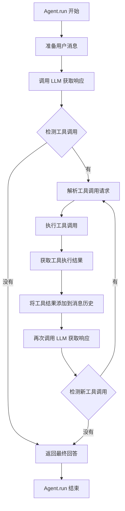
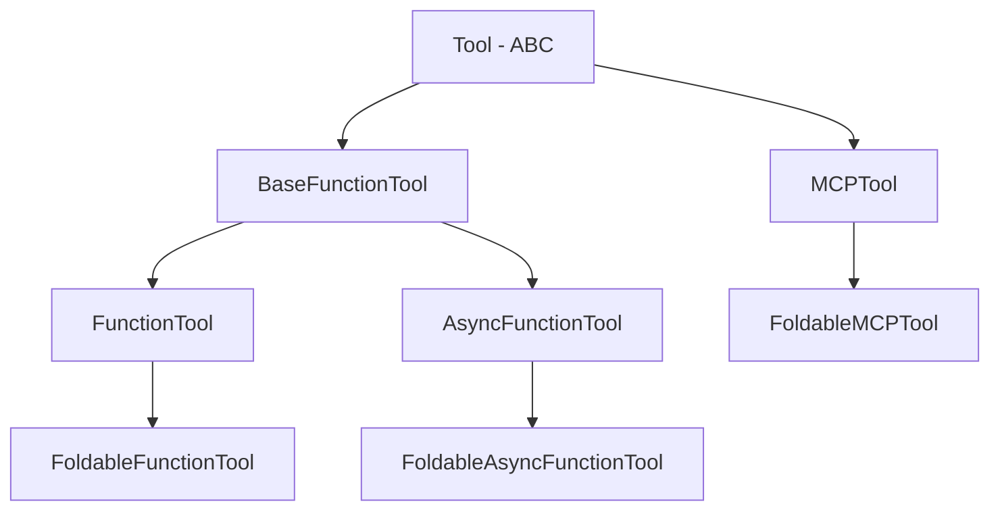

# 基于 openai sdk 的简单 AI Agent

<p align="center">
<a href="https://pypi.org/project/ez-agent/"></a>
<a href="https://github.com/captainsuo/ez-agent/blob/main/LICENSE"></a>
<a href="https://github.com/captainsuo/ez-agent"></a>
</p>

## ⚠ 注意：同步版本已停止维护，下文所述均为异步版本

## 主要特性:

- 支持 OpenAI, DeepSeek 等公司的大语言模型
- 内置多个工具函数(获取时间、网页搜索、执行 Python 代码等)
- 支持流式输出
- 可扩展的工具系统
- 支持 MCP 服务

## 安装:

```bash
pip install ez-agent
```

## 使用方法

### 导入并创建 Agent:

```python
from ez_agent import Agent

agent = Agent(
    model="gpt-4o",
    api_key="你的API密钥",
    base_url="https://api.openai.com/v1",
)
```

#### 支持高度自定义

```python
agent = Agent(
    model="gpt-4o",
    api_key="你的API密钥",
    base_url="https://api.openai.com/v1",
    tools=[python_script_tool, get_time_tool, open_website_tool, browse_web_tool],
    instructions="你是一个助手，可以使用自定义工具。"
    temperature=0.9,
    max_tokens=1024,
    top_p=1,
    frequency_penalty=0,
    presence_penalty=0,
)
```

### 添加响应处理

监听模式设计，便于扩展。

```python
agent.add_response_handler(lambda response: print(response.content))
agent.add_tool_call_handler(lambda tool_call: print(f"工具调用: {tool_call.function.name}"))
```

### 发送请求:

```python
response = await agent.run("解释量子力学的基本原理")
```

### 流式输出

```python
agent.add_stream_chunk_handler(lambda chunk: print(chunk))
await agent.run("解释量子力学的基本原理", stream=True)
```

### 一键启动交互命令行

```python
# 通用助手
from ez_agent import Agent

# 初始化通用助手
agent = Agent(
    model="gpt-4o",
    api_key="sk-your-api-key",
    base_url="https://api.openai.com/v1",
)

agent.start()
```

### 自定义启动

```python
async def main_loop():
    while True:
        ...

agent.start(main_loop)
```

### 预设的工具:

- `get_time_tool` 获取当前时间
- `python_script_tool` 执行 Python 脚本
- `open_website_tool` 调用浏览器打开网站

#### 使用预设工具:

```python
from ez_agent.prefab import python_script_tool
```

### 自定义函数工具:

使用 `@FunctionTool` 装饰器创建自定义工具，会自动根据类型注解和函数注释生成工具。该装饰器不影响原函数，原函数仍可被直接调用。

```python
from ez_agent import FunctionTool, Agent

# 创建自定义工具
@FunctionTool
def my_tool(arg1: str, arg2: int, arg3: bool = False, ...) -> str:
    """
    工具描述
    """
    ...

# 使用自定义工具创建Agent
custom_agent = Agent(
    model="gpt-4o",
    api_key="你的API密钥",
    base_url="https://api.openai.com/v1",
    tools=[my_tool],
    instructions="你是一个助手，可以使用自定义工具。"
)
```

这样，模型便可以调用你创建的自定义工具。

### MCP 工具

该框架允许用户用简单轻松的方式连接`MCP`服务

#### 创建配置文件

```json
{
    "mcpServers": {
        "<name>": { // SSE 模式
            "url": "<url>",
            "env": {
                ...
            }
        },
        "<name>": { // stdio 模式
            "command": "<command>",
            "args": ["<arg1>", "<arg2>", ...],
            "env": {
                ...
            }
        }
    }
}
```

将上述文件保存为`mcp_config.json`

#### 使用 MCP 工具

```python
from ez_agent import Agent
agent = Agent(...)
await agent.load_mcp_config("mcp_config.json")
```

注意：`MCP`工具需手动释放资源

```python
await agent.cleanup()
```

### 设置消息过期时间

#### 可在创建 Agent 时设置

```python
agent = Agent(
    model="gpt-4o",
    api_key="你的API密钥",
    base_url="https://api.openai.com/v1",
    message_expiration_time=60 * 60, # 单位为秒
)
```

这样，1 小时前产生的消息将会被自动清理

#### 也可手动清理

```python
agent.clear_msg_by_time(60 * 60) # 单位为秒
```

### 并行支持

如果有多个请求同时到达，但又想让它们共享同一个`Agent`（例如想共享 messages），可以使用`Agent.safe_modify()`来确保线程安全：

```python
async with agent.safe_modify():
    # 在此处填写代码逻辑，例如 agent.run()，不会影响原对象
    ...
```

注意，`safe_modify()`的作用域结束后会自动合并新消息，如果要完全独立地修改`Agent`，请使用`Agent.safe_modify(merge_messages=False)`

```python
async with agent.safe_modify(merge_messages=False):
    ...
```

## 附录

### `Agent.run` 流程图



### 工具继承关系图


