# Deterministic LLM Output Methodology

**🎯 A Systematic Approach to Making Large Language Model Output Predictable and High-Quality**

*This document establishes a repeatable methodology for creating deterministic, high-quality LLM workflows. Developed through the V3 Test Generation Framework, these principles can be applied to any complex LLM-driven process requiring consistent, reliable output.*

---

## 📋 **EXECUTIVE SUMMARY**

### **The Core Challenge**
Large Language Models are inherently non-deterministic, leading to inconsistent output quality and unpredictable results in complex workflows. Traditional approaches rely on prompt engineering alone, which fails to scale to sophisticated, multi-step processes.

### **The Solution Framework**
A systematic methodology combining **Agent OS principles**, **LLM constraint awareness**, **structured specifications**, and **horizontally scaled task decomposition** to create "APIs for LLM-delivered high-quality output."

### **Key Innovation**
**Separation of Concerns**: Small, structured instructions (LLM consumes) → Systematic execution process (LLM follows) → Large, comprehensive output (LLM produces)

---

## 🧠 **LLM STRENGTHS & WEAKNESSES ANALYSIS**

### **LLM Strengths (Leverage These)**
```python
strengths = {
    "pattern_recognition": "Excellent at identifying and applying patterns",
    "contextual_understanding": "Can understand complex requirements and context",
    "code_generation": "Strong at producing syntactically correct, functional code",
    "systematic_execution": "Can follow detailed, structured instructions reliably",
    "iterative_refinement": "Effective at improving output through feedback loops",
    "cross_domain_knowledge": "Can apply knowledge across different domains",
    "targeted_operations": "Excels at focused modifications to large codebases"
}
```

### **LLM Weaknesses (Design Around These)**
```python
weaknesses = {
    "consistency": "Output varies between identical requests",
    "context_limits": "Cannot process unlimited information simultaneously",
    "surface_analysis": "May miss critical details without structured guidance",
    "completion_claims": "Often claims completion without thorough validation",
    "scope_creep": "Tendency to jump ahead or skip systematic steps",
    "quality_variance": "Output quality fluctuates without enforcement mechanisms",
    "memory_limitations": "Cannot maintain perfect context across long sessions"
}
```

### **Design Principles Based on Analysis**
1. **Structure compensates for inconsistency** → Systematic frameworks
2. **Small files compensate for context limits** → Horizontally scaled documentation
3. **Explicit steps compensate for surface analysis** → Detailed phase breakdown
4. **Validation gates compensate for completion claims** → Automated quality checks
5. **Sequential requirements compensate for scope creep** → Mandatory phase dependencies
6. **Enforcement mechanisms compensate for quality variance** → Automated validation
7. **External memory compensates for memory limitations** → Persistent documentation

---

## 🏗️ **AGENT OS DISCOVERY-DRIVEN ARCHITECTURE**

### **Agent OS Core Principles Applied**
```yaml
Systematic_Approach:
  principle: "Structured, repeatable processes over ad-hoc solutions"
  implementation: "Multi-phase frameworks with clear dependencies"
  
Spec_Driven_Development:
  principle: "Comprehensive specifications before implementation"
  implementation: "Detailed API specifications for LLM workflows"
  
Compliance_First_Execution:
  principle: "Check existing standards before creating new approaches"
  implementation: "Mandatory compliance gates and discovery flows"
  
Quality_Gates:
  principle: "Automated validation at every stage"
  implementation: "Programmatic quality enforcement with exit codes"
  
Evidence_Based_Progress:
  principle: "Quantified results over subjective assessments"
  implementation: "Measurable outputs with documented evidence"
  
Horizontal_Scaling:
  principle: "Break complex problems into manageable components"
  implementation: "Small, focused files that compose into comprehensive systems"
```

### **Discovery Flow Architecture Pattern**

```mermaid
graph TD
    A[Entry Point - Project Rules] --> B[Compliance Gate - Standards Check]
    B --> C[Standards Hub - Task Routing] 
    C --> D[Framework Hub - Methodology Selection]
    D --> E[Side-Loaded Context ≤100 lines]
    E --> F[Active Read Files 200-500 lines]
    F --> G[Output Generation - Unlimited Size]
```


**Reusable Pattern**: Any complex LLM workflow should implement this funnel architecture - wide entry through compliance gates to focused execution with unlimited output generation.

### **Agent OS Adaptation for LLM Workflows**
```python
# Traditional Agent OS (Human-Centric)
agent_os_traditional = {
    "specs": "Comprehensive documents (500-2000 lines)",
    "tasks": "Complex, multi-faceted requirements", 
    "execution": "Human interpretation and adaptation",
    "validation": "Manual review and iteration"
}

# LLM-Optimized Agent OS (AI-Centric)
agent_os_llm_optimized = {
    "specs": "Modular documents (<100-150 lines each)",
    "tasks": "Single-responsibility, focused requirements",
    "execution": "Systematic, step-by-step instruction following",
    "validation": "Automated quality gates with programmatic enforcement"
}
```

---

## 📐 **SPECIFICATION-DRIVEN METHODOLOGY**

### **Three-Tier Discovery-Driven Architecture**

#### **Tier 1: Side-Loaded Context Files (≤100 lines)**
```markdown
Purpose: Systematic execution instructions automatically injected into AI context
Size: ≤100 lines for optimal AI processing (context side-loading limitations)
Discovery: Entry Point → Compliance → Hub → Framework Core → Side-Loaded Files
AI Consumption: Read during systematic execution phases
Content:
- Single-phase or single-concept instructions
- Specific commands and validation criteria
- Clear success/failure conditions
- Sequential dependencies
Example: unit-path.md, phase-navigation.md
```

#### **Tier 2: Active Read Files (200-500 lines, ideally ~250)**
```markdown
Purpose: Comprehensive context establishment and detailed methodology guidance
Size: 200-500 lines for focused reading sessions (one-time consumption)
Discovery: Referenced from Tier 1 files via explicit links
AI Consumption: On-demand focused reading when directed by side-loaded files
Content:
- Complete methodology explanation
- Architecture overview
- Success criteria and quality targets
- Integration points and dependencies
Example: framework-core.md, AI-SESSION-FOUNDATION.md
```

#### **Tier 3: Output Artifacts (No size limits)**
```markdown
Purpose: Comprehensive deliverables generated following systematic guidance
Size: No limits - quality and completeness prioritized (AI generates but doesn't re-consume)
Quality Gates: Automated validation via programmatic enforcement scripts
AI Consumption: Generate using Tier 1 & 2 guidance, never re-consume (avoids context bloat)
Content:
- Generated code, documentation, analysis reports
- Comprehensive test suites
- Detailed specifications and designs
- Quality validation results
Example: Generated test files (1000+ lines), comprehensive documentation
```

### **Specification Development Process**
1. **Define Complete API** → Comprehensive specification document
2. **Design Discovery Flow** → Entry points, compliance gates, and routing
3. **Decompose into Phases** → Small, focused instruction files
4. **Create Validation Gates** → Automated quality enforcement
5. **Test and Iterate** → Refine based on actual LLM execution
6. **Document Learnings** → Update methodology for future workflows

---

## 🛡️ **COMPLIANCE-FIRST EXECUTION MODEL**

### **The Compliance Gate Pattern**
**Foundational Principle**: Every LLM workflow must begin with compliance checking to prevent reinventing existing solutions and ensure consistency with established patterns.

```python
# Universal compliance gate pattern for any LLM workflow
class ComplianceGate:
    def __init__(self, domain_standards):
        self.domain_standards = domain_standards
        
    def validate_pre_execution(self, task_request):
        compliance_checks = [
            self.check_existing_standards(task_request),
            self.verify_established_patterns(task_request),
            self.confirm_no_existing_solutions(task_request),
            self.validate_approach_necessity(task_request)
        ]
        
        compliance_score = sum(check.score for check in compliance_checks) / len(compliance_checks)
        
        if compliance_score < 80:
            raise ComplianceViolation("Must achieve 80%+ compliance or provide explicit justification")
            
        return ComplianceReport(score=compliance_score, checks=compliance_checks)
```

### **Mandatory Pre-Execution Gates**
**Reusable Pattern**: Any complex LLM workflow should implement these gates:

1. **Standards Discovery**: Check existing domain-specific patterns and approaches
2. **Compliance Verification**: Validate against established rules and conventions  
3. **Pattern Confirmation**: Use existing approaches before creating new ones
4. **Violation Detection**: Built-in safeguards against AI shortcuts and assumptions

### **Compliance Score Integration**
```python
compliance_scoring = {
    "100%": "Perfect compliance with existing standards",
    "80-99%": "Good compliance with minor justified deviations", 
    "60-79%": "Moderate compliance requiring explicit justification",
    "<60%": "Poor compliance requiring standards updates or approach change"
}
```

**Implementation Note**: The compliance gate serves as a quality filter that prevents LLMs from bypassing established domain knowledge and ensures consistency across workflow executions.

---

## 🔄 **HORIZONTALLY SCALED TASK DECOMPOSITION**

### **The File Size Strategy**

#### **Critical Insight: Different Files, Different Constraints**
```python
file_constraints = {
    "instruction_files": {
        "purpose": "AI reads these for systematic execution",
        "constraint": "<100 lines for optimal AI processing",
        "rationale": "Context side-loading limitations",
        "examples": ["phase-1-analysis.md", "template-patterns.md"]
    },
    "output_files": {
        "purpose": "AI generates these as deliverables", 
        "constraint": "No size limits - quality and completeness prioritized",
        "rationale": "AI creates but doesn't need to re-consume",
        "examples": ["generated_tests.py", "comprehensive_documentation.md"]
    },
    "foundation_files": {
        "purpose": "AI actively reads for context establishment",
        "constraint": "Reasonable size for focused reading (200-500 lines)",
        "rationale": "One-time consumption for understanding",
        "examples": ["methodology.md", "session-foundation.md"]
    }
}
```

#### **Horizontal Scaling Patterns**
```
# Instead of one large instruction file (AI-hostile)
massive-instructions.md (500+ lines) ❌

# Use horizontally scaled, focused files (AI-friendly)
instructions/
├── phase-1/
│   ├── overview.md (50 lines)
│   ├── analysis-commands.md (75 lines)
│   └── validation-criteria.md (60 lines)
├── phase-2/
│   ├── overview.md (45 lines)
│   └── execution-steps.md (80 lines)
└── phase-3/
    ├── quality-gates.md (90 lines)
    └── enforcement.md (70 lines)
```

#### **Why Horizontal Scaling Works with Discovery Architecture**
```python
# LLM context window optimization strategy
context_optimization = {
    "discovery_phase": {
        "purpose": "Navigate through entry → compliance → hubs (one-time)",
        "cost": "High initial context consumption",
        "frequency": "Once per workflow session"
    },
    "execution_phase": {
        "purpose": "Side-load specific instructions (repeated)",
        "cost": "Low context consumption per phase",
        "frequency": "Multiple times per workflow"
    },
    "output_phase": {
        "purpose": "Generate without re-consuming (efficient)",
        "cost": "Zero context consumption for re-reading",
        "frequency": "Continuous during generation"
    }
}
```

**Cognitive Load Management Pattern**:
- **Single Responsibility**: Each file addresses one specific concept
- **Sequential Dependencies**: Clear phase ordering prevents overwhelm  
- **Evidence-Based Progress**: Quantified checkpoints prevent scope creep
- **Discovery vs Consumption Separation**: Navigate once, execute repeatedly

---

## 🔄 **HORIZONTAL SCALING DISCOVERY & DIRECTED TASK FLOW**

### **The Directed Task Flow Architecture**
**Core Innovation**: Instead of monolithic instructions, tasks are horizontally distributed across small, focused files that the discovery system directs the AI through systematically.


### **Horizontal Task Distribution Pattern**
```python
# Real V3 Framework Example: How tasks are horizontally distributed
horizontal_task_distribution = {
    "discovery_layer": {
        "entry_point": ".cursorrules (65 lines)",
        "compliance_gate": "compliance-checking.md (162 lines)",
        "task_routing": "ai-assistant/README.md (214 lines)",
        "framework_hub": "tests/README.md (373 lines)",
        "purpose": "Navigate AI to correct methodology"
    },
    
    "execution_layer": {
        "methodology_core": "v3/framework-core.md (246 lines)",
        "phase_navigation": "v3/phase-navigation.md (201 lines)", 
        "path_selection": "v3/paths/unit-path.md (331 lines)",
        "purpose": "Provide systematic execution instructions"
    },
    
    "phase_decomposition": {
        "phase_1": "phases/1/shared-analysis.md (~80 lines)",
        "phase_2": "phases/2/logging-analysis.md (~75 lines)",
        "phase_3": "phases/3/dependency-analysis.md (~90 lines)",
        "phase_4": "phases/4/usage-patterns.md (~85 lines)",
        "phase_5": "phases/5/coverage-analysis.md (~95 lines)",
        "phase_6": "phases/6/pre-generation.md (~70 lines)",
        "phase_7": "phases/7/post-generation.md (~60 lines)",
        "phase_8": "phases/8/quality-enforcement.md (~100 lines)",
        "purpose": "Break complex workflow into manageable, focused tasks"
    },
    
    "output_generation": {
        "test_files": "Generated artifacts (1000+ lines)",
        "documentation": "Comprehensive reports (unlimited)",
        "validation_results": "Quality metrics and evidence",
        "purpose": "Produce high-quality deliverables"
    }
}
```

### **Directed Task Flow Mechanism**
**How the AI is systematically guided through horizontally scaled tasks:**

#### **1. Discovery-Driven Navigation**
```python
# The AI follows explicit navigation instructions
navigation_flow = {
    "step_1": {
        "current_file": ".cursorrules",
        "instruction": "Check compliance FIRST",
        "next_file": "compliance-checking.md",
        "task_focus": "Validate existing standards"
    },
    "step_2": {
        "current_file": "compliance-checking.md", 
        "instruction": "Navigate to AI Assistant Standards Hub",
        "next_file": "ai-assistant/README.md",
        "task_focus": "Route to appropriate framework"
    },
    "step_3": {
        "current_file": "ai-assistant/README.md",
        "instruction": "Follow Test Generation Framework Hub",
        "next_file": "tests/README.md", 
        "task_focus": "Select V3 framework"
    },
    "step_4": {
        "current_file": "tests/README.md",
        "instruction": "Use V3 Framework Core",
        "next_file": "v3/framework-core.md",
        "task_focus": "Understand methodology"
    }
}
```

#### **2. Phase-by-Phase Task Direction**
```python
# Each phase explicitly directs to the next
phase_direction_pattern = {
    "phase_completion_requirement": "Update progress table with evidence",
    "next_phase_trigger": "Explicit instruction to proceed to next phase",
    "file_navigation": "Direct links to next phase file",
    "validation_gate": "Cannot proceed without completing current phase",
    
    "example_flow": {
        "phase_1_complete": "✅ Phase 1: Method Verification complete → Proceed to Phase 2",
        "phase_1_instruction": "Next: [Phase 2: Logging Analysis](phases/2/logging-analysis.md)",
        "phase_2_loads": "AI reads phases/2/logging-analysis.md (75 lines)",
        "phase_2_executes": "AI follows logging analysis instructions",
        "phase_2_validates": "AI provides evidence in progress table"
    }
}
```

#### **3. Context-Efficient Task Execution**
```python
# How horizontal scaling optimizes AI context usage
context_efficiency = {
    "traditional_monolithic": {
        "approach": "Load entire 2000+ line instruction file",
        "context_cost": "High - entire methodology in memory",
        "cognitive_load": "Overwhelming - too much information",
        "failure_rate": "High - AI gets lost in complexity"
    },
    
    "horizontal_scaling": {
        "approach": "Load only current phase instructions (60-100 lines)",
        "context_cost": "Low - focused task instructions only", 
        "cognitive_load": "Manageable - single responsibility focus",
        "failure_rate": "Low - clear, focused execution"
    },
    
    "directed_navigation": {
        "mechanism": "Each file explicitly points to next file",
        "benefit": "AI doesn't need to remember entire workflow",
        "result": "Systematic progression without cognitive overload"
    }
}
```

### **Real-World Task Flow Example (V3 Framework)**
```python
# Actual task flow through V3 framework horizontal architecture
v3_task_flow_example = {
    "task_request": "Generate unit tests for initialization.py",
    
    "flow_execution": [
        {
            "file": ".cursorrules",
            "task": "Route to compliance checking",
            "size": "65 lines",
            "focus": "Entry point navigation"
        },
        {
            "file": "compliance-checking.md", 
            "task": "Verify no existing tests, check standards",
            "size": "162 lines",
            "focus": "Standards validation"
        },
        {
            "file": "tests/README.md",
            "task": "Select V3 framework for test generation", 
            "size": "373 lines",
            "focus": "Framework selection"
        },
        {
            "file": "v3/framework-core.md",
            "task": "Understand V3 methodology and commit to contract",
            "size": "246 lines", 
            "focus": "Methodology foundation"
        },
        {
            "file": "v3/unit-path.md",
            "task": "Learn unit test strategy (mock external dependencies)",
            "size": "331 lines",
            "focus": "Path-specific guidance"
        },
        {
            "file": "phases/1/shared-analysis.md",
            "task": "Execute Phase 1: Method verification with AST parsing",
            "size": "~80 lines",
            "focus": "Single phase execution"
        },
        # ... continues through all 8 phases
        {
            "file": "Generated test file",
            "task": "Produce comprehensive unit tests",
            "size": "1020+ lines",
            "focus": "High-quality output generation"
        }
    ],
    
    "key_benefits": {
        "focused_attention": "AI processes 60-300 lines at a time vs 2000+ monolithic",
        "systematic_progression": "Each file explicitly directs to next step",
        "validation_gates": "Cannot skip phases or take shortcuts",
        "context_efficiency": "Only load what's needed for current task"
    }
}
```

### **Task Decomposition Principles**
1. **Single Responsibility** → Each file addresses one specific concept
2. **Clear Dependencies** → Explicit ordering and prerequisites  
3. **Measurable Outcomes** → Quantified success criteria for each task
4. **Composable Results** → Tasks build upon each other systematically
5. **Independent Validation** → Each task can be verified independently
6. **Directed Navigation** → Each file explicitly points to next step
7. **Context Optimization** → Load only what's needed for current task

---

## 🎯 **SYSTEMATIC EXECUTION FRAMEWORK**

### **Phase-Based Execution Model**
```python
# Generic phase structure for any LLM workflow
class LLMWorkflowPhase:
    def __init__(self, phase_number, name, prerequisites, deliverables):
        self.phase_number = phase_number
        self.name = name
        self.prerequisites = prerequisites  # What must be complete before this phase
        self.deliverables = deliverables    # What this phase must produce
        self.validation_criteria = []       # How to verify phase completion
        
    def execute(self, context):
        # 1. Validate prerequisites
        # 2. Load phase-specific instructions (<100 lines)
        # 3. Execute systematic process
        # 4. Validate deliverables
        # 5. Update context for next phase
        pass
```

### **Quality Gate Integration**
```python
# Automated validation at each phase
def validate_phase_completion(phase, deliverables):
    validation_results = []
    
    for criterion in phase.validation_criteria:
        result = criterion.validate(deliverables)
        validation_results.append(result)
    
    # All validations must pass to proceed
    return all(result.passed for result in validation_results)
```

---

## 🚨 **LLM VIOLATION DETECTION & PREVENTION**

### **Common AI Shortcut Patterns (Universal Detection)**
**Foundational Insight**: LLMs consistently exhibit predictable failure patterns that can be systematically detected and prevented.

```python
# Universal violation patterns across all complex LLM workflows
violation_patterns = {
    "premature_execution": {
        "indicators": ["Starts generating without acknowledgment", "Skips compliance checking"],
        "prevention": "Mandatory acknowledgment contracts and compliance gates",
        "detection": "Check for explicit compliance evidence before proceeding"
    },
    "surface_compliance": {
        "indicators": ["Says 'I'll follow' without showing evidence", "Generic compliance claims"],
        "prevention": "Require specific evidence and quantified metrics",
        "detection": "Validate concrete compliance artifacts, not just claims"
    },
    "assumption_based_execution": {
        "indicators": ["Uses phrases like 'based on my understanding'", "Makes assumptions about requirements"],
        "prevention": "Explicit requirement validation and evidence-based progress",
        "detection": "Flag assumption language and require concrete validation"
    },
    "metrics_claiming": {
        "indicators": ["Claims completion without showing validation", "Reports success without evidence"],
        "prevention": "Automated validation scripts with exit code requirements",
        "detection": "Require programmatic validation evidence, not just claims"
    },
    "scope_jumping": {
        "indicators": ["Skips systematic phases", "Jumps to solutions without analysis"],
        "prevention": "Sequential phase dependencies with mandatory evidence",
        "detection": "Validate phase completion evidence before allowing progression"
    }
}
```

### **Enforcement Mechanisms (Reusable Patterns)**
```python
# Universal enforcement patterns for any LLM workflow
class ViolationDetector:
    def __init__(self):
        self.violation_patterns = violation_patterns
        
    def detect_violations(self, llm_output, phase_context):
        detected_violations = []
        
        for pattern_name, pattern in self.violation_patterns.items():
            if self.check_pattern_indicators(llm_output, pattern["indicators"]):
                detected_violations.append({
                    "pattern": pattern_name,
                    "prevention_strategy": pattern["prevention"],
                    "required_action": pattern["detection"]
                })
        
        return ViolationReport(violations=detected_violations)
        
    def enforce_compliance(self, violation_report):
        if violation_report.has_violations():
            raise WorkflowViolation(
                "Detected LLM shortcuts. Must complete compliance requirements before proceeding.",
                violations=violation_report.violations
            )
```

### **Acknowledgment Contract Pattern**
**Reusable Component**: Any complex workflow should implement binding acknowledgment contracts.

```python
# Universal acknowledgment contract for complex workflows
acknowledgment_contract = {
    "compliance_commitment": "I acknowledge the critical importance of checking existing standards first",
    "systematic_execution": "I commit to following the systematic phase-by-phase approach", 
    "evidence_requirement": "I will provide quantified evidence for each phase completion",
    "quality_gates": "I will achieve all automated validation requirements with exit code 0",
    "no_shortcuts": "I will not skip phases or make assumptions without explicit validation"
}
```

**Implementation Note**: Violation detection serves as an automated quality assurance layer that compensates for LLM tendencies toward shortcuts and assumptions.

### **Evidence-Based Progress Tracking**
```python
# Quantified progress measurement
progress_tracking = {
    "phase_completion": "Explicit checkboxes with evidence",
    "quality_metrics": "Numerical scores (Pylint 10.0/10, coverage 90%)",
    "deliverable_validation": "Automated verification with exit codes",
    "dependency_satisfaction": "Programmatic prerequisite checking"
}
```

---

## 🔧 **IMPLEMENTATION PATTERNS**

### **Pattern 1: Analysis → Generation → Validation**
```python
# Applicable to: Code generation, documentation creation, system design
workflow_pattern_1 = {
    "analysis_phases": [
        "Systematic analysis of requirements",
        "Pattern identification and categorization", 
        "Dependency mapping and constraint identification"
    ],
    "generation_phase": "Comprehensive output creation using analysis results",
    "validation_phases": [
        "Automated quality checking",
        "Compliance verification",
        "Performance validation"
    ]
}
```

### **Pattern 2: Decomposition → Execution → Integration**
```python
# Applicable to: Complex system implementation, migration projects
workflow_pattern_2 = {
    "decomposition_phases": [
        "Break complex problem into manageable components",
        "Define interfaces and dependencies",
        "Create execution roadmap"
    ],
    "execution_phases": "Systematic implementation of each component",
    "integration_phases": [
        "Component integration and testing",
        "End-to-end validation",
        "Performance optimization"
    ]
}
```

### **Pattern 3: Discovery → Specification → Implementation**
```python
# Applicable to: Research projects, exploratory development
workflow_pattern_3 = {
    "discovery_phases": [
        "Requirements gathering and analysis",
        "Technology evaluation and selection",
        "Risk assessment and mitigation planning"
    ],
    "specification_phases": [
        "Detailed design specification",
        "Interface definition and contracts",
        "Quality criteria establishment"
    ],
    "implementation_phases": "Systematic development with continuous validation"
}
```

---

## 📊 **QUALITY ASSURANCE METHODOLOGY**

### **Automated Validation Framework**
```python
# Every LLM workflow should include automated validation
class WorkflowValidator:
    def __init__(self, quality_criteria):
        self.quality_criteria = quality_criteria
        
    def validate_output(self, deliverable):
        results = {}
        
        for criterion_name, criterion in self.quality_criteria.items():
            result = criterion.validate(deliverable)
            results[criterion_name] = {
                "passed": result.passed,
                "score": result.score,
                "details": result.details,
                "remediation": result.suggested_fixes
            }
        
        return ValidationReport(results)
```

### **Quality Criteria Categories**
```python
quality_categories = {
    "functional": "Does the output work as intended?",
    "structural": "Is the output well-organized and maintainable?", 
    "compliance": "Does the output meet specified standards?",
    "performance": "Does the output meet performance requirements?",
    "completeness": "Are all requirements addressed?",
    "consistency": "Is the output consistent with established patterns?"
}
```

### **Enforcement Mechanisms**
1. **Exit Code Validation** → Scripts return 0 (success) or 1 (failure)
2. **Quantified Metrics** → Numerical scores with clear thresholds
3. **Automated Remediation** → Scripts suggest or apply fixes
4. **Iterative Improvement** → Feedback loops for continuous enhancement
5. **Evidence Documentation** → Persistent record of quality achievement

---

## 🚀 **WORKFLOW DEVELOPMENT PROCESS**

### **Step 1: Problem Analysis and Scope Definition**
```markdown
Questions to Answer:
- What is the complex task that needs deterministic LLM execution?
- What are the current pain points with ad-hoc LLM approaches?
- What constitutes high-quality output for this domain?
- What are the key success metrics and validation criteria?
```

### **Step 2: LLM Capability Assessment**
```markdown
Evaluate Against LLM Strengths/Weaknesses:
- Which aspects can LLM handle well with proper structure?
- Which weaknesses need systematic compensation?
- What are the context and complexity constraints?
- Where are the highest-risk failure points?
```

### **Step 3: Architecture Design**
```markdown
Create Three-Layer Specification:
- API Specification: Complete methodology overview
- Execution Instructions: Phase-by-phase guidance (<100 lines each)
- Validation Framework: Automated quality enforcement
```

### **Step 4: Horizontal Task Decomposition**
```markdown
Break Down Complex Process:
- Identify natural phase boundaries and dependencies
- Create single-responsibility instruction files
- Define clear inputs, outputs, and validation criteria
- Establish evidence requirements for each phase
```

### **Step 5: Automation Development**
```markdown
Build Supporting Infrastructure:
- Orchestration scripts for end-to-end execution
- Quality validation scripts with quantified metrics
- Progress tracking and evidence collection systems
- Error detection and remediation mechanisms
```

### **Step 6: Testing and Iteration**
```markdown
Validate with Real LLM Execution:
- Test complete workflow with actual LLM sessions
- Measure quality metrics and consistency
- Identify failure patterns and improvement opportunities
- Refine instructions and validation criteria
```

### **Step 7: Documentation and Knowledge Transfer**
```markdown
Create Foundation Documents:
- Session foundation document for future AI sessions
- Methodology documentation for human understanding
- Lessons learned and best practices
- Extension points for future enhancements
```

---

## 📈 **SUCCESS METRICS AND EVALUATION**

### **Workflow Quality Metrics**
```python
success_metrics = {
    "consistency": {
        "measure": "Output quality variance across multiple executions",
        "target": "<10% variance in quality scores",
        "validation": "Statistical analysis of repeated executions"
    },
    "completeness": {
        "measure": "Percentage of requirements addressed",
        "target": "100% requirement coverage",
        "validation": "Automated requirement traceability"
    },
    "quality": {
        "measure": "Automated quality assessment scores",
        "target": "Domain-specific quality thresholds",
        "validation": "Programmatic quality gate validation"
    },
    "efficiency": {
        "measure": "Time and effort required for high-quality output",
        "target": "Measurable improvement over ad-hoc approaches",
        "validation": "Comparative time and quality analysis"
    }
}
```

### **Framework Maturity Assessment**
```python
maturity_levels = {
    "level_1_basic": {
        "description": "Basic instruction structure with manual validation",
        "characteristics": ["Some structured instructions", "Manual quality checking", "Inconsistent results"]
    },
    "level_2_systematic": {
        "description": "Comprehensive phase structure with automated validation",
        "characteristics": ["Complete phase breakdown", "Automated quality gates", "Consistent execution"]
    },
    "level_3_optimized": {
        "description": "Refined workflow with continuous improvement mechanisms",
        "characteristics": ["Optimized instruction files", "Advanced validation", "Self-improving system"]
    },
    "level_4_autonomous": {
        "description": "Fully autonomous workflow with adaptive capabilities",
        "characteristics": ["Dynamic instruction adaptation", "Predictive quality management", "Autonomous optimization"]
    }
}
```

---

## 🔄 **CONTINUOUS IMPROVEMENT METHODOLOGY**

### **Feedback Loop Integration**
```python
# Systematic improvement process
improvement_cycle = {
    "execution_monitoring": "Track quality metrics and failure patterns",
    "gap_analysis": "Identify systematic weaknesses and improvement opportunities", 
    "instruction_refinement": "Update phase instructions based on learnings",
    "validation_enhancement": "Improve automated quality gates and enforcement",
    "architecture_evolution": "Adapt framework structure for better performance"
}
```

### **Learning Capture Mechanisms**
1. **Execution Metrics** → Quantified performance data
2. **Failure Pattern Analysis** → Systematic weakness identification
3. **Quality Trend Analysis** → Long-term improvement tracking
4. **Instruction Effectiveness** → Phase-by-phase success measurement
5. **User Feedback Integration** → Human-in-the-loop improvement

---

## 🎯 **APPLICATION DOMAINS & CASE STUDY**

### **Primary Case Study: V3 Test Generation Framework**
**Real-World Implementation**: HoneyHive Python SDK Agent OS integration demonstrates the methodology in practice.

```python
# Actual Agent OS three-tier implementation (Case Study)
v3_framework_implementation = {
    "tier_1_side_loaded": {
        "files": ["unit-path.md", "phase-navigation.md", "framework-core.md"],
        "size_range": "246-331 lines (target ≤100, some optimization needed)",
        "discovery_path": ".cursorrules → compliance-checking.md → ai-assistant/README.md → tests/README.md → v3/framework-core.md",
        "injection_mechanism": "Automatic via Agent OS discovery flow",
        "success_metrics": "80%+ pass rate restoration after V2 22% failure"
    },
    "tier_2_active_read": {
        "files": ["AI-SESSION-FOUNDATION.md", "v3-framework-api-specification.md"], 
        "size_range": "200-500 lines (optimal for focused reading)",
        "discovery_trigger": "Referenced from tier 1 files via explicit links",
        "consumption_pattern": "On-demand when AI needs comprehensive context",
        "content_type": "Methodology foundations, architectural overviews"
    },
    "tier_3_output": {
        "files": ["test_tracer_instrumentation_initialization.py"],
        "size_achieved": "1020+ lines (no limits, quality-focused)",
        "quality_gates": "validate-test-quality.py exit code 0 requirement",
        "success_metrics": "90%+ coverage + 10.0/10 Pylint + 0 MyPy errors + 100% pass rate",
        "critical_fix": "Corrected 'mock everything' flaw to 'mock external dependencies' for coverage compatibility"
    }
}
```

### **Case Study Success Metrics**
- **Consistency**: V3 framework restored 80%+ success rate (vs V2's 22% failure)
- **Quality**: Automated validation achieves 10.0/10 Pylint + 90%+ coverage targets
- **Scalability**: Horizontally scaled architecture supports complex test generation
- **Reusability**: Patterns proven transferable to other complex LLM workflows

### **Proven Applications Beyond Case Study**
- **Code Review**: Systematic analysis and feedback generation
- **Documentation Creation**: Comprehensive, consistent technical documentation  
- **System Design**: Structured architecture and implementation planning
- **Migration Projects**: Complex system transitions with validation gates

### **Potential Applications**
```python
application_domains = {
    "software_development": [
        "Code generation and refactoring",
        "API design and documentation", 
        "Database schema design",
        "Security analysis and remediation"
    ],
    "content_creation": [
        "Technical writing and documentation",
        "Training material development",
        "Process documentation",
        "Knowledge base creation"
    ],
    "analysis_and_research": [
        "Data analysis and reporting",
        "Literature review and synthesis",
        "Competitive analysis",
        "Risk assessment and mitigation"
    ],
    "project_management": [
        "Project planning and breakdown",
        "Resource allocation and scheduling",
        "Risk management and contingency planning",
        "Progress tracking and reporting"
    ]
}
```

---

## 💡 **KEY INSIGHTS AND BEST PRACTICES**

### **Critical Success Factors**
1. **Respect LLM Constraints** → Design around context and consistency limitations
2. **Systematic Over Intuitive** → Structure compensates for LLM weaknesses
3. **Automate Quality Gates** → Programmatic validation ensures consistency
4. **Evidence-Based Progress** → Quantified results over subjective assessment
5. **Horizontal Scaling** → Small, focused files enable complex workflows
6. **Continuous Refinement** → Systematic improvement based on execution data

### **Common Pitfalls to Avoid**
```python
pitfalls = {
    "oversized_instructions": "Files >100 lines reduce LLM execution quality",
    "manual_validation": "Human-dependent quality checking reduces consistency",
    "monolithic_design": "Large, complex phases increase failure probability",
    "insufficient_structure": "Ad-hoc approaches lead to inconsistent results",
    "missing_automation": "Manual processes don't scale and introduce variance",
    "inadequate_testing": "Insufficient validation leads to production failures"
}
```

### **Design Principles Summary**
```python
design_principles = {
    "small_and_focused": "Each instruction file addresses one specific concept",
    "systematic_execution": "Clear phases with dependencies and validation",
    "automated_quality": "Programmatic enforcement of quality standards",
    "evidence_based": "Quantified metrics and documented results",
    "horizontally_scalable": "Architecture supports growth and complexity",
    "continuously_improving": "Built-in mechanisms for systematic enhancement"
}
```

---

## 🚀 **GETTING STARTED TEMPLATE**

### **Quick Start Checklist**
```markdown
□ Define the complex task requiring deterministic LLM output
□ Analyze LLM strengths/weaknesses for this specific domain
□ Create API specification document (200-500 lines)
□ Break down process into phases (<100 lines each)
□ Develop automated validation scripts
□ Create orchestration and execution infrastructure
□ Test with real LLM sessions and measure quality
□ Refine based on execution results and failure patterns
□ Document methodology and create session foundation
□ Establish continuous improvement mechanisms
```

### **Template Directory Structure**
```
workflow-name/
├── API-SPECIFICATION.md           # Complete methodology (200-500 lines)
├── AI-SESSION-FOUNDATION.md       # Context for future sessions (200-400 lines)
├── phases/
│   ├── 1/
│   │   ├── overview.md            # <100 lines
│   │   ├── analysis.md            # <100 lines
│   │   └── validation.md          # <100 lines
│   ├── 2/
│   │   └── execution.md           # <100 lines
│   └── 3/
│       └── quality-gates.md       # <100 lines
├── scripts/
│   ├── orchestrator.py            # Main execution script
│   ├── validator.py               # Quality validation
│   └── metrics-collector.py       # Performance tracking
└── templates/
    ├── output-template.md          # Generation patterns
    └── validation-template.md      # Quality criteria
```

---

---

## 🎯 **METHODOLOGY SUMMARY & REUSABILITY**

**🎯 This methodology provides a systematic, repeatable approach to creating deterministic, high-quality LLM workflows. By combining Agent OS discovery-driven architecture with LLM constraint awareness, it enables the development of sophisticated AI-driven processes that deliver consistent, reliable results across complex domains.**

### **Key Reusable Patterns**
1. **Discovery Flow Architecture**: Entry Point → Compliance Gate → Standards Hub → Framework Hub → Side-Loaded Context
2. **Three-Tier File System**: Side-loaded (≤100 lines) → Active Read (200-500 lines) → Output (unlimited)
3. **Compliance-First Execution**: Mandatory standards checking before any workflow execution
4. **Violation Detection**: Systematic prevention of common LLM shortcuts and assumptions
5. **Evidence-Based Progress**: Quantified metrics and automated validation gates

### **Case Study Validation**
**The V3 Test Generation Framework serves as a comprehensive case study and reference implementation, demonstrating how these principles can be applied to achieve:**
- **80%+ success rates** (restored from V2's 22% failure rate)
- **10.0/10 quality scores** (Pylint + MyPy + coverage targets)
- **Deterministic output** (consistent results across multiple executions)
- **Complex domain mastery** (sophisticated test generation with mocking strategies)

### **Transferability**
**These patterns are domain-agnostic and can be applied to any complex LLM workflow requiring:**
- Consistent, high-quality output
- Systematic execution across multiple phases
- Integration with existing standards and patterns
- Automated quality validation and enforcement
- Scalable architecture for growing complexity

**The methodology transforms LLM workflows from unpredictable prompt engineering into systematic, API-like processes with measurable quality guarantees.**
