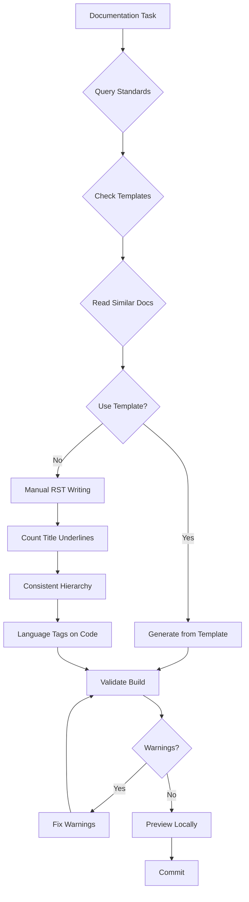

# RST Documentation Workflow

**Keywords for search**: RST documentation, reStructuredText, Sphinx documentation, how to write RST, title underline errors, RST formatting, RST validation, documentation workflow, Sphinx build warnings, RST syntax, manual documentation, non-template documentation

**Date**: 2025-10-29  
**Status**: Active  
**Scope**: All manually-written RST documentation  

---

## 🎯 TL;DR - RST Documentation Quick Reference

**Core Principle:** Prevent RST formatting errors through pre-writing discovery and built-in validation workflow.

**The Problem Without This Standard:**
- Title underline length errors (most common RST error)
- Duplicate effort (recreating existing patterns)
- Missed templates (reinventing documented patterns)
- Sphinx build failures late in process
- Inconsistent formatting across documentation

**RST Formatting Rules (CRITICAL):**

### Title Underlines - The #1 Error Source
- **MUST** be EXACTLY same length as title (character count match)
- **MUST** use consistent hierarchy:
  - Level 1 (page title): `===` (equals signs)
  - Level 2 (major sections): `---` (hyphens)
  - Level 3 (subsections): `~~~` (tildes)
  - Level 4 (sub-subsections): `^^^` (carets)
  - Level 5 (if needed): `"""` (double quotes)

**Example - Correct Hierarchy:**
```rst
AWS Strands Integration
=======================

Integration Approach
--------------------

Basic Setup
~~~~~~~~~~~

Installation Steps
^^^^^^^^^^^^^^^^^^
```

**Critical Validation:**
- Count title characters: `len("AWS Strands Integration")` = 23
- Count underline characters: `len("=======================")` = 23
- ✅ MUST MATCH EXACTLY

### Bullet Lists - Proper Formatting

**MUST use proper RST list syntax:**

```rst
# ✅ CORRECT: Use dash + space prefix
- First item
- Second item
- Third item

# ❌ WRONG: Using trailing spaces for line breaks
Item one  
Item two  
Item three

# ❌ WRONG: No prefix (will run together)
Item one
Item two
Item three
```

**Common Issue**: Items without proper list markers will run together in rendered output.

### Pre-Writing Discovery Workflow (MANDATORY)

**BEFORE writing ANY RST documentation:**

```markdown
1. ✅ Query: search_standards("RST documentation formatting rules")
2. ✅ Query: search_standards("documentation workflow")
3. ✅ Check: list_dir("docs/_templates/") - look for templates
4. ✅ Check: list_dir("docs/how-to/integrations/") - find similar docs
5. ✅ Read: ONE similar existing doc for reference
6. ✅ Ask: "Should I use template X or follow pattern Y?"
```

**Template Decision Tree:**

```
Is this an LLM provider integration?
├─ YES → Use template generation system
│         └─ Run: python docs/_templates/generate_provider_docs.py --provider <name>
│         └─ See: .agent-os/standards/documentation/documentation-generation.md
│
└─ NO → Continue to manual RST workflow
    │
    ├─ Is there a similar doc I can follow?
    │  ├─ YES → Read it, match structure, copy formatting patterns
    │  └─ NO → Follow this manual RST workflow
    │
    └─ Does this fit Divio categories?
       ├─ Tutorial → Use tutorial structure
       ├─ How-to → Use problem-solution structure  
       ├─ Reference → Use API reference structure
       └─ Explanation → Use conceptual structure
```

### Writing Phase (BUILT-IN VALIDATION)

**WHILE writing RST:**

1. ✅ **Count every title/underline pair**
   ```python
   # Mental check for each title:
   title = "Integration Approach"
   underline = "--------------------"
   assert len(title) == len(underline)  # Must be True!
   ```

2. ✅ **Use consistent hierarchy markers**
   - Don't mix `---` and `~~~` at same level
   - Follow Level 1-5 hierarchy strictly

3. ✅ **Use proper list syntax**
   - Start list items with `- ` (dash + space)
   - Don't rely on trailing spaces for line breaks
   - Don't write items without markers

4. ✅ **Validate code blocks have language tags**
   ```rst
   .. code-block:: python    ← MUST specify language
   
      def example():
          pass
   ```

4. ✅ **Check directive syntax**
   ```rst
   .. note::     ← Correct: double colon + blank line
   
      Content here
   
   .. note:      ← WRONG: single colon
   ```

### Post-Writing Validation (MANDATORY)

**AFTER writing, BEFORE committing:**

```bash
# Step 1: Build documentation to catch warnings
cd docs
make clean html

# Step 2: Fix ALL warnings immediately
# Common warnings to expect:
# - "Title underline too short" → Count characters, fix length
# - "Title underline too long" → Count characters, fix length  
# - "Unknown directive" → Check spelling, syntax
# - "Undefined label" → Check cross-references exist

# Step 3: Verify build succeeded
echo $?  # Should be 0 for success

# Step 4: Preview locally (optional but recommended)
cd _build/html
python3 -m http.server 8000
# Open http://localhost:8000 in browser
```

---

## 📋 RST Documentation Checklist

**MANDATORY: Complete before writing ANY RST doc:**

### Discovery Phase
- [ ] Queried `search_standards("RST documentation")`
- [ ] Queried `search_standards("documentation workflow")`
- [ ] Checked `docs/_templates/` for templates
- [ ] Reviewed similar existing docs
- [ ] Identified correct Divio category
- [ ] Decided: template generation vs manual writing

### Writing Phase
- [ ] All titles have matching-length underlines
- [ ] Consistent hierarchy (===, ---, ~~~, ^^^, """)
- [ ] All bullet lists use proper `- ` prefix
- [ ] All code blocks have language tags
- [ ] All directives use double colons `::`
- [ ] Cross-references use correct syntax
- [ ] No hardcoded credentials in examples

### Validation Phase
- [ ] Ran `make clean html` successfully
- [ ] Zero Sphinx warnings
- [ ] All links resolve correctly
- [ ] Code examples are syntactically correct
- [ ] Previewed locally (if significant changes)

---

## ❓ Questions This Answers

1. "How to write RST documentation?"
2. "How to prevent title underline errors?"
3. "What RST formatting rules should I follow?"
4. "How to validate RST before committing?"
5. "What workflow prevents RST formatting errors?"
6. "How to know if a template exists?"
7. "What to do before writing RST documentation?"
8. "How to fix Sphinx build warnings?"
9. "What are RST title hierarchy rules?"
10. "How to validate RST syntax?"
11. "What is the RST documentation workflow?"
12. "How to prevent duplicate RST documentation work?"
13. "When to use template generation vs manual writing?"
14. "How to check for similar documentation patterns?"
15. "How to format bullet lists in RST?"
16. "Why are my list items running together in RST?"

---

## 💡 Examples

### ✅ GOOD: Title with Correct Underline

```rst
Prerequisites
-------------
```

**Validation:**
- Title: "Prerequisites" = 13 characters
- Underline: "-------------" = 13 characters
- ✅ MATCH!

### ❌ BAD: Title with Wrong Underline Length

```rst
Prerequisites
----------
```

**Problem:**
- Title: "Prerequisites" = 13 characters
- Underline: "----------" = 10 characters  
- ❌ MISMATCH! Sphinx will error!

### ✅ GOOD: Consistent Hierarchy

```rst
AWS Strands Integration
=======================

Integration Approach
--------------------

Basic Setup
~~~~~~~~~~~

Installation
^^^^^^^^^^^^
```

### ✅ GOOD: Proper Bullet Lists

```rst
This integration provides:

- ✅ **NO instrumentor needed** - Strands instruments its own LLM calls
- ✅ **Built-in GenAI conventions** - All model calls automatically traced
- ✅ **Automatic tracing** - All agent activity captured automatically
```

**Result**: Renders as properly spaced bulleted list with checkmarks

### ❌ BAD: Improper List Formatting

```rst
This integration provides:

✅ **NO instrumentor needed** - Strands instruments its own LLM calls  
✅ **Built-in GenAI conventions** - All model calls automatically traced  
✅ **Automatic tracing** - All agent activity captured automatically
```

**Problem**: No list markers, items run together in rendered output

### ❌ BAD: Inconsistent Hierarchy

```rst
AWS Strands Integration
=======================

Integration Approach
~~~~~~~~~~~~~~~~~~~~

Basic Setup
--------------------
```

**Problem:** Mixed `~~~` and `---` at different levels creates confusing hierarchy

### ✅ GOOD: Pre-Writing Discovery

```markdown
User: "Create AWS Strands integration documentation"

Agent:
1. search_standards("RST documentation workflow")
2. search_standards("integration documentation patterns")
3. list_dir("docs/_templates/")
4. list_dir("docs/how-to/integrations/")
5. read_file("docs/how-to/integrations/openai.rst")  # Similar doc
6. Ask: "Should I follow OpenAI pattern or use template?"
```

### ❌ BAD: Skip Discovery, Start Writing

```markdown
User: "Create AWS Strands integration documentation"

Agent:
Immediately starts writing RST without:
- Checking for templates
- Reading similar docs
- Understanding patterns
- Querying standards
```

**Result:** Reinvents wheel, inconsistent formatting, misses patterns

---

## 🚨 Common Anti-Patterns

### Anti-Pattern 1: Not Counting Title Underlines

**Wrong:**
```python
# Agent writes title by eye:
"Integration Approach
--------------------"  # "Looks about right"
```

**Right:**
```python
# Agent counts characters:
title = "Integration Approach"  # 20 chars
underline = "--------------------"  # Must be exactly 20 chars
```

### Anti-Pattern 2: Skipping Pre-Writing Discovery

**Wrong:**
```
User: "Create XYZ documentation"
Agent: [Immediately writes RST]
```

**Right:**
```
User: "Create XYZ documentation"
Agent:
1. Query standards
2. Check templates  
3. Review similar docs
4. Ask about patterns
5. THEN write RST
```

### Anti-Pattern 3: Not Validating Build

**Wrong:**
```bash
# Write RST → Commit → Push
# (Sphinx build fails in CI)
```

**Right:**
```bash
# Write RST → make html → Fix warnings → Commit → Push
```

### Anti-Pattern 4: Inconsistent Hierarchy

**Wrong:**
```rst
Section One
-----------

Subsection
----------  # Same level marker as section!
```

**Right:**
```rst
Section One
-----------

Subsection
~~~~~~~~~~  # Different marker for subsection
```

### Anti-Pattern 5: Improper List Formatting

**Wrong:**
```rst
# Items without list markers - will run together
✅ First benefit
✅ Second benefit
✅ Third benefit
```

**Right:**
```rst
# Proper list syntax with dash + space
- ✅ First benefit
- ✅ Second benefit
- ✅ Third benefit
```

---

## 🔧 Troubleshooting

### Error: "Title underline too short"

**Cause:** Underline has fewer characters than title

**Solution:**
```python
# Count characters:
title = "Your Title Here"
print(len(title))  # e.g., 15

# Create underline with EXACT same length:
underline = "-" * len(title)  # "---------------" (15 chars)
```

### Error: "Title underline too long"

**Cause:** Underline has more characters than title

**Solution:** Same as above - count and match exactly

### Error: "Unexpected section title"

**Cause:** Skipped a hierarchy level (e.g., went from `===` to `~~~` without `---`)

**Solution:** Follow strict hierarchy order: `===` → `---` → `~~~` → `^^^` → `"""`

### Error: "Unknown directive type"

**Cause:** 
- Misspelled directive (e.g., `.. code-blok::`)
- Single colon instead of double (e.g., `.. note:`)

**Solution:**
- Check spelling
- Ensure double colons `::`
- Verify directive is valid Sphinx/docutils directive

---

## 🔗 Related Standards

- **[Documentation Generation](documentation-generation.md)** - Template-based generation for provider integrations
- **[Documentation Templates](documentation-templates.md)** - Multi-instrumentor tabbed interface patterns
- **[Documentation Requirements](requirements.md)** - Divio system, quality gates, categorization rules

---

## 📊 Quality Standards

### Definition of "Valid RST"
- ✅ Builds with `make html` without warnings
- ✅ All titles have matching-length underlines
- ✅ Consistent hierarchy throughout
- ✅ All code blocks have language tags
- ✅ All cross-references resolve
- ✅ No syntax errors or malformed directives

### Definition of "Proper Workflow"
- ✅ Queried standards BEFORE writing
- ✅ Checked for templates/patterns BEFORE writing
- ✅ Reviewed similar docs BEFORE writing
- ✅ Validated build AFTER writing, BEFORE committing

---

## 🎯 Workflow Summary



---

**Version:** 1.0.0  
**Last Updated:** 2025-10-29  
**Next Review:** When RST errors occur or workflow improvements identified

