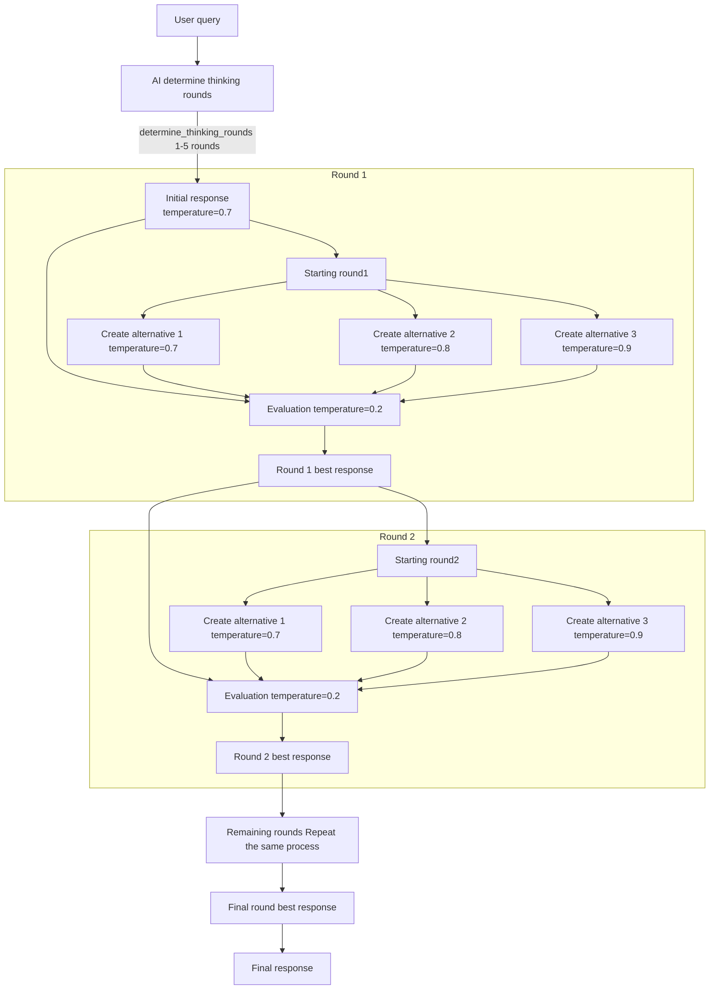

# CoRT MCP Server
[](https://smithery.ai/server/@KunihiroS/cort-mcp)

This is a Chain-of-Recursive-Thoughts (CORT) MCP server.
The orignal project is as below, I appreciate so much the original work.

> Original: PhialsBasement/Chain-of-Recursive-Thoughts: I made my AI think harder by making it argue with itself repeatedly. It works stupidly well.  
> https://github.com/PhialsBasement/Chain-of-Recursive-Thoughts

## Release note

0.2.0 LLM list updated
0.1.0 Initial release

## Features

- CoRT method available via MCP Server that makes AI to think harder by making it argue with itself repeatedly. It works stupidly well.

## Worked check

Roo code / Cline

## MCP Host Configuration

300 sec timeout recommend. (may sometime take longer time than expected)
OPENROUTER_API_KEY is required. https://openrouter.ai/

### Example: Logging Disabled
```json
"CoRT-chain-of-recursive-thinking": {
  "command": "pipx",
  "args": ["run", "cort-mcp", "--log=off"],
  "env": {
    "OPENAI_API_KEY": "{apikey}",
    "OPENROUTER_API_KEY": "{apikey}"
  }
}
```

### Example: Logging Enabled (absolute log file path required)
```json
"CoRT-chain-of-recursive-thinking": {
  "command": "pipx",
  "args": ["run", "cort-mcp", "--log=on", "--logfile=/workspace/logs/cort-mcp.log"],
  "env": {
    "OPENAI_API_KEY": "{apikey}",
    "OPENROUTER_API_KEY": "{apikey}"
  }
}
```

- `--log=off` : Disable all logging (no logs are written)
- `--log=on --logfile=/absolute/path/to/logfile.log` : Enable logging and write logs to the specified absolute file path
- Both arguments are **required** when logging is enabled. The server will exit with an error if either is missing, the path is not absolute, or if invalid values are given.

> **Note:**
> - When logging is enabled, logs are written **only** to the specified absolute file path. Relative paths or omission of `--logfile` will cause an error.
> - When logging is disabled, no logs are output.
> - If the required arguments are missing or invalid, the server will not start and will print an error message.
> - The log file must be accessible and writable by the MCP Server process.
> - If you have trouble to run this server, it may be due to caching older version of cort-mcp. Please try to run it with the latest version (set `x.y.z` to the latest version) of cort-mcp by the below setting.

```json
"CoRT-chain-of-recursive-thinking": {
  "command": "pipx",
  "args": ["run", "cort-mcp==x.y.z", "--log=off"],
  "env": {
    "OPENAI_API_KEY": "{apikey}",
    "OPENROUTER_API_KEY": "{apikey}"
  }
}
```

## Available tools

- {toolname}.simple
No details, output only final selected alternative.
- {toolname}.details
Include details of LLM response history.
- {toolname}.mixed.llm
Multi LLM inference.
- {toolname}.neweval
New evaluation prompt.

Check the below details.

## What is CoRT?


## Major enhancement from the original

There are several enhancement from original CoRT methodology.
1. **Multi LLM inference**: Each alternative is generated with a different LLM (model + provider) randomly.
2. **Evaluation enhancement**: The prompt evaluation is updated by adding a prompt that asks the AI to explain its reasoning. (Original prompt is available by tools)

### Multi LLM inference

**Overview:**
This is a new tool that adds an exploration strategy of "randomly selecting different LLM (model + provider) for each alternative" to the conventional CoRT thinking flow.
This allows you to maximize the use of the knowledge and ideas of heterogeneous models and select the optimal solution from a wider range of options.

- the function is available by mixed llm tools.

### The list of LLMs

- Reasonably lighter and faster models are selected for better user experience.

```
MIXED_LLM_LIST = [
    {"provider": "openai", "model": "gpt-4.1-nano"},
    {"provider": "openrouter", "model": "meta-llama/llama-4-scout:free"},
    {"provider": "openrouter", "model": "google/gemini-2.0-flash-exp:free"},
    {"provider": "openrouter", "model": "mistralai/mistral-small-3.1-24b-instruct:free"},
    {"provider": "openrouter", "model": "meta-llama/llama-3.2-3b-instruct:free"},
    {"provider": "openrouter", "model": "thudm/glm-4-9b:free"},
]
```

### mixed LLMs tool process.

- For each alternative, randomly select one LLM (model + provider) from the above list
- Always record in the log "which model and provider was used" for each generated alternative
- In details mode, explicitly include "model and provider used for each alternative" in the response history information

## Evaluation enhancement

**Overview:**
Changed the evaluation prompt richer. (Original prompt is available by tools)
Use the prompt by {toolname}.neweval that asks the AI to explain its reasoning.

### Original prompt

```
f"""Original message: {prompt}
Evaluate these responses and choose the best one:
Current best: {current_best}
Alternatives:
{chr(10).join([f"{i+1}. {alt}" for i, alt in enumerate(alternatives)])}
Which response best addresses the original message? Consider accuracy, clarity, and completeness.
First, respond with ONLY 'current' or a number (1-{len(alternatives)}).
Then on a new line, explain your choice in one sentence."""
```

### Enhanced prompt

```
f""" Original message: {prompt}
You are an expert evaluator tasked with selecting the response that best fulfills the user's true needs, considering multiple perspectives.
Current best: {current_best}
Alternatives: {chr(10).join([f"{i+1}. {alt}" for i, alt in enumerate(alternatives)])}
Please follow this evaluation process:
Intent Analysis: What is the user REALLY seeking? What underlying needs might be present beyond the surface question?
Context Consideration: What possible situations or backgrounds could this question arise from?
Diversity Assessment: Does the response consider different viewpoints or possible interpretations?
Practicality Evaluation: How useful would the response be in the user's real-world context?
Consistency Check: Is the response internally consistent and logically coherent?
For each response (including the current best):
Does it solve the user's TRUE problem?
Does it balance accuracy and usefulness?
Does it avoid unnecessary assumptions or biases?
Is it flexible enough to apply in various contexts or situations?
Does it account for exceptions or special cases?
After completing your evaluation:
Indicate your choice with ONLY 'current' or a number (1-{len(alternatives)}).
On the next line, explain specifically why this response best meets the user's true needs. """
```

### Parameter Specification and Fallback Processing

This API determines the actual model to be used based on the specified `provider` and `model` parameters, with fallback processing in case of errors.

1. **Provider (`provider`) Resolution**
   - **When unspecified**: `openrouter` is used as the default provider.
   - **When an invalid value is specified** (other than `openai` or `openrouter`): Falls back to the default provider `openrouter`.

2. **Model (`model`) Resolution**
   - **When unspecified**:
     - If the resolved provider is `openrouter`: The default model `mistralai/mistral-small-3.1-24b-instruct:free` is used.
     - If the resolved provider is `openai`: The default OpenAI model is used.
   - **When specified (with a valid provider)**:
     - The specified model name is used as-is with the resolved provider.
     - **Important**: At this stage, it is not verified whether the specified model name actually exists with the provider.

3. **API Call and Error Fallback**
   - An API call is first attempted with the provider and model combination resolved by the above rules.
   - **If an error occurs during the API call** (e.g., the specified model does not exist with the provider, API key authentication error, etc.):
     - **Condition 1**: The provider of the first attempted call is **not** `openai`.
     - **Condition 2**: The environment variable `OPENAI_API_KEY` is set in the system.
     - If **both** of the above conditions are met, the system automatically **retries the process using the default model of the `openai` provider** (this is the fallback processing).
     - If either or both of the above conditions are not met (e.g., the first attempt was with `openai`, or `OPENAI_API_KEY` is not set), the initial error is returned as the final result, and this type of fallback does not occur.

**Notes on Environment Variables:**
- `OPENROUTER_API_KEY` is required to use `openrouter`.
- `OPENAI_API_KEY` is required to use `openai` or to utilize the above fallback feature.
- If the corresponding API key is not set, the API call will fail (the fallback to OpenAI will also fail depending on the fallback conditions).

## License
MIT
> Go wild with it
