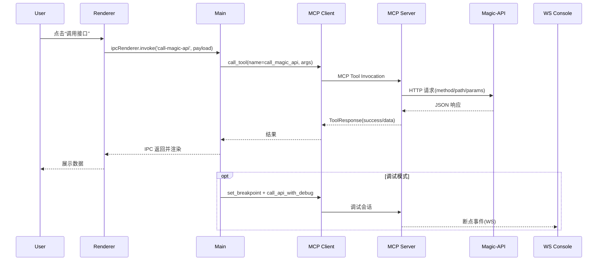

# Magic-API MCP Server 使用指南

## 🚀 快速开始

本项目集成了 Model Context Protocol (MCP) 功能，为 Magic-API 开发提供高级交互能力。

### 1. 安装与测试

```bash
# 如果尚未安装 uv (推荐方式)
pip install uv

# 安装项目依赖
uv sync
# 或者安装 fastmcp
uv add fastmcp
```

### 2. MCP 配置

#### 基础配置（适用于大多数用户）：

```json
{
  "mcpServers": {
    "magic-api-mcp-server": {
      "command": "uvx",
      "args": ["magic-api-mcp-server@latest", "--transport", "stdio"],
      "timeout": 600
    }
  }
}
```

#### 高级配置（需要自定义环境）：

```json
{
  "mcpServers": {
    "magic-api-mcp-server": {
      "command": "uvx",
      "args": ["magic-api-mcp-server@latest", "--transport", "stdio"],
      "timeout": 600,
      "env": {
        "MAGIC_API_BASE_URL": "http://127.0.0.1:10712",
        "MAGIC_API_WS_URL": "ws://127.0.0.1:10712/magic/web/console",
        "MAGIC_API_TIMEOUT_SECONDS": "30.0",
        "LOG_LEVEL": "INFO"
      }
    }
  }
}
```

#### MCP 提示词 （非常重要）

##### 提示词概述

当使用支持 MCP 的 AI 助手（如 Claude Desktop、Cursor 等）时，请务必使用以下提示词让助手了解 Magic-API MCP Server 的功能和用途。

##### 核心提示词

```
你现在是一个专业的 Magic-API 开发者助手，具备强大的 MCP (Model Context Protocol) 工具（Magic-API MCP Server）支持。

## 🎯 你的核心职能
- 提供 Magic-API 脚本语法指导和最佳实践
- 帮助用户编写高效的数据库查询和业务逻辑
- 解答 Magic-API 配置和部署相关问题
- 提供代码示例和调试建议

## ⚠️ 强制要求：代码编写前语法规则获取
**重要：** 在编写任何 Magic-Script 代码前，你必须首先调用 `get_full_magic_script_syntax` 工具获取完整的语法规则。
Magic-Script 是一种小众语言，具有独特的语法规则，不遵循标准 JavaScript 或 Java 语法。
不获取完整语法规则而直接编写代码将导致严重的语法错误。

**重要：** 在API脚本开发（create/edit API scripts）编写编辑脚本前，你必须：
1. 调用 `get_full_magic_script_syntax` 获取完整的 Magic-Script 语法规则
2. 调用 `get_development_workflow` 获取开发工作流指南
3. 遵循标准化的开发流程：准备→信息采集→执行→校验→总结

## 🧭 MagicAPI MCP Agent 核心工作流
> 流转需按顺序推进，用户可随时指令跳转。
按照以下流程调用 MCP 工具，确保每一步都有依据：
- **[需求洞察]** → `search_knowledge`、`get_development_workflow`，识别目标场景与约束
- **语法对齐** → `get_full_magic_script_syntax`、`get_script_syntax`，确认Magic-Script写法
- **[资源定位]** → `get_resource_tree`、`get_api_details_by_path`、`search_api_endpoints`，查阅现有资产
- **[实现与调试]** → `create_api_resource`、`replace_api_script`、`call_magic_api`、`call_api_with_debug`、`set_breakpoint`，落实代码并验证
- **[结果反馈]** → `get_practices_guide`、`get_common_pitfalls`、`list_backups`，输出结论并保证可回溯

## 🛠️ 可用工具能力

在本文档第 3 节中详细介绍了所有可用工具，包括：
- **文档工具** (DocumentationTools): 语法、文档、示例、最佳实践等
- **API 工具** (ApiTools): 接口调用和测试
- **资源管理工具** (ResourceManagementTools): 资源的CRUD操作
- **查询工具** (QueryTools): 资源检索
- **调试工具** (DebugTools): 断点管理
- **搜索工具** (SearchTools): 内容搜索
- **备份工具** (BackupTools): 数据备份管理
- **类方法工具** (ClassMethodTools): Java类和方法查询
- **系统工具** (SystemTools): 系统元信息查询

详情请参见下方第 3 节 "本项目 MCP 工具功能"。

## 📋 使用指南

##### 问题分析
首先理解用户的需求和上下文，再选择合适的工具。

##### 知识搜索策略
🔍 **当你不确定某个功能或语法时，优先使用搜索工具：**
- 调用 `search_knowledge` 进行全文搜索，关键词可以是功能名称、语法关键词等
- 例如：搜索"数据库连接"、"缓存使用"、"文件上传"等
- 可以限定搜索分类：syntax(语法)、modules(模块)、functions(函数)、web_docs(文档)等

##### 最佳实践
- 🔍 **遇到不确定的问题时，先搜索知识库**
- 📚 优先使用文档查询工具了解功能
- 🔍 开发时先用查询工具了解现有资源
- 🐛 调试时设置断点逐步排查问题
- 💾 重要的变更操作前先备份

##### 错误处理
- 🔍 遇到未知错误时，使用 `search_knowledge` 搜索相关解决方案
- 🌐 网络错误时检查 Magic-API 服务状态
- 🔐 权限错误时确认用户认证配置
- 📁 资源不存在时先用查询工具确认路径

## ⚠️ 注意事项
- 所有工具都支持中文和英文参数
- API 调用支持自定义请求头和参数

记住：你现在具备了完整的 Magic-API 开发工具链，可以为用户提供专业、高效的开发支持！
```

##### 简短提示词 (适用于快速配置)

```
你是一个专业的 Magic-API 开发者助手，拥有以下 MCP 工具：

⚠️ 强制要求：
- 编写任何 Magic-Script 代码前必须先调用 get_full_magic_script_syntax 获取完整语法规则！
- API脚本开发（create/edit API scripts）编写编辑脚本前必须调用 get_development_workflow 获取工作流指南！

📚 文档查询: get_full_magic_script_syntax[强制], get_development_workflow[强制], search_knowledge[推荐], get_script_syntax, get_module_api, get_best_practices, get_examples
🔧 API 调用: call_magic_api
📁 资源管理: get_resource_tree, create_api_resource, delete_resource
🔍 查询工具: get_api_details_by_path, get_api_details_by_id, search_api_endpoints
🐛 调试工具: set_breakpoint, resume_breakpoint_execution, call_api_with_debug
🔎 搜索工具: search_api_scripts, search_todo_comments
💾 备份工具: list_backups, create_full_backup, rollback_backup
⚙️ 系统工具: get_assistant_metadata

🔍 不确定时优先使用 search_knowledge 搜索知识库，代码编写前必须获取完整语法规则。
🧭 按核心工作流顺序完成需求洞察→语法对齐→资源定位→实现调试→结果反馈。
```

##### 配置提示词 (Cursor/VS Code 等编辑器)

```json
{
  "mcpServers": {
    "magic-api-mcp-server": {
      "command": "uvx",
      "args": ["magic-api-mcp-server@latest", "--transport", "stdio"],
      "timeout": 600,
      "env": {
        "MAGIC_API_BASE_URL": "http://127.0.0.1:10712",
        "MAGIC_API_WS_URL": "ws://127.0.0.1:10712/magic/web/console"
      }
    }
  }
}
```

本项目 MCP 服务器专为 Magic-API 开发者设计，提供了一套完整的工作流工具，从脚本编写、API 管理到调试和部署，全方位提升开发效率。

## 🧠 Prompts (提示词模板)

Magic-API MCP Server 提供了可复用的提示词模板，帮助您快速配置专业的 Magic-API 开发者助手。

### 可用 Prompts

#### magic_api_developer_guide
生成专业的 Magic-API 开发者助手提示词，包含：
- 完整的工具能力介绍
- 使用指南和最佳实践
- 错误处理建议
- 工具选择策略

**使用方法：**
```python
# 通过 MCP 客户端调用
prompt = await client.get_prompt("magic_api_developer_guide")
content = prompt.messages[0].content.text
```

**适用场景：**
- 配置新的 AI 助手
- 标准化开发工作流
- 培训新团队成员
- 创建一致的开发环境

#### 工具组合配置

本项目支持多种工具组合，可根据需要选择：

- `full`: 完整工具集 - 适用于完整开发环境 (默认)
- `minimal`: 最小工具集 - 适用于资源受限环境
- `development`: 开发工具集 - 专注于开发调试
- `production`: 生产工具集 - 生产环境稳定运行
- `documentation_only`: 仅文档工具 - 文档查询和学习
- `api_only`: 仅API工具 - 接口测试和调用
- `backup_only`: 仅备份工具 - 数据备份和管理
- `class_method_only`: 仅类方法工具 - Java类和方法查询
- `search_only`: 仅搜索工具 - 快速搜索定位

**工具组合使用场景**：

| 场景 | 组合模式 | 适用环境 | 特点 |
|------|----------|----------|------|
| **新手学习** | `documentation_only` | 学习阶段 | 专注文档查询和语法学习 |
| **API开发** | `development` | 开发环境 | 接口开发、测试和调试 |
| **生产运维** | `production` | 生产环境 | 系统运维和资源管理 |
| **问题调试** | `minimal` | 调试场景 | 问题排查，启用DEBUG日志 |

**基础配置模板**：
```json
{
  "mcpServers": {
    "magic-api-server": {
      "command": "uvx",
      "args": ["magic-api-mcp-server@latest", "--composition", "{组合模式}", "--transport", "stdio"],
      "timeout": 600
    }
  }
}
```

### 3. 本项目 MCP 工具功能

Magic-API MCP 服务器为 Magic-API 开发提供以下专业工具：

#### 3.1 系统工具 (SystemTools)
系统信息和元数据工具
- **get_assistant_metadata**: 获取Magic-API MCP Server的完整元信息，包括版本、功能列表和配置

#### 3.2 文档工具 (DocumentationTools)
文档查询与知识库工具，覆盖语法、实践、示例与流程
- **get_full_magic_script_syntax** ⚠️ **[强制]**: 获取完整的Magic-Script语法规则 - 大模型编写代码前必须调用此工具
- **search_knowledge** 🔍 **[推荐]**: 在Magic-API知识库中进行全文搜索 - 不确定时优先使用此工具
- **get_magic_script_syntax**: 查询 Magic-Script 语法规则与示例
- **get_magic_script_examples**: 获取脚本示例，支持关键词过滤
- **get_magic_api_docs**: 查看官方文档索引或详细内容
- **get_best_practices**: 查阅最佳实践列表
- **get_common_pitfalls**: 查阅常见问题与规避建议
- **get_development_workflow**: 获取标准化开发流程指南
- **get_module_api_docs**: 查询内置模块 API 文档
- **list_available_modules**: 查看可用模块与自动导入模块
- **get_function_docs**: 获取内置函数库文档
- **get_extension_docs**: 获取类型扩展文档（默认禁用，启用后可用）
- **get_config_docs**: 获取配置项文档（默认禁用）
- **get_plugin_docs**: 获取插件系统文档（默认禁用）
- **get_examples** / **list_examples**: 统一查询示例分类与代码片段
- **get_docs**: 获取 Magic-API 官方站点索引

#### 3.3 API 工具 (ApiTools)
API调用和测试工具，支持灵活的接口调用和测试
- **call_magic_api**: 调用Magic-API接口并返回请求结果，支持GET、POST、PUT、DELETE等HTTP方法

##### 🔍 API响应智能检查
Magic-API MCP Server 支持多种API响应格式的智能成功/失败判断：

**优先级顺序**：
1. 🚀 **`message="success"`** - 最高优先级，直接匹配message字段是否等于"success"
2. 🔢 **Code字段检查** - 检查code字段是否等于配置的成功码（默认1，可配置）
3. 📊 **Status字段检查** - 检查status字段（某些自定义响应格式）
4. ❌ **错误字段检查** - 检查是否存在error、exception、failure等错误字段
5. ✅ **默认成功** - 兼容模式，对没有明确标识的响应默认视为成功

**支持的响应格式示例**：
```json
// 标准格式
{"code": 1, "message": "success", "data": {...}}

// 自定义状态码
{"code": 200, "message": "ok", "data": {...}}

// Message优先（最高优先级）
{"code": 500, "message": "success", "data": {...}} // 仍然成功！

{"code": 1, "message": "operation failed", "data": {...}} // 失败！

// 自定义格式
{"status": 1, "msg": "success", "body": {...}}

// 错误响应
{"code": 500, "message": "Internal Error", "data": {...}}
{"error": "something went wrong"}
```

**配置方式**：
```bash
# 通过环境变量配置成功状态码和消息
MAGIC_API_SUCCESS_CODE=200
MAGIC_API_SUCCESS_MESSAGE=ok
MAGIC_API_INVALID_CODE=400
MAGIC_API_EXCEPTION_CODE=500
```

#### 3.4 资源管理工具 (ResourceManagementTools)
完整的资源管理系统，支持资源树查询与批量操作
- **get_resource_tree**: 获取资源树，支持过滤、导出多种格式（JSON/CSV/树形），向后兼容CSV参数
- **save_group**: 保存分组，支持单个分组创建或更新，包含完整的分组配置选项
- **create_api_resource** / **create_api_endpoint**: 创建单个或批量 API
- **replace_api_script**: 按接口 ID 替换 Magic-Script 片段，支持一次或全量替换
- **copy_resource**: 复制资源
- **move_resource**: 移动资源
- **delete_resource**: 删除单个或批量资源
- **lock_resource** / **unlock_resource**: 批量锁定或解锁资源
- **list_resource_groups**: 列出与搜索资源分组
- **get_resource_stats**: 统计资源数量与类型分布

#### 3.5 查询工具 (QueryTools)
高效的资源查询和检索工具
- **get_api_details_by_path**: 根据API路径直接获取接口的详细信息，支持模糊匹配
- **get_api_details_by_id**: 根据接口ID获取完整的接口详细信息和配置
- **search_api_endpoints**: 搜索和过滤Magic-API接口端点，返回包含ID的完整信息列表

#### 3.6 调试工具 (DebugTools)
强大的调试功能，支持断点管理和调试会话
- **set_breakpoint**: 在指定API脚本中设置断点
- **remove_breakpoint**: 移除指定的断点
- **resume_breakpoint_execution**: 恢复断点执行，继续运行调试脚本
- **step_over_breakpoint**: 单步执行，越过当前断点继续执行
- **list_breakpoints**: 列出所有当前设置的断点
- **call_api_with_debug**: 调用指定接口并在命中断点处暂停
- **execute_debug_session**: 执行完整的调试会话
- **get_debug_status**: 获取当前调试状态
- **clear_all_breakpoints**: 清除所有断点
- **get_websocket_status**: 获取WebSocket连接状态

#### 3.7 搜索工具 (SearchTools)
内容搜索与定位
- **search_api_scripts**: 在所有 API 脚本中检索关键词
- **search_todo_comments**: 搜索脚本中的 TODO 注释（默认禁用）

#### 3.8 备份工具 (BackupTools)
完整的备份管理功能
- **list_backups**: 查询备份列表，支持时间戳过滤和名称过滤
- **get_backup_history**: 获取备份历史记录
- **get_backup_content**: 获取指定备份的内容
- **rollback_backup**: 回滚到指定的备份版本
- **create_full_backup**: 创建完整的系统备份

#### 3.9 类方法工具 (ClassMethodTools)
Java类和方法检索工具
- **list_magic_api_classes**: 列出所有Magic-API可用的类、扩展和函数，支持翻页浏览
- **get_class_details**: 获取指定类的详细信息，包括方法、属性和继承关系
- **get_method_details**: 获取指定方法的详细信息，包括参数类型和返回值

#### 3.10 代码生成工具 (CodeGenerationTools) - 当前禁用
智能代码生成功能（需启用后使用）
- **generate_crud_api**: 生成完整的CRUD API接口代码
- **generate_database_query**: 生成数据库查询代码
- **generate_api_test**: 生成API接口测试代码
- **generate_workflow_code**: 生成工作流模板代码

#### 3.11 提示词工具 (PromptTools)
提供可复用的提示词模板，确保助手严格遵循 MCP 工具化流程
- **magic_api_developer_guide**: 输出最新版“Magic-API 开发者助手”系统提示词，强调“仅依赖 MCP 工具”工作守则、六步工具工作流以及结构化输出要求

#### 3.12 工作流知识库亮点

`magicapi_tools/utils/kb_practices.py` 新增 "mcp_tool_driven" 等工作流，调用 `get_development_workflow` 或 `get_practices_guide` 时可获取：
- 🔍 **智能搜索驱动**：遇到不确定的问题时，优先调用 `search_knowledge` 工具进行知识库全文搜索，确保获取最新和准确的信息。
- MCP 工具优先的通用流程：覆盖准备、信息采集、执行、校验、总结全链路，并针对每一步给出对应工具提示。
- api_script_development / diagnose / optimize / refactor 等场景化流程：提供原则说明、步骤拆解以及工具列表，确保在接口开发、故障排查、性能优化与重构中全程依赖 MCP 工具完成。
- 结合 `magic_api_developer_guide` 提示词，可让大模型在对话中主动引用工具证据，输出可验证的结论。

### 4. 环境变量

| 变量 | 用途 | 值 | 默认值 |
|------|------|----|--------|
| MAGIC_API_BASE_URL | Magic-API 服务基础 URL | URL 地址 | http://127.0.0.1:10712 |
| MAGIC_API_WS_URL | Magic-API WebSocket URL | WebSocket 地址 | ws://127.0.0.1:10712/magic/web/console |
| MAGIC_API_USERNAME | Magic-API 认证用户名 | 字符串 | 无 |
| MAGIC_API_PASSWORD | Magic-API 认证密码 | 字符串 | 无 |
| MAGIC_API_TOKEN | Magic-API 认证令牌 | 字符串 | 无 |
| MAGIC_API_AUTH_ENABLED | 是否启用认证 | true/false | false |
| MAGIC_API_TIMEOUT_SECONDS | 请求超时时间（秒） | 数字 | 30.0 |
| MAGIC_API_SUCCESS_CODE | API成功状态码 | 数字 | 1 |
| MAGIC_API_SUCCESS_MESSAGE | API成功消息文本 | 字符串 | success |
| MAGIC_API_INVALID_CODE | 参数验证失败状态码 | 数字 | 0 |
| MAGIC_API_EXCEPTION_CODE | 系统异常状态码 | 数字 | -1 |
| LOG_LEVEL | 日志级别 | DEBUG/INFO/WARNING/ERROR | INFO |
| FASTMCP_TRANSPORT | FastMCP 传输协议 | stdio/http | stdio |

### 5. 本地运行方式

```bash
# 推荐方式：使用 uvx 运行最新版本（适用于已发布到 pip 的包）
uvx magic-api-mcp-server@latest

# 或安装后使用本地命令
magic-api-mcp-server

# 或者直接运行 Python 脚本（开发时）
uv run fastmcp run run_mcp.py:mcp --transport http --port 8000

# 指定工具组合运行
uvx magic-api-mcp-server@latest --composition development

# 使用特定配置运行
MAGIC_API_BASE_URL=http://localhost:8080 uvx magic-api-mcp-server@latest
```

### 6. Docker 运行方式

#### 使用 Docker Compose (推荐)

```bash
# 使用 Makefile 命令 (推荐，简化操作)
make quick-start    # 快速启动开发环境
make deploy         # 生产环境部署
make logs           # 查看日志
make status         # 查看状态
make shell          # 进入容器
make test           # 运行测试

# 或直接使用 docker-compose 命令
# 1. 构建并启动服务
docker-compose up -d

# 2. 查看日志
docker-compose logs -f magic-api-mcp-server

# 3. 停止服务
docker-compose down

# 4. 重启服务
docker-compose restart magic-api-mcp-server
```

#### 使用 Docker 命令 (基于 uvx)

```bash
# 1. 构建镜像
docker build -t magic-api-mcp-server .

# 2. 运行容器 (stdio模式)
docker run --rm --entrypoint uvx magic-api-mcp-server \
  magic-api-mcp-server@latest --composition full --transport stdio

# 3. 运行容器 (HTTP模式)
docker run -d --name magic-api-mcp-server \
  -p 8000:8000 \
  --entrypoint uvx magic-api-mcp-server \
  magic-api-mcp-server@latest --transport http --port 8000

# 4. 查看日志
docker logs -f magic-api-mcp-server

# 5. 停止容器
docker stop magic-api-mcp-server
```

#### Docker 配置说明

**基于 uvx 的优势**:
- 自动下载并运行最新版本的包
- 无需预先安装依赖
- 镜像更小，构建更快
- 自动处理包版本管理

**生产环境配置** (`docker-compose.yml`):
- 使用桥接网络连接到Magic-API服务
- 配置资源限制和健康检查
- 支持自动重启

**开发环境配置** (`docker-compose.override.yml`):
- 挂载源代码支持热重载
- 调试日志级别
- 禁用健康检查

#### Docker 环境变量

| 变量 | 描述 | 默认值 |
|------|------|--------|
| `MAGIC_API_BASE_URL` | Magic-API 服务基础 URL | `http://host.docker.internal:10712` |
| `MAGIC_API_WS_URL` | Magic-API WebSocket URL | `ws://host.docker.internal:10712/magic/web/console` |
| `MAGIC_API_USERNAME` | 认证用户名 | 无 |
| `MAGIC_API_PASSWORD` | 认证密码 | 无 |
| `MAGIC_API_TOKEN` | 认证令牌 | 无 |
| `MAGIC_API_AUTH_ENABLED` | 是否启用认证 | `false` |
| `MAGIC_API_TIMEOUT_SECONDS` | 请求超时时间 | `30.0` |
| `MAGIC_API_SUCCESS_CODE` | API成功状态码 | `1` |
| `MAGIC_API_SUCCESS_MESSAGE` | API成功消息文本 | `success` |
| `MAGIC_API_INVALID_CODE` | 参数验证失败状态码 | `0` |
| `MAGIC_API_EXCEPTION_CODE` | 系统异常状态码 | `-1` |
| `LOG_LEVEL` | 日志级别 | `INFO` |
| `FASTMCP_TRANSPORT` | MCP传输协议 | `stdio` |

#### 网络配置注意事项

- **Linux**: 使用 `host.docker.internal` 访问宿主机服务
- **macOS/Windows**: Docker Desktop 自动提供 `host.docker.internal`
- **自定义网络**: 可通过 `docker network` 创建专用网络

#### Docker 构建问题解决

如果遇到网络证书验证问题，请尝试以下解决方案：

**方案1: 使用国内镜像源**
```bash
# 修改Dockerfile添加国内镜像源
RUN sed -i 's/deb.debian.org/mirrors.tuna.tsinghua.edu.cn/g' /etc/apt/sources.list.d/debian.sources
RUN pip config set global.index-url https://pypi.tuna.tsinghua.edu.cn/simple/
```

**方案2: 配置Docker代理**
```bash
# 创建或修改 ~/.docker/config.json
{
  "proxies": {
    "default": {
      "httpProxy": "http://127.0.0.1:7897",
      "httpsProxy": "http://127.0.0.1:7897",
      "noProxy": "localhost,127.0.0.1"
    }
  }
}
```

**方案3: 跳过TLS验证 (仅用于测试)**
```bash
# 临时跳过TLS验证构建
docker build --build-arg DOCKER_TLS_VERIFY=0 -t magic-api-mcp-server:test .
```

**方案4: 使用预构建镜像**
```bash
# 如果网络问题持续，可考虑使用预构建的基础镜像
# 或者在有稳定网络的环境中构建
```

#### 故障排除

```bash
# 使用 Makefile 命令 (推荐)
make status         # 查看容器状态
make shell          # 进入容器调试
make logs-tail      # 查看详细日志
make test           # 运行健康检查
make test-connection # 测试与 Magic-API 连接
make clean-all      # 清理所有资源

# 或直接使用 docker/docker-compose 命令
# 查看容器状态
docker-compose ps

# 进入容器调试
docker-compose exec magic-api-mcp-server bash

# 查看详细日志
docker-compose logs --tail=100 magic-api-mcp-server

# 清理容器和镜像
docker-compose down --rmi all --volumes
```

### 7. 项目结构

```
magicapi_mcp/
├── magicapi_assistant.py    # 主要的 MCP 助手实现
├── tool_registry.py         # 工具注册表
├── tool_composer.py         # 工具组合器
└── settings.py              # 配置设置
magicapi_tools/
├── tools/                   # 各种 MCP 工具
│   ├── system.py            # 系统工具 (元信息查询)
│   ├── documentation.py     # 文档工具 (知识库查询)
│   ├── api.py              # API工具 (接口调用)
│   ├── resource.py         # 资源管理工具 (CRUD操作)
│   ├── query.py            # 查询工具 (资源检索)
│   ├── debug.py            # 调试工具 (断点管理)
│   ├── search.py           # 搜索工具 (内容搜索)
│   ├── backup.py           # 备份工具 (数据备份)
│   ├── class_method.py     # 类方法工具 (Java类查询)
│   ├── code_generation.py  # 代码生成工具 (当前禁用)
│   └── common.py           # 通用辅助函数
└── utils/                  # 工具助手功能
    ├── knowledge_base.py   # 知识库接口
    ├── response.py         # 标准化响应
    ├── http_client.py      # HTTP 客户端
    └── resource_manager.py # 资源管理器
```

### 8. 安装方式

#### 从 PyPI 安装（推荐）

```bash
# 安装已发布的包
pip install magic-api-mcp-server

# 或使用 uv 安装
uv add magic-api-mcp-server

# 运行 MCP 服务器（推荐使用最新版本）
uvx magic-api-mcp-server@latest

# 或使用安装后的命令
magic-api-mcp-server
```

#### 开发者本地安装

```bash
# 本项目已包含完整的 MCP 实现
cd magic-api-mcp-server

# 安装项目依赖（开发时）
uv sync

# 安装 fastmcp 依赖
uv add fastmcp

# 本地运行（开发时）
python run_mcp.py
```

## 🛠️ 项目结构

```
magicapi_mcp/
├── magicapi_assistant.py    # 主要的 MCP 助手实现
├── tool_registry.py         # 工具注册表
├── tool_composer.py         # 工具组合器
└── settings.py              # 配置设置
magicapi_tools/
├── tools/                   # 各种 MCP 工具
│   ├── documentation.py     # 文档相关工具
│   ├── api.py              # API 相关工具
│   ├── code_generation.py   # 代码生成工具 (当前已禁用)
│   ├── query.py            # 查询工具
│   ├── backup.py           # 备份工具
│   ├── class_method.py     # 类方法工具
│   ├── debug.py            # 调试工具
│   ├── resource.py         # 资源管理工具
│   ├── search.py           # 搜索工具
│   └── system.py           # 系统工具
└── utils/                  # 工具助手功能
    ├── knowledge_base.py    # 知识库接口
    ├── response.py          # 标准化响应
    ├── http_client.py       # HTTP 客户端
    └── resource_manager.py  # 资源管理器
```


## AIMCP Electron 客户端附录（含 Mermaid 架构图）

> 本附录面向基于 Electron 的 AIMCP 客户端，指导如何对接本 Magic-API MCP Server，并提供关键流程可视化。适合作为独立开源仓库 README 模板片段复用。

### 项目简介（AIMCP）
- 目标：在 Electron 应用中，通过 MCP 协议统一调用 Magic-API 能力，覆盖查询、资源管理与调试。
- 栈特性：Electron(Main/Renderer/Preload) + Node MCP 客户端 + FastMCP Server(Python) + Magic-API(HTTP/WS)。

### 架构总览
```mermaid
flowchart LR
  subgraph Renderer[Electron Renderer UI]
    R[React/Vue/Svelte UI]
  end
  subgraph Main[Electron Main Process]
    IPC[IPC Router]
    C[Node MCP Client]
  end
  subgraph Server[magic-api-mcp-server (Python/FastMCP)]
    S[Tools: Api/Query/Debug/...]
  end
  subgraph MagicAPI[Magic-API Backend]
    A[(HTTP API)]
    W[(WS Console)]
    DB[(Database)]
  end

  R -->|ipcRenderer.invoke| IPC --> C
  C <--> |stdio/http| S
  S --> A --> DB
  S -. WebSocket Debug .-> W
```

### 关键调用时序


### 快速集成（Electron Main）
```ts
// main/mcp.ts
import { spawn } from 'node:child_process'
import { StdioClientTransport, Client } from '@modelcontextprotocol/sdk/client'

export async function createMcpClient() {
  const child = spawn('uvx', ['magic-api-mcp-server@latest', '--transport', 'stdio'], {
    stdio: ['pipe', 'pipe', 'pipe']
  })

  const transport = new StdioClientTransport({
    stdin: child.stdin!, stdout: child.stdout!, stderr: child.stderr!
  })

  const client = new Client({ name: 'AIMCP', version: '0.1.0' }, transport)
  await client.connect()
  return { client, child }
}

// 调用示例
export async function callMagicApi(client: Client, args: any) {
  return client.callTool({ name: 'call_magic_api', arguments: args })
}
```

```ts
// main/ipc.ts
import { ipcMain } from 'electron'
import { createMcpClient, callMagicApi } from './mcp'

let mcp: Awaited<ReturnType<typeof createMcpClient>> | null = null

ipcMain.handle('call-magic-api', async (_e, payload) => {
  if (!mcp) mcp = await createMcpClient()
  const res = await callMagicApi(mcp.client, payload)
  return res
})
```

### 渲染进程调用示例
```ts
// renderer/api.ts
export async function callApi(payload: {
  method: 'GET'|'POST'|'PUT'|'DELETE', path: string, params?: any, headers?: any
}) {
  return window.electron.ipc.invoke('call-magic-api', payload)
}
```

### 配置与安全建议
- 在 Electron 主进程通过环境变量注入 MAGIC_API_BASE_URL/MAGIC_API_WS_URL 等，勿在 Renderer 暴露密钥。
- 生产环境启用 MAGIC_API_AUTH_ENABLED 并使用 TOKEN 访问。
- 调试开关建议以 Feature Flag 控制（仅开发环境允许 set_breakpoint）。

### 常用功能映射
- API 调用：call_magic_api（支持自定义 success 判断，详见前文环境变量）。
- 资源检索：search_api_endpoints、get_api_details_by_path。
- 调试会话：set_breakpoint、call_api_with_debug、resume_breakpoint_execution。

### 目录建议（AIMCP 客户端）
```
app/
├─ main/            # Electron Main（进程生命周期、MCP 客户端、IPC）
│  ├─ mcp.ts
│  └─ ipc.ts
├─ preload/         # 受限桥接，仅暴露安全 IPC 能力
├─ renderer/        # 前端 UI（调用 ipcRenderer.invoke）
└─ config/          # env/配置与 Feature Flags
```

### 开发与打包提示
- 开发：同时运行 Electron 与 MCP Server（Main 进程首调用时自动拉起 uvx 进程）。
- 打包：确保将 uv/uvx 作为外部依赖或在安装阶段预置；或改为 HTTP 模式连接已部署的 MCP Server。

### 故障排查速查
- 无响应：检查 Main 进程是否成功 spawn uvx；查看 child.stderr。
- 401/403：确认 MAGIC_API_AUTH_ENABLED 与 TOKEN 配置。
- 断点不生效：检查 Magic-API WS 地址与权限；确认调试工具组合启用。

