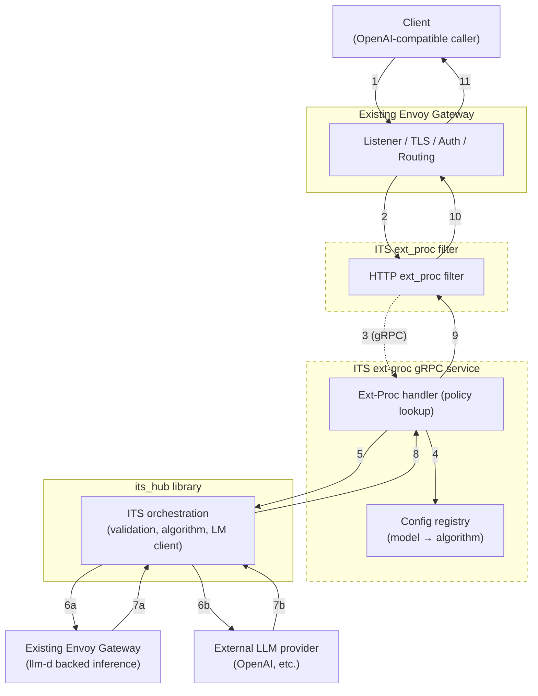

# Inference-Time Scaling Proxy Architecture

## Background
The current MVP (`its_hub/integration/iaas.py`) exposes inference-time scaling (ITS) through an in-process FastAPI server. It keeps algorithm instances (`LM_DICT`, `SCALING_ALG`) as global state, reads a `budget` field from the JSON body, and directly orchestrates ITS loops before proxying responses back in OpenAI format. Reward functions (`its_hub/integration/reward_hub.py`) execute inside the same process and may call local vLLM workers or LLM-as-a-judge endpoints synchronously. While this approach works for experimentation, it lacks production guardrails (auth, rate limiting, circuit breaking, observability) and does not scale horizontally.

As ITS moves toward production, we need a proxy layer that:
- Remains OpenAI-compatible while ingesting ITS-specific metadata from headers (for example, `X-ITS-Budget`, `X-ITS-Alg`, potentialy other parameters).
- Executes ITS algorithms across multiple downstream LLM calls safely, including reward-model scoring that can depend on GPU-heavy models or remote evaluators.
- Leverages industry-proven, lightweight gateways instead of bespoke web servers, so we inherit battle-tested reliability, security, and operational tooling.

Our first production implementation will be built on Envoy with the external processing (ext_proc) filter. Envoy gives us hardened L7 proxy capabilities (mTLS, authentication, rate limiting, retries, circuit breaking, observability) while letting us inject custom logic via a gRPC ext_proc service that can run ITS orchestration. This document lays out that architecture, details the implementation steps, and then surveys alternative gateway options that can host the same ITS logic later.

## Implementation Status

### Current Phase - Proof of Concept
**Location**: `its_hub/integration/iaas.py:1`, `its_hub/integration/reward_hub.py`

**What Works**:
- OpenAI-compatible FastAPI server with `/v1/chat/completions` endpoint
- Support for self-consistency algorithms
- Budget-based inference-time scaling via request body parameter
- Async generation with `OpenAICompatibleLanguageModel` and `LiteLLMLanguageModel`
- Tool calling support for self-consistency algorithm
- Configuration endpoint (`/configure`) for runtime setup

**Current Limitations**:
- Global mutable state (`LM_DICT`, `SCALING_ALG`) prevents multi-tenancy and horizontal scaling
- No authentication, authorization, or API key validation
- No rate limiting or quota enforcement per tenant/user
- No circuit breaking or graceful degradation for upstream failures
- Minimal observability (basic logging only, no metrics or distributed tracing)
- Hardcoded token counting (returns 0 for all usage statistics)
- Single-node deployment model with no failover capability
- Configuration stored in-memory (lost on restart)

### Production Readiness: Phase 1 - Support Self-contained ITS Algorithms (i.e. Self-consistency)

**What We're Building**:
- Stateless ext_proc service
- Envoy-managed TLS termination, and rate limiting
- Distributed tracing (OpenTelemetry), Prometheus metrics, and structured logging
- Circuit breakers, retries with backoff, and timeout enforcement
- Horizontal scaling for ext_proc

### Migration Path

**Step 1: Library Refactoring**
- Extract orchestration logic from `iaas.py` into reusable `ITSOrchestrator` class
- Abstract LM client to support Envoy-backed HTTP calls
- Define configuration schema at Request-level for models

**Step 2: ext_proc Service**
- Implement gRPC external processing service
- Integrate refactored `ITSOrchestrator` with request/response handling
- Add header-based ITS metadata parsing (`X-ITS-Budget`, `X-ITS-Alg`, and etc.)
- Support pass-through mode for non-ITS requests

**Step 3: Standalone Envoy Configuration & Integration**
- Configure listeners and ext_proc filter on a standalone Envoy
- Enable TLS, rate limiting, and circuit breakers
- Set up observability stack (Prometheus, Jaeger/Zipkin, ELK/Loki)

**Step 4: Integration with Inference Gateway**
- Integrate with Envoy Inference Gateway
- Define the order of integration for ITS ext_proc in IGW

**Step 5: Validation & Release Cut**
- Integration testing with IGW
- Load testing for ext_proc and reward service sizing
- Staged rollout with feature flags and traffic mirroring

### High-Level Flow



1. Client sends a standard OpenAI Chat Completions request with additional ITS headers.
2. Envoy based IGW performs front-door auth/rate limiting and invokes the ext_proc filter.
3. ext_proc forwards the request to a dedicated ITS Orchestrator service.
4. The orchestrator reads ITS headers, runs the scaling algorithm using the refactored `its_hub` library, issues multiple LLM calls (via Envoy or direct)
5. Once the orchestrator selects the final response, it returns an OpenAI-compatible payload back to Envoy, which relays it to the client.

### Component Responsibilities
- **Envoy Gateway**: terminates TLS, authenticates, enforces rate/quotas, fuses in observability (access logs, metrics, distributed tracing), applies retries/circuit breaking, and forwards ext_proc gRPC messages.
- **ITS Orchestrator Service**: stateless gRPC service that hosts the refactored ITS algorithms, manages per-request execution (budget enforcement, tool routing, failures), and coordinates reward scoring (TBD) through asynchronous workers.
- **Downstream LLM Connectivity**: either reuse Envoy clusters (preferred) so the orchestrator sends HTTP requests through Envoy, or embed a hardened HTTP client with mTLS and retries if direct access is required.

## Implementation

### 1. Refactor ITS core for gateway integration
1. Extract orchestration logic from `its_hub/integration/iaas.py` into a new module, e.g., `its_hub.integration.orchestrator`.
   - Provide an `ITSOrchestrator` class with methods `configure_model`, `run_chat_completion`, and `shutdown`.
   - Remove FastAPI globals; instead accept explicit dependencies (model registry, algorithm registry, reward client).
2. Replace direct instantiation of `OpenAICompatibleLanguageModel` with a provider interface that can call through Envoy (HTTP client abstraction).
   - Create adapters for streaming vs. non-streaming responses, even if streaming is deferred.
4. Document configuration schema (YAML/JSON) for models, algorithms, budgets; potentially, store in Redis/Postgres or ConfigMap for runtime lookup.

### 2. Build the Envoy ext_proc service
1. Define the gRPC service using Envoy’s `external_processing.proto`. The service must implement:
   - `Process(Request) → Response` for header/body interception.
   - Optional streaming interfaces if we need to inspect chunks (not required for the first iteration).
2. Implement the service in Python (gRPC) or Go (for higher performance). Recommended layout:
   ```
   its_ext_proc/
     server.py              # gRPC server bootstrap
     processor.py           # ExtProc handler class
     orchestrator_client.py # Thin wrapper around ITSOrchestrator
     envoy/
       external_processing.proto
   ```
3. Request handling flow inside `processor.py`:
   - Parse request metadata (method, path, headers). Validate required headers (`X-ITS-Budget`, optional `X-ITS-Alg` and other in request parameters).
   - Read/parse JSON body from `HttpBody` message. Forward to `ITSOrchestrator.run_chat_completion()`.
   - Pass along client headers needed for downstream LLM auth (`Authorization`, `OpenAI-Organization`, etc.). Encode them in the orchestrator request context.
   - Short-circuit if ITS headers are absent: return `CONTINUE` so Envoy forwards request upstream without modification.
   - On ITS execution:
     1. Call orchestrator with budget/algorithm.
     2. Orchestrator issues N LLM calls. Calls should use Envoy cluster by making HTTP requests to `http://envoy-cluster-name/v1/chat/completions` (loop back through Envoy) or by leveraging direct provider clients with built-in retry policies.
     3. Orchestrator invokes evaluation logic; enforce timeouts and fallbacks.
     4. Construct final OpenAI-compatible response JSON.
   - Populate `HttpResponse` with final payload, status 200, and pass headers like `Content-Type: application/json`.
4. Add resilience:
   - Wrap orchestrator calls with deadlines shorter than Envoy timeouts and issues upstream LLM calls concurrently.
   - Map exceptions to appropriate HTTP statuses (`429` for quota exhaustion, `503` for upstream failure, `500` for internal error).
   - Emit structured logs (request id, user, model, algorithm, budget, latency).
5. Package the service (Dockerfile with minimal base, e.g., `python:3.11-slim`). Include health/metrics endpoints (e.g., `/healthz`, `/metrics`) served via aiohttp or Prometheus client.

### 4. Configure Envoy
1. Define clusters:
   - `its_ext_proc` (gRPC) → orchestrator service.
   - `openai_primary` (HTTP) → OpenAI endpoint or upstream gateway.

2. Configure listeners and HTTP connection manager, example
   ```yaml
   static_resources:
     listeners:
       - name: its_listener
         address:
           socket_address: { address: 0.0.0.0, port_value: 8443 }
         filter_chains:
           - filters:
               - name: envoy.filters.network.http_connection_manager
                 typed_config:
                   "@type": type.googleapis.com/envoy.extensions.filters.network.http_connection_manager.v3.HttpConnectionManager
                   stat_prefix: its_hcm
                   route_config:
                     name: default
                     virtual_hosts:
                       - name: its
                         domains: ["*"]
                         routes:
                           - match: { prefix: "/v1/chat/completions" }
                             route:
                               cluster: openai_primary
                               timeout: 30s
                   http_filters:
                     - name: envoy.filters.http.ext_proc
                       typed_config:
                         "@type": type.googleapis.com/envoy.extensions.filters.http.ext_proc.v3.ExternalProcessor
                         grpc_service:
                           envoy_grpc:
                             cluster_name: its_ext_proc
                         processing_mode:
                           request_body_mode: BUFFERED
                           response_body_mode: BUFFERED
                           request_header_mode: SEND
                           response_header_mode: SKIP
                     - name: envoy.filters.http.router
   ```

3. Enable production safeguards:
   - mTLS between Envoy and ext_proc/reward services.
   - Rate limiting via `envoy.filters.http.local_ratelimit` (per API key) plus global rate limits via Redis.
   - Circuit breakers (`max_requests`, `max_connections`) on `openai_primary` and `its_ext_proc`.
   - Retries with backoff on upstream cluster (respect provider limits).

4. Observability:
   - Enable access logs with additional headers (`x-request-id`, `x-its-budget`, `x-its-alg`, and etc.).
   - Emit Prometheus metrics; configure tracing (Zipkin/OTel) for ext_proc interactions.

5. Security:
   - Require API key/JWT validation via `envoy.filters.http.jwt_authn` or ext_authz.
   - Sanitize ITS headers before forwarding to upstream providers to avoid leaking internal metadata.

### 5. Observability, testing, and rollout

1. Integration tests: spin up Envoy + ext_proc in docker-compose; test scenarios (with/without ITS headers, reward timeout, upstream failure).
2. Load testing: simulate concurrent ITS workloads to size ext_proc instances and GPU reward workers.
3. Staging rollout: deploy behind feature flag; mirror production traffic with ITS disabled, validate latency/availability.
4. Cutover: gradually enable ITS per tenant or per API key. Monitor error budgets, fallback to pass-through mode if SLA risk detected.

## ITS Input Arguments Options

ITS orchestration requires configurations, there are two ways we could approach this:
- Using discrete headers
- Argment OpenAI API's Request Body with ITS parameters

### Parameters

A preliminary list of parameters required to run self-contained ITS:
- "Budget": integer for ITS Budget that can be used to scale up compute
- "ITS Algorithm": enum of string to choose ITS Algos, default to Self-consistency
- "API Endpoint": Endpoint to send ITS scaled-up LLM calls to

Integration with reward hub will require additional parameters and comprehensive list is to be determined.


### Headers

- `X-ITS-Budget`
- `X-ITS-Alg`
- `X-ITS-APIEndpoint`

Pro: no request body parsing and minimal changes to the incoming OpenAI API request, streaming support in the future can be easily supported
Con: extending to reward based algorithm will grow the list significantly

### Additional Request Body

Request Body:
```json
{
   ...,
   "its": {
      "budget": 10,
      "alg": "self-consistency",
      "api_endpoint": "https://api.openai.com",
      ...
   },
   ...
}
```

Pro: fully extensible for supporting more complex in request ITS algorithm configurations.
Con: intercepting ITS configuration in request body required. In streamming, implementation might require additional intercepting implementation in gRPC interface. More complex but doable.

## Future Considerations

While Envoy ext_proc is our first target, other open-source gateways can host ITS logic with less custom infrastructure.

### LiteLLM Proxy
- Python-based OpenAI-compatible gateway with built-in auth, rate limiting, provider fallbacks, caching, and Prometheus metrics.
- Integration approach: implement a LiteLLM custom provider or pre-call hook that invokes the refactored `ITSOrchestrator`. Downstream calls reuse LiteLLM’s provider clients, and reward services stay external.
- Pros: minimal glue code, existing ecosystem, straightforward deployment. Cons: Python runtime limits (GIL), need to isolate reward workloads to avoid blocking.

### Helicone Gateway
- Rust gateway focused on analytics and request logging for OpenAI-compatible APIs (Postgres + ClickHouse).
- Integration approach: use Helicone transformers/webhooks to route ITS-specific requests to an orchestrator service that returns responses to Helicone for delivery.
- Pros: strong observability out of the box. Cons: requires external orchestrator for ITS loops; less control over inline request modification.

### Envoy/Kong Front with LiteLLM Core
- Run a managed ingress proxy (Envoy Gateway or Kong) for edge policies while delegating ITS orchestration to LiteLLM behind it.
- Provides layered defense: enterprise ingress features plus Python-based extensibility for ITS logic.

## Open Questions
- Streaming support: ext_proc currently buffers bodies; decide if/when to support streaming completions.
- Reward model isolation: determine acceptable latency/throughput for reward scoring and whether synchronous scoring suffices.
- Configuration management: choose between service discovery (Redis/Postgres) or declarative configs (GitOps) for models, budgets, and tenant overrides.
