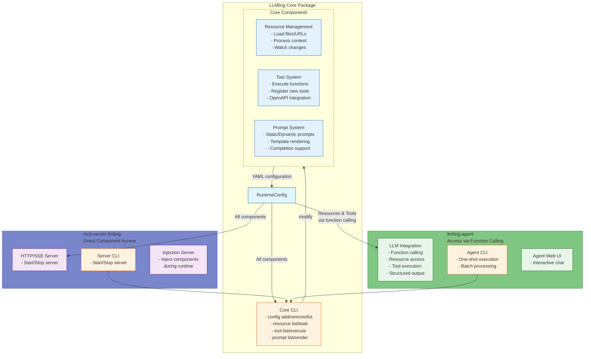

# LLMling

[](https://pypi.org/project/llmling/)
[](https://pypi.org/project/llmling/)
[](https://pypi.org/project/llmling/)
[](https://pypi.org/project/llmling/)
[](https://pypi.org/project/llmling/)
[](https://pypi.org/project/llmling/)
[](https://pypi.org/project/llmling/)
[](https://github.com/phil65/llmling/releases)
[](https://github.com/phil65/llmling/graphs/contributors)
[](https://github.com/phil65/llmling/discussions)
[](https://github.com/phil65/llmling/forks)
[](https://github.com/phil65/llmling/issues)
[](https://github.com/phil65/llmling/pulls)
[](https://github.com/phil65/llmling/watchers)
[](https://github.com/phil65/llmling/stars)
[](https://github.com/phil65/llmling)
[](https://github.com/phil65/llmling/commits)
[](https://github.com/phil65/llmling/releases)
[](https://github.com/phil65/llmling)
[](https://github.com/phil65/llmling)
[](https://codecov.io/gh/phil65/llmling/)
[](https://pyup.io/repos/github/phil65/llmling/)

A framework for declarative LLM application development focused on resource management, prompt templates, and tool execution.

This package provides the backend for two consumers: [A MCP server](https://github.com/phil65/mcp-server-llmling) and [a pydantic-AI based Agent](https://github.com/phil65/llmling-agent)


## Core Concepts

LLMLing provides a YAML-based configuration system for LLM applications.
It allows to set up custom MPC servers serving content defined in YAML files.

- **Static Declaration**: Define your LLM's environment in YAML - no code required
- **MCP Protocol**: Built on the Machine Chat Protocol (MCP) for standardized LLM interaction
- **Component Types**:
  - **Resources**: Content providers (files, text, CLI output, etc.)
  - **Prompts**: Message templates with arguments
  - **Tools**: Python functions callable by the LLM

The YAML configuration creates a complete environment that provides the LLM with:
- Access to content via resources
- Structured prompts for consistent interaction
- Tools for extending capabilities


- Written from ground up in modern python (minimum 3.12 required)
- 100% typed
- pydantic(-ai) based

An overview about the whole system:




## Usage

### 1. CLI Usage

Create a basic configuration file:
```bash
# Create a new config file with basic settings
llmling config init my_config.yml

# Add it to your stored configs
llmling config add myconfig my_config.yml
llmling config set myconfig  # Make it active
```

Basic CLI commands:
```bash
# List available resources
llmling resource list

# Load a resource
llmling resource load python_files

# Execute a tool
llmling tool call open_url url=https://github.com

# Show a prompt
llmling prompt show greet

# Many more commands. The CLI will get extended when installing
# llmling-agent and mcp-server-llmling
```

### 2. Agent Usage (powered by pydantic-AI)

Create a configuration file (`config.yml`):
```yaml
tools:
  open_url:
    import_path: "webbrowser.open"

resources:
  bookmarks:
    type: text
    description: "Common Python URLs"
    content: |
      Python Website: https://python.org
```

Use the agent with this configuration:
```python
from llmling import RuntimeConfig
from llmling_agent import LLMlingAgent
from pydantic import BaseModel

class WebResult(BaseModel):
    opened_url: str
    success: bool

async with RuntimeConfig.open("config.yml") as runtime:
    agent = LLMlingAgent[WebResult](runtime)
    result = await agent.run(
        "Load the bookmarks resource and open the Python website URL"
    )
    print(f"Opened: {result.data.opened_url}")
```

The agent will:
1. Load the bookmarks resource
2. Extract the Python website URL
3. Use the `open_url` tool to open it
4. Return the structured result

### 3. Server Usage

#### With Zed Editor

Add LLMLing as a context server in your `settings.json`:

```json
{
  "context_servers": {
    "llmling": {
      "command": {
        "env": {},
        "label": "llmling",
        "path": "uvx",
        "args": [
          "mcp-server-llmling@latest",
          "start",
          "path/to/your/config.yml",
          "--zed-mode"
        ]
      },
      "settings": {}
    }
  }
}
```

#### With Claude Desktop

Configure LLMLing in your `claude_desktop_config.json`:

```json
{
  "mcpServers": {
    "llmling": {
      "command": "uvx",
      "args": [
        "mcp-server-llmling@latest",
        "start",
        "path/to/your/config.yml"
      ],
      "env": {}
    }
  }
}
```

#### Manual Server Start

Start the server directly from command line:

```bash
# Latest version
uvx mcp-server-llmling@latest start path/to/your/config.yml
```


## Resources

Resources are content providers that load and pre-process data from various sources.

### Basic Resource Types

```yaml
global_config:  # declare dependencies if used for tools or function prompts
  requirements: ["myapp"]
  scripts:
    - "https://gist.githubusercontent.com/.../get_readme.py"


resources:
  # Load and watch a file or directory
  python_files:
    type: path
    path: "./src/**/*.py"  # Glob patterns supported
    watch:  # Optional file watching
      enabled: true
      patterns:
        - "*.py"
        - "!**/__pycache__/**"  # Exclude patterns with !
    processors:  # Optional processing steps
      - name: format_python
      - name: add_header
        required: false  # Optional step

  # Static text content
  system_prompt:
    type: text
    content: |
      You are a code reviewer specialized in Python.
      Focus on these aspects:
      - Code style (PEP8)
      - Best practices
      - Performance
      - Security

  # Execute CLI commands
  git_changes:
    type: cli
    command: "git diff HEAD~1"  # String or list of args
    shell: true  # Use shell for command
    cwd: "./src"  # Optional working directory
    timeout: 5.0  # Optional timeout in seconds

  # Load Python source code
  utils_module:
    type: source
    import_path: myapp.utils
    recursive: true  # Include submodules
    include_tests: false  # Exclude test files

  # Execute Python callables
  system_info:
    type: callable
    import_path: platform.uname
    keyword_args:  # Optional arguments
      aliased: true

```

### Resource Groups

Group related resources for easier access:

```yaml
resource_groups:
  code_review:
    - python_files
    - git_changes
    - system_prompt

  documentation:
    - architecture
    - utils_module
```

### File Watching

Resources supporting file watching (`path`, `image`) can be configured to detect changes:

```yaml
resources:
  config_files:
    type: path
    path: "./config"
    watch:
      enabled: true
      patterns:  # .gitignore style patterns
        - "*.yml"
        - "*.yaml"
        - "!.private/**"  # Exclude private files
      ignore_file: ".gitignore"  # Use existing ignore file
```

### Resource Processing

Resources can be processed through a pipeline of processors:

```yaml
# First define processors
context_processors:
  uppercase:
    type: function
    import_path: myapp.processors.to_upper
    async_execution: false  # Sync function

# Then use them in resources
resources:
  processed_file:
    type: path
    path: "./input.txt"
    processors:
      - name: uppercase
```

## Prompts

Prompts are message templates that can be formatted with arguments. LLMLing supports both declarative YAML prompts and function-based prompts.

### YAML-Based Prompts

```yaml
prompts:
  code_review:
    description: "Review Python code changes"
    messages:
      - role: system
        content: |
          You are a Python code reviewer. Focus on:
          - Code style (PEP8)
          - Best practices
          - Performance
          - Security

          Always structure your review as:
          1. Summary
          2. Issues Found
          3. Suggestions

      - role: user
        content: |
          Review the following code changes:

          {code}

          Focus areas: {focus_areas}

    arguments:
      - name: code
        description: "Code to review"
        required: true
      - name: focus_areas
        description: "Specific areas to focus on (one of: style, security, performance)"
        required: false
        default: "style"
```

### Function-Based Prompts

Function-based prompts provide more control and enable auto-completion:

```yaml
prompts:
  analyze_code:
    # Import path to the prompt function
    import_path: myapp.prompts.code_analysis
    # Optional overrides
    name: "Code Analysis"
    description: "Analyze Python code structure and complexity"
    # Optional message template override
    template: |
      Analyze this code: {code}
      Focus on: {focus}
    # Auto-completion functions for arguments
    completions:
      focus: myapp.prompts.get_analysis_focus_options
```

```python
# myapp/prompts/code_analysis.py
from typing import Literal

FocusArea = Literal["complexity", "dependencies", "typing"]

def code_analysis(
    code: str,
    focus: FocusArea = "complexity",
    include_metrics: bool = True
) -> list[dict[str, str]]:
    """Analyze Python code structure and complexity.

    Args:
        code: Python source code to analyze
        focus: Analysis focus area (one of: complexity, dependencies, typing)
        include_metrics: Whether to include numeric metrics
    """
    # Function will be converted to a prompt automatically
    ...

def get_analysis_focus_options(current: str) -> list[str]:
    """Provide auto-completion for focus argument."""
    options = ["complexity", "dependencies", "typing"]
    return [opt for opt in options if opt.startswith(current)]
```

### Message Content Types

Prompts support different content types:

```yaml
prompts:
  document_review:
    messages:
      # Text content
      - role: system
        content: "You are a document reviewer..."

      # Resource reference
      - role: user
        content:
          type: resource
          content: "document://main.pdf"
          alt_text: "Main document content"

      # Image content
      - role: user
        content:
          type: image_url
          content: "https://example.com/diagram.png"
          alt_text: "System architecture diagram"
```

### Argument Validation

Prompts validate arguments before formatting:

```yaml
prompts:
  analyze:
    messages:
      - role: user
        content: "Analyze with level {level}"

    arguments:
      - name: level
        description: "Analysis depth (one of: basic, detailed, full)"
        required: true
        # Will be used for validation and auto-completion
        type_hint: Literal["basic", "detailed", "full"]
```

## Tools

Tools are Python functions or classes that can be called by the LLM. They provide a safe way to extend the LLM's capabilities with custom functionality.

### Basic Tool Configuration

```yaml
tools:
  # Function-based tool
  analyze_code:
    import_path: myapp.tools.code.analyze
    description: "Analyze Python code structure and metrics"

  # Class-based tool
  browser:
    import_path: llmling.tools.browser.BrowserTool
    description: "Control web browser for research"

  # Override tool name
  code_metrics:
    import_path: myapp.tools.analyze_complexity
    name: "Analyze Code Complexity"
    description: "Calculate code complexity metrics"

# Include pre-built tool collections
toolsets:
  - llmling.code  # Code analysis tools
  - llmling.web   # Web/browser tools
```

## Toolsets

Toolsets are, like the name says, a collection of tools. Right now LLMling supports:

- Extension point system
- OpenAPI endpoints
- class-based toolsets

### Function-Based Tools

Tools can be created from any Python function:

```python
# myapp/tools/code.py
from typing import Any
import ast

async def analyze(
    code: str,
    include_metrics: bool = True
) -> dict[str, Any]:
    """Analyze Python code structure and complexity.

    Args:
        code: Python source code to analyze
        include_metrics: Whether to include numeric metrics

    Returns:
        Dictionary with analysis results
    """
    tree = ast.parse(code)
    return {
        "classes": len([n for n in ast.walk(tree) if isinstance(n, ast.ClassDef)]),
        "functions": len([n for n in ast.walk(tree) if isinstance(n, ast.FunctionDef)]),
        "complexity": _calculate_complexity(tree) if include_metrics else None
    }
```

### Class-Based Tools

Complex tools can be implemented as classes:

```python
# myapp/tools/browser.py
from typing import Literal
from playwright.async_api import Page
from llmling.tools.base import BaseTool

class BrowserTool(BaseTool):
    """Tool for web browser automation."""

    name = "browser"
    description = "Control web browser to navigate and interact with web pages"

    ...

    def get_tools(self):
        return [self.open_url, self.click_button]
```

### Tool Collections (Toolsets)

Group related tools into reusable collections:

```python
# myapp/toolsets.py
from typing import Callable, Any

def get_mcp_tools() -> list[Callable[..., Any]]:
    """Entry point exposing tools to LLMling."""
    from myapp.tools import (
        analyze_code,
        check_style,
        count_tokens
    )
    return [
        analyze_code,
        check_style,
        count_tokens
    ]
```

In pyproject.toml:

```toml
[project.entry-points.llmling]
tools = "llmling.testing:get_mcp_tools"
```

### Tool Progress Reporting

Tools can report progress to the client:

```python
from llmling.tools.base import BaseTool

class AnalysisTool(BaseTool):
    name = "analyze"
    description = "Analyze large codebase"

    async def execute(
        self,
        path: str,
        _meta: dict[str, Any] | None = None,  # Progress tracking
    ) -> dict[str, Any]:
        files = list(Path(path).glob("**/*.py"))
        results = []

        for i, file in enumerate(files):
            # Report progress if meta information provided
            if _meta and "progressToken" in _meta:
                self.notify_progress(
                    token=_meta["progressToken"],
                    progress=i,
                    total=len(files),
                    description=f"Analyzing {file.name}"
                )

            results.append(await self._analyze_file(file))

        return {"results": results}
```

### Complete Tool Example

Here's a complete example combining multiple tool features:

```yaml
# Configuration
tools:
  # Basic function tool
  analyze:
    import_path: myapp.tools.code.analyze

  # Class-based tool with lifecycle
  browser:
    import_path: myapp.tools.browser.BrowserTool

  # Tool with progress reporting
  batch_analysis:
    import_path: myapp.tools.AnalysisTool

toolsets:
  - llmling.code
  - myapp.tools
```

```python
# Tool implementation
from typing import Any
from pathlib import Path
from llmling.tools.base import BaseTool

class AnalysisTool(BaseTool):
    """Tool for batch code analysis with progress reporting."""

    name = "batch_analysis"
    description = "Analyze multiple Python files"

    async def startup(self) -> None:
        """Initialize analysis engine."""
        self.analyzer = await self._create_analyzer()

    async def execute(
        self,
        path: str,
        recursive: bool = True,
        _meta: dict[str, Any] | None = None
    ) -> dict[str, Any]:
        """Execute batch analysis.

        Args:
            path: Directory to analyze
            recursive: Whether to analyze subdirectories
            _meta: Optional progress tracking metadata
        """
        files = list(Path(path).glob("**/*.py" if recursive else "*.py"))
        results = []

        for i, file in enumerate(files, 1):
            # Report progress
            if _meta and "progressToken" in _meta:
                self.notify_progress(
                    token=_meta["progressToken"],
                    progress=i,
                    total=len(files),
                    description=f"Analyzing {file.name}"
                )

            # Analyze file
            try:
                result = await self.analyzer.analyze_file(file)
                results.append({
                    "file": str(file),
                    "metrics": result
                })
            except Exception as e:
                results.append({
                    "file": str(file),
                    "error": str(e)
                })

        return {
            "total_files": len(files),
            "successful": len([r for r in results if "metrics" in r]),
            "failed": len([r for r in results if "error" in r]),
            "results": results
        }

    async def shutdown(self) -> None:
        """Clean up analysis engine."""
        await self.analyzer.close()
```

More: (ATTENTION: THESE ARE MOSTLY AI GENERATED AND OUTDATED, NO GUARANTEE FOR CORRECTNESS)
[introduction](https://github.com/phil65/LLMling/blob/main/docs/introduction.md)
[quick_example](https://github.com/phil65/LLMling/blob/main/docs/quick_example.md)
[usage](https://github.com/phil65/LLMling/blob/main/docs/usage.md)
[yaml_config](https://github.com/phil65/LLMling/blob/main/docs/yaml_config.md)
[CLI](https://github.com/phil65/LLMling/blob/main/docs/cli.md)

[resources](https://github.com/phil65/LLMling/blob/main/docs/resources.md)
[prompts](https://github.com/phil65/LLMling/blob/main/docs/prompts.md)
[tools](https://github.com/phil65/LLMling/blob/main/docs/tools.md)
[server](https://github.com/phil65/LLMling/blob/main/docs/server.md)
[extending](https://github.com/phil65/LLMling/blob/main/docs/extending.md)
