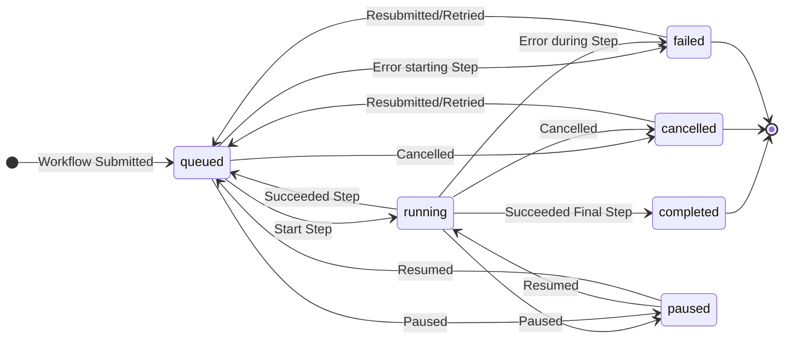

# MADSci Workcell Manager

The MADSci Workcell Manager handles the operation of a **Workcell**, a collection of **Nodes**, **Locations**, and **Resources** that are scheduled together to perform **Workflows**. A lab may consist of multiple Workcells, with each Workcell able to execute workflows independently.


## Installation

See the main [README](../../README.md#installation) for installation options. This package is available as:
- PyPI: `pip install madsci.workcell_manager`
- Docker: Included in `ghcr.io/ad-sdl/madsci`
- **Example configuration**: See [example_lab/managers/example_workcell.manager.yaml](../../example_lab/managers/example_workcell.manager.yaml)

**Dependencies**: MongoDB and Redis (see [example docker-compose](./workcell_manager.compose.yaml) or [example_lab](../../example_lab/))

## Usage

### Quick Start

Use the [example_lab](../../example_lab/) as a starting point:

```bash
# Start with working example
docker compose up  # From repo root
# Workcell Manager available at http://localhost:8005/docs

# Or run standalone
python -m madsci.workcell_manager.workcell_server
```

### Workcell Setup

For custom deployments:

```bash
# Create a Workcell Definition
madsci workcell create
```

See [example_workcell.manager.yaml](../../example_lab/managers/example_workcell.manager.yaml) for configuration options.

### Workcell Client

Use `WorkcellClient` to submit workflows and manage workcell operations:

```python
from madsci.client.workcell_client import WorkcellClient

workcell_client = WorkcellClient("http://localhost:8005")

# Submit workflow from file (recommended)
workflow = workcell_client.submit_workflow(
    workflow="path/to/workflow.yaml",
    json_inputs={"test_param": 10},
    file_inputs={"input_file": "./data.csv"}
)

# Access workflow results with helper methods
# Get datapoint ID from a specific step
datapoint_id = workflow.get_datapoint_id("analysis_step")

# Get full datapoint object from a specific step
datapoint = workflow.get_datapoint("analysis_step")

# Or create workflow programmatically
from madsci.common.types.workflow_types import WorkflowDefinition
from madsci.common.types.step_types import StepDefinition

wf_def = WorkflowDefinition(
    name="Test Workflow",
    parameters=[{"name": "test_param", "default": 0}],
    steps=[StepDefinition(
        name="Test Step",
        node="liquidhandler_1",  # Must exist in workcell
        action="test_action",
        args={"test_arg": "${test_param}"}
    )]
)
workflow = workcell_client.submit_workflow(workflow=wf_def)

# Query workflow status
status = workcell_client.query_workflow(workflow.workflow_id)
```

**Example workflows**: See [example_lab/workflows/](../../example_lab/workflows/) for complete workflow definitions.

**Workflow Result Access:**
```python
# Submit workflow and access results (await_completion=True by default)
workflow = workcell_client.submit_workflow("analysis.workflow.yaml")

# Or submit without waiting and poll status
workflow = workcell_client.submit_workflow("analysis.workflow.yaml", await_completion=False)
while not workflow.status.terminal:
    workflow = workcell_client.query_workflow(workflow.workflow_id)
    time.sleep(1)

# Access step results efficiently
analysis_datapoint_id = workflow.get_datapoint_id("analysis_step")
analysis_result = workflow.get_datapoint("analysis_step")

# Results are automatically validated and properly typed
if analysis_result.datapoint_type == "value":
    data = analysis_result.value  # Direct access to result data
elif analysis_result.datapoint_type == "file":
    file_path = analysis_result.file_path  # Access to result files
```

## Defining a Workcell

You can create a new `WorkcellDefinition` file (typically a `.workcell.yaml`) using the command `madsci workcell create`

### Nodes

Nodes are required to execute the action required by each step in a Workflow. Each Node typically corresponds to a physical device (robot, instrument, sensor, etc.) in your laboratory.

In the workcell definition files `nodes` section, you can specify each node avaiable in the workcell as a mapping of node alias to the node's URL. When specifying the node to execute a step on in a Workflow, you should use the node alias defined here, rather than the node name according to the node itself.

### Locations

You can define important locations in your workcell, optionally linking them to container resources, using the `locations` list. This top-level element of the `WorkcellDefinition` allows you to provide a list of `LocationDefinition` objects, which have the following important properties:

- A `location_name` and `location_id` to idenitfy the location
- A `reference` dictionary, which maps node names to representations of the location relevant to that node.
- Optionally, a `resource_id` or `resource_definition` for the container resource that you want the location to be attached to.

## Defining Workflows

MADSci Workcell Managers accept `WorkflowDefinition`s, which define a sequence of steps to be run on a Workcell. Each step represents an Action to be taken by a Node.

Workflows can either be directly created as python objects, or defined as YAML files (typically with the `.workflow.yaml` extension) which are then read, validated, and submitted by the workcell client.

**Enhanced Features:**
- **Flexible data handling**: Support for JSON inputs, file uploads, and complex parameter types
- **Result validation**: Automatic validation of step results and datapoint creation
- **Helper methods**: Convenient access to step results via `get_datapoint()` and `get_datapoint_id()`
- **Error handling**: Improved error reporting and workflow recovery mechanisms
- **Type safety**: Full validation of workflow parameters and step arguments

### Steps

The `steps` list allows you to specify a sequence of `StepDefinition`s, which are evaluated by the Workcell Manager's Scheduler and executed when able.

A step has the following important properties:

- `name`: the human-readable name of the step
- `description`: optional, a longer/more-detailed description of the step
- `node`: the name of the node used to perform this step. This must match the name of a node in the workcell definition (so if the node's name and the alias used by the workcell differ, use the workcell's version)
- `action`: the name of the action to be performed (must match an action provided by the node)
- `args`: a dictionary of argument names and values to pass to the node when executing the action
- `files`: a dictionary of file argument names and paths to upload to the node when executing the action
- `locations`: any locations to be passed to the node as arguments. Note that this will send _just the representation relevant to that node_, so the workcell's `LocationDefinition` must include a reference value matching the node name.
- `conditions`: a list of user-specified conditions that must be met before this step can be run.
- `data_labels`: allows you to attach unique labels to datapoints returned as part of the action results.

**Enhanced Result Handling:**
Steps now support flexible return types from nodes, including direct JSON data, datapoint IDs, file paths, and custom Pydantic models. The workcell engine automatically handles serialization and provides convenient access methods for retrieving results.

### Parameters

You can, optionally, specify `WorkflowParameter`s in the `parameters` field of a workflow. These consist of a `name` and, optionally, a `default` value. When submitting a workflow, you can specify values for these parameters to be used in the workflow.

You can use a workflow parameter's value in a workflow definition with the following syntax:

- `${parameter_name}`
- `$parameter_name`

If a parameter has no default value and a value is not provided when the workflow is submitted, an exception is thrown.

## Workflow Lifecycle

The below state diagrams illustrates the evolution of a Workflow's status over the course of it's life, from submission to reaching a terminal state.


