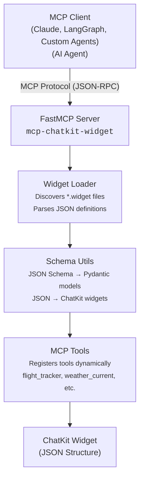

# ChatKit Widget MCP Server

[](https://github.com/ShaojieJiang/mcp-chatkit-widget/actions/workflows/ci.yml?query=branch%3Amain)
[](https://coverage-badge.samuelcolvin.workers.dev/redirect/ShaojieJiang/mcp-chatkit-widget)
[](https://pypi.python.org/pypi/mcp-chatkit-widget)
[](https://www.python.org/downloads/)

A Model Context Protocol (MCP) server that **automatically** transforms ChatKit Studio widget definitions into callable MCP tools, enabling AI agents to dynamically generate rich, interactive UI components that can be rendered in the ChatKit UI.


## Purpose

`mcp-chatkit-widget` bridges the gap between static UI component definitions and runtime tool invocation for AI agents. It automatically converts [ChatKit Studio](https://chatkit.studio/) `.widget` files into MCP tools that agents can call to generate interactive widgets.

### Key Features

- **Automatic Tool Generation**: Converts every `.widget` file into an MCP tool with type-safe input validation
- **Dynamic Schema Conversion**: Transforms JSON Schema definitions into Pydantic models for runtime validation
- **Template Rendering**: Uses Jinja2 to render widget templates with validated data
- **Rich Widget Library**: Includes 16 pre-built widgets from ChatKit Studio's gallery (flight tracker, weather, email composer, etc.), extendable with custom widgets
- **Type Safety**: Full type annotations and validation using Pydantic v2
- **Zero Configuration**: Works out of the box with included widget definitions

### How It Works

1. **Widget Discovery**: Scans `.widget` files from the `widgets/` directory and user-specified directory through the `CUSTOM_WIDGETS_DIR` environment variable
2. **Schema Parsing**: Extracts JSON Schema and Jinja2 templates from widget definitions
3. **Model Generation**: Creates dynamic Pydantic models for input validation
4. **Tool Registration**: Registers MCP tools with FastMCP server
5. **Runtime Execution**: Validates inputs, renders templates, and returns ChatKit widget components

## Installation

### From PyPI

```bash
uv add mcp-chatkit-widget
```

### From Source (Development)

```bash
# Clone the repository
git clone https://github.com/ShaojieJiang/mcp-chatkit-widget.git
cd mcp-chatkit-widget

# Install with uv (recommended)
uv sync --all-groups

# Or with pip
pip install -e ".[dev,docs]"
```

### Requirements

- Python 3.12 or higher
- [FastMCP](https://github.com/jlowin/fastmcp) >= 2.13.0.2
- [OpenAI ChatKit](https://pypi.org/project/openai-chatkit/) >= 1.1.0

## Usage

### Running the MCP Server

Start the server using the provided console script:

```bash
mcp-chatkit-widget
```

Or run as a Python module:

```bash
python -m mcp_chatkit_widget
```

### Integrating with MCP Clients

#### Claude Desktop

Add the server to your Claude Desktop configuration (`claude_desktop_config.json`):

```json
{
  "mcpServers": {
    "chatkit-widget": {
      "command": "/path/to/uvx",
      "args": ["--from", "mcp-chatkit-widget@latest", "mcp-chatkit-widget"]
    }
  }
}
```

#### LangGraph Agents

```python
from langgraph.prebuilt import create_react_agent
from mcp import ClientSession, StdioServerParameters
from mcp.client.stdio import stdio_client

# Connect to the MCP server
server_params = StdioServerParameters(
    command="mcp-chatkit-widget",
    args=[]
)

async with stdio_client(server_params) as (read, write):
    async with ClientSession(read, write) as session:
        # Initialize session
        await session.initialize()

        # List available tools
        tools_result = await session.list_tools()
        print(f"Available widgets: {[tool.name for tool in tools_result.tools]}")

        # Create agent with widget tools
        agent = create_react_agent(model, tools=tools_result.tools)
```

#### Direct Tool Invocation

```python
from mcp_chatkit_widget.server import server

# Example: Generate a flight tracker widget
flight_widget = server.call_tool(
    "flight_tracker",
    arguments={
        "number": "PA 845",
        "date": "Fri, Apr 25",
        "progress": "60",
        "airline": {
            "name": "Pan American Airways",
            "logo": "/panam_logo.png"
        },
        "departure": {
            "airport": "SFO",
            "city": "San Francisco",
            "time": "10:30 AM"
        },
        "arrival": {
            "airport": "JFK",
            "city": "New York",
            "time": "7:45 PM"
        }
    }
)

# `result.content[0].text` is the JSON string of the ChatKit WidgetComponentBase instance
print(result.content[0].text)
```

### Reconstructing the widget

Once you have the JSON string, you can reconstruct the widget as a Python object for [streaming to the ChatKit UI](https://platform.openai.com/docs/guides/custom-chatkit#add-inline-interactive-widgets).

```python
from mcp_chatkit_widget.schema_utils import json_schema_to_chatkit_widget

card_widget = json_schema_to_chatkit_widget(result.content[0].text, widget_name)
# `card_widget` is a ChatKit WidgetComponentBase instance
```

### Available Widgets

The server includes 16 pre-built widgets:

- **Communication**: Channel Message, Draft Email
- **Travel**: Flight Tracker, Ride Status
- **Events**: Create Event, View Event, Event Session
- **Tasks**: Create Task, Enable Notification
- **Entertainment**: Player Card, Playlist
- **Weather**: Weather Current, Weather Forecast
- **Shopping**: Purchase Complete, Software Purchase, Purchase Items

Each widget automatically becomes an MCP tool named in `snake_case` (e.g., "Flight Tracker" → `flight_tracker`).

### Adding Custom Widgets

1. Export a `.widget` file from [ChatKit Studio](https://chatkit.openai.com/)
2. Copy it to `mcp_chatkit_widget/widgets/`
3. Restart the MCP server

The widget will automatically be discovered and registered as a new tool.

Alternatively, point the server at your own widget directory by setting
`CUSTOM_WIDGETS_DIR` before starting the process (supports multiple directories
separated by `:` on Unix-like systems):

```bash
export CUSTOM_WIDGETS_DIR="/path/to/my/widgets"
mcp-chatkit-widget
```

## Architecture



### Data Flow

1. **Startup**: Server discovers all `.widget` files
2. **Registration**: Each widget becomes an MCP tool with validated schema
3. **Invocation**: Agent calls tool with parameters
4. **Validation**: Pydantic model validates input data
5. **Rendering**: Jinja2 template renders with validated data
6. **Construction**: JSON parsed into ChatKit widget components
7. **Return**: Widget instance sent back to agent

## Development

### Running Tests

```bash
# Run all tests with coverage
make test

# Run specific test file
pytest tests/test_server.py

# Run with verbose output
pytest -v tests/
```

### Code Quality

```bash
# Run linting and type checking
make lint

# Auto-format code
make format

# Type check only
mypy mcp_chatkit_widget/
```

### Building Documentation

```bash
# Serve documentation locally
make doc

# Documentation will be available at http://0.0.0.0:8080
```

## Project Structure

```
mcp-chatkit-widget/
├── mcp_chatkit_widget/
│   ├── __init__.py          # Package entry point
│   ├── server.py            # FastMCP server implementation
│   ├── widget_loader.py     # Widget discovery and parsing
│   ├── schema_utils.py      # Schema conversion utilities
│   └── widgets/             # Widget definition files
│       ├── Flight Tracker.widget
│       ├── weatherCurrent.widget
│       ├── draftEmail.widget
│       └── ... (16+ widgets)
├── tests/                   # Test suite
├── docs/                    # Documentation
├── examples/                # Example integrations
├── pyproject.toml           # Project configuration
└── README.md
```

## Contributing

Contributions are welcome! Please:

1. Fork the repository
2. Create a feature branch (`git checkout -b feature/amazing-feature`)
3. Run tests and linting (`make test && make lint`)
4. Commit your changes (`git commit -m 'Add amazing feature'`)
5. Push to the branch (`git push origin feature/amazing-feature`)
6. Open a Pull Request

## License

This project is licensed under the MIT License - see the [LICENSE.txt](LICENSE.txt) file for details.

## Resources

- [ChatKit Studio](https://chatkit.studio/) - Create and export widget definitions
- [Model Context Protocol](https://modelcontextprotocol.io/) - MCP specification
- [FastMCP](https://github.com/jlowin/fastmcp) - High-level MCP server framework
- [OpenAI ChatKit Python SDK](https://pypi.org/project/openai-chatkit/) - Widget component library

## Support

- **Issues**: [GitHub Issues](https://github.com/ShaojieJiang/mcp-chatkit-widget/issues)
- **Documentation**: [docs/](docs/)
