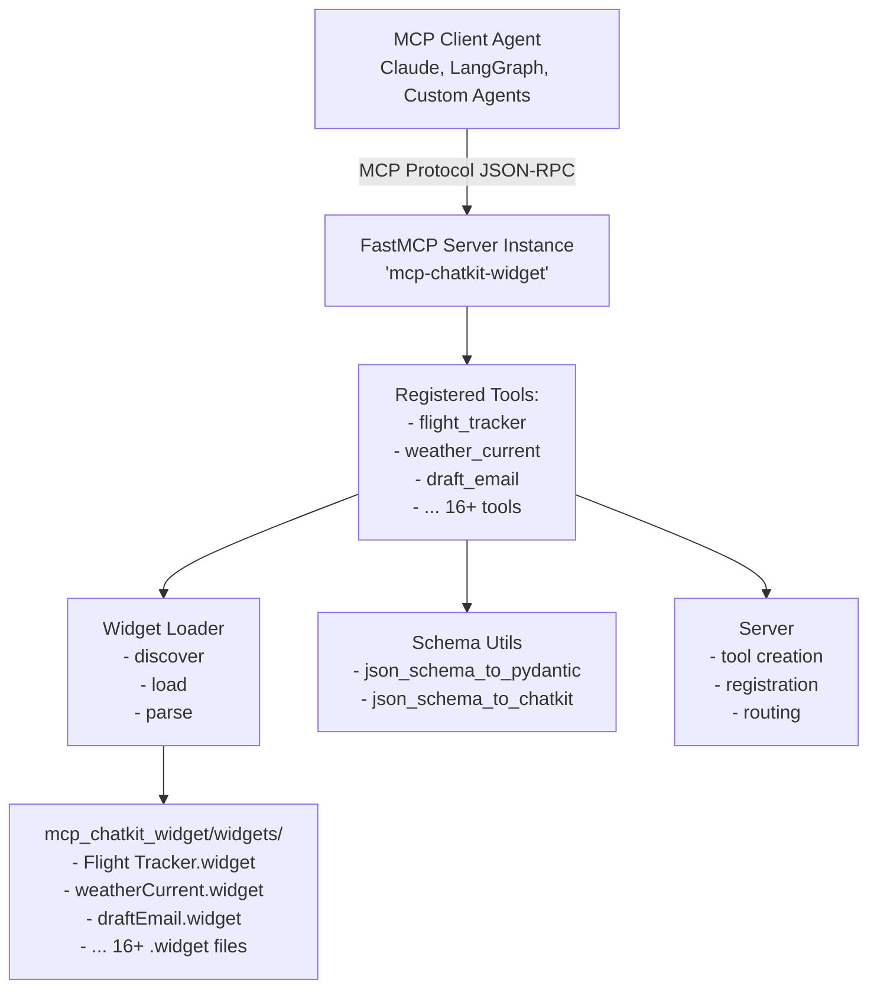
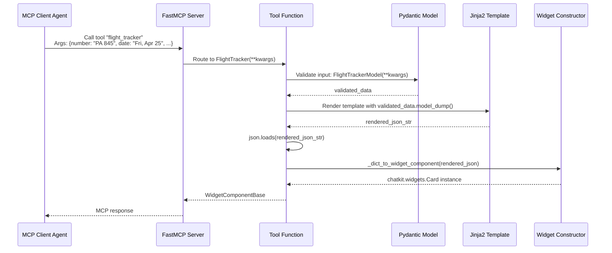

# Design Document

## Project: mcp-chatkit-widget

### Version: 0.1.0

---

## Overview

`mcp-chatkit-widget` is an MCP (Model Context Protocol) server that dynamically generates MCP tools from ChatKit Studio widget definition files. It bridges the gap between static UI component definitions and runtime tool invocation, enabling AI agents to generate rich, interactive widgets programmatically.

## Architecture

### High-Level Design



### Component Breakdown

#### 1. Widget Loader (`widget_loader.py`)

**Purpose:** File system interaction and widget definition parsing.

**Key Data Structures:**
```python
@dataclass
class WidgetDefinition:
    name: str                          # "Flight Tracker"
    version: str                       # "1.0"
    json_schema: dict[str, Any]       # JSON Schema for inputs
    output_json_preview: dict[str, Any]  # Example output
    template: str                      # Jinja2 template
    encoded_widget: str | None        # Base64 encoded (optional)
    file_path: Path                   # Source file path
```

**Functions:**
- `discover_widgets(widgets_dir: Path | None = None) -> list[WidgetDefinition]`
  - Scans directory for `*.widget` files
  - Default: `mcp_chatkit_widget/widgets/`
  - Returns list of parsed widget definitions
  - Continues on individual widget errors (with warnings)

- `load_widget(widget_path: Path) -> WidgetDefinition`
  - Parses single `.widget` JSON file
  - Validates required fields: `name`, `version`, `jsonSchema`, `outputJsonPreview`, `template`
  - Raises `ValueError` on missing fields or invalid JSON

- `get_widget_by_name(name: str, widgets_dir: Path | None = None) -> WidgetDefinition | None`
  - Convenience method for retrieving specific widget
  - Returns `None` if not found

**Error Handling:**
- Invalid JSON: Raises `json.JSONDecodeError`
- Missing required fields: Raises `ValueError` with details
- Directory not found: Raises `ValueError`
- Individual widget errors during discovery: Prints warning, continues

---

#### 2. Schema Utilities (`schema_utils.py`)

**Purpose:** Dynamic schema transformation and widget construction.

##### 2.1 Pydantic Model Generation

**Function:** `json_schema_to_pydantic(schema: dict, model_name: str, schema_title: str | None) -> type[BaseModel]`

**Algorithm:**
1. Validate root schema is type "object"
2. Extract `properties` and `required` fields
3. For each property:
   - Map JSON type to Python type via `type_map`
   - Handle nested objects recursively
   - Handle arrays as `list[Any]` (TODO: typed arrays)
   - Mark field as optional if not in `required` list
4. Create dynamic model with `pydantic.create_model()`
5. Set custom schema title if provided

**Type Mapping:**
```python
type_map = {
    "string": str,
    "integer": int,
    "number": float,
    "boolean": bool,
    "array": list,
    "object": dict,
}
```

**Nested Objects:**
- Recursively generate sub-models
- Naming convention: `{ParentModel}{FieldNameTitleCase}`
- Example: `FlightTrackerModel` + `airline` → `FlightTrackerModelAirline`

**Optional Fields:**
- Not in `required` list → `field_type | None` with default `None`
- In `required` list → `field_type` with `...` (required marker)

##### 2.2 ChatKit Widget Construction

**Function:** `json_schema_to_chatkit_widget(output_json_preview: dict, widget_name: str) -> WidgetComponentBase`

Wrapper for `_dict_to_widget_component()` that initiates recursive widget construction.

**Function:** `_dict_to_widget_component(component_dict: dict) -> WidgetComponentBase`

**Algorithm:**
1. Extract `type` field from dictionary
2. Look up component class from `component_class_map`
3. Extract all properties except `type`
4. Recursively process `children` list if present
5. Instantiate widget class with properties

**Component Class Map:**
Maps type strings to `chatkit.widgets` classes:
- Layout: `Card`, `Row`, `Col`, `Box`
- Typography: `Text`, `Title`, `Caption`, `Markdown`
- Media: `Image`, `Icon`
- Interactive: `Button`, `Input`, `Textarea`, `Select`, `Checkbox`, `RadioGroup`, `DatePicker`, `Form`
- Utility: `Spacer`, `Divider`, `Badge`
- Advanced: `ListView`, `Transition`, `Chart`

**Error Handling:**
- Missing `type`: Raises `ValueError`
- Unknown component type: Raises `ValueError` with type name

---

#### 3. MCP Server (`server.py`)

**Purpose:** FastMCP server initialization and dynamic tool registration.

##### 3.1 Server Initialization

```python
server = FastMCP("mcp-chatkit-widget")
```

- Creates FastMCP server instance
- Registered on module import
- Entry point: `mcp-chatkit-widget` console script → `main()`

##### 3.2 Name Transformation

**Function:** `_sanitize_tool_name(widget_name: str) -> str`

Converts widget names to valid Python identifiers:
- Lowercase conversion
- Spaces/hyphens → underscores
- Remove non-alphanumeric (except underscores)
- Prefix with `_` if starts with digit

Examples:
- "Flight Tracker" → "flight_tracker"
- "Create Task" → "create_task"
- "123 Test" → "_123_test"

**Function:** `_to_camel_case(snake_str: str) -> str`

Converts snake_case to CamelCase for class names:
- "flight_tracker" → "FlightTracker"
- "weather_current" → "WeatherCurrent"

##### 3.3 Tool Function Generation

**Function:** `_create_widget_tool_function(widget_name: str, pydantic_model: type[BaseModel], template_str: str) -> Any`

**Generated Function Structure:**
```python
def widget_tool(**kwargs: Any) -> WidgetComponentBase:
    # 1. Validate input
    validated_data = pydantic_model(**kwargs)

    # 2. Render Jinja2 template
    template = Template(template_str)
    render_context = validated_data.model_dump()
    render_context["undefined"] = None  # Jinja2 compatibility
    rendered_json_str = template.render(**render_context)

    # 3. Parse and convert to widget
    rendered_json = json.loads(rendered_json_str)
    widget = json_schema_to_chatkit_widget(rendered_json, widget_name)

    return widget
```

**Function Metadata:**
- `__name__`: CamelCase version of widget name (e.g., "FlightTracker")
- `__doc__`: Generated docstring with widget description
- `__signature__`: Dynamic signature with individual parameters (not wrapper object)
- `__annotations__`: Type hints for all parameters

**Signature Generation:**
- Creates `inspect.Parameter` for each Pydantic model field
- `KEYWORD_ONLY` parameters
- Default value: `inspect.Parameter.empty` for required, field default for optional
- Return annotation: `WidgetComponentBase`

##### 3.4 Tool Registration

**Function:** `register_widget_tools() -> None`

**Workflow:**
1. Call `discover_widgets()` to find all `.widget` files
2. For each widget:
   a. Generate CamelCase model name: `{WidgetName}Model`
   b. Generate CamelCase schema title: `{WidgetName}Arguments`
   c. Convert JSON schema to Pydantic model
   d. Create tool function with proper signature
   e. Register with FastMCP using snake_case tool name
3. Called automatically on module import

**Registration:**
```python
server.tool(name=tool_name)(tool_func)
```
- `tool_name`: snake_case (e.g., "flight_tracker")
- `tool_func`: Generated function with CamelCase name

---

## Data Flow

### Complete Request Flow



### Example: Flight Tracker Widget

**Input `.widget` File:**
```json
{
  "name": "Flight Tracker",
  "version": "1.0",
  "jsonSchema": {
    "type": "object",
    "properties": {
      "number": {"type": "string"},
      "airline": {
        "type": "object",
        "properties": {
          "name": {"type": "string"},
          "logo": {"type": "string"}
        },
        "required": ["name", "logo"]
      }
    },
    "required": ["number", "airline"]
  },
  "template": "{\"type\":\"Card\", \"children\":[...]}"
}
```

**Generated Pydantic Models:**
```python
class FlightTrackerModelAirline(BaseModel):
    name: str
    logo: str

class FlightTrackerModel(BaseModel):
    number: str
    airline: FlightTrackerModelAirline
```

**Generated Tool:**
```python
@server.tool(name="flight_tracker")
def FlightTracker(
    number: str,
    airline: FlightTrackerModelAirline,
) -> WidgetComponentBase:
    """Generate a Flight Tracker widget.

    This tool creates a Flight Tracker widget with the provided data.
    The input must conform to the widget's JSON schema.
    """
    # Implementation...
```

**Tool Invocation:**
```python
result = FlightTracker(
    number="PA 845",
    airline={"name": "Pan American", "logo": "/panam.png"}
)
# Returns: chatkit.widgets.Card instance
```

---

## Design Decisions

### 1. Why FastMCP?

**Rationale:**
- High-level abstraction over MCP protocol
- Automatic JSON-RPC handling
- Built-in tool registration decorators
- Type-safe tool definitions

**Alternatives Considered:**
- Raw MCP SDK: Too low-level, requires manual protocol implementation
- Custom framework: Unnecessary complexity, FastMCP provides needed features

### 2. Why Jinja2 Templates?

**Rationale:**
- Widget definitions contain template strings from ChatKit Studio
- Jinja2 provides variable interpolation with `{{ }}` syntax
- Compatible with existing `.widget` format
- Supports filters like `tojson` for proper JSON serialization

**Template Example:**
```json
{"type":"Text","value":{{ (airline.name) | tojson }}}
```

Renders to:
```json
{"type":"Text","value":"Pan American"}
```

### 3. Why Dynamic Pydantic Models?

**Rationale:**
- JSON Schema is provided at runtime from `.widget` files
- Static models would require code generation
- Pydantic's `create_model()` provides runtime model creation
- Automatic validation and type coercion

**Alternatives Considered:**
- Static code generation: Requires build step, less flexible
- Manual validation: Error-prone, no type safety
- Dict-based validation: Loses IDE support and type hints

### 4. Why Individual Parameters vs. Single Object?

**Current Design:**
```python
def flight_tracker(number: str, airline: AirlineModel) -> Widget:
    ...
```

**Alternative (Not Used):**
```python
def flight_tracker(params: FlightTrackerModel) -> Widget:
    ...
```

**Rationale:**
- Better MCP tool schema discovery
- Clearer parameter documentation in agent interfaces
- More natural calling convention for agents
- Individual parameter validation in MCP clients

**Implementation:**
Uses `inspect.Signature` to dynamically create function signatures with individual parameters.

### 5. Why CamelCase Function Names?

**Rationale:**
- Function `__name__` becomes Pydantic model title
- MCP tool schemas use function name for documentation
- CamelCase provides better readability in schemas
- Tool registration uses snake_case (`tool_name` parameter)

**Result:**
- Tool name in MCP: `flight_tracker` (snake_case)
- Schema title: `FlightTracker` (CamelCase)
- Best of both conventions

---

## Technical Constraints

### 1. JSON Schema Support

**Currently Supported:**
- Object types with nested properties
- Primitive types: string, integer, number, boolean
- Arrays (as `list[Any]`)
- Required vs. optional fields
- Nested objects (recursive)

**Not Yet Supported:**
- Enum types (mapped to generic types)
- Typed arrays (e.g., array of specific objects)
- JSON Schema `$ref` references
- Conditional schemas (`if`/`then`/`else`)
- Pattern validation, min/max constraints
- `oneOf`, `anyOf`, `allOf` combinators

**Future Enhancement:**
Add enum support via Pydantic `Literal` types.

### 2. ChatKit Component Support

**Supported Components:** 23 widget types
- All standard ChatKit components from `openai-chatkit` library
- See `component_class_map` in `schema_utils.py`

**Extension:**
Adding new components requires:
1. Update `component_class_map` in `schema_utils.py`
2. Ensure component class available in `chatkit.widgets`

### 3. Template Rendering

**Limitations:**
- Templates must render to valid JSON
- All template variables must be in Pydantic model
- Special case: `undefined` mapped to `None` for Jinja2 compatibility

**Error Handling:**
- Invalid JSON: Raises `json.JSONDecodeError`
- Missing variables: Jinja2 raises `UndefinedError`
- Invalid widget structure: Raises `ValueError` in component construction

---

## Testing Strategy

### Unit Tests

**Coverage Areas:**
1. `widget_loader.py`:
   - File discovery
   - JSON parsing
   - Missing field validation
   - Error handling

2. `schema_utils.py`:
   - JSON Schema → Pydantic conversion
   - Nested object handling
   - Optional fields
   - Widget component construction
   - Recursive children processing

3. `server.py`:
   - Name sanitization
   - Tool function generation
   - Signature creation
   - Template rendering
   - End-to-end tool invocation

### Integration Tests

**Test Scenarios:**
1. Load real widget files
2. Generate tools from widgets
3. Invoke tools with valid data
4. Verify returned widget structure
5. Test all included widgets (16+)

**Test Data:**
Uses actual `.widget` files from `mcp_chatkit_widget/widgets/`

---

## Performance Considerations

### Startup Performance

**Current:**
- All widgets discovered and registered on module import
- 16 widgets: ~0.1s startup time
- Pydantic model generation: ~0.001s per widget

**Optimization Opportunities:**
- Lazy loading: Register tools on first access
- Caching: Store generated models between runs
- Parallel processing: Multi-threaded widget discovery

### Runtime Performance

**Per-Request:**
1. Pydantic validation: ~0.1ms
2. Jinja2 rendering: ~0.5ms
3. JSON parsing: ~0.1ms
4. Widget construction: ~1ms
5. **Total:** ~2ms per widget generation

**Bottlenecks:**
- Widget construction (recursive component instantiation)
- JSON parsing (can be optimized with `orjson`)

### Memory Usage

**Per Widget:**
- Widget definition: ~5KB
- Pydantic model: ~2KB
- Total for 16 widgets: ~112KB

**Scalability:**
- Tested with 16 widgets
- Expected capacity: 100+ widgets with minimal impact

---

## Future Enhancements

### 1. MCP Resources (Not Implemented)

**Planned Feature:**
Expose widget templates and encoded data as MCP resources:
- `{widget_name}_template`: Human-readable template
- `{widget_name}_encoded`: Base64 encoded widget

**Use Cases:**
- Agent inspection of widget structure
- Widget metadata retrieval
- Studio round-tripping

### 2. Hot Reload

**Planned Feature:**
File watcher to reload widgets on `.widget` file changes.

**Implementation:**
- Use `watchdog` library
- Re-register tools on file modification
- Invalidate Pydantic model cache

### 3. Enhanced Schema Support

**Planned Features:**
- Enum types via `Literal`
- Typed arrays via `list[SpecificModel]`
- JSON Schema `$ref` resolution
- Validation constraints (min/max, pattern)

### 4. Widget Validation

**Planned Feature:**
Pre-validate widget definitions on load:
- Template renders correctly with sample data
- Output structure matches component types
- All referenced variables in schema

### 5. Performance Optimizations

**Opportunities:**
- Replace `json` with `orjson` for faster parsing
- Cache generated Pydantic models
- Lazy widget discovery
- Parallel tool registration

---

## Security Considerations

### 1. Template Injection

**Risk:** Malicious Jinja2 templates in `.widget` files

**Mitigation:**
- Widget files controlled by package maintainers
- No user-provided templates at runtime
- Jinja2 autoescape enabled for string contexts

### 2. Arbitrary Code Execution

**Risk:** Pydantic model generation from untrusted schemas

**Mitigation:**
- No `eval()` or `exec()` in model generation
- Pydantic's `create_model()` is safe
- Schema validation before processing

### 3. Resource Exhaustion

**Risk:** Large widget files or deeply nested structures

**Mitigation:**
- File size limits (implicit via JSON parsing)
- Recursion depth limits (Python default: 1000)
- Startup-time discovery (not request-time)

---

## Deployment

### Package Structure

```
mcp-chatkit-widget/
├── mcp_chatkit_widget/
│   ├── __init__.py          # main() entry point
│   ├── server.py            # FastMCP server
│   ├── widget_loader.py     # Widget discovery
│   ├── schema_utils.py      # Schema conversion
│   └── widgets/             # Widget definitions
│       ├── Flight Tracker.widget
│       ├── weatherCurrent.widget
│       └── ... (16+ files)
├── tests/                   # Test suite
├── docs/                    # Documentation
├── pyproject.toml           # Package config
└── README.md
```

### Installation

```bash
# Via pip (after PyPI publish)
pip install mcp-chatkit-widget

# Via uv (development)
uv sync --all-groups
```

### Running the Server

```bash
# Console script
mcp-chatkit-widget

# Direct module execution
python -m mcp_chatkit_widget

# Debugging (list registered tools)
python -m mcp_chatkit_widget.server
```

### Environment Requirements

- Python 3.12+
- Dependencies: `fastmcp>=2.13.0.2`, `openai-chatkit>=1.1.0`
- Development: `uv` package manager

---

## Maintenance

### Adding New Widgets

1. Export `.widget` file from ChatKit Studio
2. Copy to `mcp_chatkit_widget/widgets/`
3. Restart server (or implement hot reload)
4. Tool automatically registered

### Updating Widget Definitions

1. Modify `.widget` file in `widgets/` directory
2. Restart server
3. Tool updated with new schema/template

### Testing New Widgets

```python
# Integration test template
def test_new_widget():
    widget = new_widget(param1="value1", param2="value2")
    assert isinstance(widget, WidgetComponentBase)
    # Verify structure...
```

---

## Appendix

### Widget File Format Reference

```json
{
  "version": "1.0",
  "name": "Widget Display Name",
  "template": "{\"type\":\"Card\",\"children\":[...]}",
  "jsonSchema": {
    "$schema": "https://json-schema.org/draft/2020-12/schema",
    "type": "object",
    "properties": { ... },
    "required": [ ... ]
  },
  "outputJsonPreview": {
    "type": "Card",
    "children": [ ... ]
  },
  "encodedWidget": "base64_encoded_data..."
}
```

### Pydantic Model Generation Example

**Input Schema:**
```json
{
  "type": "object",
  "properties": {
    "name": {"type": "string"},
    "age": {"type": "integer"},
    "email": {"type": "string"}
  },
  "required": ["name"]
}
```

**Generated Model:**
```python
class DynamicModel(BaseModel):
    name: str
    age: int | None = None
    email: str | None = None
```

### ChatKit Component Hierarchy

```
WidgetComponentBase (base class)
├── Card
├── Row
├── Col
├── Box
├── Text
├── Title
├── Caption
├── Image
├── Icon
├── Button
├── Spacer
├── Divider
├── Badge
├── Markdown
├── Input
├── Textarea
├── Select
├── Checkbox
├── RadioGroup
├── DatePicker
├── Form
├── ListView
├── Transition
└── Chart
```

---

**Document Version:** 1.0
**Last Updated:** 2025-01-05
**Authors:** MCP ChatKit Widget Team
