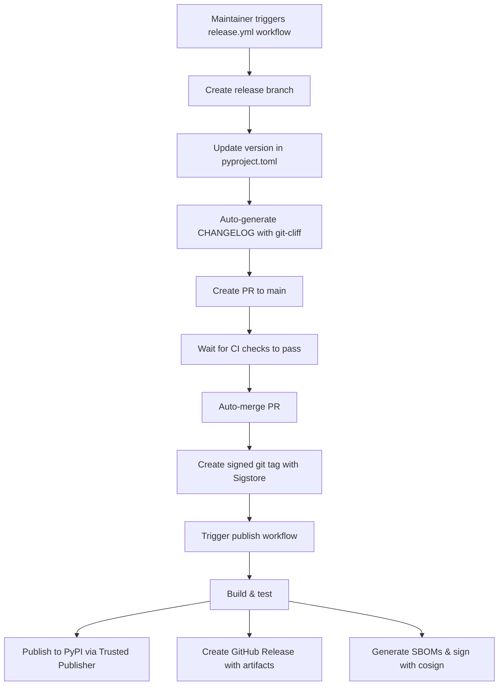

# AGENT.md - miniflux-tui-py Project Guide

This document provides context about the miniflux-tui-py project for coding agents working via the Codex CLI.

## Project Overview

**miniflux-tui-py** is a Python Terminal User Interface (TUI) client for [Miniflux](https://miniflux.app) - a self-hosted RSS reader. It provides a keyboard-driven interface to browse, read, and manage RSS feeds directly from the terminal.

- **Language**: Python 3.11+
- **Framework**: Textual (TUI framework)
- **Status**: Beta (v0.4.0) | v0.5.0 in development
- **License**: MIT
- **Author**: Peter Reuterås
- **PyPI**: Available at <https://pypi.org/project/miniflux-tui-py/>
- **Docs**: <https://reuteras.github.io/miniflux-tui-py/>
- **Roadmap**: See [ROADMAP.md](ROADMAP.md) for v0.5.0-v0.7.0 features

This is a Python reimplementation of [cliflux](https://github.com/spencerwi/cliflux) (original Rust implementation).

## Directory Structure

```bash
miniflux-tui-py/
├── miniflux_tui/                    # Main package
│   ├── __init__.py
│   ├── main.py                      # Entry point & CLI argument handling
│   ├── config.py                    # Configuration management
│   ├── constants.py                 # Application constants
│   ├── performance.py               # Performance optimization utilities
│   ├── utils.py                     # Helper utilities
│   ├── api/
│   │   ├── client.py                # Async Miniflux API wrapper
│   │   └── models.py                # Data models (Entry, Feed)
│   └── ui/
│       ├── app.py                   # Main Textual App
│       └── screens/
│           ├── entry_list.py        # Entry list with sorting/grouping
│           ├── entry_reader.py      # Entry detail view
│           └── help.py              # Help/keyboard shortcuts
├── tests/                           # Test suite
│   ├── conftest.py
│   ├── test_*.py                    # Test files
├── docs/                            # MkDocs documentation
│   ├── index.md
│   ├── installation.md
│   ├── configuration.md
│   ├── usage.md
│   ├── contributing.md
│   └── api/
│       ├── client.md
│       ├── models.md
│       └── screens.md
├── .github/
│   ├── workflows/
│   │   ├── test.yml                 # Run tests on push (Python 3.11-3.13)
│   │   ├── publish.yml              # Publish to PyPI on git tags
│   │   └── docs-deploy.yml          # Deploy docs to GitHub Pages
│   ├── dependabot.yml               # Automated dependency updates
│   └── CODEOWNERS                   # Code review requirements
├── pyproject.toml                   # Project metadata & dependencies
├── mkdocs.yml                       # MkDocs configuration
├── CHANGELOG.md                     # Release notes (Keep a Changelog format)
├── CONTRIBUTING.md                  # Contributing guidelines
├── CODE_OF_CONDUCT.md               # Community guidelines
├── SECURITY.md                      # Vulnerability reporting
├── AUTHORS.md                       # Contributor credits
├── README.md                         # User documentation
├── LICENSE                          # MIT License
└── .pre-commit-config.yaml          # Pre-commit hooks
```

## Key Files & Responsibilities

### Core Files

| File | Purpose |
|------|---------|
| `main.py` | CLI entry point; handles `--init`, `--check-config`; runs async app |
| `config.py` | Config loading/saving with platform-specific paths (XDG, macOS, Windows) |
| `api/client.py` | Async wrapper around official miniflux Python library with retry logic |
| `api/models.py` | Dataclasses: `Category`, `Entry`, `Feed` with helper properties |
| `ui/app.py` | Main `MinifluxTuiApp` Textual App; screen management; entry loading |
| `ui/screens/entry_list.py` | Entry list screen with sorting, grouping, navigation |
| `ui/screens/entry_reader.py` | Entry detail view with HTML→Markdown conversion |

### Recent Modifications (Key Behaviors)

#### entry_list.py
- **Sorting modes**: "date" (newest first), "feed" (alphabetical + date), "status" (unread first)
- **Grouping**: When enabled (`g` key), groups by feed title and sorts by published date within each feed
- **Grouped mode navigation**: Uses CSS-based hiding to preserve cursor position
  - All entries are always in the list (structure never changes)
  - Collapsed entries have "collapsed" CSS class (display: none)
  - j/k navigation skips hidden entries automatically
  - Cursor position naturally preserved during expand/collapse
- **Navigation**: `j`/`k` (or arrow keys) to navigate; skips hidden entries
- **Stored state**: `self.sorted_entries` tracks currently sorted order for proper J/K navigation in entry reader
- **Filtering**: `u` (unread only), `t` (starred only)
- **Key bindings**:
  - `j/k` - cursor down/up (skips hidden entries)
  - `enter` - select entry
  - `m` - toggle read/unread
  - `*` - toggle starred
  - `e` - save entry
  - `s` - cycle sort mode
  - `g` - toggle group by feed
  - `l/h` - expand/collapse feed
  - `r/,` - refresh entries
  - `u` - show unread only
  - `t` - show starred only

#### entry_reader.py
- **Display**: Shows entry title, feed name, publish date, URL, and HTML content (converted to Markdown)
- **Navigation**: `J/K` (uppercase) to navigate between entries in current list order
- **Actions**: Mark unread, toggle starred, open in browser, fetch original content
- **Critical fix**: Uses `entry_list` parameter passed from entry_list screen for correct navigation order

## Architecture Patterns

### Async/Await Pattern
- UI is synchronous (Textual), API calls are async
- `api/client.py` converts sync miniflux calls to async using `run_in_executor`
- Screen actions marked with `async def` when making API calls

### Screen Navigation
- `EntryListScreen` → User selects entry → `push_entry_reader(entry, entry_list, current_index)`
- Entry reader can navigate with J/K using the `entry_list` passed at open time
- Back button pops screen and returns to entry list

### Data Flow
```bash
config.py (load/validate)
  → app.py (create MinifluxTuiApp)
  → client.py (async API calls)
  → models.py (Entry/Feed objects)
  → screens (display & user interaction)
```

## Setup & Development

### Installation

#### Option 1: From PyPI (Recommended for users)
```bash
uv pip install miniflux-tui-py

# Create config
miniflux-tui --init

# Run application
miniflux-tui
```

#### Option 2: From Source (Recommended for development)
```bash
# Install uv package manager - see https://docs.astral.sh/uv/getting-started/installation/
# On macOS/Linux: brew install uv
# On Windows: choco install uv

# Clone and setup
git clone https://github.com/reuteras/miniflux-tui-py.git
cd miniflux-tui-py
uv sync --all-groups  # Install all dependencies including dev and docs tools

# Create config (interactive)
uv run miniflux-tui --init

# Run application
uv run miniflux-tui
```

### Git Workflow (CRITICAL)

**⚠️ ALL CHANGES MUST BE IN FEATURE BRANCHES - NEVER COMMIT DIRECTLY TO MAIN**

The main branch is protected and enforces:
1. **All changes must come through pull requests** - No direct pushes allowed
2. **All CI checks must pass** - Tests, linting, type checking, security scans
3. **Code review required** - Before any merge to main
4. **Branches must be up-to-date** - Rebase before merging

**Branch Naming Conventions:**
- `feat/feature-name` - New features (e.g., `feat/v0.5.0-categories`)
- `fix/bug-name` - Bug fixes (e.g., `fix/navigation-bug`)
- `docs/document-name` - Documentation updates (e.g., `docs/installation-guide`)
- `refactor/component-name` - Code refactoring (e.g., `refactor/entry-list`)
- `test/feature-name` - Test additions (e.g., `test/search-functionality`)
- `chore/task-name` - Maintenance tasks (e.g., `chore/dependency-update`)

**All development must follow this workflow:**

```bash
# 1. Create feature branch from main (ALWAYS start from main)
git checkout main
git pull origin main
git checkout -b feat/your-feature-name

# 2. Make changes locally
# (Edit files, make improvements)

# 3. Test your changes before committing (RUN ALL CHECKS!)
uv run ruff check .              # Lint
uv run ruff format .             # Format
uv run pyright                   # Type check
uv run pytest tests              # Run tests
pre-commit run --all-files       # Pre-commit hooks

# 4. Commit with clear, descriptive message
git add .
git commit -m "feat: Clear description of what was implemented

## Changes
- Bullet point 1
- Bullet point 2

## Related Issues
- #123 - Issue title

## Testing
- ✅ Tests added
- ✅ CI checks passing"

# 5. Push to origin (NEVER directly to main)
git push origin feat/your-feature-name

# 6. Create a Pull Request on GitHub
# - Go to https://github.com/reuteras/miniflux-tui-py/pulls
# - Click "New Pull Request"
# - Select your branch against main
# - Fill in detailed description
# - Link related issues with "Fixes #123" or "Related to #456"

# 7. Wait for CI to pass
# - GitHub Actions will run all checks automatically
# - Fix any failures before merging

# 8. After PR is merged, clean up your local branch
git checkout main
git pull origin main
git branch -d feat/your-feature-name
git push origin --delete feat/your-feature-name
```

**Critical Rules:**
- ✅ Create branch FROM main (git checkout main; git pull origin main; git checkout -b ...)
- ✅ Make changes ONLY in the branch (NOT on main)
- ✅ Test BEFORE committing (run ruff, pyright, pytest)
- ✅ Commit messages MUST be clear and describe the WHY
- ✅ Push ONLY to your branch (git push origin branch-name)
- ✅ Create PR on GitHub (never merge directly)
- ✅ Wait for CI/CD to pass
- ✅ Delete branch after merge

**⚠️ CRITICAL: SSH SIGNING WITH 1PASSWORD**

**If commit signing fails or doesn't work, STOP and WAIT immediately. Do NOT proceed.**

This project uses 1Password for SSH commit signing approval. When you attempt to commit:
- If signing works: 1Password will prompt for approval, and the commit will be signed
- If signing fails: It means the maintainer (Peter) is away or busy and cannot approve
- If 1Password is unreachable: WAIT - do not attempt to work around this

**Never:**
- ❌ Try to disable signing (commit.gpgsign=false)
- ❌ Try to commit without signing
- ❌ Use alternate signing methods
- ❌ Attempt any workaround

**If you get signing errors:**
1. Stop all work
2. Wait for the maintainer to come back online
3. Check that 1Password SSH Agent is running (macOS: System Preferences → Password Manager → SSH Agent)
4. Retry the commit

This ensures all commits are verified and trusted.

**Why this workflow?**
- Ensures code quality through automated CI checks (no breaking commits)
- Enables peer review and knowledge sharing
- Maintains clear, linear commit history
- Prevents accidental pushes that break the main branch
- Allows safe rollback of any feature
- Makes it easy to track what changes and when
- Enables multiple developers to work in parallel

### GitHub Branch Protection Rules (main branch)

The main branch has protection rules enabled via GitHub Settings. These prevent direct pushes and enforce quality standards.

**⚠️ CRITICAL: For OpenSSF Scorecard Perfect Score (10/10)**

The project aims for a perfect 10/10 on OpenSSF Scorecard's Branch-Protection check. This requires specific settings that must ALL be enabled (tiered scoring - each tier must be fully satisfied).

**To configure branch protection for 10/10 Scorecard score:**

1. Go to **Settings** → **Branches** → **Add rule** (or edit existing rule)
2. Apply to `main` branch
3. Enable these settings:

#### Pull Request Requirements
- ✅ **Require a pull request before merging**
  - **Require approvals: 2** (minimum 2 reviewers for Tier 4)
  - ✅ **Dismiss stale pull request approvals when new commits are pushed** (Tier 2 & 5)
  - ✅ **Require review from Code Owners** (Tier 4 - requires .github/CODEOWNERS)
  - ✅ **Require approval of the most recent reviewable push** (Tier 2)

#### Status Check Requirements
- ✅ **Require status checks to pass before merging** (Tier 3)
  - ✅ **Require branches to be up to date before merging** (Tier 2)
  - Select required checks: All CI checks (test, docs-deploy, scorecard, etc.)

#### Branch Rules
- ✅ **Do not allow bypassing the above settings** (Tier 5)
  - ✅ **Include administrators** (Tier 5 - CRITICAL for 10/10)
- ✅ **Allow force pushes: DISABLED** (Tier 1 - ensure unchecked)
- ✅ **Allow deletions: DISABLED** (Tier 1 - ensure unchecked)

#### Code Owners Configuration
The `.github/CODEOWNERS` file must be configured with review accounts:
- `@reuteras` - Primary maintainer
- `@reuteras-review` - Review account (second reviewer)

**OpenSSF Scorecard Tier Requirements:**
- **Tier 1 (3 pts)**: Prevent force push + prevent branch deletion
- **Tier 2 (6 pts)**: ≥1 reviewer, require PRs for admins, branch up-to-date, approve latest push
- **Tier 3 (8 pts)**: ≥1 status check required
- **Tier 4 (9 pts)**: ≥2 reviewers + code owner review
- **Tier 5 (10 pts)**: Dismiss stale reviews + include administrators

**These settings ensure:**
- ✅ No one (including admins) can push directly to main - must use PRs
- ✅ All CI tests and checks must pass before merge
- ✅ Minimum 2 reviewers required for every PR
- ✅ Code owners must review all changes
- ✅ PRs cannot be merged until branch is up-to-date with main
- ✅ Stale reviews are dismissed when new commits are pushed
- ✅ Branch cannot be force-pushed or deleted
- ✅ Administrators are subject to the same rules (no bypass)
- ✅ Perfect 10/10 OpenSSF Scorecard Branch-Protection score

### Common Commands
```bash
uv sync --all-groups             # Install all dependencies (dev + docs)
uv run miniflux-tui              # Run app
uv run miniflux-tui --init       # Create config
uv run ruff check .              # Lint code
uv run ruff format .             # Format code
uv run pyright                   # Type check
uv run pytest tests              # Run tests
uv run mkdocs serve              # Preview docs locally
```

### Configuration (TOML Format)

Location varies by OS:
- Linux: `~/.config/miniflux-tui/config.toml`
- macOS: `~/.config/miniflux-tui/config.toml`
- Windows: `%APPDATA%\miniflux-tui\config.toml`

Example:
```toml
server_url = "https://miniflux.example.com"
api_key = "your-api-key-here"
allow_invalid_certs = false

[theme]
unread_color = "cyan"
read_color = "gray"

[sorting]
default_sort = "date"       # "date", "feed", or "status"
default_group_by_feed = false
```

## Code Style & Standards

- **Line length**: 140 characters
- **Indentation**: 4 spaces
- **Quotes**: Double quotes
- **Linting**: ruff (fast Python linter & formatter)
- **Type checking**: pyright (strict type checking)
- **Testing**: pytest with coverage tracking
- **Pre-commit hooks**: Enforces syntax, security checks, formatting, and type checking
- **CI/CD**: GitHub Actions runs all checks on push (not PR)
- **Documentation**: MkDocs with Material theme, auto-deployed to GitHub Pages

## Important Implementation Details

### Entry List Ordering Issue (FIXED)
**Problem**: When grouping entries by feed, J/K navigation didn't follow visual order.

**Root cause**: `entry_list.py` was passing unsorted `self.entries` to entry reader instead of the sorted version.

**Solution**:
- Added `self.sorted_entries` to track current sort order
- Pass `self.sorted_entries` to entry reader for correct J/K navigation
- Find entry index in sorted list, not original list

### Cursor Navigation (FIXED)
**Problem**: `j/k` keys didn't work in entry list.

**Root cause**: `action_cursor_down/up` tried to use `self.app.set_focus()` on nested ListItems (invalid widget hierarchy).

**Solution**: Delegate directly to ListView's `action_cursor_down()` and `action_cursor_up()` methods.

## Common Tasks

### Adding a New Keyboard Binding
1. Add `Binding` tuple to `BINDINGS` list in the screen class
2. Create `action_*` method in the same screen
3. For API calls, mark as `async def` and await the call

Example:
```python
BINDINGS = [
    Binding("x", "do_something", "Do Something"),
]

async def action_do_something(self):
    """Description."""
    if hasattr(self.app, "client"):
        await self.app.client.some_api_call()
```

### Adding a New Screen
1. Create file in `ui/screens/`
2. Extend `Screen` class from textual
3. Implement `compose()` for UI layout
4. Add bindings and action methods
5. Push screen from app: `self.app.push_screen(MyScreen())`

### Modifying Entry Display
- Entry list: Edit `EntryListItem` in `entry_list.py`
- Entry detail: Edit `compose()` and `refresh_screen()` in `entry_reader.py`
- Remember to keep data model in sync via `api/models.py`

## Dependencies

**Runtime**:
- `textual>=0.82.0` - TUI framework
- `miniflux>=0.0.11` - Official Miniflux API client
- `html2text>=2024.2.26` - HTML to Markdown conversion
- `tomli>=2.0.1` - TOML parsing (Python <3.11)

**Development** (included with `uv sync`):
- `ruff>=0.6.0` - Fast linter & formatter
- `pyright>=1.1.0` - Static type checker
- `pytest>=8.0.0` - Testing framework
- `pytest-asyncio>=0.23.0` - Async test support
- `pytest-cov>=4.0.0` - Coverage reporting
- `pylint>=4.0.2` - Additional code linting

**Documentation** (included with `uv sync` or `pip install .[docs]`):
- `mkdocs>=1.5.0` - Documentation generator
- `mkdocs-material>=9.4.0` - Material theme for MkDocs
- `mkdocstrings[python]>=0.23.0` - Auto-generate API docs from docstrings

## Known Patterns & Conventions

### Screen Initialization
Screens receive data via constructor params, not global state:
```python
def __init__(self, entry: Entry, entry_list: list, current_index: int, **kwargs):
    super().__init__(**kwargs)
    self.entry = entry
    self.entry_list = entry_list
    self.current_index = current_index
```

### Async API Calls
Always check for app.client before calling:
```python
async def action_mark_read(self):
    if hasattr(self.app, "client") and self.app.client:
        await self.app.client.mark_as_read(self.entry.id)
```

### State Updates
- Screens update local data model (`entry.is_read = True`)
- Call API to persist changes
- Call `_populate_list()` or `refresh_screen()` to update UI

## Recent Changes (v0.1.1)

Major improvements in October 2025:
- **Grouped mode navigation fixed**: CSS-based hiding instead of list rebuilding
  - Cursor position now preserved during expand/collapse
  - j/k navigation automatically skips hidden entries
- **PyPI package infrastructure**: Published to PyPI with OIDC secure publishing
- **Comprehensive documentation**: MkDocs site with installation, usage, and API reference
- **GitHub Actions CI/CD**:
  - Automated testing on Python 3.11, 3.12, 3.13
  - Type checking with pyright
  - Test coverage tracking with codecov
  - Auto-deploy docs to GitHub Pages
  - Auto-publish to PyPI on version tags
- **Professional tooling**:
  - Pre-commit hooks with pyright type checking
  - Standard community files (CHANGELOG, CONTRIBUTING, CODE_OF_CONDUCT, SECURITY)
  - Dependabot for automated dependency updates
- **Code quality**:
  - Added constants.py for centralized configuration
  - Added performance.py for optimization tracking
  - Added utils.py for helper functions
  - Incremental refresh for better performance

## Testing & Quality Assurance

- **Automated CI/CD**: GitHub Actions runs on every push
  - Tests Python 3.11, 3.12, 3.13
  - Minimum 60% test coverage required
  - Type checking with pyright
  - Linting with ruff
- **Pre-commit hooks**: Enforces quality before commit
  - ruff linting and formatting
  - pyright type checking
  - YAML validation
  - Security checks
- **Manual testing**: Test with different Miniflux instances and feed sizes
- **Test suite**: Basic pytest coverage in tests/ directory

## Release Process for AI Agents

**⚠️ CRITICAL: AI agents should NEVER manually run releases. Releases are maintainer-only operations.**

### When Releases Happen

Releases are created by project maintainers using the fully automated GitHub Actions workflow:

```bash
# Via GitHub UI: Actions → Create Release → Run workflow
# Or via CLI:
gh workflow run release.yml --ref main --field version=0.5.6
# Or auto-bump:
gh workflow run release.yml --ref main --field bump_type=patch
```

The workflow automates everything:
1. Creates release branch with version + changelog updates (using git-cliff)
2. Creates PR to main and waits for CI checks
3. Auto-merges PR when tests pass
4. Creates signed git tag (using Sigstore Gitsign)
5. Triggers publish workflow which publishes to PyPI, creates GitHub release with all artifacts

Total time: ~10 minutes, zero manual steps required.

See [RELEASE.md](RELEASE.md) for complete documentation.

### How AI Agents Can Help

While agents should never release, they can assist with pre-release preparation:

**1. Feature Implementation**
- Follow conventional commit format: `feat:`, `fix:`, `docs:`, `refactor:`, etc.
- Include PR numbers in commit messages: `feat: Add feature (#123)`
- This enables automatic changelog generation

**2. Pre-Release Quality Checks**
- Ensure all tests pass: `uv run pytest tests --cov=miniflux_tui`
- Verify linting: `uv run ruff check miniflux_tui tests`
- Check types: `uv run pyright miniflux_tui tests`
- Review test coverage (minimum 60% required)

**3. Documentation Updates**
- Update docstrings for new features
- Update `docs/` when adding user-facing features
- Ensure README.md reflects current capabilities
- Keep code examples up to date

**4. Version Planning**
When asked about releases, help determine semantic version:
- **Patch (0.2.1)**: Bug fixes only, no new features
- **Minor (0.3.0)**: New features, backward compatible
- **Major (1.0.0)**: Breaking changes

**5. Changelog Preparation**
- Group commits by type (feat, fix, docs, etc.)
- Reference relevant issue/PR numbers
- Highlight breaking changes
- Note deprecations

### What NOT to Do

**NEVER:**
- ❌ Trigger the release workflow
- ❌ Manually edit version in `pyproject.toml` for release
- ❌ Create or push git tags
- ❌ Manually publish to PyPI
- ❌ Create GitHub releases
- ❌ Modify release workflows without maintainer approval

### Release Workflow Overview

For reference, here's how the automated release process works:



### CI/CD Pipeline

The publish workflow (`.github/workflows/publish.yml`) is triggered by version tags:
- Triggers on: `v[0-9]+.[0-9]+.[0-9]+` (e.g., v0.3.0)
- Runs: Full test suite, linting, type checking
- Builds: Distribution packages (tar.gz + wheel)
- Publishes: To PyPI using OpenID Connect (no secrets!)
- Creates: GitHub Release with artifacts
- Generates: SLSA provenance for supply chain security

### PyPI Trusted Publisher

The project uses PyPI's Trusted Publisher (OIDC) for secure publishing:
- No API tokens stored in GitHub secrets
- Direct authentication from GitHub Actions to PyPI
- Configured at: <https://pypi.org/account/publishing/>
- Environment: `pypi`
- Workflow: `publish.yml`

### Release Checklist Reference

If a maintainer asks for help preparing a release:

**Pre-Release:**
- [ ] All PRs merged to main
- [ ] All tests passing: `uv run pytest tests`
- [ ] Code formatted: `uv run ruff format .`
- [ ] Linting clean: `uv run ruff check .`
- [ ] Types valid: `uv run pyright`
- [ ] Documentation updated
- [ ] ROADMAP.md reflects current status

**Post-Release (Verification):**
- [ ] GitHub Actions workflow passed
- [ ] Release visible on GitHub: <https://github.com/reuteras/miniflux-tui-py/releases>
- [ ] Package on PyPI: <https://pypi.org/project/miniflux-tui-py/>
- [ ] Installation works: `pip install miniflux-tui-py --upgrade`

### Conventional Commit Format

The changelog generator relies on conventional commits. Always use this format:

```text
<type>: <description>

<optional detailed description>

<optional footer>
```

**Types:**
- `feat`: New features
- `fix`: Bug fixes
- `docs`: Documentation changes
- `style`: Code style (formatting, no logic change)
- `refactor`: Code refactoring
- `perf`: Performance improvements
- `test`: Test additions or fixes
- `ci`: CI/CD changes
- `chore`: Maintenance tasks

**Examples:**
```bash
feat: Add category filtering to entry list (#42)
fix: Correct cursor position after feed collapse (#55)
docs: Update installation instructions for Windows
refactor: Extract API retry logic into separate function
test: Add integration tests for feed refresh
```

### Release Documentation References

- [RELEASE.md](RELEASE.md) - Complete release documentation
- [CHANGELOG.md](CHANGELOG.md) - Release history
- [ROADMAP.md](ROADMAP.md) - Planned features by version
- [.github/workflows/release.yml](.github/workflows/release.yml) - Automated release workflow
- [cliff.toml](cliff.toml) - git-cliff configuration for changelog generation

## Troubleshooting

**Keys don't work**: Check bindings list in screen class - must have matching `action_*` method.

**Navigation jumps around**: Verify `current_index` and `entry_list` are passed correctly to entry reader from entry list.

**Config not found**: Run `uv run miniflux-tui --init` to create default config in correct OS-specific location.

**API errors**: Check network connectivity and API key in config; verify Miniflux server is accessible.

## References

- [Textual Documentation](https://textual.textualize.io/)
- [Miniflux Project](https://miniflux.app)
- [Original cliflux (Rust)](https://github.com/spencerwi/cliflux)
- Commits to GitHub should be signed with ssh key
- No bare urls in Markdown files.
