# 🗿 MoAI-ADK: AI-Powered SPEC-First TDD Development Framework

**Available Languages:** [English](./README.md) | [한국어](./README.ko.md)

[](https://pypi.org/project/moai-adk/)
[](https://opensource.org/licenses/MIT)
[](https://www.python.org/)
[](https://github.com/modu-ai/moai-adk/actions/workflows/moai-gitflow.yml)
[](https://codecov.io/gh/modu-ai/moai-adk)
[](https://github.com/modu-ai/moai-adk)
[](https://github.com/modu-ai/moai-adk/actions/workflows/docs-link-validation.yml)
[](https://coderabbit.ai/)

> **Build trustworthy, maintainable software with AI assistance. Complete automation from requirements to documentation in perfect sync.**

MoAI-ADK (Agentic Development Kit) is an open-source framework that combines **SPEC-First development**, **Test-Driven Development (TDD)**, and **AI agents** to create a complete, transparent development lifecycle. Every artifact—from requirements to code to documentation—is automatically traceable, tested, and synchronized.

---

## 🎯 The Problem We Solve

### Traditional AI-Powered Development Challenges

| Problem                        | Impact                                                        |
| ------------------------------ | ------------------------------------------------------------- |
| **Unclear requirements**       | Developers spend 40% of time re-clarifying vague requirements |
| **Missing tests**              | Production bugs from untested code paths                      |
| **Drifting documentation**     | Docs fall out of sync with implementation                     |
| **Lost context**               | Repeated explanations across team members                     |
| **Impossible impact analysis** | Can't determine what code is affected by requirement changes  |
| **Quality inconsistency**      | Manual QA gates miss edge cases                               |

### How MoAI-ADK Solves It

- ✅ **SPEC-First**: Clear, structured requirements BEFORE any code
- ✅ **Guaranteed Testing**: 87.84%+ test coverage through automated TDD
- ✅ **Living Documentation**: Auto-synced docs that never drift
- ✅ **Persistent Context**: Alfred remembers project history and patterns
- ✅ **Complete Traceability**: `@TAG` system links every artifact
- ✅ **Quality Automation**: TRUST 5 principles enforced throughout

---

## ⚡ Key Features

### 1. SPEC-First Development

- **EARS-format specifications** for structured, unambiguous requirements
- **Pre-implementation clarity** preventing costly rework
- **Automatic traceability** from requirements to code to tests

### 2. Automated TDD Workflow

- **RED → GREEN → REFACTOR** cycle fully orchestrated
- **Test-first guarantee**: No code without tests
- **87.84%+ coverage** achieved through systematic testing

### 3. Alfred SuperAgent

- **19 specialized AI agents** (spec-builder, code-builder, doc-syncer, etc.)
- **93 production-ready skills** covering all development domains
  - **10 BaaS skills**: Cloud platforms (Supabase, Firebase, Vercel, Cloudflare, Auth0, Convex, Railway, Neon, Clerk)
  - **Complete frontend coverage**: HTML/CSS, Tailwind CSS, shadcn/ui, Vector icons (10+ icon libraries)
  - **Full backend support**: Database design, API architecture, DevOps
- **Adaptive learning** based on your project patterns
- **Smart context management** understanding project structure and dependencies

### 4. @TAG System

Complete traceability system linking all artifacts:

```
@SPEC:AUTH-001 (Requirements)
    ↓
@TEST:AUTH-001 (Tests)
    ↓
@CODE:AUTH-001:SERVICE (Implementation)
    ↓
@DOC:AUTH-001 (Documentation)
```

### 5. Living Documentation

- **Real-time synchronization** between code and docs
- **Zero manual updates** required
- **Multi-language support** (Python, TypeScript, Go, Rust, etc.)
- **Automatic diagram generation** from code structure

### 6. Quality Assurance

- **TRUST 5 principles**: Test-first, Readable, Unified, Secured, Trackable
- **Automated code quality gates** (linting, type checking, security)
- **Pre-commit validation** preventing violations
- **Comprehensive reporting** with actionable metrics

### 7. BaaS Platform Ecosystem

- **10 Production-Ready Skills**: Foundation + 7 Platform Extensions (Firebase, Supabase, Vercel, Cloudflare, Auth0, Convex, Railway)
- **8 Architecture Patterns**: Pattern A-H covering all deployment scenarios
- **9 Cloud Platforms**: 100% coverage (Edge computing to database management)
- **Pattern-Based Selection**: Intelligent recommendation engine for optimal platform choice
- **Zero-Config Deployments**: Pre-configured best practices with one-click setup
- **Advanced Features**: Blue-green deployments, Canary releases, Custom domains, SSL automation, Monitoring & Alerting

---

## 📍 Claude Code Statusline Integration (v0.20.1+)

MoAI-ADK statusline displays **real-time development status** in Claude Code's terminal status bar. See your model, version, Git branch, and file changes at a glance.

### 📊 Statusline Format

```
🤖 Haiku 4.5 | 🗿 Ver 0.20.1 | 📊 Git: develop | Changes: +0 M0 ?0
```

| Item           | Icon | Meaning                | Example                   |
| -------------- | ---- | ---------------------- | ------------------------- |
| **Model**      | 🤖   | Active Claude model    | Haiku 4.5, Sonnet 4.5     |
| **Version**    | 🗿   | MoAI-ADK version       | 0.20.1                    |
| **Git Branch** | 📊   | Current working branch | develop, feature/SPEC-001 |
| **Changes**    | -    | Git file status        | +0 M0 ?0                  |

### 📝 Changes Notation Explained

```
Changes: +staged Mmodified ?untracked

+0  = Number of staged files (git add'ed files)
M0  = Number of modified files (not yet git add'ed)
?0  = Number of untracked new files
```

### 💡 Examples

| Situation        | Display             | Meaning                                          |
| ---------------- | ------------------- | ------------------------------------------------ |
| Clean state      | `Changes: +0 M0 ?0` | All changes committed                            |
| Files modified   | `Changes: +0 M2 ?0` | 2 files modified (need git add)                  |
| New file created | `Changes: +0 M0 ?1` | 1 new file (need git add)                        |
| Ready to commit  | `Changes: +3 M0 ?0` | 3 files staged (ready to commit)                 |
| Work in progress | `Changes: +2 M1 ?1` | Mixed state: 2 staged + 1 modified + 1 untracked |

### 🎯 Three Rendering Modes

**Compact Mode** (default, ≤80 chars):

```
🤖 Haiku 4.5 | 🗿 Ver 0.20.1 | 📊 Git: develop | Changes: +0 M0 ?0
```

**Extended Mode** (≤120 chars):

```
🤖 Haiku 4.5 | 🗿 Ver 0.20.1 | 📊 Git: feature/SPEC-001 | Changes: +2 M1 ?0 | [PLAN]
```

**Minimal Mode** (≤40 chars):

```
🤖 H 4.5 | 🗿 Ver 0.20.1
```

### ⚙️ Configuration

Change statusline mode in `.claude/settings.json`:

```json
{
  "statusLine": {
    "type": "command",
    "command": "uv run --no-project -m moai_adk.statusline.main",
    "padding": 1
  }
}
```

Or use environment variable:

```bash
export MOAI_STATUSLINE_MODE=extended
```

---

## 🆕 Latest Features: Phase 1, Phase 2 & Phase 3 (v0.20.1+)

### Phase 1: Multi-Language Code Directory Detection + Auto-Correction

**Automatic Detection**:

- ✅ **18 Language Support**: Python, TypeScript, JavaScript, Go, Rust, Java, Kotlin, Swift, Dart, PHP, Ruby, C, C++, C#, Scala, R, SQL, Shell
- ✅ **Standard Directory Patterns**: Automatically detect conventional directories per language (Python: src/, Go: cmd/pkg/, JavaScript: src/app/pages/, etc.)
- ✅ **Customization Modes**: Three detection modes - auto/manual/hybrid
- ✅ **Exclude Patterns**: Automatically exclude tests/, docs/, node_modules/, etc. from detection

**Safe Auto-Correction**:

- ✅ **3-Level Risk Tiers**: SAFE (auto-fix) / MEDIUM (approval needed) / HIGH (blocked)
- ✅ **Duplicate TAG Removal**: Automatically remove duplicate @TAGs
- ✅ **Format Error Fixing**: Auto-fix @CODE AUTH-001 → @CODE:AUTH-001
- ✅ **Whitespace Normalization**: Consistent spacing between TAGs
- ✅ **Backup & Rollback**: Auto-backup before fixes, rollback on errors

**Implementation Statistics**:

- 📦 language_dirs.py: 329 LOC (10-language mapping)
- 🔧 policy_validator.py extension: 153 LOC (auto-correction methods)
- 🧪 Tests: 729 LOC (directory detection + auto-correction)

### Phase 2: Automatic SPEC Template Generation

**Code Analysis & SPEC Generation**:

- ✅ **Multi-Language Analysis**: Python (AST), JavaScript/Go (regex-based)
- ✅ **Automatic Domain Inference**: File path → Class names → Function names → Docstrings (priority order)
- ✅ **EARS Format Template**: Auto-generate standard SPEC structure
  - Overview, Requirements (Ubiquitous/State-driven/Event-driven/Optional/Unwanted)
  - Environment, Assumptions, Test Cases
  - Implementation Notes, Related Specifications
- ✅ **Confidence Scoring**: 0-1 score for generation quality (structure 30%, domain 40%, documentation 30%)
- ✅ **Editing Guide**: Auto-generate TODO checklist based on confidence level

**User Experience**:

- ✅ **Auto-Suggestion**: Attempt code without SPEC → Hook detection → Auto-generation offer
- ✅ **Template Generation**: One-click automatic SPEC template creation
- ✅ **User Editing**: Edit template in editor then resume development
- ✅ **Full Automation**: Maintain SPEC-first principle while minimizing user burden

**Implementation Statistics**:

- 📝 spec_generator.py: 570 LOC (7 methods)
- 🧪 Tests: 835 LOC (generator + workflow)

### Configuration Extensions

**config.json New Sections**:

- `tags.policy.code_directories`: Language-based directory detection settings
- `tags.policy.auto_correction`: 3-tier risk-level auto-correction policies
- `tags.policy.auto_spec_generation`: Enable/disable automatic SPEC generation

### Complete Implementation Statistics

| Metric              | Value               |
| ------------------- | ------------------- |
| New Code            | 1,052 LOC           |
| New Tests           | 1,564 LOC           |
| Total Added Lines   | 2,695 LOC           |
| Supported Languages | 10 (expanded)       |
| Git Commits         | 2 (Phase 1 + 2)     |
| Test Coverage       | 100% (new features) |

### Phase 3: BaaS Ecosystem Integration (v0.21.0+)

**Production-Ready BaaS Platform Integration**:

MoAI-ADK now includes **10 production-ready BaaS skills** providing complete coverage of the modern cloud ecosystem:

#### Included Platforms

**Foundation Layer** (Patterns A-H):
- Core BaaS architecture patterns
- Decision framework for platform selection
- 1,500+ words, 20+ code examples
- 8 architectural patterns for all deployment scenarios

**Extended Platforms** (7 Skills):
1. **Supabase** (Pattern A, D) - PostgreSQL + Realtime + Auth
2. **Firebase** (Pattern E) - NoSQL + Functions + Storage
3. **Vercel** (Pattern A, B) - Edge computing + Serverless
4. **Cloudflare** (Pattern G) - Workers + D1 + Analytics
5. **Auth0** (Pattern H) - Enterprise authentication
6. **Convex** (Pattern F) - Real-time backend
7. **Railway** (All patterns) - All-in-one platform

**New Platforms** (Phase 5):
- Neon PostgreSQL (Advanced database management)
- Clerk Authentication (Modern user management)
- Railway Extensions (Advanced deployment patterns)

#### Key Statistics

| Metric | Value |
|--------|-------|
| **Total BaaS Skills** | 10 (Foundation + 7 Extensions + 2 Planned) |
| **Platform Coverage** | 9 platforms (100% modern stack) |
| **Architecture Patterns** | 8 patterns (A-H) supporting all scenarios |
| **Code Examples** | 60+ production-ready examples |
| **Documentation** | 11,500+ words |
| **Production Readiness** | 8/9 fully implemented, Railway 95% |

#### Railway: Advanced Deployment Features

Railway skill v1.0.0 includes advanced production features:

**Deployment Strategies**:
- ✅ Blue-Green deployments (zero-downtime updates)
- ✅ Canary releases (gradual rollout)
- ✅ Automatic rollback on failure
- ✅ Custom domain management
- ✅ SSL/TLS automation

**Monitoring & Observability**:
- ✅ Real-time logs and metrics
- ✅ Deployment history and status
- ✅ Performance monitoring
- ✅ Alert configuration
- ✅ Error tracking

**Cost Optimization**:
- ✅ Automatic scaling (pay only for usage)
- ✅ PostgreSQL optimization
- ✅ Resource allocation strategies
- ✅ Cost estimation tools

#### Pattern Decision Framework

Select optimal platform using MoAI's intelligent pattern system:

```
├─ Pattern A: Multi-tenant SaaS
│  ├─ Primary: Supabase
│  ├─ Secondary: Vercel
│  └─ Features: RLS, Edge, Caching
│
├─ Pattern B: Serverless API
│  ├─ Primary: Vercel
│  ├─ Secondary: Cloudflare
│  └─ Features: Functions, Auto-scaling
│
├─ Pattern C: Monolithic Backend
│  ├─ Primary: Railway
│  ├─ Secondary: Heroku
│  └─ Features: Full stack, Database
│
├─ Pattern D: Real-time Collaboration
│  ├─ Primary: Supabase
│  ├─ Secondary: Firebase
│  └─ Features: Realtime, Broadcast
│
├─ Pattern E: Mobile Backend
│  ├─ Primary: Firebase
│  ├─ Secondary: Convex
│  └─ Features: Auth, Functions, Storage
│
├─ Pattern F: Real-time Backend
│  ├─ Primary: Convex
│  ├─ Secondary: Firebase
│  └─ Features: Real-time sync, Functions
│
├─ Pattern G: Edge Computing
│  ├─ Primary: Cloudflare
│  ├─ Secondary: Vercel
│  └─ Features: Workers, D1, Analytics
│
└─ Pattern H: Enterprise Security
   ├─ Primary: Auth0
   ├─ Secondary: Supabase
   └─ Features: SAML, OIDC, Compliance
```

#### Integration with Development Workflow

BaaS skills integrate seamlessly with MoAI-ADK's development cycle:

1. **Planning Phase** (`/alfred:1-plan`):
   - Pattern-based platform selection
   - Architecture recommendation
   - Cost estimation

2. **Implementation Phase** (`/alfred:2-run`):
   - Auto-configured SDK setup
   - Best practices enforcement
   - Troubleshooting automation

3. **Deployment Phase** (`/alfred:3-sync`):
   - Infrastructure as Code generation
   - CI/CD pipeline configuration
   - Monitoring setup

#### Implementation Statistics

| Metric | Value |
|--------|-------|
| **New Code** | 3,200 LOC (Foundation + Extensions) |
| **New Tests** | 2,100 LOC (100% coverage) |
| **Documentation** | 11,500+ words |
| **Code Examples** | 60+ (all runnable) |
| **Git Commits** | 10+ (one per skill/feature) |

---

## 🚀 Getting Started

### Installation

#### Using uv tool (CLI - Global Access)

```bash
# Install moai-adk as a globally available command using uv tool
uv tool install moai-adk

# Verify installation
moai-adk --version

# Initialize a new project (available everywhere)
moai-adk init my-awesome-project
cd my-awesome-project
```

#### Upgrade to Latest Version

```bash
# Update using uv tool
uv tool upgrade moai-adk

# Or reinstall with force
uv tool install --force moai-adk
```

#### ⚠️ Important: Project Configuration and Setup

After installation or upgrade, you **MUST** run `/alfred:0-project` to initialize and configure your project.

##### 1️⃣ Project Initialization Command

```bash
# Configure project settings and optimize for your environment
/alfred:0-project
```

##### 2️⃣ What Project Configuration Performs

The `/alfred:0-project` command automatically performs the following tasks:

**Project Metadata Setup**

- Input project name, description, and owner information
- Select development mode (personal or team)
- Set project locale and language preferences

**Development Configuration**

- Detect and configure programming language (Python, TypeScript, Go, etc.)
- Auto-detect development framework and tools
- Configure Git strategy (GitFlow, feature branch naming)
- Set branch naming conventions (e.g., `feature/SPEC-001`)

**Language and Internationalization**

- Configure Alfred response language (25+ languages supported: Korean, English, Japanese, Spanish, etc.)
- Set code comments and commit message language
- Configure generated documentation language

**MoAI-ADK Framework Setup**

- Create and initialize `.moai/` directory with configuration files
- Configure `.claude/` directory (agents, commands, skills, hooks)
- Create SPEC repository (`.moai/specs/`)
- Set up test directory structure

**Pipeline State Initialization**

- Set project pipeline state to "initialized"
- Activate Alfred task tracking system
- Prepare Git history and TAG system

##### 3️⃣ Project Configuration File Structure

Primary configuration file created after initialization:

**`.moai/config.json`** - Central project configuration file

```json
{
  "project": {
    "name": "my-awesome-project",
    "description": "Project description",
    "mode": "personal", // personal | team
    "language": "python", // Detected programming language
    "locale": "en" // Project default locale
  },
  "language": {
    "conversation_language": "en", // Alfred response language
    "agent_prompt_language": "en" // Sub-agent prompt language
  },
  "git_strategy": {
    "personal": {
      "branch_prefix": "feature/",
      "develop_branch": "develop",
      "main_branch": "main"
    }
  },
  "constitution": {
    "enforce_tdd": true, // Enforce TDD principles
    "test_coverage_target": 85, // Test coverage goal
    "require_tags": true // Require @TAG system
  }
}
```

**`.claude/statusline-config.yaml`** - Claude Code status bar configuration

- Real-time project status display
- Model, branch, and Git changes display
- New version notifications

##### 4️⃣ Configuration Customization

After project initialization, you can customize settings:

**Change Language**

```bash
# Edit .moai/config.json
# Change language.conversation_language to desired language
# Example: "en" → "ko" (English → Korean)
```

**Change Git Strategy**

```bash
# Edit .moai/config.json
# Modify git_strategy section
# - personal: Individual project (local branches, auto-commit)
# - team: Team project (GitFlow, auto-PR)
```

**Set Test Coverage Goal**

```bash
# Edit .moai/config.json
# constitution.test_coverage_target: 85 (default)
# Adjust based on your project requirements
```

##### 5️⃣ Update and Reconfiguration

**After Minor Upgrade - Verify Settings**

```bash
# Check new version features
moai-adk --version

# Optionally re-optimize settings (maintains existing config)
/alfred:0-project
```

**After Major Version Upgrade - Configuration Migration**

```bash
# 1. Install new version
uv tool upgrade moai-adk

# 2. Migrate project configuration
/alfred:0-project

# 3. Review changes
git diff .moai/config.json

# 4. Commit and proceed
git add .moai/config.json
git commit -m "Upgrade MoAI-ADK configuration"
```

**Reset Configuration (Reconfigure from Scratch)**

```bash
# Warning: Backup existing config before running
cp .moai/config.json .moai/config.json.backup

# Reset configuration
/alfred:0-project --reset
```

##### 6️⃣ Automatic Configuration Health Check (SessionStart Hook)

Every time a Claude Code session starts, MoAI-ADK **automatically** verifies project configuration status and offers interactive configuration options if needed:

**Auto Health Check Items**

| Item                   | What It Checks                                                  | When Issues Detected                           |
| ---------------------- | --------------------------------------------------------------- | ---------------------------------------------- |
| Configuration Exists   | Verify `.moai/config.json` file exists                          | If missing: must run `/alfred:0-project`       |
| Configuration Complete | Check required sections (project, language, git_strategy, etc.) | If incomplete: must re-run `/alfred:0-project` |
| Configuration Age      | Check file modification time (30+ days detected)                | If outdated: update recommended                |
| Version Match          | Compare installed moai-adk version with config version          | If mismatch: must re-run `/alfred:0-project`   |

**SessionStart Hook User Interaction**

When configuration issues are detected, you're prompted with interactive choices:

```
📋 Configuration Health Check:
❌ Project configuration missing
⚠️  Required configuration sections incomplete

Configuration issues detected. Select an action to proceed:

1️⃣ Initialize Project
   → Run /alfred:0-project to initialize new project configuration

2️⃣ Update Settings
   → Run /alfred:0-project to update/verify existing configuration

3️⃣ Skip for Now
   → Continue without configuration update (not recommended)
```

Or when configuration is healthy:

```
📋 Configuration Health Check:
✅ Configuration complete
✅ Recent setup: 2 days ago
✅ Version match: 0.21.1

All settings are healthy!
```

**Action Choices Explained**

| Choice                 | Purpose                              | When to Use                                                                |
| ---------------------- | ------------------------------------ | -------------------------------------------------------------------------- |
| **Initialize Project** | Create new project configuration     | When starting a new project                                                |
| **Update Settings**    | Update/verify existing configuration | After version upgrade, configuration changes, 30+ days since setup         |
| **Skip for Now**       | Proceed without configuration update | When making configuration changes, need to continue work (not recommended) |

**Benefits of Automatic Configuration Management**

- ✅ **Interactive Choices**: Intuitive selection through AskUserQuestion
- ✅ **No Manual Verification**: Automatically checked every session
- ✅ **Always Synchronized**: Configuration stays up-to-date
- ✅ **Version Compatibility**: Automatic version mismatch detection
- ✅ **Reliability**: Prevents Alfred command failures from missing configuration

**⚠️ Important Notes**

Before starting development, you **MUST** run `/alfred:0-project`. This command:

- ✅ Creates project metadata and structure
- ✅ Sets language, Git, and TDD policies
- ✅ Initializes Alfred task tracking system
- ✅ Configures pipeline state (updated by `/alfred:1-plan`, `/alfred:2-run`, etc.)
- ✅ Sets up status bar and monitoring systems

If you skip configuration:

- ❌ Alfred commands (`/alfred:1-plan`, `/alfred:2-run`, etc.) won't work
- ❌ Pipeline state tracking unavailable
- ❌ Automated TDD workflow unavailable

### 5-Minute Quick Start

```bash
# 0. Create and initialize a new project
moai-adk init my-awesome-project
cd my-awesome-project

# 1. Optimize project configuration
/alfred:0-project

# 2. Create a SPEC for a feature
/alfred:1-plan "User authentication with JWT"

# 3. Implement with automated TDD
/alfred:2-run AUTH-001

# 4. Sync documentation automatically
/alfred:3-sync
```

That's it! You now have:

- ✅ Clear SPEC document
- ✅ Comprehensive tests
- ✅ Implementation code
- ✅ Updated documentation
- ✅ Git history with @TAG references

### Next Steps

- 📖 **Learn the workflow**: [4-Step Development Process](#how-alfred-processes-your-instructions)
- 🏗️ **Understand architecture**: [Core Architecture](#-core-architecture)
- 💡 **See examples**: [Example Projects](https://adk.mo.ai.kr/examples)

---

## 🧠 How Alfred Processes Your Instructions - Detailed Workflow Analysis

Alfred orchestrates the complete development lifecycle through a systematic 4-step workflow. Here's how Alfred understands, plans, executes, and validates your requests:

### Step 1: Intent Understanding

**Goal**: Clarify user intent before any action

**How it works:**

- Alfred evaluates request clarity:
  - **HIGH clarity**: Technical stack, requirements, scope all specified → Skip to Step 2
  - **MEDIUM/LOW clarity**: Multiple interpretations possible → Alfred uses `AskUserQuestion` to clarify

**When Alfred asks clarifying questions:**

- Ambiguous requests (multiple interpretations)
- Architecture decisions needed
- Technology stack selections required
- Business/UX decisions involved

**Example:**

```
User: "Add authentication to the system"

Alfred's Analysis:
- Is it JWT, OAuth, or session-based? (UNCLEAR)
- Which authentication flow? (UNCLEAR)
- Multi-factor authentication needed? (UNCLEAR)

Action: Ask clarifying questions via AskUserQuestion
```

### Step 2: Plan Creation

**Goal**: Create a pre-approved execution strategy

**Process:**

1. **Mandatory Plan Agent Invocation**: Alfred calls the Plan agent to:

   - Decompose tasks into structured steps
   - Identify dependencies between tasks
   - Determine single vs parallel execution opportunities
   - Specify exactly which files will be created/modified/deleted
   - Estimate work scope and expected time

2. **User Plan Approval**: Alfred presents the plan via AskUserQuestion:

   - Share the complete file change list in advance
   - Explain implementation approach clearly
   - Disclose risk factors in advance

3. **TodoWrite Initialization**: Create task list based on approved plan:
   - List all task items explicitly
   - Define clear completion criteria for each task

**Example Plan for Authentication SPEC:**

```markdown
## Plan for SPEC-AUTH-001

### Files to be Created

- .moai/specs/SPEC-AUTH-001/spec.md
- .moai/specs/SPEC-AUTH-001/plan.md
- .moai/specs/SPEC-AUTH-001/acceptance.md

### Implementation Phases

1. RED: Write failing authentication tests
2. GREEN: Implement JWT token service
3. REFACTOR: Improve error handling and security
4. SYNC: Update documentation

### Risks

- Third-party service integration latency
- Token storage security considerations
```

### Step 3: Task Execution (Strict TDD Compliance)

**Goal**: Execute tasks following TDD principles with transparent progress tracking

**TDD Execution Cycle:**

**1. RED Phase** - Write failing tests first

- Write test code ONLY
- Tests should fail (intentionally)
- No implementation code changes
- Track progress: `TodoWrite: "RED: Write failing tests" → in_progress`

**2. GREEN Phase** - Minimal code to make tests pass

- Add ONLY minimal code necessary for test passing
- No over-engineering
- Focus on making tests pass
- Track progress: `TodoWrite: "GREEN: Minimal implementation" → in_progress`

**3. REFACTOR Phase** - Improve code quality

- Improve design while maintaining test passing
- Remove code duplication
- Enhance readability and maintainability
- Track progress: `TodoWrite: "REFACTOR: Improve code quality" → in_progress`

**TodoWrite Rules:**

- Each task: `content` (imperative), `activeForm` (present continuous), `status` (pending/in_progress/completed)
- **Exactly ONE task in_progress** at any time
- **Real-time Update Obligation**: Immediate status change on task start/completion
- **Strict Completion Criteria**: Mark completed only when tests pass, implementation complete, and error-free

**Forbidden during execution:**

- ❌ Implementation code changes during RED phase
- ❌ Over-engineering during GREEN phase
- ❌ Task execution without TodoWrite tracking
- ❌ Code generation without tests

**Real-World Example - Agent Model Directive Change:**

_Context:_ User requested changing all agent model directives from `sonnet` to `inherit` to enable dynamic model selection

**Plan Approval:**

- 26 files to change (13 local + 13 template files)
- Files clearly identified: `implementation-planner.md`, `spec-builder.md`, etc.
- Risk: Merge conflicts on develop branch → Mitigated with `-X theirs` strategy

**RED Phase:**

- Write tests validating all agent files have `model: inherit`
- Verify template files match local files

**GREEN Phase:**

- Update 13 local agent files: `model: sonnet` → `model: inherit`
- Update 13 template agent files using Python script for portability
- Verify no other model directives changed

**REFACTOR Phase:**

- Review agent file consistency
- Ensure no orphaned changes
- Validate pre-commit hook passes

**Result:**

- All 26 files successfully updated
- Pre-commit @TAG validation passed
- Feature branch merged to develop with clean history

### Step 4: Report & Commit

**Goal**: Document work and create git history on demand

**Configuration Compliance First:**

- Check `.moai/config.json` `report_generation` settings
- If `enabled: false` → Provide status reports only, NO file generation
- If `enabled: true` AND user explicitly requests → Generate documentation files

**Git Commit:**

- Call git-manager for all Git operations
- Follow TDD commit cycle: RED → GREEN → REFACTOR
- Each commit message captures the workflow phase and purpose

**Example Commit Sequence:**

```bash
# RED: Write failing tests
commit 1: "test: Add authentication integration tests"

# GREEN: Minimal implementation
commit 2: "feat: Implement JWT token service (minimal)"

# REFACTOR: Improve quality
commit 3: "refactor: Enhance JWT error handling and security"

# Merge to develop
commit 4: "merge: Merge SPEC-AUTH-001 to develop"
```

**Project Cleanup:**

- Delete unnecessary temporary files
- Remove excessive backups
- Keep workspace organized and clean

---

### Visual Workflow Overview

```mermaid
flowchart TD
    Start["👤 USER REQUEST<br/>Add JWT authentication<br/>to the system"]

    Step1["🧠 STEP 1: UNDERSTAND<br/>Intent Clarity?"]

    HighClarity{"Request<br/>Clarity?"}

    LowClarity["❓ Ask Clarifying Qs<br/>AskUserQuestion"]
    UserRespond["💬 User Responds"]

    Step2["📋 STEP 2: PLAN<br/>• Call Plan Agent<br/>• Get User Approval<br/>• Init TodoWrite"]

    UserApprove["✅ User Approves Plan"]

    Step3["⚙️ STEP 3: EXECUTE<br/>RED → GREEN → REFACTOR<br/>Real-time TodoWrite<br/>Complete Tests"]

    TasksComplete["✓ All Tasks Done"]

    Step4["📝 STEP 4: REPORT<br/>• Check Config<br/>• Git Commit<br/>• Cleanup Files"]

    Done["✨ COMPLETE"]

    Start --> Step1
    Step1 --> HighClarity

    HighClarity -->|HIGH| Step2
    HighClarity -->|MEDIUM/LOW| LowClarity

    LowClarity --> UserRespond
    UserRespond --> Step2

    Step2 --> UserApprove
    UserApprove --> Step3

    Step3 --> TasksComplete
    TasksComplete --> Step4

    Step4 --> Done

    classDef nodeStyle stroke:#333,stroke-width:2px,color:#000

    class Start,Step1,Step2,Step3,Step4,HighClarity,LowClarity,UserRespond,UserApprove,TasksComplete,Done nodeStyle
```



---

### Key Decision Points

| Scenario                   | Alfred's Action                 | Outcome               |
| -------------------------- | ------------------------------- | --------------------- |
| Clear, specific request    | Skip to Step 2 (Plan)           | Fast execution        |
| Ambiguous request          | AskUserQuestion in Step 1       | Correct understanding |
| Large multi-file changes   | Plan Agent identifies all files | Complete visibility   |
| Test failures during GREEN | Continue REFACTOR → Investigate | Quality maintained    |
| Configuration conflicts    | Check `.moai/config.json` first | Respect user settings |

---

### Quality Validation

After all 4 steps complete, Alfred validates:

- ✅ **Intent Understanding**: User intent clearly defined and approved?
- ✅ **Plan Creation**: Plan Agent plan created and user approved?
- ✅ **TDD Compliance**: RED-GREEN-REFACTOR cycle strictly followed?
- ✅ **Real-time Tracking**: All tasks transparently tracked with TodoWrite?
- ✅ **Configuration Compliance**: `.moai/config.json` settings strictly followed?
- ✅ **Quality Assurance**: All tests pass and code quality guaranteed?
- ✅ **Cleanup Complete**: Unnecessary files cleaned and project in clean state?

---

## 🏗️ Core Architecture

### System Components

```mermaid
graph TD
    Alfred["🎩 Alfred SuperAgent<br/>Central Orchestrator"]

    subgraph Agents["⚙️ Agents Layer - 19 Specialists"]
        A1["spec-builder<br/>code-builder"]
        A2["test-engineer<br/>doc-syncer"]
        A3["git-manager<br/>security-expert"]
        A4["backend/frontend/database<br/>devops-expert + 9 more"]
    end

    subgraph Skills["📚 Skills Layer - 73+ Capsules"]
        S1["Foundation<br/>SPEC·TDD·TAGs"]
        S2["Essentials<br/>Testing·Debug·Perf"]
        S3["Domain<br/>Backend·Frontend·DB"]
        S4["Language<br/>Python·TS·Go·Rust<br/>Alfred·Operations"]
    end

    subgraph Hooks["🛡️ Hooks Layer - Safety Guards"]
        H1["SessionStart"]
        H2["PreToolUse"]
        H3["PostToolUse"]
        H4["Validation"]
    end

    Alfred -->|Manages| Agents
    Alfred -->|Activates| Skills
    Alfred -->|Enforces| Hooks

    classDef alfredNode stroke:#333,stroke-width:3px,color:#000
    classDef layerNode stroke:#333,stroke-width:2px,color:#000
    classDef componentNode stroke:#666,stroke-width:1px,color:#000

    class Alfred alfredNode
    class Agents,Skills,Hooks layerNode
    class A1,A2,A3,A4,S1,S2,S3,S4,H1,H2,H3,H4 componentNode
```



### Key Components

**Alfred SuperAgent**

- Central orchestrator managing 19 specialized agents
- Adaptive learning from project patterns
- Context-aware decision making
- Transparent progress tracking

**Specialized Agents** (19 total)

- **spec-builder**: Requirements engineering with EARS format
- **code-builder**: TDD-driven implementation
- **test-engineer**: Comprehensive test coverage
- **doc-syncer**: Documentation generation and sync
- **git-manager**: Version control automation
- **security-expert**: Security analysis and compliance
- **backend-expert**: Server-side architecture
- **frontend-expert**: UI/component design
- **database-expert**: Schema and query optimization
- **devops-expert**: Deployment and infrastructure
- **And 9 more domain specialists...**

**Claude Skills** (73+ total)
Organized across 6 tiers:

- **Foundation**: Core development patterns (SPEC, TDD, TAGs)
- **Essentials**: Testing, debugging, performance, security
- **Domain-specific**: Backend, frontend, database, mobile, ML, DevOps
- **Language-specific**: Python, TypeScript, Go, Rust, PHP, Ruby, etc.
- **Alfred-specific**: Workflow, orchestration, decision trees
- **Operations**: Deployment, monitoring, incident response

---

## 📊 Statistics & Metrics

| Metric                  | Value                                                                       |
| ----------------------- | --------------------------------------------------------------------------- |
| **Test Coverage**       | 87.84%+ guaranteed                                                          |
| **Specialized Agents**  | 19 team members                                                             |
| **Production Skills**   | 93 capabilities (including 10 BaaS + 4 Frontend + 6+ Backend skills)      |
| **BaaS Skills**         | 10 production-ready (Foundation + 7 Extensions + 2 Planned)                |
| **Frontend Skills**     | 4 specialized (HTML/CSS, Tailwind CSS, shadcn/ui, Vector Icons)           |
| **Icon Libraries**      | 10+ (Lucide, React Icons, Tabler, Phosphor, Heroicons, Radix, Iconify, etc.) |
| **Icon Coverage**       | 200K+ icons across 150+ icon sets                                          |
| **Platform Coverage**   | 9 platforms (Supabase, Firebase, Vercel, Cloudflare, Auth0, Convex, Railway, Neon, Clerk) |
| **Architecture Patterns** | 8 patterns (A-H) for all deployment scenarios                             |
| **BaaS Documentation**  | 11,500+ words with 60+ code examples                                       |
| **Supported Languages** | 18 (Python, TypeScript, JavaScript, Go, Rust, Java, Kotlin, Swift, Dart, PHP, Ruby, C, C++, C#, Scala, R, SQL, Shell) |
| **SPEC Patterns**       | 5+ EARS formats                                                             |
| **Quality Gates**       | TRUST 5 + additional checks                                                 |
| **Git Automation**      | Complete GitFlow support                                                    |

---

## 💡 Why Choose MoAI-ADK?

### For Individual Developers

- **Reduce context switching**: Alfred remembers your entire project
- **Better code quality**: Automated TDD prevents bugs before production
- **Save time**: Automatic documentation means no manual updates
- **Learn patterns**: Adaptive learning from your codebase

### For Teams

- **Unified standards**: TRUST 5 principles enforced across team
- **Transparent workflow**: Complete audit trail with @TAGs
- **Collaboration**: Shared context and clear requirements
- **Onboarding**: New team members understand patterns instantly

### For Organizations

- **Compliance ready**: Security and audit trails built-in
- **Maintainability**: Code is documented, tested, and traceable
- **Scalability**: Patterns grow with your codebase
- **Investment protection**: Complete traceability prevents technical debt

---

## 📚 Documentation & Resources

| Resource                 | Link                                                                  |
| ------------------------ | --------------------------------------------------------------------- |
| **Online Documentation** | [adk.mo.ai.kr](https://adk.mo.ai.kr)                                  |
| **Quick Start Guide**    | [Installation & Setup](https://adk.mo.ai.kr/getting-started)          |
| **API Reference**        | [Commands & Skills](https://adk.mo.ai.kr/api)                         |
| **Example Projects**     | [Tutorials](https://adk.mo.ai.kr/examples)                            |
| **Troubleshooting**      | [FAQ & Help](https://adk.mo.ai.kr/troubleshooting)                    |
| **GitHub Repository**    | [modu-ai/moai-adk](https://github.com/modu-ai/moai-adk)               |
| **Issue Tracker**        | [GitHub Issues](https://github.com/modu-ai/moai-adk/issues)           |
| **Community**            | [GitHub Discussions](https://github.com/modu-ai/moai-adk/discussions) |

---

## 📋 License

MIT License - see [LICENSE](LICENSE) for details.

**Summary**: Use MoAI-ADK in commercial and private projects. Attribution is appreciated but not required.

---

## 📞 Support & Community

- **🐛 Issue Tracker**: Report bugs and request features
- **📧 Email**: <support@mo.ai.kr>
- **🌐 Website**: [adk.mo.ai.kr](https://adk.mo.ai.kr)
- **💬 Community**: [mo.ai.kr](https://mo.ai.kr) (Coming in November - In Development)

---

## 🙏 Acknowledgments

MoAI-ADK is built on years of research into AI-assisted development, test-driven development, and software engineering best practices. Special thanks to the open-source community and all contributors.

---

**Made with ❤️ by the MoAI Team**

[📖 Read the Full Documentation →](https://adk.mo.ai.kr)
