# Nous: A Neuro‑Symbolic Library for Interpretable AI

[](https://pypi.org/project/nous/)
[](https://opensource.org/licenses/MIT)
[](https://www.python.org/)
[](https://pytorch.org/)
[](https://github.com/EmotionEngineer/nous)

**Nous** (Greek: νοῦς, "mind") is a neuro‑symbolic deep learning library for building interpretable, causally transparent, and high‑performance models for classification and regression. It combines differentiable β‑facts with rule aggregation layers to produce human‑readable decision logic while retaining the benefits of gradient‑based optimization.

## 🚀 Key Features

- **Human‑Readable Explanations**. Get clear "IF-THEN" rules that explain predictions
- **Differentiable Rule Learning**. Train symbolic rules with gradient-based optimization
- **Faithful Interpretability**. Honest leave‑one‑out, counterfactuals, and minimal sufficient explanations
- **Zero‑Dependency Inference**. Export to pure NumPy for production deployment
- **Prototype‑Based Reasoning**. Classification by similarity to learned prototypes
- **Advanced Optimizers**. Specialized training for sparse, gated models

## 📦 Installation

**Stable release (PyPI)**
```bash
pip install nous
```

**Development version (GitHub)**
```bash
pip install "nous[dev,examples] @ git+https://github.com/EmotionEngineer/nous@main"
```

## 🎯 Quick Start

### Training a Classification Model

```python
from nous import NousNet
import torch

# Initialize model
model = NousNet(
    input_dim=10,
    num_outputs=3,
    task_type="classification",
    num_facts=32,
    rules_per_layer=(16, 8),
    rule_selection_method="soft_fact",
    use_prototypes=True
)

# Sample data
X = torch.randn(1000, 10)
y = torch.randint(0, 3, (1000,))

# Training
optimizer = torch.optim.AdamW(model.parameters(), lr=1e-3)
criterion = torch.nn.CrossEntropyLoss()

for epoch in range(100):
    optimizer.zero_grad()
    outputs = model(X)
    loss = criterion(outputs, y)
    loss.backward()
    optimizer.step()
```

### Generating Explanations

```python
from nous import generate_enhanced_explanation

# Explain a prediction
x_sample = X[0].numpy()
explanation = generate_enhanced_explanation(
    model, x_sample, y_true=int(y[0].item()),
    feature_names=[f"f{i}" for i in range(10)],
    class_names=["A", "B", "C"]
)

print(explanation)
```

### Export for Production

```python
from nous.export import export_numpy_inference, load_numpy_module

# Export to pure NumPy
export_numpy_inference(model, "nous_infer.py")

# Load and use in any environment
infer = load_numpy_module("nous_infer.py")
probs = infer.predict(X.numpy()[:5])
```

## 🏗️ Core Architecture

```mermaid
%%{init: {'theme':'base', 'themeVariables': { 'primaryColor':'#e8f4f8','primaryTextColor':'#1a1a1a','primaryBorderColor':'#2c5f7c','lineColor':'#4a90a4','secondaryColor':'#fef5e7','tertiaryColor':'#f0f8ff','noteTextColor':'#1a1a1a','noteBkgColor':'#fffacd','textColor':'#1a1a1a'}}}%%

graph TB
    %% Input Layer
    INPUT["<b>📥 Input Layer</b><br/>x ∈ ℝᴰ<br/><i>Raw Features</i>"]:::inputStyle
    
    %% Preprocessing
    CALIB["<b>📊 Feature Calibrators</b><br/>Monotonic splines<br/>Feature scaling & normalization<br/><i>Optional preprocessing</i>"]:::preprocessStyle
    
    %% Beta Facts
    BETA["<b>🔷 Beta-Fact Layer</b><br/>βᵢ(x) = σ(kᵢ·(Lᵢx − Rᵢx − θᵢ))^νᵢ<br/>━━━━━━━━━━━━━━<br/>• k: sharpness parameter<br/>• ν: shape exponent<br/>• L,R: feature projections<br/>• θ: threshold bias<br/><i>N differentiable atoms ∈ [0,1]</i>"]:::factStyle
    
    %% Rule Layer 1
    RULE1["<b>⚙️ Rule Layer 1</b><br/>Combinator Logic<br/>━━━━━━━━━━━━━━<br/>• AND: ∏ᵢ βᵢ<br/>• OR: 1−∏ᵢ(1−βᵢ)<br/>• k-of-n: soft threshold<br/>• NOT: 1−β<br/><i>R₁ learned rules</i>"]:::ruleStyle
    
    GATE1["<b>🚪 Gating 1</b><br/>Soft top-k selection<br/>Budget masking<br/><i>Sparsity control</i>"]:::gateStyle
    
    AGG1["<b>∑ Aggregation 1</b><br/>Weighted sum<br/>Residual connections"]:::aggStyle
    
    %% Rule Layer 2
    RULE2["<b>⚙️ Rule Layer 2</b><br/>Higher-order combinations<br/>━━━━━━━━━━━━━━<br/>Rules over rules<br/><i>R₂ meta-rules</i>"]:::ruleStyle
    
    GATE2["<b>🚪 Gating 2</b><br/>Hierarchical pruning<br/>Confidence weighting"]:::gateStyle
    
    AGG2["<b>∑ Aggregation 2</b><br/>Final rule scores<br/>Symbolic → numeric"]:::aggStyle
    
    %% Output Heads
    HEAD_LINEAR["<b>📐 Linear Head</b><br/>W·r + b<br/><i>Regression output</i>"]:::headStyle
    
    HEAD_PROTO["<b>🎯 Prototype Head</b><br/>Similarity to prototypes<br/>━━━━━━━━━━━━━━<br/>d(r, pₖ) = ||r − pₖ||₂<br/>L2 normalization<br/><i>Classification via distance</i>"]:::headStyle
    
    %% Output
    OUTPUT["<b>📤 Predictions</b><br/>ŷ ∈ ℝᴷ<br/>━━━━━━━━━━━━━━<br/>• Logits (classification)<br/>• Values (regression)<br/>+ Rule activations<br/>+ Explanation data"]:::outputStyle
    
    %% Explanation Module
    EXPLAIN["<b>💡 Explanation Engine</b><br/>━━━━━━━━━━━━━━<br/>• IF-THEN rules<br/>• Counterfactuals<br/>• Feature importance<br/>• Minimal sufficient sets<br/>• Global rule ranking"]:::explainStyle
    
    %% Connections
    INPUT --> CALIB
    CALIB --> BETA
    BETA --> RULE1
    RULE1 --> GATE1
    GATE1 --> AGG1
    AGG1 --> RULE2
    RULE2 --> GATE2
    GATE2 --> AGG2
    
    AGG2 --> HEAD_LINEAR
    AGG2 --> HEAD_PROTO
    
    HEAD_LINEAR --> OUTPUT
    HEAD_PROTO --> OUTPUT
    
    OUTPUT -.->|"Rule traces"| EXPLAIN
    RULE1 -.->|"Layer 1 rules"| EXPLAIN
    RULE2 -.->|"Layer 2 rules"| EXPLAIN
    BETA -.->|"Fact activations"| EXPLAIN
    
    %% Subgraphs
    subgraph SYMBOLIC ["<b>🧠 Symbolic Core</b>"]
        BETA
        RULE1
        RULE2
    end
    
    subgraph CONTROL ["<b>🎛️ Neural Control</b>"]
        GATE1
        GATE2
        AGG1
        AGG2
    end
    
    subgraph HEADS ["<b>🎯 Task Heads</b>"]
        HEAD_LINEAR
        HEAD_PROTO
    end
    
    %% Gradient Flow Annotation
    GRAD["<b>⚡ Gradient Flow</b><br/>End-to-end differentiable<br/>Backprop through rules"]:::gradStyle
    OUTPUT -.->|"∇Loss"| GRAD
    GRAD -.->|"∂L/∂β, ∂L/∂W"| BETA
    
    %% Styling
    classDef inputStyle fill:#e3f2fd,stroke:#1976d2,stroke-width:3px,color:#0d47a1,font-weight:bold
    classDef preprocessStyle fill:#f3e5f5,stroke:#7b1fa2,stroke-width:2px,color:#4a148c
    classDef factStyle fill:#fff3e0,stroke:#e65100,stroke-width:3px,color:#bf360c,font-weight:bold
    classDef ruleStyle fill:#e8f5e9,stroke:#2e7d32,stroke-width:3px,color:#1b5e20,font-weight:bold
    classDef gateStyle fill:#fce4ec,stroke:#c2185b,stroke-width:2px,color:#880e4f
    classDef aggStyle fill:#e0f2f1,stroke:#00695c,stroke-width:2px,color:#004d40
    classDef headStyle fill:#f1f8e9,stroke:#558b2f,stroke-width:3px,color:#33691e,font-weight:bold
    classDef outputStyle fill:#e8eaf6,stroke:#283593,stroke-width:4px,color:#1a237e,font-weight:bold
    classDef explainStyle fill:#fffde7,stroke:#f9a825,stroke-width:3px,color:#f57f17,font-weight:bold
    classDef gradStyle fill:#fce4ec,stroke:#ad1457,stroke-width:2px,color:#880e4f,font-style:italic
    
    style SYMBOLIC fill:#e8f5e9,stroke:#2e7d32,stroke-width:3px,stroke-dasharray: 5 5
    style CONTROL fill:#fff3e0,stroke:#ef6c00,stroke-width:2px,stroke-dasharray: 5 5
    style HEADS fill:#e1f5fe,stroke:#0277bd,stroke-width:2px,stroke-dasharray: 5 5
```



### Key Components

- **β‑Facts**. Differentiable, bounded atoms defined as:
  `βᵢ(x) = σ(kᵢ · (Lᵢx − Rᵢx − θᵢ))^νᵢ`
  where `k` controls sharpness, `ν` controls shape, and `(L, R, θ)` parameterize linear predicates

- **Rule Layers**. Combinators over β‑facts using AND/OR/k‑of‑n/NOT with multiple selection modes

- **Differentiable Gaters**. Soft top‑k or budgeted masking over rules

- **Prototype Head**. Classification by similarity to learned, L2‑normalized prototypes

## 📊 Performance Benchmarks

| Dataset | Metric | **Nous** | **XGBoost** | **EBM** | **MLP** | **KAN** |
|---------|--------|----------|-------------|---------|---------|---------|
| **HELOC** (classification) | AUC | 0.7922 ± 0.0037 | 0.7965 ± 0.0071 | 0.8001 ± 0.0065 | 0.7910 ± 0.0045 | 0.7964 ± 0.0060 |
| | Accuracy | 0.7199 ± 0.0063 | 0.7239 ± 0.0089 | 0.7279 ± 0.0083 | 0.7218 ± 0.0063 | 0.7252 ± 0.0073 |
| **California Housing** (regression) | RMSE ↓ | 0.5157 ± 0.0117 | 0.4441 ± 0.0117 | 0.5500 ± 0.0131 | 0.5231 ± 0.0072 | 0.5510 ± 0.0046 |
| | R² ↑ | 0.8001 ± 0.0091 | 0.8517 ± 0.0090 | 0.7726 ± 0.0107 | 0.7944 ± 0.0027 | 0.7719 ± 0.0038 |

*Note: Nous provides state‑of‑the‑art interpretability with competitive accuracy, trading minimal performance gaps for full symbolic transparency.*

## 🔍 Advanced Features

### Minimal Sufficient Explanations
```python
from nous.explain import minimal_sufficient_explanation

mse = minimal_sufficient_explanation(model, x_sample)
print(f"Minimal rules needed: {mse['rules_used']}")
```

### Counterfactual Suggestions
```python
from nous.explain import suggest_rule_counterfactuals

cf = suggest_rule_counterfactuals(model, x_sample, target_class=1)
print(f"Change {cf['feature']} from {cf['current']} to {cf['target']}")
```

### Global Rule Analysis
```python
from nous.explain import global_rulebook

rules = global_rulebook(model, X.numpy())
print(f"Top global rule: {rules[0]['description']}")
```

## 🗂️ Project Structure

```
nous/
├── model.py              # Main NousNet class
├── facts.py              # β-facts and calibrators
├── rules/                # Rule layers and gaters
├── prototypes.py         # Prototype-based head
├── explain/              # Interpretation tools
├── export/               # NumPy export
├── training/             # Training utilities
├── optim/                # Specialized optimizers
└── examples/             # Usage examples
```

## 🤝 Contributing

We welcome contributions! Please:

1. Fork the repository
2. Create a feature branch (`git checkout -b feat/amazing-feature`)
3. Add tests and documentation
4. Open a pull request

Bug reports, documentation improvements, and use‑case suggestions are appreciated.

## 📄 License

MIT License. See [LICENSE](https://github.com/EmotionEngineer/nous/blob/main/LICENSE) for details.
