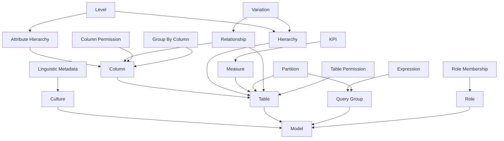

```mermaid

flowchart TD
  attribute_hierarchy[Attribute Hierarchy]
  
  
  column_permission[Column Permission]
  column[Column]
  culture[Culture]
  
  expression[Expression]
  
  
  group_by_column[Group By Column]
  hierarchy[Hierarchy]
  kpi[KPI]
  level[Level]
  linguistic_metadata[Linguistic Metadata]
  measure[Measure]
  model[Model]
  partition[Partition]

  query_group[Query Group]
  relationship[Relationship]
  role_membership[Role Membership]
  role[Role]
  
  table_permission[Table Permission]
  table[Table]
  variation[Variation]

  level --> attribute_hierarchy --> column
  relationship & column_permission & group_by_column --> column --> table
  linguistic_metadata --> culture --> model
  expression --> query_group
  level & variation --> hierarchy --> table
  kpi --> measure --> table --> model
  partition --> table & query_group
  query_group --> model
  variation --> relationship --> table
  role_membership --> role --> model
  table_permission --> table
```