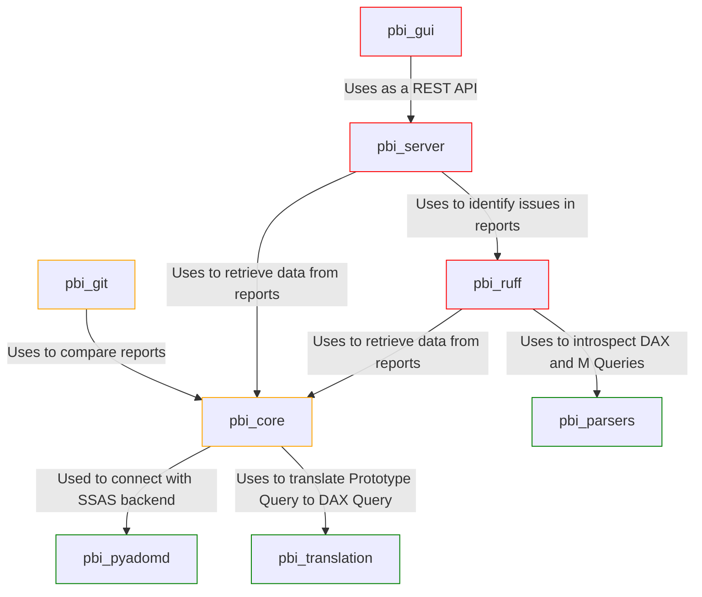
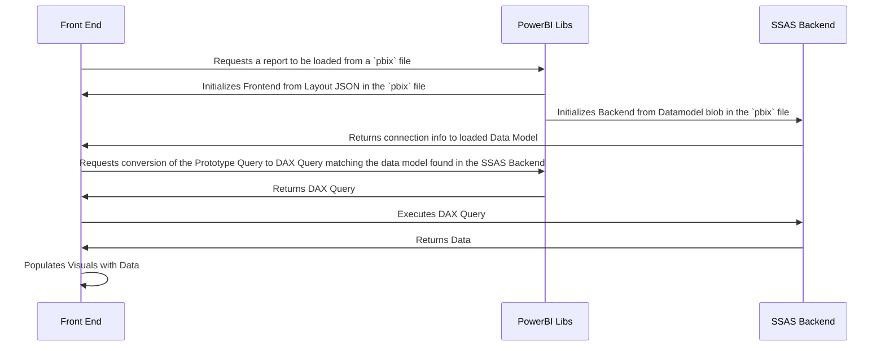

# Power BI Libraries Overview

**pbi_core**: The main library. This library provides the core functionality for working with Power BI reports. It can:
- Independently create an SSAS backend and load a Power BI report file (.pbix), allowing for programmatic manipulation of Power BI reports.
- Run performance traces and extract the data for visuals, measures, columns, and tables in the Power BI report.
- Provides a full [attrs](https://www.attrs.org/en/stable/) model for the Power BI layout.

**pbi_parsers**: A library that provides parsers for the DAX and M Query languages used in Power BI. This library allows deeper introspection of the queries used in a report. It also implements basic auto-formatting for DAX queries.

**pbi_translation**: A simple library providing an interface to translate the VisualContainers' Prototype Query to DAX Query. It uses the same library as the PowerBI Desktop to ensure that the DAX Query is identical to the one generated by PowerBI Desktop. This library is used by the pbi_core library to convert the Prototype Query to DAX Query. Please refer to the flowchart below for the process of populating data in Power BI visuals.

**pbi_ruff**: Currently residing in the pbi_core repository, this is a collection of ruff-style rules for Power BI reports. Rules are used to ensure that Power BI reports follow best practices and maintainability standards. Rules are applied to the layout, DAX, and PowerQuery entities in the Power BI report.

**pbi_pyadomd**: A fork of the [original pyadomd library](https://github.com/S-C-O-U-T/Pyadomd), which is a Python client for the Microsoft Analysis Services Tabular Data Model. Adds logging, more typing at the C# and python level, and some additional features such as support for streaming results. Additions were done to support various downstream libraries.

**pbi_gui**: A graphical user interface for the PBI_CORE library, providing a user-friendly way to interact with the functionality of the PBI_CORE and pbi_ruff libraries. 

**pbi_server**: A server that provides a REST API for the pbi_core library, allowing for remote access to the functionality of the pbi_core and pbi_ruff libraries. The server is designed to be used in conjunction with the pbi_gui library, but can also be used independently.

In the following flowchart:

- Packages in green are considered feature complete and essentially stable.
- Packages in orange are in active development, but should be usable for most basic scenarios.
- Packages in red are experimental and are recommended only for advanced users or contributors.

## Populating Data in Power BI Visuals

Given this library's focus on Power BI and its data model, it is important to understand how data is populated in Power BI visuals from a `pbix` file. The following sequence diagram illustrates the process:

- `PowerBI Libs` are the various libraries used by the Power BI GUI (both on Desktop and in `app.powerbi.com`) to interact with the SSAS backend. These are largely invisible to the user.
- `Front End` is the Power BI GUI, which is responsible for rendering the visuals and interacting with the user. This is the Desktop application or the web application itself.
- `SSAS Backend` is the Analysis Services Tabular Data Model that stores the data model and executes DAX queries.

