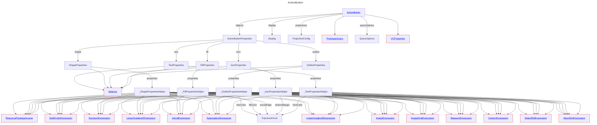

```mermaid
---
title: ActionButton
---
graph 
ActionButton[<a href='/layout/erd/ActionButton'>ActionButton</a>]
ActionButtonProperties[ActionButtonProperties]
AggregationExpression[<a href='/layout/erd/AggregationExpression'>AggregationExpression</a>]
style AggregationExpression stroke:#ff0000,stroke-width:1px
AlgorithmExpression[<a href='/layout/erd/AlgorithmExpression'>AlgorithmExpression</a>]
style AlgorithmExpression stroke:#ff0000,stroke-width:1px
ColumnExpression[<a href='/layout/erd/ColumnExpression'>ColumnExpression</a>]
style ColumnExpression stroke:#ff0000,stroke-width:1px
Display[Display]
ExpressionList[ExpressionList]
FillProperties[FillProperties]
GeoJsonExpression[<a href='/layout/erd/GeoJsonExpression'>GeoJsonExpression</a>]
style GeoJsonExpression stroke:#ff0000,stroke-width:1px
IconProperties[IconProperties]
ImageExpression[<a href='/layout/erd/ImageExpression'>ImageExpression</a>]
style ImageExpression stroke:#ff0000,stroke-width:1px
ImageKindExpression[<a href='/layout/erd/ImageKindExpression'>ImageKindExpression</a>]
style ImageKindExpression stroke:#ff0000,stroke-width:1px
LinearGradient2Expression[<a href='/layout/erd/LinearGradient2Expression'>LinearGradient2Expression</a>]
style LinearGradient2Expression stroke:#ff0000,stroke-width:1px
LinearGradient3Expression[<a href='/layout/erd/LinearGradient3Expression'>LinearGradient3Expression</a>]
style LinearGradient3Expression stroke:#ff0000,stroke-width:1px
LiteralExpression[<a href='/layout/erd/LiteralExpression'>LiteralExpression</a>]
style LiteralExpression stroke:#ff0000,stroke-width:1px
MeasureExpression[<a href='/layout/erd/MeasureExpression'>MeasureExpression</a>]
style MeasureExpression stroke:#ff0000,stroke-width:1px
OutlineProperties[OutlineProperties]
ProjectionConfig[ProjectionConfig]
PrototypeQuery[<a href='/layout/erd/PrototypeQuery'>PrototypeQuery</a>]
style PrototypeQuery stroke:#ff0000,stroke-width:1px
QueryOptions[QueryOptions]
ResourcePackageAccess[<a href='/layout/erd/ResourcePackageAccess'>ResourcePackageAccess</a>]
style ResourcePackageAccess stroke:#ff0000,stroke-width:1px
SelectRefExpression[<a href='/layout/erd/SelectRefExpression'>SelectRefExpression</a>]
style SelectRefExpression stroke:#ff0000,stroke-width:1px
Selector[<a href='/layout/erd/Selector'>Selector</a>]
style Selector stroke:#ff0000,stroke-width:1px
ShapeProperties[ShapeProperties]
SolidColorExpression[<a href='/layout/erd/SolidColorExpression'>SolidColorExpression</a>]
style SolidColorExpression stroke:#ff0000,stroke-width:1px
TextProperties[TextProperties]
VCProperties[<a href='/layout/erd/VCProperties'>VCProperties</a>]
style VCProperties stroke:#ff0000,stroke-width:1px
_FillPropertiesHelper[_FillPropertiesHelper]
_IconPropertiesHelper[_IconPropertiesHelper]
_OutlinePropertiesHelper[_OutlinePropertiesHelper]
_ShapePropertiesHelper[_ShapePropertiesHelper]
_TextPropertiesHelper[_TextPropertiesHelper]
_ShapePropertiesHelper ---> ImageKindExpression
_OutlinePropertiesHelper --->|lineColor| ExpressionList
IconProperties --->|properties| _IconPropertiesHelper
_FillPropertiesHelper ---> ResourcePackageAccess
_IconPropertiesHelper ---> ColumnExpression
_TextPropertiesHelper ---> LiteralExpression
_ShapePropertiesHelper ---> LinearGradient3Expression
_ShapePropertiesHelper ---> ResourcePackageAccess
_FillPropertiesHelper ---> SolidColorExpression
_ShapePropertiesHelper ---> AggregationExpression
_FillPropertiesHelper ---> GeoJsonExpression
_FillPropertiesHelper ---> LinearGradient2Expression
_IconPropertiesHelper ---> MeasureExpression
ActionButtonProperties --->|fill| FillProperties
_ShapePropertiesHelper ---> LinearGradient2Expression
_FillPropertiesHelper ---> LiteralExpression
_OutlinePropertiesHelper ---> GeoJsonExpression
_IconPropertiesHelper ---> AlgorithmExpression
_FillPropertiesHelper ---> AggregationExpression
_ShapePropertiesHelper ---> LiteralExpression
_OutlinePropertiesHelper ---> LinearGradient2Expression
_FillPropertiesHelper --->|fillColor| ExpressionList
ActionButton --->|projections| ProjectionConfig
_ShapePropertiesHelper ---> ColumnExpression
ActionButton ---> VCProperties
_OutlinePropertiesHelper ---> ResourcePackageAccess
TextProperties --->|properties| _TextPropertiesHelper
_OutlinePropertiesHelper ---> SelectRefExpression
TextProperties ---> Selector
_IconPropertiesHelper ---> ImageExpression
OutlineProperties --->|properties| _OutlinePropertiesHelper
_TextPropertiesHelper ---> ImageExpression
_OutlinePropertiesHelper ---> LiteralExpression
ShapeProperties --->|properties| _ShapePropertiesHelper
_ShapePropertiesHelper --->|roundEdge| ExpressionList
_IconPropertiesHelper --->|bottomMargin| ExpressionList
ActionButtonProperties --->|outline| OutlineProperties
_TextPropertiesHelper ---> SolidColorExpression
_FillPropertiesHelper ---> LinearGradient3Expression
_TextPropertiesHelper ---> SelectRefExpression
_ShapePropertiesHelper ---> ImageExpression
_ShapePropertiesHelper ---> SolidColorExpression
_IconPropertiesHelper ---> SelectRefExpression
_OutlinePropertiesHelper ---> ImageExpression
_TextPropertiesHelper ---> ImageKindExpression
_IconPropertiesHelper ---> ImageKindExpression
_TextPropertiesHelper ---> ColumnExpression
_ShapePropertiesHelper ---> MeasureExpression
_OutlinePropertiesHelper ---> SolidColorExpression
ShapeProperties ---> Selector
_TextPropertiesHelper ---> ResourcePackageAccess
IconProperties ---> Selector
_IconPropertiesHelper ---> SolidColorExpression
_FillPropertiesHelper ---> ImageExpression
ActionButtonProperties --->|icon| IconProperties
_OutlinePropertiesHelper ---> ImageKindExpression
ActionButtonProperties --->|text| TextProperties
_FillPropertiesHelper ---> ImageKindExpression
_TextPropertiesHelper ---> LinearGradient3Expression
_OutlinePropertiesHelper ---> LinearGradient3Expression
_OutlinePropertiesHelper ---> AggregationExpression
ActionButton ---> PrototypeQuery
_FillPropertiesHelper ---> MeasureExpression
_TextPropertiesHelper --->|fontColor| ExpressionList
_IconPropertiesHelper ---> ResourcePackageAccess
_TextPropertiesHelper ---> MeasureExpression
_OutlinePropertiesHelper ---> AlgorithmExpression
_IconPropertiesHelper ---> AggregationExpression
_ShapePropertiesHelper ---> SelectRefExpression
ActionButtonProperties --->|shape| ShapeProperties
_IconPropertiesHelper ---> LinearGradient2Expression
_IconPropertiesHelper ---> LinearGradient3Expression
_OutlinePropertiesHelper ---> ColumnExpression
_FillPropertiesHelper ---> ColumnExpression
_ShapePropertiesHelper ---> GeoJsonExpression
OutlineProperties ---> Selector
ActionButton --->|display| Display
_OutlinePropertiesHelper ---> MeasureExpression
ActionButton --->|queryOptions| QueryOptions
FillProperties ---> Selector
_ShapePropertiesHelper ---> AlgorithmExpression
_TextPropertiesHelper ---> AggregationExpression
FillProperties --->|properties| _FillPropertiesHelper
_TextPropertiesHelper ---> LinearGradient2Expression
_TextPropertiesHelper ---> AlgorithmExpression
_IconPropertiesHelper ---> GeoJsonExpression
_FillPropertiesHelper ---> SelectRefExpression
_IconPropertiesHelper ---> LiteralExpression
_TextPropertiesHelper ---> GeoJsonExpression
ActionButton --->|objects| ActionButtonProperties
_FillPropertiesHelper ---> AlgorithmExpression
```