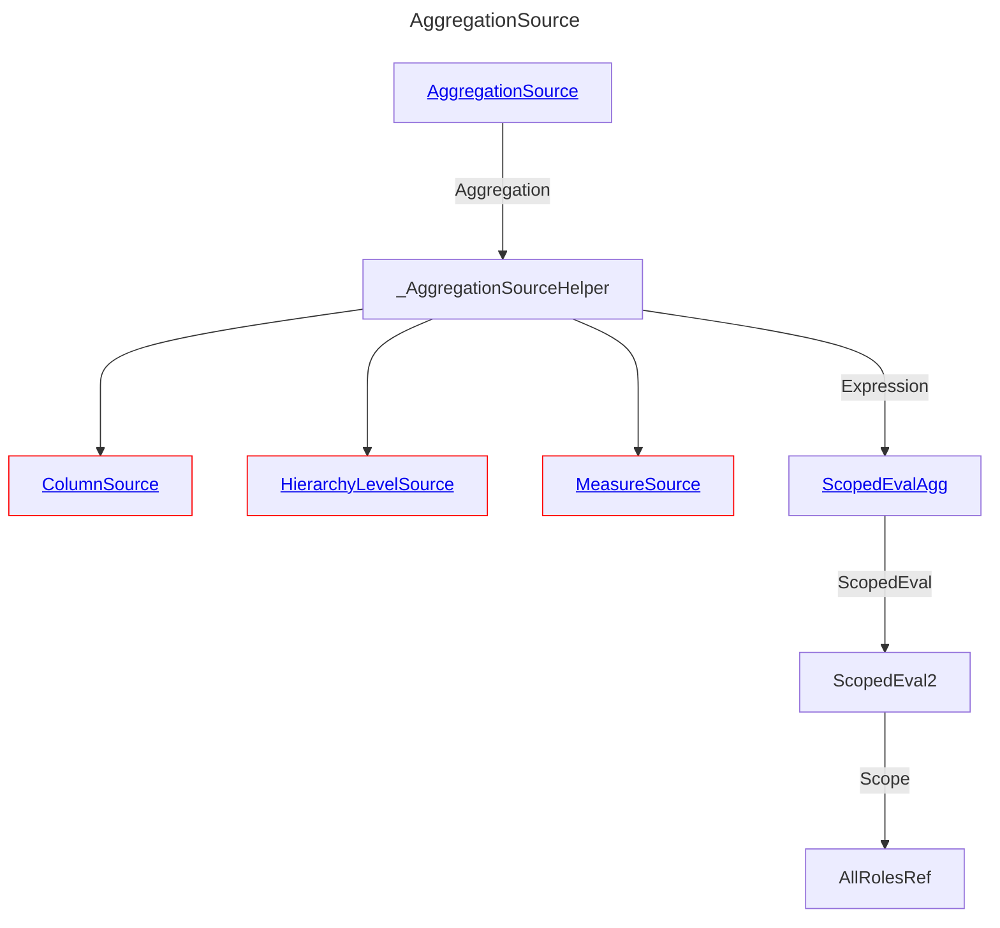

```mermaid
---
title: AggregationSource
---
graph 
AggregationSource[<a href='/layout/erd/AggregationSource'>AggregationSource</a>]
AllRolesRef[AllRolesRef]
ColumnSource[<a href='/layout/erd/ColumnSource'>ColumnSource</a>]
style ColumnSource stroke:#ff0000,stroke-width:1px
HierarchyLevelSource[<a href='/layout/erd/HierarchyLevelSource'>HierarchyLevelSource</a>]
style HierarchyLevelSource stroke:#ff0000,stroke-width:1px
MeasureSource[<a href='/layout/erd/MeasureSource'>MeasureSource</a>]
style MeasureSource stroke:#ff0000,stroke-width:1px
ScopedEval2[ScopedEval2]
ScopedEvalAgg[<a href='/layout/erd/ScopedEvalAgg'>ScopedEvalAgg</a>]
_AggregationSourceHelper[_AggregationSourceHelper]
ScopedEval2 --->|Scope| AllRolesRef
_AggregationSourceHelper ---> MeasureSource
_AggregationSourceHelper ---> ColumnSource
_AggregationSourceHelper ---> HierarchyLevelSource
AggregationSource --->|Aggregation| _AggregationSourceHelper
ScopedEvalAgg --->|ScopedEval| ScopedEval2
_AggregationSourceHelper --->|Expression| ScopedEvalAgg
```