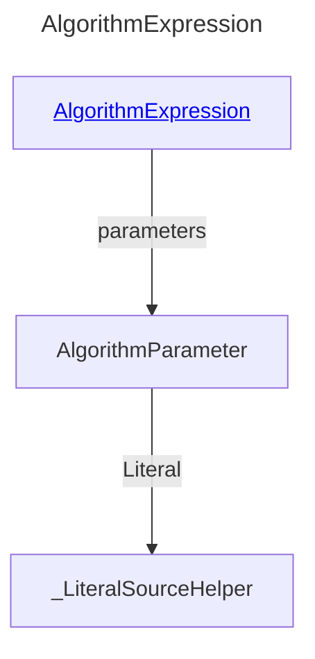

```mermaid
---
title: AlgorithmExpression
---
graph 
AlgorithmExpression[<a href='/layout/erd/AlgorithmExpression'>AlgorithmExpression</a>]
AlgorithmParameter[AlgorithmParameter]
_LiteralSourceHelper[_LiteralSourceHelper]
AlgorithmParameter --->|Literal| _LiteralSourceHelper
AlgorithmExpression --->|parameters| AlgorithmParameter
```