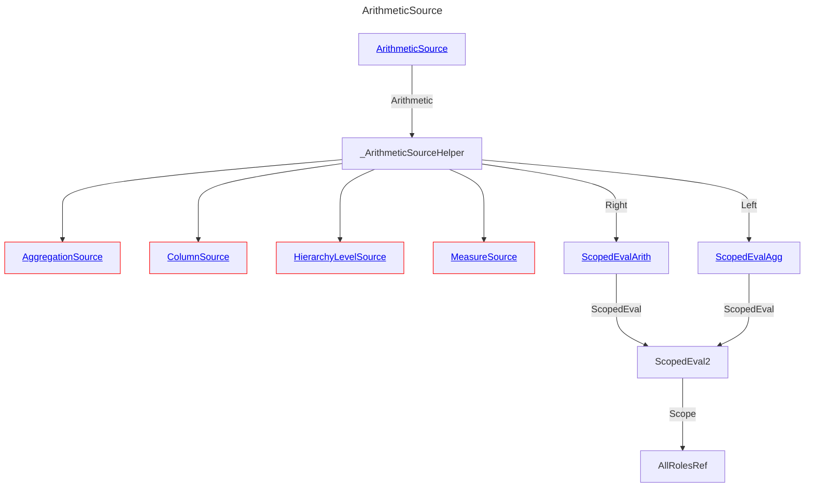

```mermaid
---
title: ArithmeticSource
---
graph 
AggregationSource[<a href='/layout/erd/AggregationSource'>AggregationSource</a>]
style AggregationSource stroke:#ff0000,stroke-width:1px
AllRolesRef[AllRolesRef]
ArithmeticSource[<a href='/layout/erd/ArithmeticSource'>ArithmeticSource</a>]
ColumnSource[<a href='/layout/erd/ColumnSource'>ColumnSource</a>]
style ColumnSource stroke:#ff0000,stroke-width:1px
HierarchyLevelSource[<a href='/layout/erd/HierarchyLevelSource'>HierarchyLevelSource</a>]
style HierarchyLevelSource stroke:#ff0000,stroke-width:1px
MeasureSource[<a href='/layout/erd/MeasureSource'>MeasureSource</a>]
style MeasureSource stroke:#ff0000,stroke-width:1px
ScopedEval2[ScopedEval2]
ScopedEvalAgg[<a href='/layout/erd/ScopedEvalAgg'>ScopedEvalAgg</a>]
ScopedEvalArith[<a href='/layout/erd/ScopedEvalArith'>ScopedEvalArith</a>]
_ArithmeticSourceHelper[_ArithmeticSourceHelper]
_ArithmeticSourceHelper --->|Left| ScopedEvalAgg
ScopedEval2 --->|Scope| AllRolesRef
_ArithmeticSourceHelper ---> AggregationSource
_ArithmeticSourceHelper --->|Right| ScopedEvalArith
ArithmeticSource --->|Arithmetic| _ArithmeticSourceHelper
_ArithmeticSourceHelper ---> HierarchyLevelSource
_ArithmeticSourceHelper ---> MeasureSource
_ArithmeticSourceHelper ---> ColumnSource
ScopedEvalArith --->|ScopedEval| ScopedEval2
ScopedEvalAgg --->|ScopedEval| ScopedEval2
```