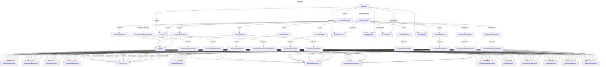

```mermaid
---
title: BarChart
---
graph 
AggregationExpression[<a href='/layout/erd/AggregationExpression'>AggregationExpression</a>]
style AggregationExpression stroke:#ff0000,stroke-width:1px
AlgorithmExpression[<a href='/layout/erd/AlgorithmExpression'>AlgorithmExpression</a>]
style AlgorithmExpression stroke:#ff0000,stroke-width:1px
BarChart[<a href='/layout/erd/BarChart'>BarChart</a>]
BarChartProperties[BarChartProperties]
CategoryAxisProperties[CategoryAxisProperties]
ColumnExpression[<a href='/layout/erd/ColumnExpression'>ColumnExpression</a>]
style ColumnExpression stroke:#ff0000,stroke-width:1px
ColumnProperty[<a href='/layout/erd/ColumnProperty'>ColumnProperty</a>]
DataPointProperties[DataPointProperties]
Display[Display]
ExpressionList[ExpressionList]
GeneralProperties[GeneralProperties]
GeoJsonExpression[<a href='/layout/erd/GeoJsonExpression'>GeoJsonExpression</a>]
style GeoJsonExpression stroke:#ff0000,stroke-width:1px
ImageExpression[<a href='/layout/erd/ImageExpression'>ImageExpression</a>]
style ImageExpression stroke:#ff0000,stroke-width:1px
ImageKindExpression[<a href='/layout/erd/ImageKindExpression'>ImageKindExpression</a>]
style ImageKindExpression stroke:#ff0000,stroke-width:1px
LabelsProperties[LabelsProperties]
LayoutProperties[LayoutProperties]
LegendProperties[LegendProperties]
LinearGradient2Expression[<a href='/layout/erd/LinearGradient2Expression'>LinearGradient2Expression</a>]
style LinearGradient2Expression stroke:#ff0000,stroke-width:1px
LinearGradient3Expression[<a href='/layout/erd/LinearGradient3Expression'>LinearGradient3Expression</a>]
style LinearGradient3Expression stroke:#ff0000,stroke-width:1px
LiteralExpression[<a href='/layout/erd/LiteralExpression'>LiteralExpression</a>]
style LiteralExpression stroke:#ff0000,stroke-width:1px
MeasureExpression[<a href='/layout/erd/MeasureExpression'>MeasureExpression</a>]
style MeasureExpression stroke:#ff0000,stroke-width:1px
ProjectionConfig[ProjectionConfig]
PrototypeQuery[<a href='/layout/erd/PrototypeQuery'>PrototypeQuery</a>]
style PrototypeQuery stroke:#ff0000,stroke-width:1px
QueryOptions[QueryOptions]
ResourcePackageAccess[<a href='/layout/erd/ResourcePackageAccess'>ResourcePackageAccess</a>]
style ResourcePackageAccess stroke:#ff0000,stroke-width:1px
RibbonBandsProperties[RibbonBandsProperties]
SelectRefExpression[<a href='/layout/erd/SelectRefExpression'>SelectRefExpression</a>]
style SelectRefExpression stroke:#ff0000,stroke-width:1px
Selector[<a href='/layout/erd/Selector'>Selector</a>]
style Selector stroke:#ff0000,stroke-width:1px
SolidColorExpression[<a href='/layout/erd/SolidColorExpression'>SolidColorExpression</a>]
style SolidColorExpression stroke:#ff0000,stroke-width:1px
VCProperties[<a href='/layout/erd/VCProperties'>VCProperties</a>]
style VCProperties stroke:#ff0000,stroke-width:1px
ValueAxisProperties[ValueAxisProperties]
XAxisReferenceLineProperties[XAxisReferenceLineProperties]
ZoomProperties[ZoomProperties]
_CategoryAxisPropertiesHelper[_CategoryAxisPropertiesHelper]
_DataPointPropertiesHelper[_DataPointPropertiesHelper]
_GeneralPropertiesHelper[_GeneralPropertiesHelper]
_LabelsPropertiesHelper[_LabelsPropertiesHelper]
_LayoutPropertiesHelper[_LayoutPropertiesHelper]
_LegendPropertiesHelper[_LegendPropertiesHelper]
_RibbonBandsPropertiesHelper[_RibbonBandsPropertiesHelper]
_ValueAxisPropertiesHelper[_ValueAxisPropertiesHelper]
_XAxisReferenceLinePropertiesHelper[_XAxisReferenceLinePropertiesHelper]
_ZoomPropertiesHelper[_ZoomPropertiesHelper]
BarChart --->|objects| BarChartProperties
_ZoomPropertiesHelper ---> SolidColorExpression
_LegendPropertiesHelper ---> ColumnExpression
_LabelsPropertiesHelper ---> ColumnExpression
_LayoutPropertiesHelper ---> SelectRefExpression
_RibbonBandsPropertiesHelper ---> AggregationExpression
_LabelsPropertiesHelper ---> MeasureExpression
_RibbonBandsPropertiesHelper ---> GeoJsonExpression
_DataPointPropertiesHelper ---> ImageKindExpression
ValueAxisProperties --->|properties| _ValueAxisPropertiesHelper
BarChart ---> PrototypeQuery
_XAxisReferenceLinePropertiesHelper ---> ResourcePackageAccess
BarChartProperties --->|valueAxis| ValueAxisProperties
_RibbonBandsPropertiesHelper --->|borderColorMatchFill| ExpressionList
LegendProperties --->|properties| _LegendPropertiesHelper
LayoutProperties --->|properties| _LayoutPropertiesHelper
_XAxisReferenceLinePropertiesHelper ---> AlgorithmExpression
_ValueAxisPropertiesHelper ---> LinearGradient3Expression
_LayoutPropertiesHelper ---> SolidColorExpression
_LegendPropertiesHelper ---> SolidColorExpression
ColumnProperty --->|display| Display
_CategoryAxisPropertiesHelper ---> SolidColorExpression
_LayoutPropertiesHelper ---> AggregationExpression
_ZoomPropertiesHelper ---> LinearGradient2Expression
_RibbonBandsPropertiesHelper ---> LiteralExpression
_LayoutPropertiesHelper ---> LinearGradient2Expression
BarChart --->|columnProperties| ColumnProperty
_LegendPropertiesHelper ---> ResourcePackageAccess
BarChart --->|queryOptions| QueryOptions
_CategoryAxisPropertiesHelper ---> ColumnExpression
_CategoryAxisPropertiesHelper --->|axisStyle| ExpressionList
_RibbonBandsPropertiesHelper ---> ImageExpression
BarChartProperties --->|general| GeneralProperties
_LabelsPropertiesHelper ---> SelectRefExpression
_GeneralPropertiesHelper ---> SolidColorExpression
_LabelsPropertiesHelper ---> SolidColorExpression
BarChartProperties --->|legend| LegendProperties
_CategoryAxisPropertiesHelper ---> AggregationExpression
_XAxisReferenceLinePropertiesHelper ---> AggregationExpression
_GeneralPropertiesHelper ---> LinearGradient3Expression
_LabelsPropertiesHelper ---> AggregationExpression
_LabelsPropertiesHelper --->|backgroundColor| ExpressionList
_GeneralPropertiesHelper ---> MeasureExpression
_CategoryAxisPropertiesHelper ---> MeasureExpression
BarChartProperties --->|categoryAxis| CategoryAxisProperties
_LayoutPropertiesHelper --->|ribbonGapSize| ExpressionList
_ValueAxisPropertiesHelper ---> SelectRefExpression
_XAxisReferenceLinePropertiesHelper ---> ImageKindExpression
_ZoomPropertiesHelper ---> MeasureExpression
_ValueAxisPropertiesHelper ---> ImageKindExpression
_CategoryAxisPropertiesHelper ---> SelectRefExpression
_ZoomPropertiesHelper ---> ImageKindExpression
_LayoutPropertiesHelper ---> ImageKindExpression
XAxisReferenceLineProperties ---> Selector
DataPointProperties ---> Selector
_CategoryAxisPropertiesHelper ---> AlgorithmExpression
_GeneralPropertiesHelper ---> LiteralExpression
_LegendPropertiesHelper ---> ImageExpression
_XAxisReferenceLinePropertiesHelper ---> LinearGradient3Expression
RibbonBandsProperties --->|properties| _RibbonBandsPropertiesHelper
_RibbonBandsPropertiesHelper ---> ColumnExpression
_GeneralPropertiesHelper ---> ImageExpression
_ValueAxisPropertiesHelper ---> LinearGradient2Expression
_ZoomPropertiesHelper ---> ResourcePackageAccess
_GeneralPropertiesHelper ---> AlgorithmExpression
_DataPointPropertiesHelper ---> ColumnExpression
_RibbonBandsPropertiesHelper ---> LinearGradient2Expression
_LegendPropertiesHelper ---> ImageKindExpression
_LabelsPropertiesHelper ---> LinearGradient2Expression
_ValueAxisPropertiesHelper --->|axisScale| ExpressionList
_LayoutPropertiesHelper ---> ImageExpression
_ValueAxisPropertiesHelper ---> AggregationExpression
_GeneralPropertiesHelper ---> SelectRefExpression
ColumnProperty ---> PrototypeQuery
_ZoomPropertiesHelper ---> ColumnExpression
_LegendPropertiesHelper ---> LiteralExpression
_DataPointPropertiesHelper ---> LinearGradient3Expression
_LabelsPropertiesHelper ---> ResourcePackageAccess
_DataPointPropertiesHelper ---> ResourcePackageAccess
BarChartProperties --->|layout| LayoutProperties
_XAxisReferenceLinePropertiesHelper ---> ImageExpression
_RibbonBandsPropertiesHelper ---> SelectRefExpression
_XAxisReferenceLinePropertiesHelper ---> SolidColorExpression
ColumnProperty --->|projections| ProjectionConfig
_LegendPropertiesHelper --->|fontSize| ExpressionList
_CategoryAxisPropertiesHelper ---> ResourcePackageAccess
_RibbonBandsPropertiesHelper ---> MeasureExpression
_LegendPropertiesHelper ---> GeoJsonExpression
_CategoryAxisPropertiesHelper ---> ImageKindExpression
_GeneralPropertiesHelper ---> AggregationExpression
_XAxisReferenceLinePropertiesHelper --->|displayName| ExpressionList
_RibbonBandsPropertiesHelper ---> SolidColorExpression
BarChartProperties --->|labels| LabelsProperties
_GeneralPropertiesHelper ---> ImageKindExpression
_XAxisReferenceLinePropertiesHelper ---> ColumnExpression
ColumnProperty --->|queryOptions| QueryOptions
_LayoutPropertiesHelper ---> MeasureExpression
_GeneralPropertiesHelper ---> GeoJsonExpression
_LabelsPropertiesHelper ---> GeoJsonExpression
_CategoryAxisPropertiesHelper ---> LiteralExpression
XAxisReferenceLineProperties --->|properties| _XAxisReferenceLinePropertiesHelper
BarChart --->|display| Display
_ZoomPropertiesHelper ---> LinearGradient3Expression
_LegendPropertiesHelper ---> MeasureExpression
_RibbonBandsPropertiesHelper ---> ImageKindExpression
_DataPointPropertiesHelper ---> LinearGradient2Expression
_DataPointPropertiesHelper ---> AggregationExpression
_LayoutPropertiesHelper ---> LinearGradient3Expression
_LabelsPropertiesHelper ---> LinearGradient3Expression
_ValueAxisPropertiesHelper ---> MeasureExpression
_GeneralPropertiesHelper ---> LinearGradient2Expression
_XAxisReferenceLinePropertiesHelper ---> LiteralExpression
LabelsProperties --->|properties| _LabelsPropertiesHelper
_DataPointPropertiesHelper --->|borderColorMatchFill| ExpressionList
CategoryAxisProperties --->|properties| _CategoryAxisPropertiesHelper
_LabelsPropertiesHelper ---> LiteralExpression
_CategoryAxisPropertiesHelper ---> ImageExpression
_ValueAxisPropertiesHelper ---> LiteralExpression
_DataPointPropertiesHelper ---> LiteralExpression
_ZoomPropertiesHelper ---> LiteralExpression
BarChartProperties --->|dataPoint| DataPointProperties
_RibbonBandsPropertiesHelper ---> AlgorithmExpression
_XAxisReferenceLinePropertiesHelper ---> SelectRefExpression
ColumnProperty ---> VCProperties
_LayoutPropertiesHelper ---> ColumnExpression
ZoomProperties --->|properties| _ZoomPropertiesHelper
_CategoryAxisPropertiesHelper ---> LinearGradient2Expression
_ValueAxisPropertiesHelper ---> SolidColorExpression
_XAxisReferenceLinePropertiesHelper ---> MeasureExpression
_ZoomPropertiesHelper ---> GeoJsonExpression
_GeneralPropertiesHelper --->|altText| ExpressionList
_DataPointPropertiesHelper ---> GeoJsonExpression
_LayoutPropertiesHelper ---> AlgorithmExpression
_LegendPropertiesHelper ---> SelectRefExpression
BarChartProperties --->|xAxisReferenceLine| XAxisReferenceLineProperties
_DataPointPropertiesHelper ---> ImageExpression
_ZoomPropertiesHelper ---> AggregationExpression
_LegendPropertiesHelper ---> LinearGradient3Expression
_LegendPropertiesHelper ---> AlgorithmExpression
_DataPointPropertiesHelper ---> MeasureExpression
_LegendPropertiesHelper ---> LinearGradient2Expression
_GeneralPropertiesHelper ---> ColumnExpression
_ValueAxisPropertiesHelper ---> GeoJsonExpression
BarChartProperties --->|ribbonBands| RibbonBandsProperties
_DataPointPropertiesHelper ---> AlgorithmExpression
_XAxisReferenceLinePropertiesHelper ---> LinearGradient2Expression
BarChart ---> VCProperties
_CategoryAxisPropertiesHelper ---> LinearGradient3Expression
_ValueAxisPropertiesHelper ---> ColumnExpression
BarChart --->|projections| ProjectionConfig
_GeneralPropertiesHelper ---> ResourcePackageAccess
_CategoryAxisPropertiesHelper ---> GeoJsonExpression
_ZoomPropertiesHelper --->|show| ExpressionList
_ValueAxisPropertiesHelper ---> AlgorithmExpression
_ValueAxisPropertiesHelper ---> ImageExpression
_RibbonBandsPropertiesHelper ---> LinearGradient3Expression
_ZoomPropertiesHelper ---> SelectRefExpression
_LabelsPropertiesHelper ---> AlgorithmExpression
_ZoomPropertiesHelper ---> ImageExpression
_DataPointPropertiesHelper ---> SelectRefExpression
_LegendPropertiesHelper ---> AggregationExpression
_ZoomPropertiesHelper ---> AlgorithmExpression
_XAxisReferenceLinePropertiesHelper ---> GeoJsonExpression
_LayoutPropertiesHelper ---> GeoJsonExpression
DataPointProperties --->|properties| _DataPointPropertiesHelper
GeneralProperties --->|properties| _GeneralPropertiesHelper
_DataPointPropertiesHelper ---> SolidColorExpression
_LabelsPropertiesHelper ---> ImageKindExpression
BarChartProperties --->|zoom| ZoomProperties
_ValueAxisPropertiesHelper ---> ResourcePackageAccess
_LayoutPropertiesHelper ---> ResourcePackageAccess
_LayoutPropertiesHelper ---> LiteralExpression
LabelsProperties ---> Selector
_RibbonBandsPropertiesHelper ---> ResourcePackageAccess
_LabelsPropertiesHelper ---> ImageExpression
```