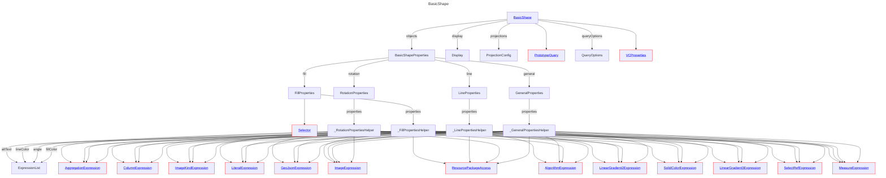

```mermaid
---
title: BasicShape
---
graph 
AggregationExpression[<a href='/layout/erd/AggregationExpression'>AggregationExpression</a>]
style AggregationExpression stroke:#ff0000,stroke-width:1px
AlgorithmExpression[<a href='/layout/erd/AlgorithmExpression'>AlgorithmExpression</a>]
style AlgorithmExpression stroke:#ff0000,stroke-width:1px
BasicShape[<a href='/layout/erd/BasicShape'>BasicShape</a>]
BasicShapeProperties[BasicShapeProperties]
ColumnExpression[<a href='/layout/erd/ColumnExpression'>ColumnExpression</a>]
style ColumnExpression stroke:#ff0000,stroke-width:1px
Display[Display]
ExpressionList[ExpressionList]
FillProperties[FillProperties]
GeneralProperties[GeneralProperties]
GeoJsonExpression[<a href='/layout/erd/GeoJsonExpression'>GeoJsonExpression</a>]
style GeoJsonExpression stroke:#ff0000,stroke-width:1px
ImageExpression[<a href='/layout/erd/ImageExpression'>ImageExpression</a>]
style ImageExpression stroke:#ff0000,stroke-width:1px
ImageKindExpression[<a href='/layout/erd/ImageKindExpression'>ImageKindExpression</a>]
style ImageKindExpression stroke:#ff0000,stroke-width:1px
LineProperties[LineProperties]
LinearGradient2Expression[<a href='/layout/erd/LinearGradient2Expression'>LinearGradient2Expression</a>]
style LinearGradient2Expression stroke:#ff0000,stroke-width:1px
LinearGradient3Expression[<a href='/layout/erd/LinearGradient3Expression'>LinearGradient3Expression</a>]
style LinearGradient3Expression stroke:#ff0000,stroke-width:1px
LiteralExpression[<a href='/layout/erd/LiteralExpression'>LiteralExpression</a>]
style LiteralExpression stroke:#ff0000,stroke-width:1px
MeasureExpression[<a href='/layout/erd/MeasureExpression'>MeasureExpression</a>]
style MeasureExpression stroke:#ff0000,stroke-width:1px
ProjectionConfig[ProjectionConfig]
PrototypeQuery[<a href='/layout/erd/PrototypeQuery'>PrototypeQuery</a>]
style PrototypeQuery stroke:#ff0000,stroke-width:1px
QueryOptions[QueryOptions]
ResourcePackageAccess[<a href='/layout/erd/ResourcePackageAccess'>ResourcePackageAccess</a>]
style ResourcePackageAccess stroke:#ff0000,stroke-width:1px
RotationProperties[RotationProperties]
SelectRefExpression[<a href='/layout/erd/SelectRefExpression'>SelectRefExpression</a>]
style SelectRefExpression stroke:#ff0000,stroke-width:1px
Selector[<a href='/layout/erd/Selector'>Selector</a>]
style Selector stroke:#ff0000,stroke-width:1px
SolidColorExpression[<a href='/layout/erd/SolidColorExpression'>SolidColorExpression</a>]
style SolidColorExpression stroke:#ff0000,stroke-width:1px
VCProperties[<a href='/layout/erd/VCProperties'>VCProperties</a>]
style VCProperties stroke:#ff0000,stroke-width:1px
_FillPropertiesHelper[_FillPropertiesHelper]
_GeneralPropertiesHelper[_GeneralPropertiesHelper]
_LinePropertiesHelper[_LinePropertiesHelper]
_RotationPropertiesHelper[_RotationPropertiesHelper]
BasicShape --->|objects| BasicShapeProperties
_GeneralPropertiesHelper --->|altText| ExpressionList
_FillPropertiesHelper ---> ColumnExpression
_RotationPropertiesHelper ---> MeasureExpression
_RotationPropertiesHelper ---> AggregationExpression
BasicShapeProperties --->|general| GeneralProperties
BasicShapeProperties --->|rotation| RotationProperties
_FillPropertiesHelper ---> ImageExpression
_FillPropertiesHelper ---> ResourcePackageAccess
_LinePropertiesHelper ---> ImageKindExpression
_RotationPropertiesHelper ---> LiteralExpression
_GeneralPropertiesHelper ---> AggregationExpression
_LinePropertiesHelper ---> AlgorithmExpression
_RotationPropertiesHelper ---> GeoJsonExpression
_LinePropertiesHelper ---> SelectRefExpression
_LinePropertiesHelper ---> ResourcePackageAccess
_GeneralPropertiesHelper ---> ColumnExpression
_RotationPropertiesHelper ---> ResourcePackageAccess
FillProperties ---> Selector
_LinePropertiesHelper ---> ImageExpression
_GeneralPropertiesHelper ---> ImageKindExpression
LineProperties --->|properties| _LinePropertiesHelper
_RotationPropertiesHelper ---> LinearGradient3Expression
_LinePropertiesHelper --->|lineColor| ExpressionList
_FillPropertiesHelper ---> ImageKindExpression
_GeneralPropertiesHelper ---> LiteralExpression
_GeneralPropertiesHelper ---> GeoJsonExpression
_RotationPropertiesHelper ---> SolidColorExpression
BasicShape --->|queryOptions| QueryOptions
_LinePropertiesHelper ---> LinearGradient2Expression
_RotationPropertiesHelper ---> ImageKindExpression
_FillPropertiesHelper ---> SolidColorExpression
_LinePropertiesHelper ---> LinearGradient3Expression
_FillPropertiesHelper ---> GeoJsonExpression
_GeneralPropertiesHelper ---> ImageExpression
_LinePropertiesHelper ---> ColumnExpression
_GeneralPropertiesHelper ---> ResourcePackageAccess
FillProperties --->|properties| _FillPropertiesHelper
_LinePropertiesHelper ---> GeoJsonExpression
BasicShapeProperties --->|line| LineProperties
_FillPropertiesHelper ---> MeasureExpression
_FillPropertiesHelper ---> LinearGradient2Expression
_GeneralPropertiesHelper ---> AlgorithmExpression
_RotationPropertiesHelper ---> LinearGradient2Expression
_RotationPropertiesHelper ---> ColumnExpression
_RotationPropertiesHelper --->|angle| ExpressionList
_LinePropertiesHelper ---> MeasureExpression
_FillPropertiesHelper ---> LiteralExpression
_FillPropertiesHelper ---> LinearGradient3Expression
_RotationPropertiesHelper ---> ImageExpression
BasicShape ---> VCProperties
_GeneralPropertiesHelper ---> LinearGradient2Expression
_FillPropertiesHelper ---> AggregationExpression
GeneralProperties --->|properties| _GeneralPropertiesHelper
_FillPropertiesHelper ---> SelectRefExpression
_GeneralPropertiesHelper ---> SolidColorExpression
RotationProperties --->|properties| _RotationPropertiesHelper
_FillPropertiesHelper --->|fillColor| ExpressionList
_GeneralPropertiesHelper ---> LinearGradient3Expression
BasicShape --->|projections| ProjectionConfig
_RotationPropertiesHelper ---> AlgorithmExpression
_RotationPropertiesHelper ---> SelectRefExpression
_GeneralPropertiesHelper ---> SelectRefExpression
BasicShape --->|display| Display
BasicShapeProperties --->|fill| FillProperties
_LinePropertiesHelper ---> SolidColorExpression
_GeneralPropertiesHelper ---> MeasureExpression
_LinePropertiesHelper ---> AggregationExpression
_FillPropertiesHelper ---> AlgorithmExpression
_LinePropertiesHelper ---> LiteralExpression
BasicShape ---> PrototypeQuery
```