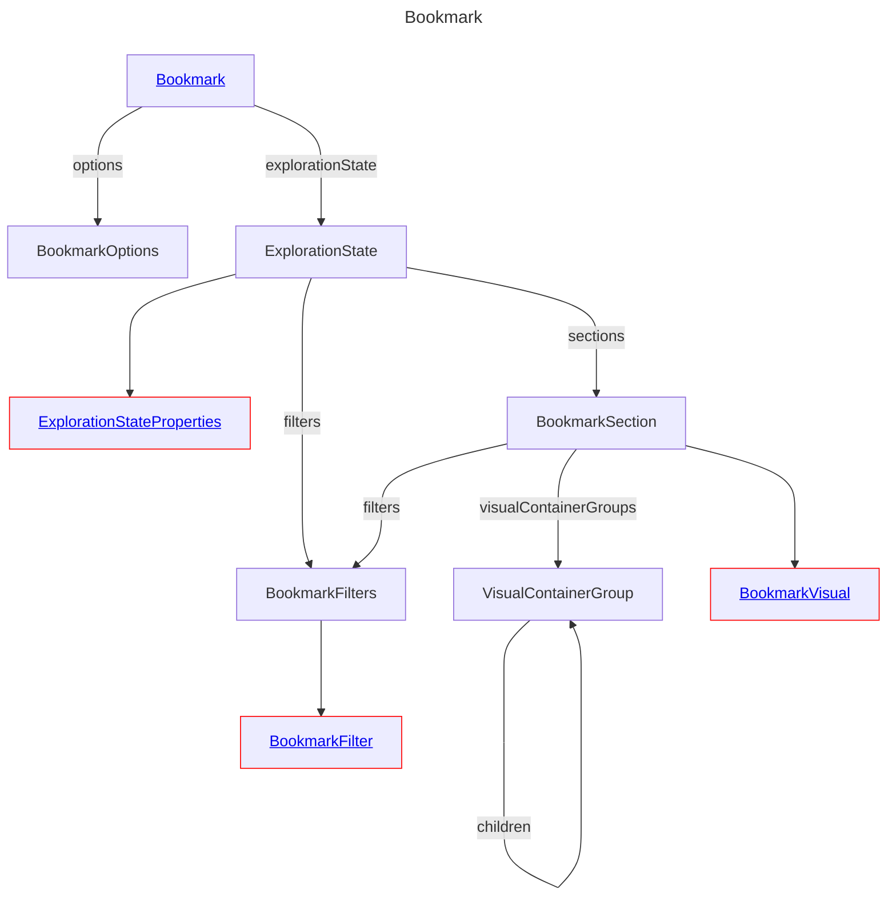

```mermaid
---
title: Bookmark
---
graph 
Bookmark[<a href='/layout/erd/Bookmark'>Bookmark</a>]
BookmarkFilter[<a href='/layout/erd/BookmarkFilter'>BookmarkFilter</a>]
style BookmarkFilter stroke:#ff0000,stroke-width:1px
BookmarkFilters[BookmarkFilters]
BookmarkOptions[BookmarkOptions]
BookmarkSection[BookmarkSection]
BookmarkVisual[<a href='/layout/erd/BookmarkVisual'>BookmarkVisual</a>]
style BookmarkVisual stroke:#ff0000,stroke-width:1px
ExplorationState[ExplorationState]
ExplorationStateProperties[<a href='/layout/erd/ExplorationStateProperties'>ExplorationStateProperties</a>]
style ExplorationStateProperties stroke:#ff0000,stroke-width:1px
VisualContainerGroup[VisualContainerGroup]
Bookmark --->|options| BookmarkOptions
Bookmark --->|explorationState| ExplorationState
ExplorationState ---> ExplorationStateProperties
VisualContainerGroup --->|children| VisualContainerGroup
BookmarkSection --->|filters| BookmarkFilters
BookmarkSection --->|visualContainerGroups| VisualContainerGroup
ExplorationState --->|filters| BookmarkFilters
BookmarkFilters ---> BookmarkFilter
BookmarkSection ---> BookmarkVisual
ExplorationState --->|sections| BookmarkSection
```