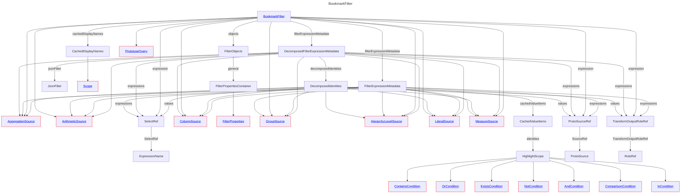

```mermaid
---
title: BookmarkFilter
---
graph 
AggregationSource[<a href='/layout/erd/AggregationSource'>AggregationSource</a>]
style AggregationSource stroke:#ff0000,stroke-width:1px
AndCondition[<a href='/layout/erd/AndCondition'>AndCondition</a>]
style AndCondition stroke:#ff0000,stroke-width:1px
ArithmeticSource[<a href='/layout/erd/ArithmeticSource'>ArithmeticSource</a>]
style ArithmeticSource stroke:#ff0000,stroke-width:1px
BookmarkFilter[<a href='/layout/erd/BookmarkFilter'>BookmarkFilter</a>]
CachedDisplayNames[CachedDisplayNames]
CachedValueItems[CachedValueItems]
ColumnSource[<a href='/layout/erd/ColumnSource'>ColumnSource</a>]
style ColumnSource stroke:#ff0000,stroke-width:1px
ComparisonCondition[<a href='/layout/erd/ComparisonCondition'>ComparisonCondition</a>]
style ComparisonCondition stroke:#ff0000,stroke-width:1px
ContainsCondition[<a href='/layout/erd/ContainsCondition'>ContainsCondition</a>]
style ContainsCondition stroke:#ff0000,stroke-width:1px
DecomposedFilterExpressionMetadata[DecomposedFilterExpressionMetadata]
DecomposedIdentities[DecomposedIdentities]
ExistsCondition[<a href='/layout/erd/ExistsCondition'>ExistsCondition</a>]
style ExistsCondition stroke:#ff0000,stroke-width:1px
ExpressionName[ExpressionName]
FilterExpressionMetadata[FilterExpressionMetadata]
FilterObjects[FilterObjects]
FilterProperties[<a href='/layout/erd/FilterProperties'>FilterProperties</a>]
style FilterProperties stroke:#ff0000,stroke-width:1px
FilterPropertiesContainer[FilterPropertiesContainer]
GroupSource[<a href='/layout/erd/GroupSource'>GroupSource</a>]
style GroupSource stroke:#ff0000,stroke-width:1px
HierarchyLevelSource[<a href='/layout/erd/HierarchyLevelSource'>HierarchyLevelSource</a>]
style HierarchyLevelSource stroke:#ff0000,stroke-width:1px
HighlightScope[HighlightScope]
InCondition[<a href='/layout/erd/InCondition'>InCondition</a>]
style InCondition stroke:#ff0000,stroke-width:1px
JsonFilter[JsonFilter]
LiteralSource[<a href='/layout/erd/LiteralSource'>LiteralSource</a>]
style LiteralSource stroke:#ff0000,stroke-width:1px
MeasureSource[<a href='/layout/erd/MeasureSource'>MeasureSource</a>]
style MeasureSource stroke:#ff0000,stroke-width:1px
NotCondition[<a href='/layout/erd/NotCondition'>NotCondition</a>]
style NotCondition stroke:#ff0000,stroke-width:1px
OrCondition[<a href='/layout/erd/OrCondition'>OrCondition</a>]
style OrCondition stroke:#ff0000,stroke-width:1px
ProtoSource[ProtoSource]
ProtoSourceRef[ProtoSourceRef]
PrototypeQuery[<a href='/layout/erd/PrototypeQuery'>PrototypeQuery</a>]
style PrototypeQuery stroke:#ff0000,stroke-width:1px
RoleRef[RoleRef]
Scope[<a href='/layout/erd/Scope'>Scope</a>]
style Scope stroke:#ff0000,stroke-width:1px
SelectRef[SelectRef]
TransformOutputRoleRef[TransformOutputRoleRef]
HighlightScope ---> ContainsCondition
HighlightScope ---> OrCondition
BookmarkFilter --->|filterExpressionMetadata| FilterExpressionMetadata
FilterPropertiesContainer ---> FilterProperties
FilterExpressionMetadata --->|expressions| ProtoSourceRef
DecomposedFilterExpressionMetadata --->|decomposedIdentities| DecomposedIdentities
FilterExpressionMetadata --->|expressions| TransformOutputRoleRef
HighlightScope ---> ExistsCondition
DecomposedFilterExpressionMetadata ---> ArithmeticSource
DecomposedFilterExpressionMetadata ---> GroupSource
FilterExpressionMetadata ---> ArithmeticSource
HighlightScope ---> NotCondition
DecomposedIdentities ---> GroupSource
CachedValueItems --->|identities| HighlightScope
ProtoSourceRef --->|SourceRef| ProtoSource
DecomposedIdentities ---> ArithmeticSource
BookmarkFilter --->|expression| TransformOutputRoleRef
CachedDisplayNames ---> Scope
BookmarkFilter ---> GroupSource
BookmarkFilter --->|objects| FilterObjects
BookmarkFilter --->|expression| ProtoSourceRef
BookmarkFilter ---> MeasureSource
FilterExpressionMetadata ---> ColumnSource
DecomposedFilterExpressionMetadata --->|jsonFilter| JsonFilter
DecomposedIdentities ---> AggregationSource
DecomposedIdentities --->|values| SelectRef
TransformOutputRoleRef --->|TransformOutputRoleRef| RoleRef
BookmarkFilter --->|expression| SelectRef
HighlightScope ---> AndCondition
FilterExpressionMetadata --->|cachedValueItems| CachedValueItems
DecomposedFilterExpressionMetadata --->|expressions| SelectRef
DecomposedFilterExpressionMetadata ---> LiteralSource
DecomposedIdentities ---> ColumnSource
HighlightScope ---> ComparisonCondition
BookmarkFilter ---> PrototypeQuery
FilterExpressionMetadata ---> LiteralSource
DecomposedFilterExpressionMetadata ---> HierarchyLevelSource
DecomposedIdentities ---> LiteralSource
DecomposedFilterExpressionMetadata ---> MeasureSource
BookmarkFilter --->|cachedDisplayNames| CachedDisplayNames
BookmarkFilter ---> HierarchyLevelSource
BookmarkFilter ---> ColumnSource
BookmarkFilter --->|filterExpressionMetadata| DecomposedFilterExpressionMetadata
SelectRef --->|SelectRef| ExpressionName
DecomposedIdentities ---> MeasureSource
FilterExpressionMetadata --->|expressions| SelectRef
FilterExpressionMetadata ---> HierarchyLevelSource
DecomposedFilterExpressionMetadata ---> ColumnSource
DecomposedIdentities ---> HierarchyLevelSource
FilterExpressionMetadata ---> GroupSource
FilterExpressionMetadata ---> MeasureSource
BookmarkFilter ---> AggregationSource
FilterExpressionMetadata ---> AggregationSource
HighlightScope ---> InCondition
BookmarkFilter ---> ArithmeticSource
BookmarkFilter ---> LiteralSource
DecomposedFilterExpressionMetadata --->|expressions| ProtoSourceRef
DecomposedFilterExpressionMetadata --->|expressions| TransformOutputRoleRef
FilterObjects --->|general| FilterPropertiesContainer
DecomposedIdentities --->|values| TransformOutputRoleRef
DecomposedIdentities --->|values| ProtoSourceRef
DecomposedFilterExpressionMetadata ---> AggregationSource
```