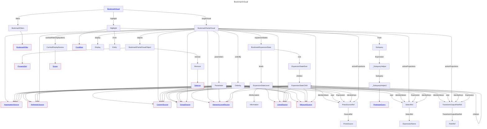

```mermaid
---
title: BookmarkVisual
---
graph 
AggregationSource[<a href='/layout/erd/AggregationSource'>AggregationSource</a>]
style AggregationSource stroke:#ff0000,stroke-width:1px
ArithmeticSource[<a href='/layout/erd/ArithmeticSource'>ArithmeticSource</a>]
style ArithmeticSource stroke:#ff0000,stroke-width:1px
BookmarkExpansionState[BookmarkExpansionState]
BookmarkFilter[<a href='/layout/erd/BookmarkFilter'>BookmarkFilter</a>]
style BookmarkFilter stroke:#ff0000,stroke-width:1px
BookmarkFilters[BookmarkFilters]
BookmarkPartialVisual[BookmarkPartialVisual]
BookmarkPartialVisualObject[BookmarkPartialVisualObject]
BookmarkVisual[<a href='/layout/erd/BookmarkVisual'>BookmarkVisual</a>]
CachedDisplayNames[CachedDisplayNames]
ColumnSource[<a href='/layout/erd/ColumnSource'>ColumnSource</a>]
style ColumnSource stroke:#ff0000,stroke-width:1px
Condition[<a href='/layout/erd/Condition'>Condition</a>]
style Condition stroke:#ff0000,stroke-width:1px
Display[Display]
Entity[Entity]
ExpansionStateChild[ExpansionStateChild]
ExpansionStateLevel[ExpansionStateLevel]
ExpansionStateRoot[ExpansionStateRoot]
ExpressionName[ExpressionName]
GroupSource[<a href='/layout/erd/GroupSource'>GroupSource</a>]
style GroupSource stroke:#ff0000,stroke-width:1px
HierarchyLevelSource[<a href='/layout/erd/HierarchyLevelSource'>HierarchyLevelSource</a>]
style HierarchyLevelSource stroke:#ff0000,stroke-width:1px
Highlight[Highlight]
Information[Information]
LiteralSource[<a href='/layout/erd/LiteralSource'>LiteralSource</a>]
style LiteralSource stroke:#ff0000,stroke-width:1px
MeasureSource[<a href='/layout/erd/MeasureSource'>MeasureSource</a>]
style MeasureSource stroke:#ff0000,stroke-width:1px
Orderby[Orderby]
Parameter[Parameter]
PropertyDef[<a href='/layout/erd/PropertyDef'>PropertyDef</a>]
style PropertyDef stroke:#ff0000,stroke-width:1px
ProtoSource[ProtoSource]
ProtoSourceRef[ProtoSourceRef]
PrototypeQuery[<a href='/layout/erd/PrototypeQuery'>PrototypeQuery</a>]
style PrototypeQuery stroke:#ff0000,stroke-width:1px
Remove[Remove]
RoleRef[RoleRef]
Scope[<a href='/layout/erd/Scope'>Scope</a>]
style Scope stroke:#ff0000,stroke-width:1px
SelectRef[SelectRef]
Selector[<a href='/layout/erd/Selector'>Selector</a>]
style Selector stroke:#ff0000,stroke-width:1px
Subquery[Subquery]
TransformOutputRoleRef[TransformOutputRoleRef]
_SubqueryHelper[_SubqueryHelper]
_SubqueryHelper2[_SubqueryHelper2]
ExpansionStateChild --->|identityValues| ProtoSourceRef
BookmarkVisual --->|singleVisual| BookmarkPartialVisual
Parameter ---> GroupSource
Highlight --->|From| Entity
BookmarkPartialVisual --->|orderBy| Orderby
ProtoSourceRef --->|SourceRef| ProtoSource
BookmarkPartialVisualObject ---> PropertyDef
Parameter --->|expr| SelectRef
ExpansionStateLevel ---> LiteralSource
BookmarkPartialVisual ---> AggregationSource
Orderby ---> HierarchyLevelSource
ExpansionStateChild ---> ArithmeticSource
BookmarkPartialVisual --->|cachedFilterDisplayItems| CachedDisplayNames
BookmarkPartialVisual ---> LiteralSource
Orderby ---> ArithmeticSource
Subquery --->|Expression| _SubqueryHelper
ExpansionStateLevel ---> ArithmeticSource
Orderby ---> AggregationSource
BookmarkPartialVisual --->|display| Display
Highlight ---> Condition
Parameter ---> ArithmeticSource
BookmarkPartialVisual ---> ArithmeticSource
Orderby ---> ColumnSource
Parameter ---> MeasureSource
_SubqueryHelper2 ---> PrototypeQuery
ExpansionStateRoot --->|children| ExpansionStateChild
BookmarkPartialVisual ---> ColumnSource
Parameter ---> ColumnSource
ExpansionStateChild --->|identityValues| SelectRef
BookmarkPartialVisual --->|expansionStates| BookmarkExpansionState
ExpansionStateChild ---> GroupSource
ExpansionStateChild --->|identityValues| TransformOutputRoleRef
ExpansionStateLevel --->|AIInformation| Information
ExpansionStateLevel ---> AggregationSource
TransformOutputRoleRef --->|TransformOutputRoleRef| RoleRef
ExpansionStateChild ---> LiteralSource
Parameter --->|expr| ProtoSourceRef
_SubqueryHelper --->|Subquery| _SubqueryHelper2
Parameter ---> AggregationSource
BookmarkPartialVisual --->|objects| BookmarkPartialVisualObject
BookmarkPartialVisual --->|activeProjections| SelectRef
Remove ---> Selector
BookmarkPartialVisualObject --->|remove| Remove
Parameter --->|expr| TransformOutputRoleRef
Orderby ---> LiteralSource
Orderby ---> MeasureSource
Highlight --->|From| Subquery
SelectRef --->|SelectRef| ExpressionName
ExpansionStateChild --->|children| ExpansionStateChild
BookmarkPartialVisual --->|activeProjections| TransformOutputRoleRef
Orderby --->|Expression| ProtoSourceRef
ExpansionStateLevel ---> MeasureSource
Orderby --->|Expression| SelectRef
Orderby ---> GroupSource
ExpansionStateChild ---> MeasureSource
BookmarkVisual --->|highlight| Highlight
BookmarkPartialVisual --->|parameters| Parameter
Parameter ---> LiteralSource
ExpansionStateLevel --->|identityKeys| ProtoSourceRef
BookmarkFilters ---> BookmarkFilter
CachedDisplayNames ---> Scope
ExpansionStateLevel --->|identityKeys| TransformOutputRoleRef
BookmarkPartialVisual ---> HierarchyLevelSource
ExpansionStateLevel ---> ColumnSource
Orderby --->|Expression| TransformOutputRoleRef
Parameter ---> HierarchyLevelSource
ExpansionStateLevel --->|identityKeys| SelectRef
ExpansionStateChild ---> HierarchyLevelSource
ExpansionStateChild ---> AggregationSource
BookmarkExpansionState --->|root| ExpansionStateRoot
ExpansionStateChild ---> ColumnSource
ExpansionStateLevel ---> GroupSource
BookmarkVisual --->|filters| BookmarkFilters
BookmarkPartialVisual ---> GroupSource
BookmarkPartialVisual --->|activeProjections| ProtoSourceRef
BookmarkExpansionState --->|levels| ExpansionStateLevel
ExpansionStateLevel ---> HierarchyLevelSource
BookmarkPartialVisual ---> MeasureSource
```