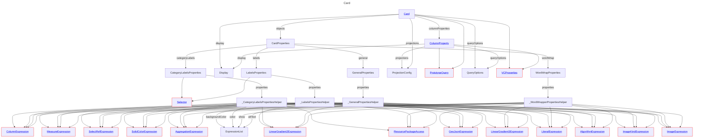

```mermaid
---
title: Card
---
graph 
AggregationExpression[<a href='/layout/erd/AggregationExpression'>AggregationExpression</a>]
style AggregationExpression stroke:#ff0000,stroke-width:1px
AlgorithmExpression[<a href='/layout/erd/AlgorithmExpression'>AlgorithmExpression</a>]
style AlgorithmExpression stroke:#ff0000,stroke-width:1px
Card[<a href='/layout/erd/Card'>Card</a>]
CardProperties[CardProperties]
CategoryLabelsProperties[CategoryLabelsProperties]
ColumnExpression[<a href='/layout/erd/ColumnExpression'>ColumnExpression</a>]
style ColumnExpression stroke:#ff0000,stroke-width:1px
ColumnProperty[<a href='/layout/erd/ColumnProperty'>ColumnProperty</a>]
Display[Display]
ExpressionList[ExpressionList]
GeneralProperties[GeneralProperties]
GeoJsonExpression[<a href='/layout/erd/GeoJsonExpression'>GeoJsonExpression</a>]
style GeoJsonExpression stroke:#ff0000,stroke-width:1px
ImageExpression[<a href='/layout/erd/ImageExpression'>ImageExpression</a>]
style ImageExpression stroke:#ff0000,stroke-width:1px
ImageKindExpression[<a href='/layout/erd/ImageKindExpression'>ImageKindExpression</a>]
style ImageKindExpression stroke:#ff0000,stroke-width:1px
LabelsProperties[LabelsProperties]
LinearGradient2Expression[<a href='/layout/erd/LinearGradient2Expression'>LinearGradient2Expression</a>]
style LinearGradient2Expression stroke:#ff0000,stroke-width:1px
LinearGradient3Expression[<a href='/layout/erd/LinearGradient3Expression'>LinearGradient3Expression</a>]
style LinearGradient3Expression stroke:#ff0000,stroke-width:1px
LiteralExpression[<a href='/layout/erd/LiteralExpression'>LiteralExpression</a>]
style LiteralExpression stroke:#ff0000,stroke-width:1px
MeasureExpression[<a href='/layout/erd/MeasureExpression'>MeasureExpression</a>]
style MeasureExpression stroke:#ff0000,stroke-width:1px
ProjectionConfig[ProjectionConfig]
PrototypeQuery[<a href='/layout/erd/PrototypeQuery'>PrototypeQuery</a>]
style PrototypeQuery stroke:#ff0000,stroke-width:1px
QueryOptions[QueryOptions]
ResourcePackageAccess[<a href='/layout/erd/ResourcePackageAccess'>ResourcePackageAccess</a>]
style ResourcePackageAccess stroke:#ff0000,stroke-width:1px
SelectRefExpression[<a href='/layout/erd/SelectRefExpression'>SelectRefExpression</a>]
style SelectRefExpression stroke:#ff0000,stroke-width:1px
Selector[<a href='/layout/erd/Selector'>Selector</a>]
style Selector stroke:#ff0000,stroke-width:1px
SolidColorExpression[<a href='/layout/erd/SolidColorExpression'>SolidColorExpression</a>]
style SolidColorExpression stroke:#ff0000,stroke-width:1px
VCProperties[<a href='/layout/erd/VCProperties'>VCProperties</a>]
style VCProperties stroke:#ff0000,stroke-width:1px
WordWrapProperties[WordWrapProperties]
_CategoryLabelsPropertiesHelper[_CategoryLabelsPropertiesHelper]
_GeneralPropertiesHelper[_GeneralPropertiesHelper]
_LabelsPropertiesHelper[_LabelsPropertiesHelper]
_WordWrapperPropertiesHelper[_WordWrapperPropertiesHelper]
Card --->|display| Display
_CategoryLabelsPropertiesHelper ---> ResourcePackageAccess
_LabelsPropertiesHelper ---> ColumnExpression
_LabelsPropertiesHelper ---> MeasureExpression
Card ---> VCProperties
_CategoryLabelsPropertiesHelper ---> AlgorithmExpression
ColumnProperty --->|display| Display
_WordWrapperPropertiesHelper ---> GeoJsonExpression
_LabelsPropertiesHelper ---> SelectRefExpression
_GeneralPropertiesHelper ---> SolidColorExpression
_LabelsPropertiesHelper ---> SolidColorExpression
_GeneralPropertiesHelper ---> LinearGradient3Expression
_LabelsPropertiesHelper ---> AggregationExpression
_CategoryLabelsPropertiesHelper ---> LiteralExpression
_LabelsPropertiesHelper --->|backgroundColor| ExpressionList
_GeneralPropertiesHelper ---> MeasureExpression
_CategoryLabelsPropertiesHelper ---> GeoJsonExpression
_CategoryLabelsPropertiesHelper --->|color| ExpressionList
Card --->|queryOptions| QueryOptions
CategoryLabelsProperties ---> Selector
_GeneralPropertiesHelper ---> LiteralExpression
_WordWrapperPropertiesHelper ---> LinearGradient3Expression
_GeneralPropertiesHelper ---> ImageExpression
_WordWrapperPropertiesHelper ---> ResourcePackageAccess
_GeneralPropertiesHelper ---> AlgorithmExpression
_CategoryLabelsPropertiesHelper ---> AggregationExpression
_WordWrapperPropertiesHelper ---> SolidColorExpression
_CategoryLabelsPropertiesHelper ---> ImageExpression
_CategoryLabelsPropertiesHelper ---> ImageKindExpression
_LabelsPropertiesHelper ---> LinearGradient2Expression
CardProperties --->|labels| LabelsProperties
_CategoryLabelsPropertiesHelper ---> LinearGradient2Expression
_GeneralPropertiesHelper ---> SelectRefExpression
ColumnProperty ---> PrototypeQuery
_WordWrapperPropertiesHelper ---> AggregationExpression
_WordWrapperPropertiesHelper ---> ImageKindExpression
_WordWrapperPropertiesHelper --->|show| ExpressionList
_LabelsPropertiesHelper ---> ResourcePackageAccess
ColumnProperty --->|projections| ProjectionConfig
_CategoryLabelsPropertiesHelper ---> SolidColorExpression
_GeneralPropertiesHelper ---> AggregationExpression
WordWrapProperties --->|properties| _WordWrapperPropertiesHelper
_GeneralPropertiesHelper ---> ImageKindExpression
ColumnProperty --->|queryOptions| QueryOptions
Card --->|objects| CardProperties
_GeneralPropertiesHelper ---> GeoJsonExpression
_LabelsPropertiesHelper ---> GeoJsonExpression
_LabelsPropertiesHelper ---> LinearGradient3Expression
_GeneralPropertiesHelper ---> LinearGradient2Expression
LabelsProperties --->|properties| _LabelsPropertiesHelper
CardProperties --->|wordWrap| WordWrapProperties
_WordWrapperPropertiesHelper ---> LiteralExpression
_LabelsPropertiesHelper ---> LiteralExpression
_WordWrapperPropertiesHelper ---> LinearGradient2Expression
ColumnProperty ---> VCProperties
_WordWrapperPropertiesHelper ---> SelectRefExpression
_GeneralPropertiesHelper --->|altText| ExpressionList
_CategoryLabelsPropertiesHelper ---> MeasureExpression
_GeneralPropertiesHelper ---> ColumnExpression
Card --->|projections| ProjectionConfig
Card ---> PrototypeQuery
_CategoryLabelsPropertiesHelper ---> SelectRefExpression
Card --->|columnProperties| ColumnProperty
_GeneralPropertiesHelper ---> ResourcePackageAccess
_CategoryLabelsPropertiesHelper ---> ColumnExpression
_WordWrapperPropertiesHelper ---> ColumnExpression
_WordWrapperPropertiesHelper ---> ImageExpression
CardProperties --->|general| GeneralProperties
_LabelsPropertiesHelper ---> AlgorithmExpression
CategoryLabelsProperties --->|properties| _CategoryLabelsPropertiesHelper
GeneralProperties --->|properties| _GeneralPropertiesHelper
_WordWrapperPropertiesHelper ---> AlgorithmExpression
_LabelsPropertiesHelper ---> ImageKindExpression
CardProperties --->|categoryLabels| CategoryLabelsProperties
_WordWrapperPropertiesHelper ---> MeasureExpression
_CategoryLabelsPropertiesHelper ---> LinearGradient3Expression
LabelsProperties ---> Selector
_LabelsPropertiesHelper ---> ImageExpression
```