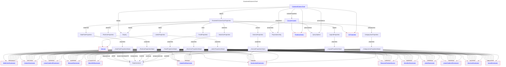

```mermaid
---
title: ClusteredColumnChart
---
graph 
AggregationExpression[<a href='/layout/erd/AggregationExpression'>AggregationExpression</a>]
style AggregationExpression stroke:#ff0000,stroke-width:1px
AlgorithmExpression[<a href='/layout/erd/AlgorithmExpression'>AlgorithmExpression</a>]
style AlgorithmExpression stroke:#ff0000,stroke-width:1px
CategoryAxisProperties[CategoryAxisProperties]
ClusteredColumnChart[<a href='/layout/erd/ClusteredColumnChart'>ClusteredColumnChart</a>]
ClusteredColumnChartProperties[ClusteredColumnChartProperties]
ColumnExpression[<a href='/layout/erd/ColumnExpression'>ColumnExpression</a>]
style ColumnExpression stroke:#ff0000,stroke-width:1px
ColumnProperty[<a href='/layout/erd/ColumnProperty'>ColumnProperty</a>]
DataPointProperties[DataPointProperties]
Display[Display]
ExpressionList[ExpressionList]
GeneralProperties[GeneralProperties]
GeoJsonExpression[<a href='/layout/erd/GeoJsonExpression'>GeoJsonExpression</a>]
style GeoJsonExpression stroke:#ff0000,stroke-width:1px
ImageExpression[<a href='/layout/erd/ImageExpression'>ImageExpression</a>]
style ImageExpression stroke:#ff0000,stroke-width:1px
ImageKindExpression[<a href='/layout/erd/ImageKindExpression'>ImageKindExpression</a>]
style ImageKindExpression stroke:#ff0000,stroke-width:1px
LabelsProperties[LabelsProperties]
LegendProperties[LegendProperties]
LinearGradient2Expression[<a href='/layout/erd/LinearGradient2Expression'>LinearGradient2Expression</a>]
style LinearGradient2Expression stroke:#ff0000,stroke-width:1px
LinearGradient3Expression[<a href='/layout/erd/LinearGradient3Expression'>LinearGradient3Expression</a>]
style LinearGradient3Expression stroke:#ff0000,stroke-width:1px
LiteralExpression[<a href='/layout/erd/LiteralExpression'>LiteralExpression</a>]
style LiteralExpression stroke:#ff0000,stroke-width:1px
MeasureExpression[<a href='/layout/erd/MeasureExpression'>MeasureExpression</a>]
style MeasureExpression stroke:#ff0000,stroke-width:1px
PlotAreaProperties[PlotAreaProperties]
ProjectionConfig[ProjectionConfig]
PrototypeQuery[<a href='/layout/erd/PrototypeQuery'>PrototypeQuery</a>]
style PrototypeQuery stroke:#ff0000,stroke-width:1px
QueryOptions[QueryOptions]
ResourcePackageAccess[<a href='/layout/erd/ResourcePackageAccess'>ResourcePackageAccess</a>]
style ResourcePackageAccess stroke:#ff0000,stroke-width:1px
SelectRefExpression[<a href='/layout/erd/SelectRefExpression'>SelectRefExpression</a>]
style SelectRefExpression stroke:#ff0000,stroke-width:1px
Selector[<a href='/layout/erd/Selector'>Selector</a>]
style Selector stroke:#ff0000,stroke-width:1px
SolidColorExpression[<a href='/layout/erd/SolidColorExpression'>SolidColorExpression</a>]
style SolidColorExpression stroke:#ff0000,stroke-width:1px
TrendProperties[TrendProperties]
VCProperties[<a href='/layout/erd/VCProperties'>VCProperties</a>]
style VCProperties stroke:#ff0000,stroke-width:1px
ValueAxisProperties[ValueAxisProperties]
_CategoryAxisPropertiesHelper[_CategoryAxisPropertiesHelper]
_DataPointPropertiesHelper[_DataPointPropertiesHelper]
_GeneralPropertiesHelper[_GeneralPropertiesHelper]
_LabelsPropertiesHelper[_LabelsPropertiesHelper]
_LegendPropertiesHelper[_LegendPropertiesHelper]
_PlotAreaPropertiesHelper[_PlotAreaPropertiesHelper]
_TrendPropertiesHelper[_TrendPropertiesHelper]
_ValueAxisPropertiesHelper[_ValueAxisPropertiesHelper]
_TrendPropertiesHelper ---> AlgorithmExpression
ClusteredColumnChart --->|queryOptions| QueryOptions
_LegendPropertiesHelper ---> ColumnExpression
_LabelsPropertiesHelper ---> ColumnExpression
_LabelsPropertiesHelper ---> MeasureExpression
_DataPointPropertiesHelper ---> ImageKindExpression
ValueAxisProperties --->|properties| _ValueAxisPropertiesHelper
LegendProperties --->|properties| _LegendPropertiesHelper
ClusteredColumnChart --->|projections| ProjectionConfig
_ValueAxisPropertiesHelper ---> LinearGradient3Expression
_LegendPropertiesHelper ---> SolidColorExpression
ColumnProperty --->|display| Display
_CategoryAxisPropertiesHelper ---> SolidColorExpression
ClusteredColumnChartProperties --->|legend| LegendProperties
_TrendPropertiesHelper ---> GeoJsonExpression
_LegendPropertiesHelper ---> ResourcePackageAccess
_CategoryAxisPropertiesHelper ---> ColumnExpression
_CategoryAxisPropertiesHelper --->|axisStyle| ExpressionList
_LabelsPropertiesHelper ---> SelectRefExpression
ClusteredColumnChartProperties --->|general| GeneralProperties
_GeneralPropertiesHelper ---> SolidColorExpression
_LabelsPropertiesHelper ---> SolidColorExpression
_CategoryAxisPropertiesHelper ---> AggregationExpression
_GeneralPropertiesHelper ---> LinearGradient3Expression
_LabelsPropertiesHelper ---> AggregationExpression
ClusteredColumnChart --->|objects| ClusteredColumnChartProperties
ClusteredColumnChart --->|columnProperties| ColumnProperty
_LabelsPropertiesHelper --->|backgroundColor| ExpressionList
_GeneralPropertiesHelper ---> MeasureExpression
_CategoryAxisPropertiesHelper ---> MeasureExpression
_TrendPropertiesHelper ---> AggregationExpression
_PlotAreaPropertiesHelper ---> AlgorithmExpression
_ValueAxisPropertiesHelper ---> SelectRefExpression
_ValueAxisPropertiesHelper ---> ImageKindExpression
ClusteredColumnChartProperties --->|labels| LabelsProperties
_PlotAreaPropertiesHelper ---> ResourcePackageAccess
_PlotAreaPropertiesHelper ---> ColumnExpression
_CategoryAxisPropertiesHelper ---> SelectRefExpression
DataPointProperties ---> Selector
_CategoryAxisPropertiesHelper ---> AlgorithmExpression
_GeneralPropertiesHelper ---> LiteralExpression
_LegendPropertiesHelper ---> ImageExpression
_GeneralPropertiesHelper ---> ImageExpression
_ValueAxisPropertiesHelper ---> LinearGradient2Expression
ClusteredColumnChart --->|display| Display
_GeneralPropertiesHelper ---> AlgorithmExpression
_DataPointPropertiesHelper ---> ColumnExpression
_LegendPropertiesHelper ---> ImageKindExpression
_TrendPropertiesHelper ---> SolidColorExpression
_LabelsPropertiesHelper ---> LinearGradient2Expression
_ValueAxisPropertiesHelper --->|axisScale| ExpressionList
ClusteredColumnChart ---> PrototypeQuery
_TrendPropertiesHelper ---> LiteralExpression
_ValueAxisPropertiesHelper ---> AggregationExpression
_GeneralPropertiesHelper ---> SelectRefExpression
ColumnProperty ---> PrototypeQuery
_PlotAreaPropertiesHelper ---> LinearGradient2Expression
_LegendPropertiesHelper ---> LiteralExpression
_DataPointPropertiesHelper ---> LinearGradient3Expression
ClusteredColumnChart ---> VCProperties
ClusteredColumnChartProperties --->|plotArea| PlotAreaProperties
_LabelsPropertiesHelper ---> ResourcePackageAccess
_DataPointPropertiesHelper ---> ResourcePackageAccess
ColumnProperty --->|projections| ProjectionConfig
_LegendPropertiesHelper --->|fontSize| ExpressionList
_CategoryAxisPropertiesHelper ---> ResourcePackageAccess
_LegendPropertiesHelper ---> GeoJsonExpression
_TrendPropertiesHelper ---> LinearGradient3Expression
_CategoryAxisPropertiesHelper ---> ImageKindExpression
_GeneralPropertiesHelper ---> AggregationExpression
_GeneralPropertiesHelper ---> ImageKindExpression
_PlotAreaPropertiesHelper ---> ImageKindExpression
ColumnProperty --->|queryOptions| QueryOptions
_GeneralPropertiesHelper ---> GeoJsonExpression
_PlotAreaPropertiesHelper ---> SelectRefExpression
_PlotAreaPropertiesHelper --->|transparency| ExpressionList
_LabelsPropertiesHelper ---> GeoJsonExpression
_PlotAreaPropertiesHelper ---> LinearGradient3Expression
_CategoryAxisPropertiesHelper ---> LiteralExpression
_LegendPropertiesHelper ---> MeasureExpression
ClusteredColumnChartProperties --->|categoryAxis| CategoryAxisProperties
_DataPointPropertiesHelper ---> LinearGradient2Expression
_DataPointPropertiesHelper ---> AggregationExpression
_LabelsPropertiesHelper ---> LinearGradient3Expression
_ValueAxisPropertiesHelper ---> MeasureExpression
_GeneralPropertiesHelper ---> LinearGradient2Expression
LabelsProperties --->|properties| _LabelsPropertiesHelper
_PlotAreaPropertiesHelper ---> SolidColorExpression
_DataPointPropertiesHelper --->|borderColorMatchFill| ExpressionList
CategoryAxisProperties --->|properties| _CategoryAxisPropertiesHelper
_LabelsPropertiesHelper ---> LiteralExpression
_CategoryAxisPropertiesHelper ---> ImageExpression
_ValueAxisPropertiesHelper ---> LiteralExpression
ClusteredColumnChartProperties --->|dataPoint| DataPointProperties
_PlotAreaPropertiesHelper ---> ImageExpression
_DataPointPropertiesHelper ---> LiteralExpression
_TrendPropertiesHelper ---> MeasureExpression
ColumnProperty ---> VCProperties
_CategoryAxisPropertiesHelper ---> LinearGradient2Expression
_ValueAxisPropertiesHelper ---> SolidColorExpression
_GeneralPropertiesHelper --->|altText| ExpressionList
_DataPointPropertiesHelper ---> GeoJsonExpression
_TrendPropertiesHelper ---> SelectRefExpression
_TrendPropertiesHelper ---> ResourcePackageAccess
PlotAreaProperties --->|properties| _PlotAreaPropertiesHelper
_LegendPropertiesHelper ---> SelectRefExpression
_PlotAreaPropertiesHelper ---> MeasureExpression
_DataPointPropertiesHelper ---> ImageExpression
ClusteredColumnChartProperties --->|trend| TrendProperties
_LegendPropertiesHelper ---> LinearGradient3Expression
_PlotAreaPropertiesHelper ---> LiteralExpression
_LegendPropertiesHelper ---> AlgorithmExpression
_DataPointPropertiesHelper ---> MeasureExpression
_LegendPropertiesHelper ---> LinearGradient2Expression
_GeneralPropertiesHelper ---> ColumnExpression
_ValueAxisPropertiesHelper ---> GeoJsonExpression
_TrendPropertiesHelper --->|displayName| ExpressionList
_DataPointPropertiesHelper ---> AlgorithmExpression
_CategoryAxisPropertiesHelper ---> LinearGradient3Expression
_ValueAxisPropertiesHelper ---> ColumnExpression
_TrendPropertiesHelper ---> LinearGradient2Expression
_GeneralPropertiesHelper ---> ResourcePackageAccess
_CategoryAxisPropertiesHelper ---> GeoJsonExpression
_ValueAxisPropertiesHelper ---> AlgorithmExpression
_ValueAxisPropertiesHelper ---> ImageExpression
_LabelsPropertiesHelper ---> AlgorithmExpression
_TrendPropertiesHelper ---> ColumnExpression
_DataPointPropertiesHelper ---> SelectRefExpression
_LegendPropertiesHelper ---> AggregationExpression
_TrendPropertiesHelper ---> ImageExpression
DataPointProperties --->|properties| _DataPointPropertiesHelper
GeneralProperties --->|properties| _GeneralPropertiesHelper
_PlotAreaPropertiesHelper ---> GeoJsonExpression
_DataPointPropertiesHelper ---> SolidColorExpression
_TrendPropertiesHelper ---> ImageKindExpression
ClusteredColumnChartProperties --->|valueAxis| ValueAxisProperties
_LabelsPropertiesHelper ---> ImageKindExpression
_PlotAreaPropertiesHelper ---> AggregationExpression
_ValueAxisPropertiesHelper ---> ResourcePackageAccess
TrendProperties --->|properties| _TrendPropertiesHelper
LabelsProperties ---> Selector
_LabelsPropertiesHelper ---> ImageExpression
```