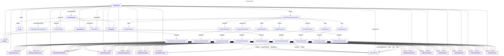

```mermaid
---
title: ColumnChart
---
graph 
AggregationExpression[<a href='/layout/erd/AggregationExpression'>AggregationExpression</a>]
style AggregationExpression stroke:#ff0000,stroke-width:1px
AlgorithmExpression[<a href='/layout/erd/AlgorithmExpression'>AlgorithmExpression</a>]
style AlgorithmExpression stroke:#ff0000,stroke-width:1px
CategoryAxisProperties[CategoryAxisProperties]
ColumnChart[<a href='/layout/erd/ColumnChart'>ColumnChart</a>]
ColumnChartColumnProperties[ColumnChartColumnProperties]
ColumnExpression[<a href='/layout/erd/ColumnExpression'>ColumnExpression</a>]
style ColumnExpression stroke:#ff0000,stroke-width:1px
ColumnProperty[<a href='/layout/erd/ColumnProperty'>ColumnProperty</a>]
DataPointProperties[DataPointProperties]
Display[Display]
ExpressionList[ExpressionList]
GeneralProperties[GeneralProperties]
GeoJsonExpression[<a href='/layout/erd/GeoJsonExpression'>GeoJsonExpression</a>]
style GeoJsonExpression stroke:#ff0000,stroke-width:1px
ImageExpression[<a href='/layout/erd/ImageExpression'>ImageExpression</a>]
style ImageExpression stroke:#ff0000,stroke-width:1px
ImageKindExpression[<a href='/layout/erd/ImageKindExpression'>ImageKindExpression</a>]
style ImageKindExpression stroke:#ff0000,stroke-width:1px
LabelsProperties[LabelsProperties]
LegendProperties[LegendProperties]
LinearGradient2Expression[<a href='/layout/erd/LinearGradient2Expression'>LinearGradient2Expression</a>]
style LinearGradient2Expression stroke:#ff0000,stroke-width:1px
LinearGradient3Expression[<a href='/layout/erd/LinearGradient3Expression'>LinearGradient3Expression</a>]
style LinearGradient3Expression stroke:#ff0000,stroke-width:1px
LiteralExpression[<a href='/layout/erd/LiteralExpression'>LiteralExpression</a>]
style LiteralExpression stroke:#ff0000,stroke-width:1px
MeasureExpression[<a href='/layout/erd/MeasureExpression'>MeasureExpression</a>]
style MeasureExpression stroke:#ff0000,stroke-width:1px
ProjectionConfig[ProjectionConfig]
PrototypeQuery[<a href='/layout/erd/PrototypeQuery'>PrototypeQuery</a>]
style PrototypeQuery stroke:#ff0000,stroke-width:1px
QueryOptions[QueryOptions]
ResourcePackageAccess[<a href='/layout/erd/ResourcePackageAccess'>ResourcePackageAccess</a>]
style ResourcePackageAccess stroke:#ff0000,stroke-width:1px
SelectRefExpression[<a href='/layout/erd/SelectRefExpression'>SelectRefExpression</a>]
style SelectRefExpression stroke:#ff0000,stroke-width:1px
Selector[<a href='/layout/erd/Selector'>Selector</a>]
style Selector stroke:#ff0000,stroke-width:1px
SolidColorExpression[<a href='/layout/erd/SolidColorExpression'>SolidColorExpression</a>]
style SolidColorExpression stroke:#ff0000,stroke-width:1px
TotalProperties[TotalProperties]
VCProperties[<a href='/layout/erd/VCProperties'>VCProperties</a>]
style VCProperties stroke:#ff0000,stroke-width:1px
ValueAxisProperties[ValueAxisProperties]
Y1AxisReferenceLineProperties[Y1AxisReferenceLineProperties]
ZoomProperties[ZoomProperties]
_CategoryAxisPropertiesHelper[_CategoryAxisPropertiesHelper]
_DataPointPropertiesHelper[_DataPointPropertiesHelper]
_GeneralPropertiesHelper[_GeneralPropertiesHelper]
_LabelsPropertiesHelper[_LabelsPropertiesHelper]
_LegendPropertiesHelper[_LegendPropertiesHelper]
_TotalPropertiesHelper[_TotalPropertiesHelper]
_ValueAxisPropertiesHelper[_ValueAxisPropertiesHelper]
_Y1AxisReferenceLinePropertiesHelper[_Y1AxisReferenceLinePropertiesHelper]
_ZoomPropertiesHelper[_ZoomPropertiesHelper]
_ZoomPropertiesHelper ---> SolidColorExpression
_Y1AxisReferenceLinePropertiesHelper ---> ColumnExpression
_LegendPropertiesHelper ---> ColumnExpression
_LabelsPropertiesHelper ---> ColumnExpression
_LabelsPropertiesHelper ---> MeasureExpression
_DataPointPropertiesHelper ---> ImageKindExpression
_Y1AxisReferenceLinePropertiesHelper ---> ImageExpression
ValueAxisProperties --->|properties| _ValueAxisPropertiesHelper
Y1AxisReferenceLineProperties --->|properties| _Y1AxisReferenceLinePropertiesHelper
ColumnChart ---> GeoJsonExpression
LegendProperties --->|properties| _LegendPropertiesHelper
ColumnChart ---> LinearGradient2Expression
ColumnChart ---> LinearGradient3Expression
ColumnChartColumnProperties --->|valueAxis| ValueAxisProperties
_ValueAxisPropertiesHelper ---> LinearGradient3Expression
_LegendPropertiesHelper ---> SolidColorExpression
_Y1AxisReferenceLinePropertiesHelper ---> AggregationExpression
ColumnProperty --->|display| Display
ColumnChart ---> SolidColorExpression
_CategoryAxisPropertiesHelper ---> SolidColorExpression
_ZoomPropertiesHelper ---> LinearGradient2Expression
ColumnChart ---> ResourcePackageAccess
_LegendPropertiesHelper ---> ResourcePackageAccess
_CategoryAxisPropertiesHelper ---> ColumnExpression
_CategoryAxisPropertiesHelper --->|axisStyle| ExpressionList
_LabelsPropertiesHelper ---> SelectRefExpression
_GeneralPropertiesHelper ---> SolidColorExpression
_LabelsPropertiesHelper ---> SolidColorExpression
ColumnChart ---> ImageKindExpression
_CategoryAxisPropertiesHelper ---> AggregationExpression
_GeneralPropertiesHelper ---> LinearGradient3Expression
_LabelsPropertiesHelper ---> AggregationExpression
ColumnChartColumnProperties --->|zoom| ZoomProperties
_Y1AxisReferenceLinePropertiesHelper ---> ImageKindExpression
_LabelsPropertiesHelper --->|backgroundColor| ExpressionList
_GeneralPropertiesHelper ---> MeasureExpression
_CategoryAxisPropertiesHelper ---> MeasureExpression
ColumnChartColumnProperties --->|totals| TotalProperties
_Y1AxisReferenceLinePropertiesHelper ---> LinearGradient2Expression
Y1AxisReferenceLineProperties ---> Selector
_ValueAxisPropertiesHelper ---> SelectRefExpression
ColumnChart ---> PrototypeQuery
_ZoomPropertiesHelper ---> MeasureExpression
_ValueAxisPropertiesHelper ---> ImageKindExpression
_TotalPropertiesHelper ---> ImageExpression
_Y1AxisReferenceLinePropertiesHelper --->|displayName| ExpressionList
_TotalPropertiesHelper ---> LinearGradient2Expression
_CategoryAxisPropertiesHelper ---> SelectRefExpression
_ZoomPropertiesHelper ---> ImageKindExpression
ColumnChart ---> Selector
DataPointProperties ---> Selector
_CategoryAxisPropertiesHelper ---> AlgorithmExpression
_GeneralPropertiesHelper ---> LiteralExpression
_LegendPropertiesHelper ---> ImageExpression
_TotalPropertiesHelper ---> GeoJsonExpression
_GeneralPropertiesHelper ---> ImageExpression
_Y1AxisReferenceLinePropertiesHelper ---> LinearGradient3Expression
_ValueAxisPropertiesHelper ---> LinearGradient2Expression
_ZoomPropertiesHelper ---> ResourcePackageAccess
_GeneralPropertiesHelper ---> AlgorithmExpression
_Y1AxisReferenceLinePropertiesHelper ---> SelectRefExpression
_DataPointPropertiesHelper ---> ColumnExpression
_LegendPropertiesHelper ---> ImageKindExpression
ColumnChart --->|objects| ColumnChartColumnProperties
_LabelsPropertiesHelper ---> LinearGradient2Expression
_Y1AxisReferenceLinePropertiesHelper ---> ResourcePackageAccess
_ValueAxisPropertiesHelper --->|axisScale| ExpressionList
_ValueAxisPropertiesHelper ---> AggregationExpression
_GeneralPropertiesHelper ---> SelectRefExpression
ColumnProperty ---> PrototypeQuery
_ZoomPropertiesHelper ---> ColumnExpression
_TotalPropertiesHelper ---> AggregationExpression
_LegendPropertiesHelper ---> LiteralExpression
_DataPointPropertiesHelper ---> LinearGradient3Expression
ColumnChartColumnProperties --->|dataPoint| DataPointProperties
_LabelsPropertiesHelper ---> ResourcePackageAccess
_DataPointPropertiesHelper ---> ResourcePackageAccess
ColumnChartColumnProperties --->|legend| LegendProperties
ColumnProperty --->|projections| ProjectionConfig
_LegendPropertiesHelper --->|fontSize| ExpressionList
_Y1AxisReferenceLinePropertiesHelper ---> GeoJsonExpression
_CategoryAxisPropertiesHelper ---> ResourcePackageAccess
_LegendPropertiesHelper ---> GeoJsonExpression
ColumnChart ---> ImageExpression
ColumnChart --->|projections| ProjectionConfig
_CategoryAxisPropertiesHelper ---> ImageKindExpression
ColumnChart --->|columnProperties| ColumnProperty
ColumnChart --->|display| Display
ColumnChart ---> AlgorithmExpression
ColumnChartColumnProperties --->|y1AxisReferenceLine| Y1AxisReferenceLineProperties
_GeneralPropertiesHelper ---> AggregationExpression
_TotalPropertiesHelper ---> AlgorithmExpression
_GeneralPropertiesHelper ---> ImageKindExpression
ColumnChartColumnProperties --->|general| GeneralProperties
ColumnProperty --->|queryOptions| QueryOptions
_GeneralPropertiesHelper ---> GeoJsonExpression
_LabelsPropertiesHelper ---> GeoJsonExpression
ColumnChartColumnProperties --->|labels| LabelsProperties
_TotalPropertiesHelper ---> SelectRefExpression
_TotalPropertiesHelper ---> LinearGradient3Expression
TotalProperties --->|properties| _TotalPropertiesHelper
_CategoryAxisPropertiesHelper ---> LiteralExpression
_ZoomPropertiesHelper ---> LinearGradient3Expression
_LegendPropertiesHelper ---> MeasureExpression
_DataPointPropertiesHelper ---> LinearGradient2Expression
_DataPointPropertiesHelper ---> AggregationExpression
ColumnChart ---> AggregationExpression
_LabelsPropertiesHelper ---> LinearGradient3Expression
ColumnChart ---> VCProperties
_ValueAxisPropertiesHelper ---> MeasureExpression
_TotalPropertiesHelper ---> ImageKindExpression
ColumnChart ---> MeasureExpression
_GeneralPropertiesHelper ---> LinearGradient2Expression
ColumnChart --->|columnCount| ExpressionList
LabelsProperties --->|properties| _LabelsPropertiesHelper
_DataPointPropertiesHelper --->|borderColorMatchFill| ExpressionList
CategoryAxisProperties --->|properties| _CategoryAxisPropertiesHelper
_LabelsPropertiesHelper ---> LiteralExpression
_CategoryAxisPropertiesHelper ---> ImageExpression
_ValueAxisPropertiesHelper ---> LiteralExpression
_DataPointPropertiesHelper ---> LiteralExpression
_ZoomPropertiesHelper ---> LiteralExpression
ColumnProperty ---> VCProperties
_CategoryAxisPropertiesHelper ---> LinearGradient2Expression
ZoomProperties --->|properties| _ZoomPropertiesHelper
_ValueAxisPropertiesHelper ---> SolidColorExpression
_TotalPropertiesHelper ---> ColumnExpression
ColumnChart ---> ColumnExpression
_ZoomPropertiesHelper ---> GeoJsonExpression
_TotalPropertiesHelper ---> LiteralExpression
ColumnChartColumnProperties --->|categoryAxis| CategoryAxisProperties
_GeneralPropertiesHelper --->|altText| ExpressionList
_DataPointPropertiesHelper ---> GeoJsonExpression
_Y1AxisReferenceLinePropertiesHelper ---> LiteralExpression
_LegendPropertiesHelper ---> SelectRefExpression
_DataPointPropertiesHelper ---> ImageExpression
_ZoomPropertiesHelper ---> AggregationExpression
_LegendPropertiesHelper ---> LinearGradient3Expression
_LegendPropertiesHelper ---> AlgorithmExpression
_DataPointPropertiesHelper ---> MeasureExpression
_LegendPropertiesHelper ---> LinearGradient2Expression
_GeneralPropertiesHelper ---> ColumnExpression
_ValueAxisPropertiesHelper ---> GeoJsonExpression
ColumnChart ---> LiteralExpression
ColumnChart ---> SelectRefExpression
_DataPointPropertiesHelper ---> AlgorithmExpression
_TotalPropertiesHelper ---> MeasureExpression
_Y1AxisReferenceLinePropertiesHelper ---> AlgorithmExpression
_CategoryAxisPropertiesHelper ---> LinearGradient3Expression
_ValueAxisPropertiesHelper ---> ColumnExpression
_GeneralPropertiesHelper ---> ResourcePackageAccess
_TotalPropertiesHelper --->|show| ExpressionList
_CategoryAxisPropertiesHelper ---> GeoJsonExpression
_TotalPropertiesHelper ---> ResourcePackageAccess
_ZoomPropertiesHelper --->|show| ExpressionList
_ValueAxisPropertiesHelper ---> AlgorithmExpression
_ValueAxisPropertiesHelper ---> ImageExpression
_ZoomPropertiesHelper ---> SelectRefExpression
_LabelsPropertiesHelper ---> AlgorithmExpression
_ZoomPropertiesHelper ---> ImageExpression
_DataPointPropertiesHelper ---> SelectRefExpression
ColumnChart --->|queryOptions| QueryOptions
_LegendPropertiesHelper ---> AggregationExpression
_ZoomPropertiesHelper ---> AlgorithmExpression
_TotalPropertiesHelper ---> SolidColorExpression
DataPointProperties --->|properties| _DataPointPropertiesHelper
GeneralProperties --->|properties| _GeneralPropertiesHelper
_DataPointPropertiesHelper ---> SolidColorExpression
_Y1AxisReferenceLinePropertiesHelper ---> MeasureExpression
_Y1AxisReferenceLinePropertiesHelper ---> SolidColorExpression
_LabelsPropertiesHelper ---> ImageKindExpression
_ValueAxisPropertiesHelper ---> ResourcePackageAccess
LabelsProperties ---> Selector
_LabelsPropertiesHelper ---> ImageExpression
```