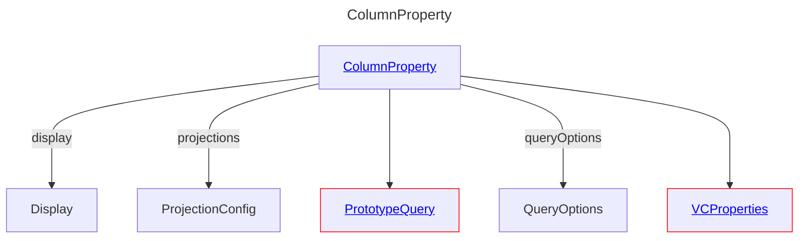

```mermaid
---
title: ColumnProperty
---
graph 
ColumnProperty[<a href='/layout/erd/ColumnProperty'>ColumnProperty</a>]
Display[Display]
ProjectionConfig[ProjectionConfig]
PrototypeQuery[<a href='/layout/erd/PrototypeQuery'>PrototypeQuery</a>]
style PrototypeQuery stroke:#ff0000,stroke-width:1px
QueryOptions[QueryOptions]
VCProperties[<a href='/layout/erd/VCProperties'>VCProperties</a>]
style VCProperties stroke:#ff0000,stroke-width:1px
ColumnProperty --->|display| Display
ColumnProperty --->|projections| ProjectionConfig
ColumnProperty ---> PrototypeQuery
ColumnProperty --->|queryOptions| QueryOptions
ColumnProperty ---> VCProperties
```