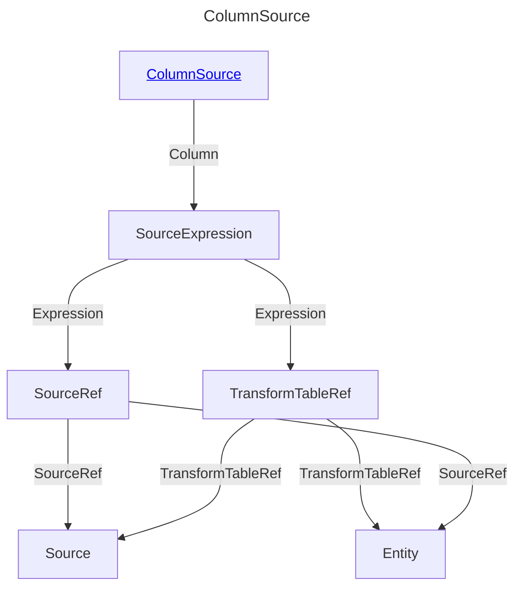

```mermaid
---
title: ColumnSource
---
graph 
ColumnSource[<a href='/layout/erd/ColumnSource'>ColumnSource</a>]
Entity[Entity]
Source[Source]
SourceExpression[SourceExpression]
SourceRef[SourceRef]
TransformTableRef[TransformTableRef]
TransformTableRef --->|TransformTableRef| Entity
SourceRef --->|SourceRef| Source
SourceExpression --->|Expression| SourceRef
SourceRef --->|SourceRef| Entity
SourceExpression --->|Expression| TransformTableRef
TransformTableRef --->|TransformTableRef| Source
ColumnSource --->|Column| SourceExpression
```