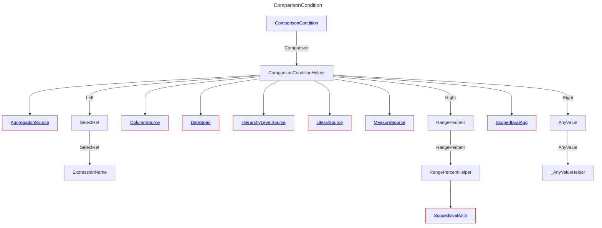

```mermaid
---
title: ComparisonCondition
---
graph 
AggregationSource[<a href='/layout/erd/AggregationSource'>AggregationSource</a>]
style AggregationSource stroke:#ff0000,stroke-width:1px
AnyValue[AnyValue]
ColumnSource[<a href='/layout/erd/ColumnSource'>ColumnSource</a>]
style ColumnSource stroke:#ff0000,stroke-width:1px
ComparisonCondition[<a href='/layout/erd/ComparisonCondition'>ComparisonCondition</a>]
ComparisonConditionHelper[ComparisonConditionHelper]
DateSpan[<a href='/layout/erd/DateSpan'>DateSpan</a>]
style DateSpan stroke:#ff0000,stroke-width:1px
ExpressionName[ExpressionName]
HierarchyLevelSource[<a href='/layout/erd/HierarchyLevelSource'>HierarchyLevelSource</a>]
style HierarchyLevelSource stroke:#ff0000,stroke-width:1px
LiteralSource[<a href='/layout/erd/LiteralSource'>LiteralSource</a>]
style LiteralSource stroke:#ff0000,stroke-width:1px
MeasureSource[<a href='/layout/erd/MeasureSource'>MeasureSource</a>]
style MeasureSource stroke:#ff0000,stroke-width:1px
RangePercent[RangePercent]
RangePercentHelper[RangePercentHelper]
ScopedEvalAgg[<a href='/layout/erd/ScopedEvalAgg'>ScopedEvalAgg</a>]
style ScopedEvalAgg stroke:#ff0000,stroke-width:1px
ScopedEvalArith[<a href='/layout/erd/ScopedEvalArith'>ScopedEvalArith</a>]
style ScopedEvalArith stroke:#ff0000,stroke-width:1px
SelectRef[SelectRef]
_AnyValueHelper[_AnyValueHelper]
ComparisonCondition --->|Comparison| ComparisonConditionHelper
SelectRef --->|SelectRef| ExpressionName
AnyValue --->|AnyValue| _AnyValueHelper
ComparisonConditionHelper ---> HierarchyLevelSource
RangePercentHelper ---> ScopedEvalArith
ComparisonConditionHelper ---> MeasureSource
ComparisonConditionHelper ---> ScopedEvalAgg
ComparisonConditionHelper --->|Left| SelectRef
ComparisonConditionHelper ---> LiteralSource
ComparisonConditionHelper --->|Right| AnyValue
RangePercent --->|RangePercent| RangePercentHelper
ComparisonConditionHelper --->|Right| RangePercent
ComparisonConditionHelper ---> DateSpan
ComparisonConditionHelper ---> AggregationSource
ComparisonConditionHelper ---> ColumnSource
```