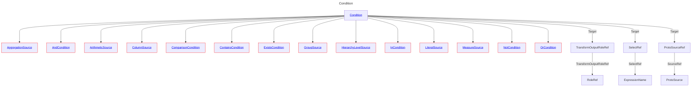

```mermaid
---
title: Condition
---
graph 
AggregationSource[<a href='/layout/erd/AggregationSource'>AggregationSource</a>]
style AggregationSource stroke:#ff0000,stroke-width:1px
AndCondition[<a href='/layout/erd/AndCondition'>AndCondition</a>]
style AndCondition stroke:#ff0000,stroke-width:1px
ArithmeticSource[<a href='/layout/erd/ArithmeticSource'>ArithmeticSource</a>]
style ArithmeticSource stroke:#ff0000,stroke-width:1px
ColumnSource[<a href='/layout/erd/ColumnSource'>ColumnSource</a>]
style ColumnSource stroke:#ff0000,stroke-width:1px
ComparisonCondition[<a href='/layout/erd/ComparisonCondition'>ComparisonCondition</a>]
style ComparisonCondition stroke:#ff0000,stroke-width:1px
Condition[<a href='/layout/erd/Condition'>Condition</a>]
ContainsCondition[<a href='/layout/erd/ContainsCondition'>ContainsCondition</a>]
style ContainsCondition stroke:#ff0000,stroke-width:1px
ExistsCondition[<a href='/layout/erd/ExistsCondition'>ExistsCondition</a>]
style ExistsCondition stroke:#ff0000,stroke-width:1px
ExpressionName[ExpressionName]
GroupSource[<a href='/layout/erd/GroupSource'>GroupSource</a>]
style GroupSource stroke:#ff0000,stroke-width:1px
HierarchyLevelSource[<a href='/layout/erd/HierarchyLevelSource'>HierarchyLevelSource</a>]
style HierarchyLevelSource stroke:#ff0000,stroke-width:1px
InCondition[<a href='/layout/erd/InCondition'>InCondition</a>]
style InCondition stroke:#ff0000,stroke-width:1px
LiteralSource[<a href='/layout/erd/LiteralSource'>LiteralSource</a>]
style LiteralSource stroke:#ff0000,stroke-width:1px
MeasureSource[<a href='/layout/erd/MeasureSource'>MeasureSource</a>]
style MeasureSource stroke:#ff0000,stroke-width:1px
NotCondition[<a href='/layout/erd/NotCondition'>NotCondition</a>]
style NotCondition stroke:#ff0000,stroke-width:1px
OrCondition[<a href='/layout/erd/OrCondition'>OrCondition</a>]
style OrCondition stroke:#ff0000,stroke-width:1px
ProtoSource[ProtoSource]
ProtoSourceRef[ProtoSourceRef]
RoleRef[RoleRef]
SelectRef[SelectRef]
TransformOutputRoleRef[TransformOutputRoleRef]
Condition ---> LiteralSource
Condition ---> GroupSource
Condition ---> ExistsCondition
ProtoSourceRef --->|SourceRef| ProtoSource
Condition ---> ComparisonCondition
Condition --->|Target| TransformOutputRoleRef
Condition ---> ArithmeticSource
TransformOutputRoleRef --->|TransformOutputRoleRef| RoleRef
Condition ---> ContainsCondition
Condition ---> AndCondition
Condition ---> MeasureSource
Condition ---> ColumnSource
Condition ---> OrCondition
Condition ---> InCondition
Condition ---> HierarchyLevelSource
Condition --->|Target| SelectRef
SelectRef --->|SelectRef| ExpressionName
Condition ---> NotCondition
Condition ---> AggregationSource
Condition --->|Target| ProtoSourceRef
```