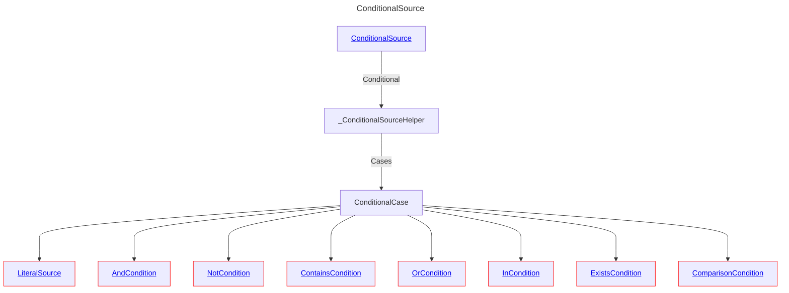

```mermaid
---
title: ConditionalSource
---
graph 
AndCondition[<a href='/layout/erd/AndCondition'>AndCondition</a>]
style AndCondition stroke:#ff0000,stroke-width:1px
ComparisonCondition[<a href='/layout/erd/ComparisonCondition'>ComparisonCondition</a>]
style ComparisonCondition stroke:#ff0000,stroke-width:1px
ConditionalCase[ConditionalCase]
ConditionalSource[<a href='/layout/erd/ConditionalSource'>ConditionalSource</a>]
ContainsCondition[<a href='/layout/erd/ContainsCondition'>ContainsCondition</a>]
style ContainsCondition stroke:#ff0000,stroke-width:1px
ExistsCondition[<a href='/layout/erd/ExistsCondition'>ExistsCondition</a>]
style ExistsCondition stroke:#ff0000,stroke-width:1px
InCondition[<a href='/layout/erd/InCondition'>InCondition</a>]
style InCondition stroke:#ff0000,stroke-width:1px
LiteralSource[<a href='/layout/erd/LiteralSource'>LiteralSource</a>]
style LiteralSource stroke:#ff0000,stroke-width:1px
NotCondition[<a href='/layout/erd/NotCondition'>NotCondition</a>]
style NotCondition stroke:#ff0000,stroke-width:1px
OrCondition[<a href='/layout/erd/OrCondition'>OrCondition</a>]
style OrCondition stroke:#ff0000,stroke-width:1px
_ConditionalSourceHelper[_ConditionalSourceHelper]
ConditionalCase ---> LiteralSource
ConditionalCase ---> AndCondition
ConditionalSource --->|Conditional| _ConditionalSourceHelper
ConditionalCase ---> NotCondition
ConditionalCase ---> ContainsCondition
ConditionalCase ---> OrCondition
ConditionalCase ---> InCondition
_ConditionalSourceHelper --->|Cases| ConditionalCase
ConditionalCase ---> ExistsCondition
ConditionalCase ---> ComparisonCondition
```