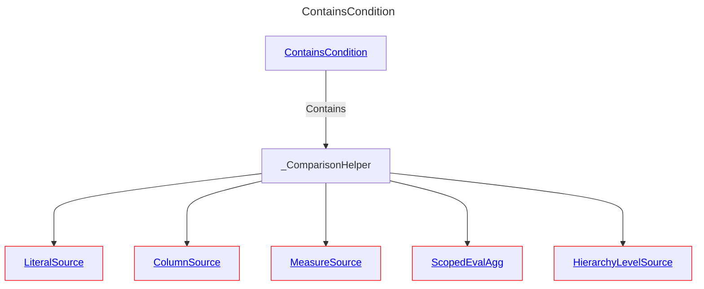

```mermaid
---
title: ContainsCondition
---
graph 
ColumnSource[<a href='/layout/erd/ColumnSource'>ColumnSource</a>]
style ColumnSource stroke:#ff0000,stroke-width:1px
ContainsCondition[<a href='/layout/erd/ContainsCondition'>ContainsCondition</a>]
HierarchyLevelSource[<a href='/layout/erd/HierarchyLevelSource'>HierarchyLevelSource</a>]
style HierarchyLevelSource stroke:#ff0000,stroke-width:1px
LiteralSource[<a href='/layout/erd/LiteralSource'>LiteralSource</a>]
style LiteralSource stroke:#ff0000,stroke-width:1px
MeasureSource[<a href='/layout/erd/MeasureSource'>MeasureSource</a>]
style MeasureSource stroke:#ff0000,stroke-width:1px
ScopedEvalAgg[<a href='/layout/erd/ScopedEvalAgg'>ScopedEvalAgg</a>]
style ScopedEvalAgg stroke:#ff0000,stroke-width:1px
_ComparisonHelper[_ComparisonHelper]
_ComparisonHelper ---> LiteralSource
_ComparisonHelper ---> ColumnSource
_ComparisonHelper ---> MeasureSource
_ComparisonHelper ---> ScopedEvalAgg
ContainsCondition --->|Contains| _ComparisonHelper
_ComparisonHelper ---> HierarchyLevelSource
```