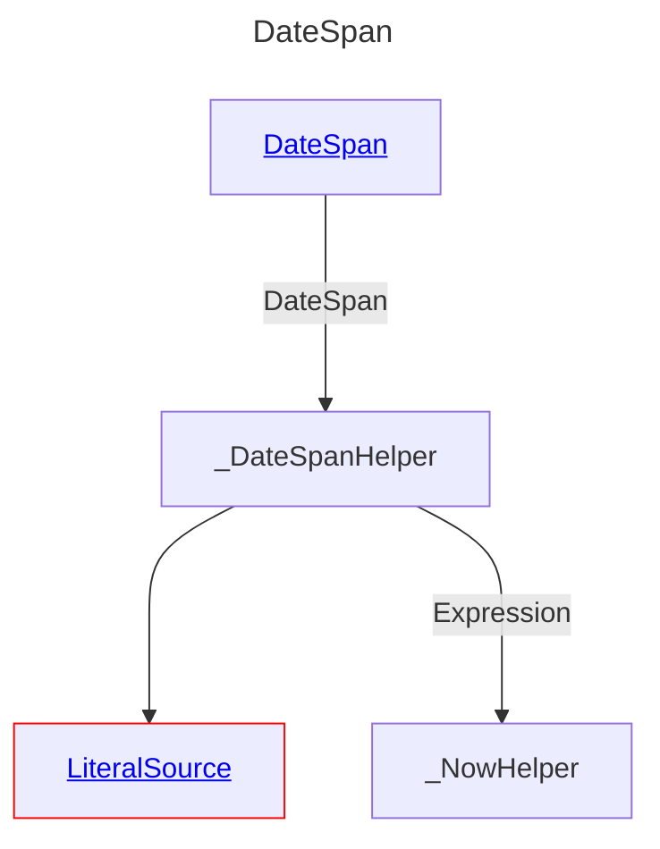

```mermaid
---
title: DateSpan
---
graph 
DateSpan[<a href='/layout/erd/DateSpan'>DateSpan</a>]
LiteralSource[<a href='/layout/erd/LiteralSource'>LiteralSource</a>]
style LiteralSource stroke:#ff0000,stroke-width:1px
_DateSpanHelper[_DateSpanHelper]
_NowHelper[_NowHelper]
DateSpan --->|DateSpan| _DateSpanHelper
_DateSpanHelper ---> LiteralSource
_DateSpanHelper --->|Expression| _NowHelper
```