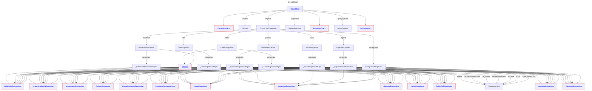

```mermaid
---
title: DonutChart
---
graph 
AggregationExpression[<a href='/layout/erd/AggregationExpression'>AggregationExpression</a>]
style AggregationExpression stroke:#ff0000,stroke-width:1px
AlgorithmExpression[<a href='/layout/erd/AlgorithmExpression'>AlgorithmExpression</a>]
style AlgorithmExpression stroke:#ff0000,stroke-width:1px
BackgroundProperties[BackgroundProperties]
ColumnExpression[<a href='/layout/erd/ColumnExpression'>ColumnExpression</a>]
style ColumnExpression stroke:#ff0000,stroke-width:1px
ColumnProperty[<a href='/layout/erd/ColumnProperty'>ColumnProperty</a>]
style ColumnProperty stroke:#ff0000,stroke-width:1px
DataPointProperties[DataPointProperties]
Display[Display]
DonutChart[<a href='/layout/erd/DonutChart'>DonutChart</a>]
DonutChartProperties[DonutChartProperties]
ExpressionList[ExpressionList]
GeneralProperties[GeneralProperties]
GeoJsonExpression[<a href='/layout/erd/GeoJsonExpression'>GeoJsonExpression</a>]
style GeoJsonExpression stroke:#ff0000,stroke-width:1px
ImageExpression[<a href='/layout/erd/ImageExpression'>ImageExpression</a>]
style ImageExpression stroke:#ff0000,stroke-width:1px
ImageKindExpression[<a href='/layout/erd/ImageKindExpression'>ImageKindExpression</a>]
style ImageKindExpression stroke:#ff0000,stroke-width:1px
LabelsProperties[LabelsProperties]
LegendProperties[LegendProperties]
LinearGradient2Expression[<a href='/layout/erd/LinearGradient2Expression'>LinearGradient2Expression</a>]
style LinearGradient2Expression stroke:#ff0000,stroke-width:1px
LinearGradient3Expression[<a href='/layout/erd/LinearGradient3Expression'>LinearGradient3Expression</a>]
style LinearGradient3Expression stroke:#ff0000,stroke-width:1px
LiteralExpression[<a href='/layout/erd/LiteralExpression'>LiteralExpression</a>]
style LiteralExpression stroke:#ff0000,stroke-width:1px
MeasureExpression[<a href='/layout/erd/MeasureExpression'>MeasureExpression</a>]
style MeasureExpression stroke:#ff0000,stroke-width:1px
ProjectionConfig[ProjectionConfig]
PrototypeQuery[<a href='/layout/erd/PrototypeQuery'>PrototypeQuery</a>]
style PrototypeQuery stroke:#ff0000,stroke-width:1px
QueryOptions[QueryOptions]
ResourcePackageAccess[<a href='/layout/erd/ResourcePackageAccess'>ResourcePackageAccess</a>]
style ResourcePackageAccess stroke:#ff0000,stroke-width:1px
SelectRefExpression[<a href='/layout/erd/SelectRefExpression'>SelectRefExpression</a>]
style SelectRefExpression stroke:#ff0000,stroke-width:1px
Selector[<a href='/layout/erd/Selector'>Selector</a>]
style Selector stroke:#ff0000,stroke-width:1px
SlicesProperties[SlicesProperties]
SolidColorExpression[<a href='/layout/erd/SolidColorExpression'>SolidColorExpression</a>]
style SolidColorExpression stroke:#ff0000,stroke-width:1px
TitleProperties[TitleProperties]
VCProperties[<a href='/layout/erd/VCProperties'>VCProperties</a>]
style VCProperties stroke:#ff0000,stroke-width:1px
_DataPointPropertiesHelper[_DataPointPropertiesHelper]
_GeneralPropertiesHelper[_GeneralPropertiesHelper]
_LabelsPropertiesHelper[_LabelsPropertiesHelper]
_LegendPropertiesHelper[_LegendPropertiesHelper]
_SlicesPropertiesHelper[_SlicesPropertiesHelper]
_TitlePropertiesHelper[_TitlePropertiesHelper]
_SlicesPropertiesHelper ---> LinearGradient3Expression
_LegendPropertiesHelper ---> ColumnExpression
_LabelsPropertiesHelper ---> ColumnExpression
_SlicesPropertiesHelper ---> AlgorithmExpression
_LabelsPropertiesHelper ---> MeasureExpression
BackgroundProperties ---> ImageExpression
_DataPointPropertiesHelper ---> ImageKindExpression
BackgroundProperties ---> AggregationExpression
DonutChartProperties --->|slices| SlicesProperties
DonutChart --->|display| Display
BackgroundProperties ---> LinearGradient2Expression
LegendProperties --->|properties| _LegendPropertiesHelper
_SlicesPropertiesHelper ---> ResourcePackageAccess
TitleProperties --->|properties| _TitlePropertiesHelper
DonutChartProperties --->|legend| LegendProperties
BackgroundProperties ---> SolidColorExpression
BackgroundProperties ---> ColumnExpression
_LegendPropertiesHelper ---> SolidColorExpression
_TitlePropertiesHelper ---> AggregationExpression
_LegendPropertiesHelper ---> ResourcePackageAccess
_TitlePropertiesHelper ---> LinearGradient2Expression
_TitlePropertiesHelper ---> GeoJsonExpression
_LabelsPropertiesHelper ---> SelectRefExpression
_GeneralPropertiesHelper ---> SolidColorExpression
_LabelsPropertiesHelper ---> SolidColorExpression
_TitlePropertiesHelper ---> AlgorithmExpression
_TitlePropertiesHelper ---> SolidColorExpression
_GeneralPropertiesHelper ---> LinearGradient3Expression
_LabelsPropertiesHelper ---> AggregationExpression
_SlicesPropertiesHelper ---> ImageExpression
_LabelsPropertiesHelper --->|backgroundColor| ExpressionList
_GeneralPropertiesHelper ---> MeasureExpression
DonutChart ---> ColumnProperty
BackgroundProperties ---> MeasureExpression
_TitlePropertiesHelper ---> SelectRefExpression
DonutChartProperties --->|general| GeneralProperties
BackgroundProperties ---> ImageKindExpression
_SlicesPropertiesHelper ---> SolidColorExpression
DataPointProperties ---> Selector
_GeneralPropertiesHelper ---> LiteralExpression
_LegendPropertiesHelper ---> ImageExpression
DonutChart --->|queryOptions| QueryOptions
_SlicesPropertiesHelper ---> LiteralExpression
DonutChartProperties --->|background| BackgroundProperties
_GeneralPropertiesHelper ---> ImageExpression
_SlicesPropertiesHelper ---> SelectRefExpression
_GeneralPropertiesHelper ---> AlgorithmExpression
_DataPointPropertiesHelper ---> ColumnExpression
_LegendPropertiesHelper ---> ImageKindExpression
_LabelsPropertiesHelper ---> LinearGradient2Expression
_SlicesPropertiesHelper ---> LinearGradient2Expression
DonutChart --->|objects| DonutChartProperties
_GeneralPropertiesHelper ---> SelectRefExpression
_LegendPropertiesHelper ---> LiteralExpression
_DataPointPropertiesHelper ---> LinearGradient3Expression
BackgroundProperties --->|show| ExpressionList
_TitlePropertiesHelper ---> ResourcePackageAccess
_LabelsPropertiesHelper ---> ResourcePackageAccess
_DataPointPropertiesHelper ---> ResourcePackageAccess
_SlicesPropertiesHelper ---> ImageKindExpression
_LegendPropertiesHelper --->|fontSize| ExpressionList
DonutChartProperties --->|labels| LabelsProperties
_TitlePropertiesHelper ---> LinearGradient3Expression
_LegendPropertiesHelper ---> GeoJsonExpression
DonutChart ---> VCProperties
_GeneralPropertiesHelper ---> AggregationExpression
BackgroundProperties ---> GeoJsonExpression
BackgroundProperties ---> LinearGradient3Expression
_GeneralPropertiesHelper ---> ImageKindExpression
_SlicesPropertiesHelper --->|innerRadiusRatio| ExpressionList
DonutChart ---> PrototypeQuery
_TitlePropertiesHelper --->|alignment| ExpressionList
_GeneralPropertiesHelper ---> GeoJsonExpression
DonutChartProperties --->|dataPoint| DataPointProperties
_LabelsPropertiesHelper ---> GeoJsonExpression
SlicesProperties --->|properties| _SlicesPropertiesHelper
_SlicesPropertiesHelper ---> AggregationExpression
_LegendPropertiesHelper ---> MeasureExpression
_DataPointPropertiesHelper ---> LinearGradient2Expression
_DataPointPropertiesHelper ---> AggregationExpression
_LabelsPropertiesHelper ---> LinearGradient3Expression
_GeneralPropertiesHelper ---> LinearGradient2Expression
LabelsProperties --->|properties| _LabelsPropertiesHelper
_DataPointPropertiesHelper --->|borderColorMatchFill| ExpressionList
BackgroundProperties ---> ResourcePackageAccess
_LabelsPropertiesHelper ---> LiteralExpression
_DataPointPropertiesHelper ---> LiteralExpression
_TitlePropertiesHelper ---> LiteralExpression
_GeneralPropertiesHelper --->|altText| ExpressionList
_DataPointPropertiesHelper ---> GeoJsonExpression
_LegendPropertiesHelper ---> SelectRefExpression
_DataPointPropertiesHelper ---> ImageExpression
_LegendPropertiesHelper ---> LinearGradient3Expression
_LegendPropertiesHelper ---> AlgorithmExpression
_DataPointPropertiesHelper ---> MeasureExpression
_LegendPropertiesHelper ---> LinearGradient2Expression
_GeneralPropertiesHelper ---> ColumnExpression
_TitlePropertiesHelper ---> ImageKindExpression
_DataPointPropertiesHelper ---> AlgorithmExpression
BackgroundProperties ---> SelectRefExpression
_GeneralPropertiesHelper ---> ResourcePackageAccess
_TitlePropertiesHelper ---> ColumnExpression
_TitlePropertiesHelper ---> ImageExpression
DonutChart --->|projections| ProjectionConfig
BackgroundProperties ---> LiteralExpression
_SlicesPropertiesHelper ---> MeasureExpression
_SlicesPropertiesHelper ---> GeoJsonExpression
_LabelsPropertiesHelper ---> AlgorithmExpression
_DataPointPropertiesHelper ---> SelectRefExpression
_LegendPropertiesHelper ---> AggregationExpression
DataPointProperties --->|properties| _DataPointPropertiesHelper
GeneralProperties --->|properties| _GeneralPropertiesHelper
_DataPointPropertiesHelper ---> SolidColorExpression
_SlicesPropertiesHelper ---> ColumnExpression
DonutChartProperties --->|title| TitleProperties
_LabelsPropertiesHelper ---> ImageKindExpression
BackgroundProperties ---> AlgorithmExpression
_TitlePropertiesHelper ---> MeasureExpression
LabelsProperties ---> Selector
_LabelsPropertiesHelper ---> ImageExpression
```