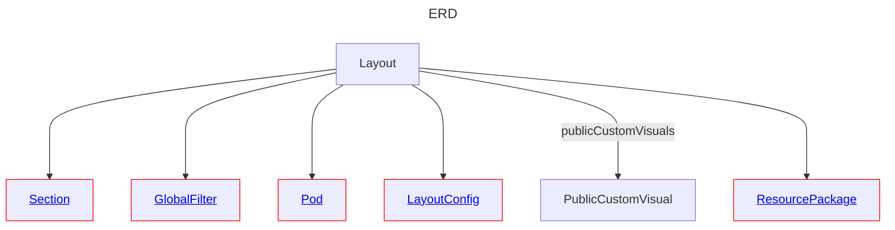

```mermaid
---
title: ERD
---
graph 
GlobalFilter[<a href='/layout/erd/GlobalFilter'>GlobalFilter</a>]
style GlobalFilter stroke:#ff0000,stroke-width:1px
Layout[Layout]
LayoutConfig[<a href='/layout/erd/LayoutConfig'>LayoutConfig</a>]
style LayoutConfig stroke:#ff0000,stroke-width:1px
Pod[<a href='/layout/erd/Pod'>Pod</a>]
style Pod stroke:#ff0000,stroke-width:1px
PublicCustomVisual[PublicCustomVisual]
ResourcePackage[<a href='/layout/erd/ResourcePackage'>ResourcePackage</a>]
style ResourcePackage stroke:#ff0000,stroke-width:1px
Section[<a href='/layout/erd/Section'>Section</a>]
style Section stroke:#ff0000,stroke-width:1px
Layout ---> Section
Layout ---> GlobalFilter
Layout ---> Pod
Layout ---> LayoutConfig
Layout --->|publicCustomVisuals| PublicCustomVisual
Layout ---> ResourcePackage
```