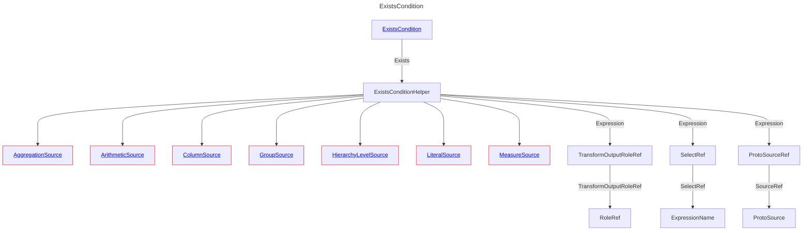

```mermaid
---
title: ExistsCondition
---
graph 
AggregationSource[<a href='/layout/erd/AggregationSource'>AggregationSource</a>]
style AggregationSource stroke:#ff0000,stroke-width:1px
ArithmeticSource[<a href='/layout/erd/ArithmeticSource'>ArithmeticSource</a>]
style ArithmeticSource stroke:#ff0000,stroke-width:1px
ColumnSource[<a href='/layout/erd/ColumnSource'>ColumnSource</a>]
style ColumnSource stroke:#ff0000,stroke-width:1px
ExistsCondition[<a href='/layout/erd/ExistsCondition'>ExistsCondition</a>]
ExistsConditionHelper[ExistsConditionHelper]
ExpressionName[ExpressionName]
GroupSource[<a href='/layout/erd/GroupSource'>GroupSource</a>]
style GroupSource stroke:#ff0000,stroke-width:1px
HierarchyLevelSource[<a href='/layout/erd/HierarchyLevelSource'>HierarchyLevelSource</a>]
style HierarchyLevelSource stroke:#ff0000,stroke-width:1px
LiteralSource[<a href='/layout/erd/LiteralSource'>LiteralSource</a>]
style LiteralSource stroke:#ff0000,stroke-width:1px
MeasureSource[<a href='/layout/erd/MeasureSource'>MeasureSource</a>]
style MeasureSource stroke:#ff0000,stroke-width:1px
ProtoSource[ProtoSource]
ProtoSourceRef[ProtoSourceRef]
RoleRef[RoleRef]
SelectRef[SelectRef]
TransformOutputRoleRef[TransformOutputRoleRef]
ExistsConditionHelper ---> HierarchyLevelSource
SelectRef --->|SelectRef| ExpressionName
ProtoSourceRef --->|SourceRef| ProtoSource
ExistsConditionHelper ---> ArithmeticSource
ExistsConditionHelper ---> ColumnSource
ExistsCondition --->|Exists| ExistsConditionHelper
ExistsConditionHelper ---> MeasureSource
ExistsConditionHelper ---> GroupSource
ExistsConditionHelper --->|Expression| TransformOutputRoleRef
ExistsConditionHelper ---> LiteralSource
ExistsConditionHelper --->|Expression| SelectRef
ExistsConditionHelper ---> AggregationSource
TransformOutputRoleRef --->|TransformOutputRoleRef| RoleRef
ExistsConditionHelper --->|Expression| ProtoSourceRef
```