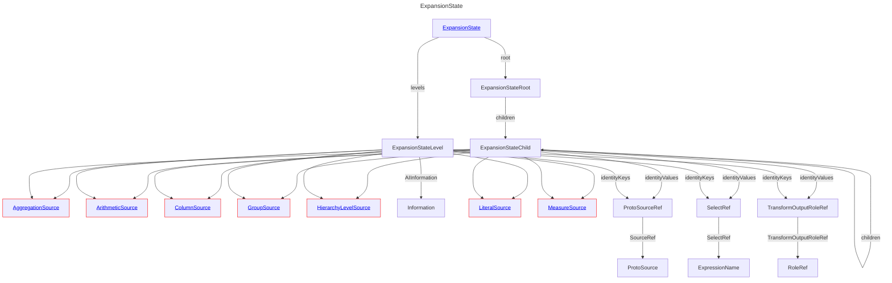

```mermaid
---
title: ExpansionState
---
graph 
AggregationSource[<a href='/layout/erd/AggregationSource'>AggregationSource</a>]
style AggregationSource stroke:#ff0000,stroke-width:1px
ArithmeticSource[<a href='/layout/erd/ArithmeticSource'>ArithmeticSource</a>]
style ArithmeticSource stroke:#ff0000,stroke-width:1px
ColumnSource[<a href='/layout/erd/ColumnSource'>ColumnSource</a>]
style ColumnSource stroke:#ff0000,stroke-width:1px
ExpansionState[<a href='/layout/erd/ExpansionState'>ExpansionState</a>]
ExpansionStateChild[ExpansionStateChild]
ExpansionStateLevel[ExpansionStateLevel]
ExpansionStateRoot[ExpansionStateRoot]
ExpressionName[ExpressionName]
GroupSource[<a href='/layout/erd/GroupSource'>GroupSource</a>]
style GroupSource stroke:#ff0000,stroke-width:1px
HierarchyLevelSource[<a href='/layout/erd/HierarchyLevelSource'>HierarchyLevelSource</a>]
style HierarchyLevelSource stroke:#ff0000,stroke-width:1px
Information[Information]
LiteralSource[<a href='/layout/erd/LiteralSource'>LiteralSource</a>]
style LiteralSource stroke:#ff0000,stroke-width:1px
MeasureSource[<a href='/layout/erd/MeasureSource'>MeasureSource</a>]
style MeasureSource stroke:#ff0000,stroke-width:1px
ProtoSource[ProtoSource]
ProtoSourceRef[ProtoSourceRef]
RoleRef[RoleRef]
SelectRef[SelectRef]
TransformOutputRoleRef[TransformOutputRoleRef]
ExpansionStateChild --->|identityValues| SelectRef
ExpansionStateChild --->|identityValues| ProtoSourceRef
ExpansionStateLevel --->|identityKeys| ProtoSourceRef
ExpansionStateChild ---> GroupSource
ExpansionStateChild --->|identityValues| TransformOutputRoleRef
ExpansionStateLevel --->|AIInformation| Information
ProtoSourceRef --->|SourceRef| ProtoSource
ExpansionStateLevel ---> AggregationSource
ExpansionState --->|root| ExpansionStateRoot
ExpansionStateLevel --->|identityKeys| TransformOutputRoleRef
ExpansionStateLevel ---> ColumnSource
ExpansionStateLevel ---> LiteralSource
TransformOutputRoleRef --->|TransformOutputRoleRef| RoleRef
ExpansionStateLevel --->|identityKeys| SelectRef
ExpansionStateChild ---> HierarchyLevelSource
ExpansionStateChild ---> AggregationSource
ExpansionStateChild ---> LiteralSource
ExpansionState --->|levels| ExpansionStateLevel
ExpansionStateChild ---> ArithmeticSource
ExpansionStateChild ---> ColumnSource
ExpansionStateLevel ---> GroupSource
SelectRef --->|SelectRef| ExpressionName
ExpansionStateRoot --->|children| ExpansionStateChild
ExpansionStateChild --->|children| ExpansionStateChild
ExpansionStateLevel ---> HierarchyLevelSource
ExpansionStateLevel ---> MeasureSource
ExpansionStateLevel ---> ArithmeticSource
ExpansionStateChild ---> MeasureSource
```