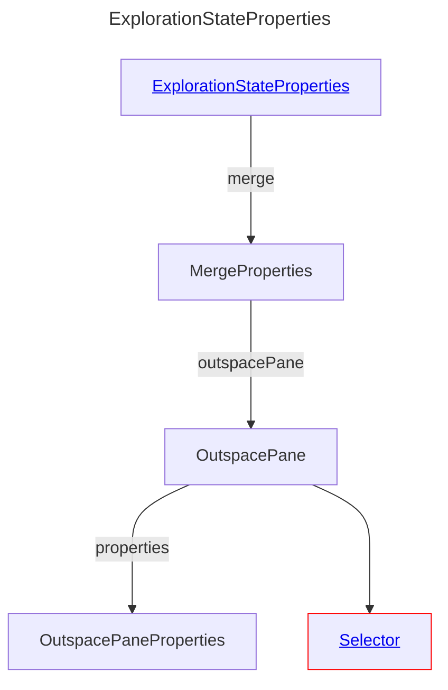

```mermaid
---
title: ExplorationStateProperties
---
graph 
ExplorationStateProperties[<a href='/layout/erd/ExplorationStateProperties'>ExplorationStateProperties</a>]
MergeProperties[MergeProperties]
OutspacePane[OutspacePane]
OutspacePaneProperties[OutspacePaneProperties]
Selector[<a href='/layout/erd/Selector'>Selector</a>]
style Selector stroke:#ff0000,stroke-width:1px
OutspacePane --->|properties| OutspacePaneProperties
OutspacePane ---> Selector
ExplorationStateProperties --->|merge| MergeProperties
MergeProperties --->|outspacePane| OutspacePane
```